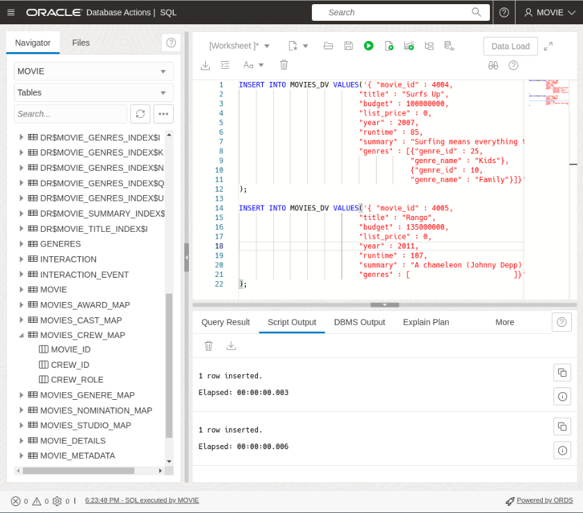

# Working with JSON and the Duality Views

## Introduction

In this lab, you will explore the power of duality views, which allow you to seamlessly work with both SQL and JSON data in Oracle Database. You will learn how to create duality views, populate them with data using SQL or JSON, and perform operations on the integrated data. Get ready to harness the flexibility and convenience of JSON Relational Duality Views!

Estimated Time: 20 minutes

### Objectives

In this lab, you will:

* Create and populate the duality views  
* Work with JSON documents

### Prerequisites

This lab assumes you have:

* Oracle Database 23c Free Developer Release
* All previous labs successfully completed
* SQL Developer Web 23.1 or a compatible tool for running SQL statements


## Task 1: Create the duality views


1. Create the `GENRES_DV` duality view. You can either click the trash to clear the worksheet or delete what is there before pasting the code below. Click the **Run** button.

    ```
    <copy>
    create or replace json duality view genres_dv
     as GENERES @INSERT @UPDATE @DELETE
    {
        genre_id : GENERE_ID,
        genre_name : GENERE_NAME
        genre_description : GENERE_DESCRIPTION
    }
	</copy>
    ```
	

2. The next view we will create the `MOVIE_DETAILS_DV` duality view. Since this is for movie details, want them creating new movies as they become available  so we set those to @insert, @update, @delete. You can either click the trash to clear the worksheet or delete what is there before pasting the code below. Click the **Run** button.

	```
	<copy>
    create or replace json duality view movies_dv
        as MOVIE_DETAILS @INSERT @UPDATE @DELETE
        {
            movie_id : MOVIE_ID
            title : TITLE
            budget : BUDGET
            list_price : LIST_PRICE
            year : YEAR
            runtime : RUNTIME
            summary : SUMMARY
        genres : MOVIES_GENERE_MAP @INSERT @UPDATE @DELETE {
                GenreToMovieID : MG_ID
                GENERES
                @unnest {
                    genre_id : GENERE_ID,
                    genre_name : GENERE_NAME,
                    genre_description: GENERE_DESCRIPTION}
                }
     };
	</copy>
    ```
    


## Task 2: Adding to our movie schema
1. Insert a new genre into the `GENRES_DV` table to include kid-friendly movies. Use the following SQL script: Copy the sql below and click the **Run** button.

	```
	<copy>
    INSERT INTO GENRES_DV VALUES('{"genre_name" : "Kids"}');
	</copy>
    ```
    

2. Insert a collection of documents into `MOVIES_DV`. This automatically populates the `MOVIE_DETAILS` and the `MOVIE_GENERE_MAPPING` table. If you remember the movies duality view joins movie_details and movies to genre mappings. It also allows inserts into both tables. Copy the sql below and click **Run Script**

    ```
    <copy>
    INSERT INTO MOVIES_DV VALUES('{ "movie_id" : 4004,
                                "title" : "Surfs Up",
                                "budget" : 100000000,
                                "list_price" : 0,
                                "year" : 2007,
                                "runtime" : 85,
                                "summary" : "Surfing means everything to teenage penguin Cody Maverick. Followed by a documentary film crew, he leaves his home in Antarctica for Pen Gu Island, site of the the Big Z Memorial Surf Off. Cody wants to be respected and admired, and he believes that winning the competition will bring him what he craves. However, an encounter with washed-up surfer Geek teaches Cody about what is truly important.",
                                "genres" : [{"genre_id" : 25,
                                            "genre_name" : "Kids"},
                                            {"genre_id" : 10,
                                            "genre_name" : "Family"}]}'
    );
    
    INSERT INTO MOVIES_DV VALUES('{ "movie_id" : 4005,
                                "title" : "Ratatouille",
                                "budget" : 150000000,
                                "list_price" : 0,
                                "year" : 2007,
                                "runtime" : 110,
                                "summary" : "Remy dreams of becoming a great chef, despite being a rat in a definitely rodent-phobic profession. He moves to Paris to follow his dream, and with…prove his culinary abilities to a great food critic but is the food good? A Pixar animation.",
                                "genres" : [
                                    
                                ]}'
    );
	</copy>
	```
	


3. Populating a duality view automatically updates the data shown in related duality views by updating their underlying tables. For example, inserting documents into the `MOVIES_DV` duality view updates both the `MOVIE_DETAILS` table and the movies to genre mappings table.

To verify the changes, you can list the contents of the `MOVIES_DV` and `GENRES_DV` duality views. These views are based on the `MOVIES_DETAILS` and genres tables, respectively. Use the following SQL script:

    ```
    <copy>
    SELECT json_serialize(data PRETTY)
    FROM movies_dv WHERE json_value(data, '$.movie_id') IN (4004, 4005);
    </copy>
    ```
    
    ```
    <copy>
    SELECT json_serialize(data PRETTY) FROM GENRES_DV g WHERE g.data.genre_id = 25;
    </copy>
    ```

    


## Task 3: Replace and fetch a document by ID

1. Now lets add more movies into our new Kids genre by updating the appropriate movies entry with the details of each new movie.

    Note that the "etag" value supplied in the content is used for "out-of-the-box" optimistic locking, to prevent the well-known "lost update" problem that can occur with concurrent operations. During the replace by ID operation, the database checks that the eTag provided in the replacement document matches the latest eTag of the target duality view document.

    If the eTags do not match, which can occur if another concurrent operation updated the same document, an error is thrown. In case of such an error, you can reread the updated value (including the updated eTag), and retry the replace operation again, adjusting it (if desired) based on the updated value. 
    
    In other words, you may have to adjust the update statement so that the etag matches the etag from the select statement above. 
    
2. First lets take a look at the movie Ratatouille movie we just added so we can see the current etag. Copy the SQL below and click **Run Script**.

    ```
    <copy>
    SELECT json_serialize(data PRETTY) FROM movies_dv m WHERE m.data.movie_id= 4005;
    </copy>
    ```
    

3. This shows us the current etage is, "etag" : "6BC843789BC84C54723E8DE208B3168C". Lets replace the full document and replace the summary and genres details.
    ```
    <copy>

    UPDATE movies_dv
        SET data = ('{"etag" : "6BC843789BC84C54723E8DE208B3168C",
                "movie_id" : 4005,
                "title" : "Ratatouille",
                "budget" : 150000000,
                "list_price" : 0,
                "year" : 2007,
                "runtime" : 110,
                "summary" : "Ratatouille, released in 2007, tells the heartwarming story of Remy, a talented rat with a passion for cooking. When Remy finds himself in the bustling culinary world of Paris, he …n worker. Together, they create extraordinary gastronomic delights while facing challenges, pursuing dreams, and proving that anyone can achieve greatness with determination and a dash of creativity. Ratatouille celebrates the joy of following ones passion, the power of embracing differences, and the delectable art of cooking.",
                "genres" : 
                [
                    {
                    "genre_id" : 25,
                    "genre_name" : "Kids"
                    },
                    {
                    "genre_id" : 10,
                    "genre_name" : "Family"
                    },
                    {
                    "genre_id" : 18,
                    "genre_name" : "Adventure"
                    },
                    {
                    "genre_id" : 17,
                    "genre_name" : "Animation"
                }

                ]}')
    WHERE json_value(data, '$.movie_id') = 4005;

    COMMIT;
    </copy>
    ```
    

4. Now let's check the updated genres for the Ratatouille  movie along with the new etag. Copy the SQL below and click **Run Script**.

    ```
    <copy>
    SELECT json_serialize(data PRETTY) FROM movies_dv m WHERE m.data.movie_id= 4005;
    </copy>
    ```
    We can see the genres, Family, Animation, Kids, and Adventure along with the a new etag of 212D1F6865F6FD0BAB515DD763DA57C3.

    


## Task 4: Update specific fields in the document identified by a predicate

1. Now we'll update a genre in the Peter Pan movie to contain the new Kids genre. Here we use json\_transform to update specific fields.

    An alternative approach is to use json_mergepatch, which is standardized, but is limited to simple object field updates and cannot be used for updating specific array elements. The json\_transform function, however, can be used to update specific array elements.

    **Note:** We are using the m.data.movie\_id in this example. This is just another way to access values. Copy the SQL below and click **Run Script**.

    ```
    <copy>
    UPDATE movies_dv m set data = json_transform(data, APPEND '$.genres' =  JSON {'genre_id' : 25, 'genre_name' : 'Kids'} ) WHERE m.data.movie_id = 2355;
    </copy>
    ```
    

2. Select from the view to ensure the change is in. In this example we are also showing that you can use json_value in the where clause. Copy the SQL below and click **Run Script**.

    ```
    <copy>
    SELECT json_serialize(data PRETTY)
    FROM movies_dv WHERE json_value(data, '$.movie_id') = 2355;
    </copy>
    ```
    

You may now **proceed to the next lab** 

## Learn More

* [JSON Relational Duality: The Revolutionary Convergence of Document, Object, and Relational Models](https://blogs.oracle.com/database/post/json-relational-duality-app-dev)
* [JSON Duality View documentation](http://docs.oracle.com)
* [Blog: Key benefits of JSON Relational Duality] (https://blogs.oracle.com/database/post/key-benefits-of-json-relational-duality-experience-it-today-using-oracle-database-23c-free-developer-release)

## Acknowledgements
* **Author** - Killian Lynch, Oracle Database Product Management, Product Manager
* **Contributors** - Dominic Giles, Oracle Database Product Management, Distinguished Product Manager
* **Last Updated By/Date** - Killian Lynch, Oracle Database Product Management, Product Manager, May 2023
