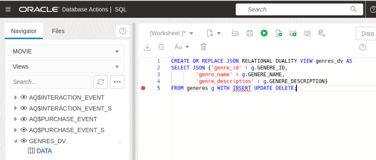
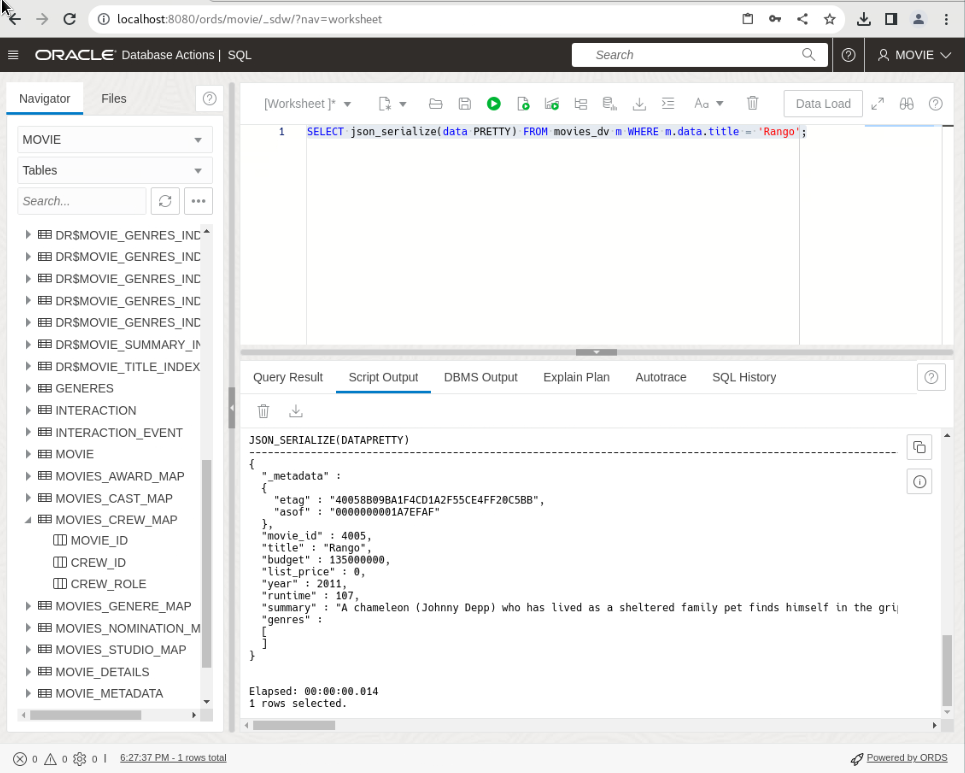
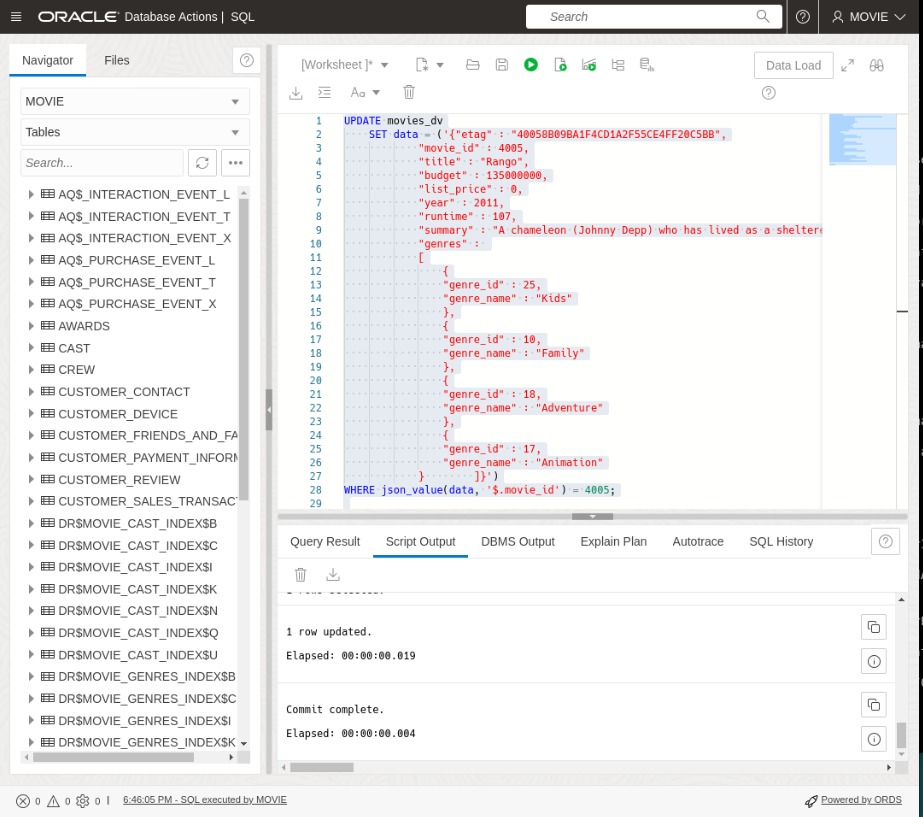
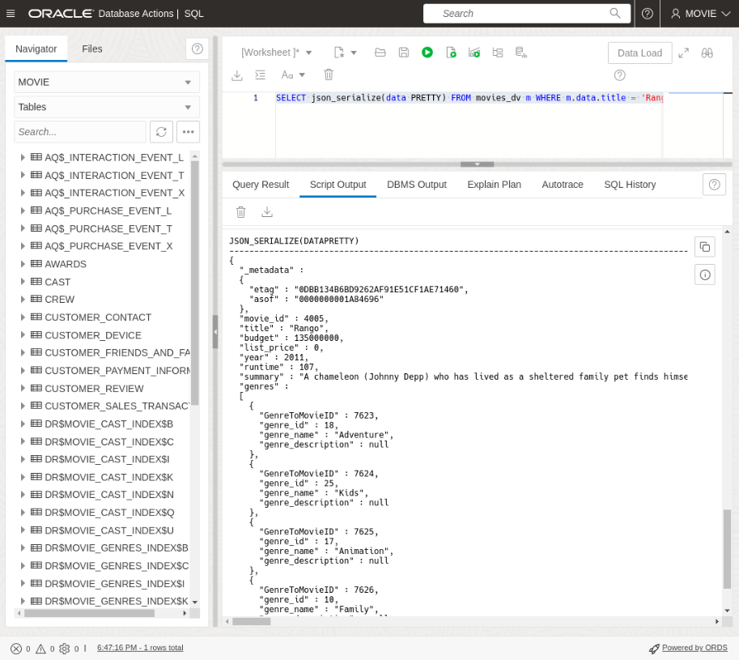

# Working with JSON and the Duality Views

## Introduction

In this lab, you will explore the power of duality views, which allow you to seamlessly work with both SQL and JSON data in Oracle Database. You will learn how to create duality views, populate them with data using SQL or JSON, and perform operations on the integrated data. Get ready to harness the flexibility and convenience of JSON Relational Duality Views!

Estimated Time: 20 minutes

### Objectives

In this lab, you will:

* Create and populate the duality views  
* Work with JSON documents

### Prerequisites

This lab assumes you have:

* Oracle Database 23c Free Developer Release
* All previous labs successfully completed
* SQL Developer Web 23.1 or a compatible tool for running SQL statements


## Task 1: Create the duality views


1. We create Duality Views by defining the documents structure and describing where the data comes from. The following Duality View we  create will list the `genres` table information. We can also define each operation against the underlying table. Here we are setting `WITH INSERT UPDATE DELETE`. 
    
    Create the `genres_dv` duality view. You can either click the trash to clear the worksheet or delete what is there before pasting the code below. Copy the sql below and click **Run Script**

    ```
    <copy>
    CREATE OR REPLACE JSON DUALITY VIEW genres_dv AS
    SELECT JSON {'genre_id' : g.GENERE_ID,
            'genre_name' : g.GENERE_NAME,
            'genre_description' : g.GENERE_DESCRIPTION}
    FROM generes g WITH INSERT UPDATE DELETE;
	</copy>
    ```
	

2. On the other hand, we can use a GraphQL syntax to create the view. In this example we will create the `movies_dv` duality view. With GraphQL we will rely on the database to work out the relationships between the tables. The `movies_dv` lists out movie details including an array of genres. We will also set this view to @insert, @update, @delete. You can either click the trash icon to clear the worksheet or delete what is there before pasting the code below. Copy the GraphQL syntax below and click **Run Script**

	```
	<copy>
    CREATE OR REPLACE JSON DUALITY VIEW movies_dv
        AS MOVIE_DETAILS @insert @update @delete
        {
            movie_id : MOVIE_ID
            title : TITLE
            budget : BUDGET
            list_price : LIST_PRICE
            year : YEAR
            runtime : RUNTIME
            summary : SUMMARY
        genres : MOVIES_GENERE_MAP @insert @update @delete {
                GenreToMovieID : MG_ID
                GENERES
                @unnest {
                    genre_id : GENERE_ID,
                    genre_name : GENERE_NAME,
                    genre_description: GENERE_DESCRIPTION}
                }
     };
	</copy>
    ```
    

3. Now that we have our Duality Views created, lets see how the `genres_dv` looks. Copy the sql below and click **Run Script**

	```
	<copy>
    SELECT json_serialize(data PRETTY) FROM genres_dv;
	</copy>
    ```
    

## Task 2: Adding to our movie schema
1. Insert a new genre into the `GENRES_DV` table to include kid-friendly movies. Copy the sql below and click **Run Statement**

	```
	<copy>
    INSERT INTO GENRES_DV VALUES('{"genre_name" : "Kids"}');
	</copy>
    ```
    

2. Populating a duality view automatically updates the data shown in related duality views by updating their underlying tables. Lets take a look at the `genres_dv` Duality View. Copy the sql below and click **Run Script**:

    ```
    <copy>
    SELECT json_serialize(data PRETTY) FROM GENRES_DV g WHERE g.data.genre_name = 'Kids';
    </copy>
    ```
    

3. Insert a collection of documents into `MOVIES_DV`. This automatically populates the `MOVIE_DETAILS` and the `MOVIE_GENERE_MAPPING` table. If you remember the movies duality view joins movie_details and movies to genre mappings. It also allows inserts into both tables. Copy the sql below and click **Run Script**

    ```
    <copy>
    INSERT INTO MOVIES_DV VALUES('{ "movie_id" : 4004,
                                "title" : "Surfs Up",
                                "budget" : 100000000,
                                "list_price" : 0,
                                "year" : 2007,
                                "runtime" : 85,
                                "summary" : "Surfing means everything to teenage penguin Cody Maverick. Followed by a documentary film crew, he leaves his home in Antarctica for Pen Gu Island, site of the the Big Z Memorial Surf Off. Cody wants to be respected and admired, and he believes that winning the competition will bring him what he craves. However, an encounter with washed-up surfer Geek teaches Cody about what is truly important.",
                                "genres" : [{"genre_id" : 25,
                                            "genre_name" : "Kids"},
                                            {"genre_id" : 10,
                                            "genre_name" : "Family"}]}'
    );
    
    INSERT INTO MOVIES_DV VALUES('{ "movie_id" : 4005,
                                "title" : "Rango",
                                "budget" : 135000000,
                                "list_price" : 0,
                                "year" : 2011,
                                "runtime" : 107,
                                "summary" : "A chameleon (Johnny Depp) who has lived as a sheltered family pet finds himself in the grip of an identity crisis. Rango wonders how to stand out when it is his nature to blend in. When he accidentally winds up in a frontier town called Dirt, he takes the first step on a transformational journey as the town's new sheriff. Though at first Rango only role-plays, a series of thrilling situations and outrageous encounters forces him to become a real hero.",
                                "genres" : [
                                    
                                ]}'
    );
	</copy>
	```
	


3. to reiterate, populating a duality view automatically updates the data shown in related duality views by updating their underlying tables. For example, inserting documents into the `MOVIES_DV` duality view updates both the `MOVIE_DETAILS` table and the `movies_genere_map` table.

    To verify the changes, list the contents of the `MOVIES_DV` duality view. Copy the sql below and click **Run Script**:

    ```
    <copy>
    SELECT json_serialize(data PRETTY)
    FROM movies_dv WHERE json_value(data, '$.title') IN ('Surfs Up', 'Rango');
    </copy>
    ```
    


## Task 3: Replace and fetch a document by ID

1. Now lets add more movies with our new Kids genre by updating the appropriate movies entry with the details of each new movie.

    Note that the "etag" value supplied in the content is used for "out-of-the-box" optimistic locking, to prevent the well-known "lost update" problem that can occur with concurrent operations. During the replace by ID operation, the database checks that the eTag provided in the replacement document matches the latest eTag of the target duality view document.

    If the eTags do not match, which can occur if another concurrent operation updated the same document, an error is thrown. In case of such an error, you can reread the updated value (including the updated eTag), and retry the replace operation again, adjusting it (if desired) based on the updated value. 
    
    In other words, you may have to adjust the update statement so that the etag matches the etag from the select statement above. 
    
2. First lets take a look at the movie Rango movie we just added so we can see the current etag. Copy the SQL below and click **Run Script**.

    ```
    <copy>
    SELECT json_serialize(data PRETTY) FROM movies_dv m WHERE m.data.title = 'Rango';
    </copy>
    ```
    

3. This shows us the current etag is, "etag" : "E5AB725AD046CA8BE4AA301E08CB4329". Lets replace the full document and change the summary section as well as add genres details. Copy the SQL below and click **Run Script**.
    ```
    <copy>

    UPDATE movies_dv
        SET data = ('{"etag" : "E5AB725AD046CA8BE4AA301E08CB4329",
                "movie_id" : 4005,
                "title" : "Rango",
                "budget" : 135000000,
                "list_price" : 0,
                "year" : 2011,
                "runtime" : 107,
                "summary" : "A chameleon (Johnny Depp) who has lived as a sheltered family pet finds himself in the grip of an identity crisis. Rango wonders how to stand out when it is his nature to blend in. When he accidentally winds up in a frontier town called Dirt, he takes the first step on a transformational journey as the town's new sheriff. Though at first Rango only role-plays, a series of thrilling situations and outrageous encounters forces him to become a real hero.",
                "genres" : 
                [
                    {
                    "genre_id" : 25,
                    "genre_name" : "Kids"
                    },
                    {
                    "genre_id" : 10,
                    "genre_name" : "Family"
                    },
                    {
                    "genre_id" : 18,
                    "genre_name" : "Adventure"
                    },
                    {
                    "genre_id" : 17,
                    "genre_name" : "Animation"
                }

                ]}')
    WHERE json_value(data, '$.movie_id') = 4005;

    COMMIT;
    </copy>
    ```
    

4. Now let's check the updated genres for the Rango  movie along with the new etag. Copy the SQL below and click **Run Script**.

    ```
    <copy>
    SELECT json_serialize(data PRETTY) FROM movies_dv m WHERE m.data.title = 'Rango';
    </copy>
    ```
    We can see the genres, Family, Animation, Kids, and Adventure along with the a new etag of 03D7F05ED195CFF7728D568AC069C909.

    


## Task 4: Update specific fields in the document identified by a predicate

1. Now we'll update a genre in the Peter Pan movie to contain the new Kids genre. First lets take a look at our Peter Pan movie document and notice that we don't currently have any Kids genre associated with the movie.

    ```
    <copy>
    SELECT json_serialize(data PRETTY)
    FROM movies_dv WHERE json_value(data, '$.title') = 'Peter Pan';
    </copy>
    ```
    Here we use json\_transform to update specific fields.

    An alternative approach is to use json_mergepatch, which is standardized, but is limited to simple object field updates and cannot be used for updating specific array elements. The json\_transform function, however, can be used to update specific array elements.

    **Note:** We are using the m.data.movie\_id in this example. This is just another way to access values. Copy the SQL below and click **Run Script**.

    ```
    <copy>
    UPDATE movies_dv m set data = json_transform(data, APPEND '$.genres' =  JSON {'genre_id' : 25, 'genre_name' : 'Kids'} ) WHERE m.data.title = 'Peter Pan';
    </copy>
    ```
    

2. Select from the view to ensure the change is in. Copy the SQL below and click **Run Script**.

    ```
    <copy>
    SELECT json_serialize(data PRETTY)
    FROM movies_dv WHERE json_value(data, '$.title') = 'Peter Pan';
    </copy>
    ```
    

You may now **proceed to the next lab** 

## Learn More

* [JSON Relational Duality: The Revolutionary Convergence of Document, Object, and Relational Models](https://blogs.oracle.com/database/post/json-relational-duality-app-dev)
* [JSON Duality View documentation](http://docs.oracle.com)
* [Blog: Key benefits of JSON Relational Duality] (https://blogs.oracle.com/database/post/key-benefits-of-json-relational-duality-experience-it-today-using-oracle-database-23c-free-developer-release)

## Acknowledgements
* **Author** - Killian Lynch, Oracle Database Product Management, Product Manager
* **Contributors** - Dominic Giles, Oracle Database Product Management, Distinguished Product Manager
* **Last Updated By/Date** - Killian Lynch, Oracle Database Product Management, Product Manager, May 2023
