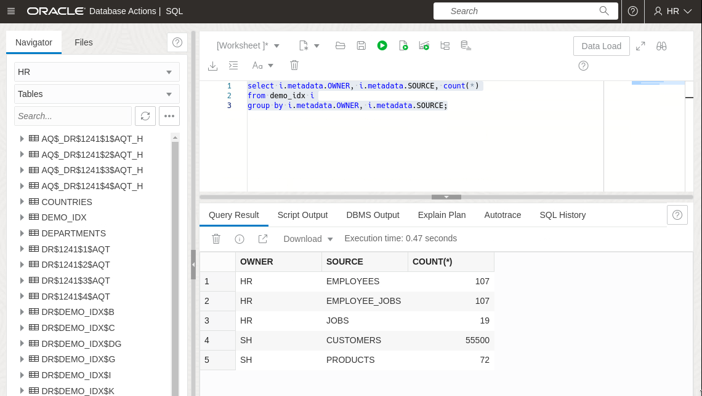
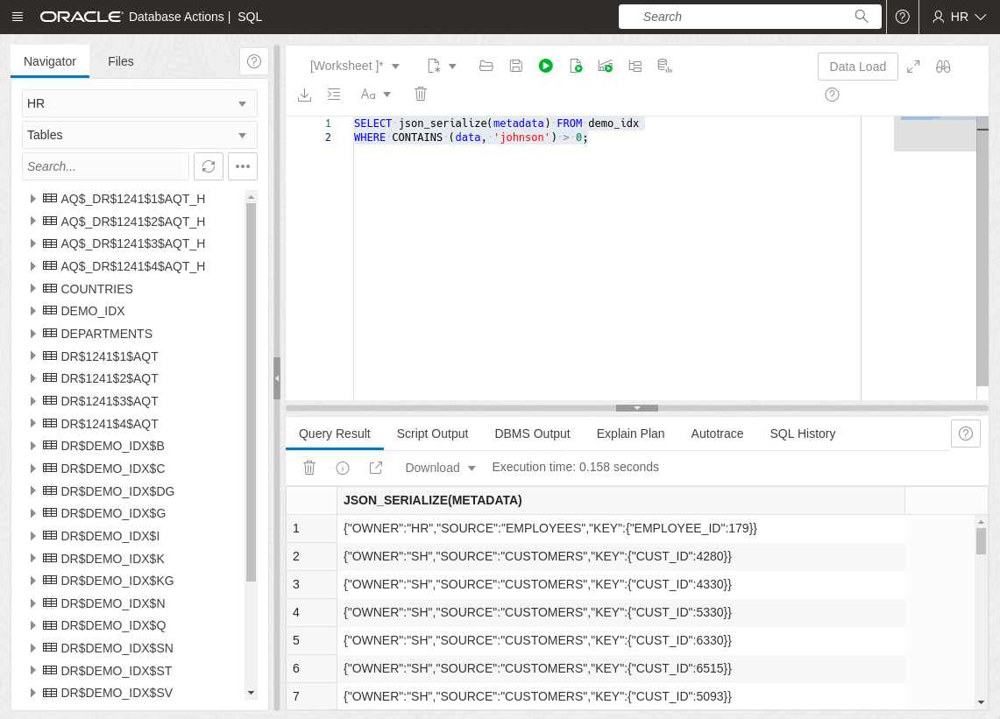
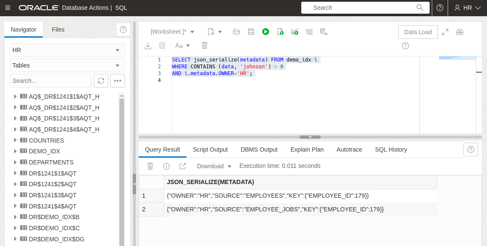
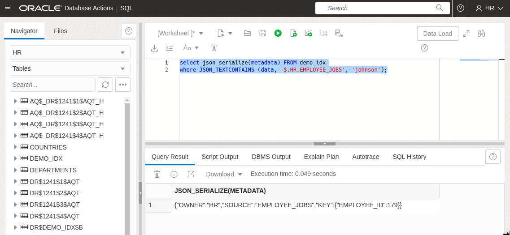
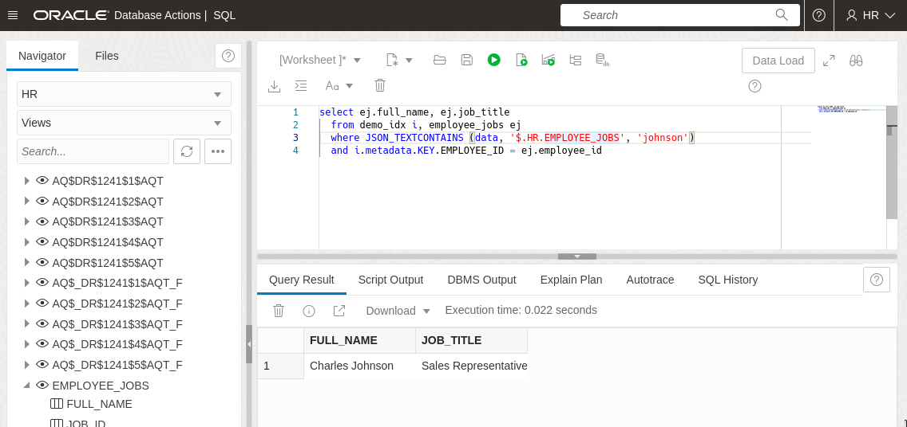

# Working with JSON and the Duality Views

## Introduction

This lab walks you through the steps to create a dbms_search index and add tables to it.

Estimated Time: 10 minutes

### Objectives

In this lab, you will:
* Create a DBMS_SEARCH index
* Add tables to the index
* Explore the layout of the index, the data that has been indexed, and the metadata which will later be used to fetch back results

### Prerequisites

This lab assumes you have:
* Oracle Database 23c Free Developer Release
* All previous labs successfully completed
* SQL Developer Web 23.1 or a compatible tool for running SQL statements

## Task 1: Perform a simple text search

Before we start we need to be logged into SQL Developer Web. If you've just finished the previous lab, you should already be in it. If not, go back and repeat Lab 2 task 1.

A DBMS|_SEARCH index is a JSON search index, which is a special type of Oracle Text index designed for JSON data. As such, we can use Oracle Text's standard CONTAINS clause, or the JSON-specific JSON\_TEXTCONTAINS search against it.

1. First, let's remind ourselves what sources we have in our index. We can do that by querying the METADATA column of the index table. By using a GROUP BY expression we can see the number of rows for each source:

    ```
    <copy>
    select i.metadata.OWNER, i.metadata.SOURCE, count(*)
    from demo_idx i
    group by i.metadata.OWNER, i.metadata.SOURCE;
    </copy>
    ```

    

2. Next we're going to do a simple CONTAINS search to fetch the metadata for all indexed rows where the word 'johnson' occurs. The CONTAINS clause takes the column name to search (in our case DATA, **not** METADATA, since DATA is the indexed column), and a search string. It returns > 0 for rows which match. The search string is not case-sensitive.

    Paste the following and click "Run":

    ```
    <copy>
    SELECT json_serialize(metadata) FROM demo_idx
    WHERE CONTAINS (data, 'johnson') > 0;
    </copy>
    ```

    

    Remember, we're only fetching the **METADATA** here. So we won't see the original data, just sufficient info to allow us to know *where* the data can be found. In this case, we get one hit in the HR employees table, and several from the SH customers table. Let's exclude the tables in the SR schema and see what we get:

    ```
    <copy>
    SELECT json_serialize(metadata) FROM demo_idx i
    WHERE CONTAINS (data, 'johnson') > 0
    AND i.metadata.OWNER='HR';
    </copy>
    ```

    

    Now we can see there are actually two results from the HR schema - one from the EMPLOYEES table, and another from the EMPLOYEE\_JOBS view. Which makes sense, since the view is based on the table.

    In the view, EMPLOYEE.FIRST\_NAME and EMPLOYEE.LAST\_NAME are concatenated with a space between to make FULL_NAME. So in the view, we actually indexed the string 'Charles Johnson'. But CONTAINS is doing a content search, or word-based search, so it doesn't matter that we didn't specify the whole string in the query.

    But what if we *only* want to search in a particular field? We could limit the search using METADATA as above, but it would be more effective if we could specify exactly which JSON field to search for the data. We can do this using the JSON_TEXTCONTAINS operator.

3. Search a particular column using JSON_TEXTCONTAINS

    In the previous example, we looked for the word 'johnson' anywhere. This time we're going to search for it only in the column FULL\_NAME column of HR.EMPLOYEE\_JOBS. The JSON\_TEXTCONTAINS operator takes three parameters
    
    - The indexed column (DATA)
    - A **JSON PATH** expression telling it where to look, and
    - The search string

    If you can't immediately understand the path expression used below, you might want to review DBMS\_SEARCH.GET\_DOCUMENT from the previous lab to remind yourself exactly what was indexed.

    ```
    <copy>
    select json_serialize(metadata) FROM demo_idx
    where JSON_TEXTCONTAINS (data, '$.HR.EMPLOYEE_JOBS', 'johnson');
    </copy>
    ```

    

## Task 2: JOIN the results back to the original table

So far we've just fetched back metadata telling us where the search terms can be found. That's fine for demo purposes, but in a real application we're most likely to want to fetch back data from the original source - be that a table or a view.

1. To do that we'll need to extract the primary key data from the metadata, and join it with the primary key column of the table. Let's review the metadata for one row in the index table:

    ```
    {"OWNER":"HR","SOURCE":"EMPLOYEE_JOBS","KEY":{"EMPLOYEE_ID":100}}
    ```

    We can see that the KEY field is actually an array. This is to allow for composite primary keys, but all our tables and views have singleton primary keys, so that's not an issue. Using "simple dot notation", we can refer to the key value here as <tablealias>.<columnname>.KEY.EMPLOYEE_ID. So to 
    to search in the employees data and join the original table, we can run:

    ```
    <copy>
    select ej.full_name, ej.job_title
      from demo_idx i, employee_jobs ej
      where JSON_TEXTCONTAINS (data, '$.HR.EMPLOYEE_JOBS', 'johnson')
      and i.metadata.KEY.EMPLOYEE_ID = ej.employee_id
    </copy>
    ```

    


## Learn More

* [Using JSON documents and don’t know what you’re looking for? 23c Search Indexes to the rescue](https://blogs.oracle.com/database/post/23c-search-index)

## Acknowledgements
* **Author** - Roger Ford
* **Last Updated By/Date** - Roger Ford, Database Product Management, June 2023
