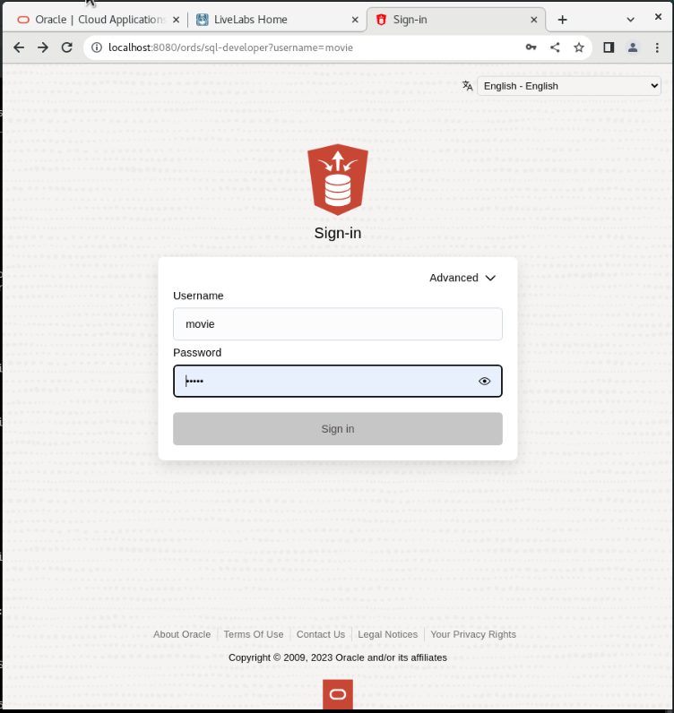
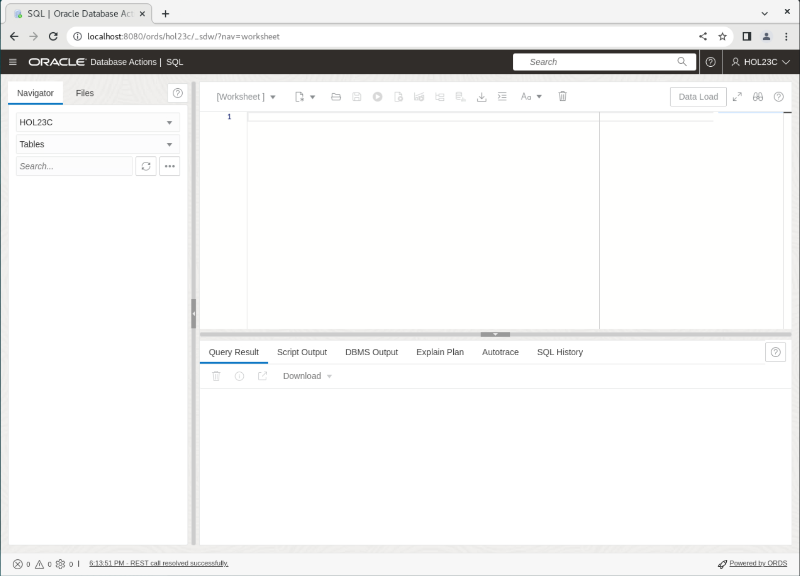
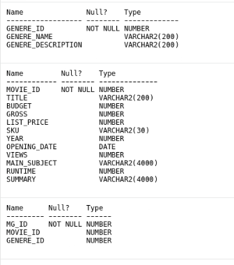

# Create the JSON Duality Views

## Introduction

This lab guides you through the setup steps to create the JSON duality views required to execute the rest of this workshop.

Estimated Time: 10 minutes

### Objectives

In this lab, you will:

* Connect to your database user
* Understand your data

### Prerequisites

This lab assumes you have:

* Installed Oracle Database 23c Free Developer Release
* Successfully completed all previous labs
* SQL Developer Web 23.1 or a compatible tool for running SQL statements*


## Task 1: Connecting to your database user

1. Make sure your browser is open. If not, open a new browser window. If you're using a Sandbox, go to "Activities" and click "New Window" at the top. If Chrome is not running, click on Chrome.

    

2. Copy and paste the following address into your browser. This is the address for SQL Developer Web on your machine.
    **Note:**  If you did not start ORDS, ORDS stopped working, or you closed the terminal in the previous lab, go back and complete the steps in that lab to start ORDS; otherwise, you won't be able to log in here.
    ```
    <copy>
    http://localhost:8080/ords/sql-developer
    </copy>
    ```
    

3. Log in using the username "movie" and the password you set in Lab 1. (password should be movie if you copied from the instructions)

    

4. To run SQL statements, you need to access the SQL worksheet. Click on "SQL" to launch it.

    

5. You are now logged in and should see a screen that looks like this.

        

## Task 2: Understanding the data
1. Throughout this workshop, we will specify whether to click the "Run" button or the "Run Script" button. The "Run" button executes a single SQL statement and displays the output in a data grid. The "Run Script" button executes multiple SQL statements and logs their output. We will highlight which button to use in each step.

    

2. To make this workshop as realistic as possible, let's introduce the business scenario you will be working with - **Oracle MovieStream**.

    

* Oracle MovieStream is a fictitious online movie streaming company. Customers log into Oracle MovieStream using their computers, tablets, and phones, where they are presented with a personalized list of movies based on their viewing history. The company is now looking for better, smarter ways to track performance, identify customers for targeted campaigns promoting new services and movies, and improve the streaming platform. The scenarios in this workshop are based on challenges that companies face in their businesses. We hope that the labs and workshops will provide you with insights into how Oracle can help you solve these common everyday business and technical challenges.

* During this workshop, we will primarily focus on three key tables: `genres`, `movie_details`, and `movies_genre_map`. As we progress through the upcoming labs, we will explore the creation of duality views spanning across these tables. Additionally, we will explore techniques for efficiently adding, updating, and manipulating the underlying data within these tables using the duality views.

3. Lets take a look at our tables. Copy the sql below and click **Run Statement** 

    ```
    <copy>
    desc GENERES;
    desc MOVIE_DETAILS;
    desc MOVIE_GENERE_MAP;
    </copy>
    ```
    


You may now **proceed to the next lab** 

## Learn More

* [JSON Relational Duality: The Revolutionary Convergence of Document, Object, and Relational Models](https://blogs.oracle.com/database/post/json-relational-duality-app-dev)
* [JSON Duality View documentation](http://docs.oracle.com)
* [Blog: Key benefits of JSON Relational Duality] (https://blogs.oracle.com/database/post/key-benefits-of-json-relational-duality-experience-it-today-using-oracle-database-23c-free-developer-release)

## Acknowledgements
* **Author** - Killian Lynch, Oracle Database Product Management, Product Manager
* **Contributors** - Dominic Giles, Oracle Database Product Management, Distinguished Product Manager
* **Last Updated By/Date** - Killian Lynch, Oracle Database Product Management, Product Manager, May 2023

