# Install and configure Swingbench

## Introduction

Welcome to the "Swingbench Unleashed: Conquer Database Stress Testing" workshop! In this hands-on session, we will dive into the world of Swingbench, a powerful tool designed to simulate real-world database workloads and stress test your database systems effectively.

As databases play a critical role in today's software landscape, understanding how your system performs under stress is paramount. Swingbench offers a controlled environment where you can replicate actual scenarios, helping you identify performance bottlenecks before they impact your users.

In this first lab, we will guide you through the essential steps of setting up and configuring Swingbench. Think of it as laying the foundation for our stress testing journey. By the end of this lab, you'll have Swingbench up and running, ready to simulate various workloads on your target database.

So, whether you're a seasoned database professional looking to enhance your stress testing skills or a newcomer eager to learn, let's embark on this journey to master Swingbench and conquer the art of database stress testing.

Estimated Time: 5 minutes

### Objectives

In this lab, you will:
* **Understand Swingbench's Role:** Grasp the significance of Swingbench as a tool for simulating realistic database workloads and stress testing.
* **Install Swingbench:** Download and install Swingbench on your local machine or designated environment.
* **Configure Connection to Database:** Successfully configure Swingbench to connect to a target database for stress testing.
* **Customize Configuration:** Learn key Swingbench configuration options for tailoring the workload simulation.


### Prerequisites

This lab assumes you have:
* Oracle Database 23c Free Developer Release installed
* Terminal or console access to the database
* Internet access

## Task 1: Install Swingbench

1. The first step is to open a command prompt. If you are running in a Sandbox environment, click on **Activities** and then select **Terminal**.

  

2. Next, set your environment. The `oraenv` command will set all the environment variables based on your database. When prompted, type "FREE" for the database name. If you supplied a different database name during installation, use that instead.

    ```
    <copy>
    . oraenv
    </copy>
	```

    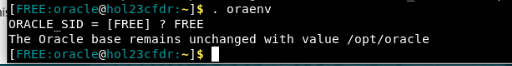


3. Next click **[here](https://objectstorage.us-ashburn-1.oraclecloud.com/p/VEKec7t0mGwBkJX92Jn0nMptuXIlEpJ5XJA-A6C9PymRgY2LhKbjWqHeB5rVBbaV/n/c4u04/b/livelabsfiles/o/data-management-library-files/23c/swingbench15082023_jdk11.zip)** to download the latest version of Swingbench.

4. Once the download is complete, open a terminal or command prompt on your computer and navigate to the location where the file was saved.

    ```
    <copy>
    unzip ~/Downloads/swingbench15082023_jdk11.zip -d ~/Downloads
    </copy>
	```

5. Navigate to the directory where Swingbench is installed. If Swingbench is installed in the "swingbench" folder within your home directory, you can use the following command:

    ```
    <copy>
    cd Downloads/swingbench/bin
    </copy>

	```

  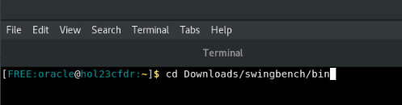

6. Once you are in the "swingbench/bin" directory, run the following command to execute the Order Entry Install Wizard:
    > **Note:** You can also run the wizards from the command in a noninteractive mode where you specify all of the options but for this demo we will use the GUI  

    ```
    <copy>
    ./oewizard
    </copy>
    ```

    This command starts the Order Entry Install Wizard, which guides you through the installation and configuration process for the Order Entry workload.
    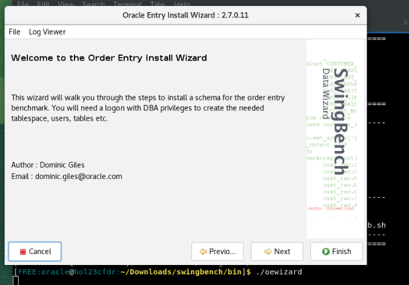

7. When the Order Entry wizard opens, click **Next** to get started.

8. When prompted make sure the **Version 2.0** is selected.

    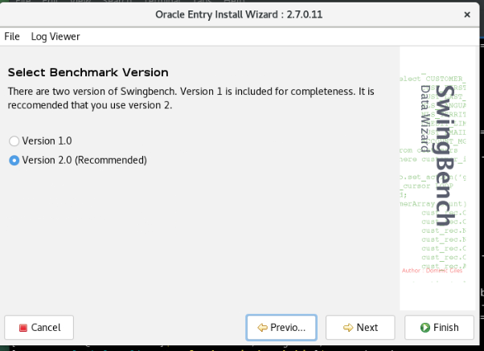

9. Make sure the **Create the Order Entry Schema** box is checked and click **Next**.

    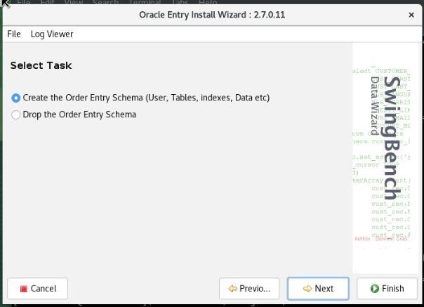

10. Under the "Connect string" box, copy (Ctrl + V) or type the following:

    ```
    <copy>
    //hol23cfdr.livelabs.oraclevcn.com:1521/FREEPDB1
    </copy>
    ```
    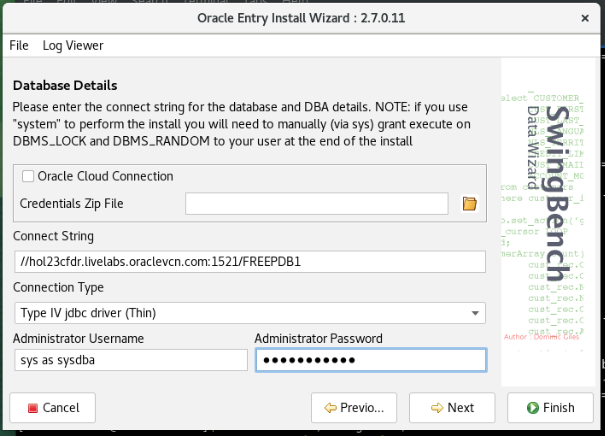

11. In the Administrator Password box, copy and paste or type the following password:

    ```
    <copy>
    Welcome123#
    </copy>
    ```
    Once finished press **Next**
    
    


12. Change the Schema's Tablespace to **users** and leave the default username and password of soe, then click **Next** 

    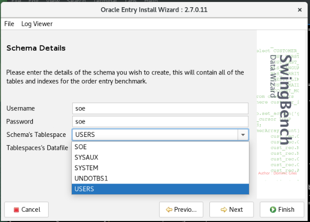

13. Accept the defaults for the "Database Options" page and click **Next**

    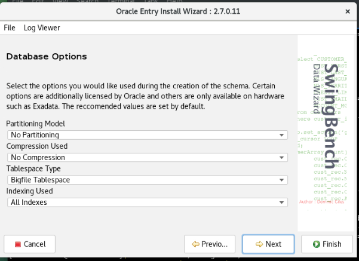

14. Change the size of the benchmark using the "User Defined Scale" option to 0.5 and click **Next**

    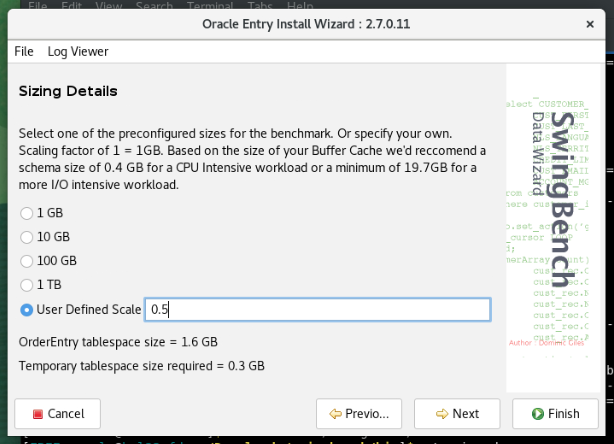

15. Accept the default **Level of Parallelism** at 8 and click **Finish**

    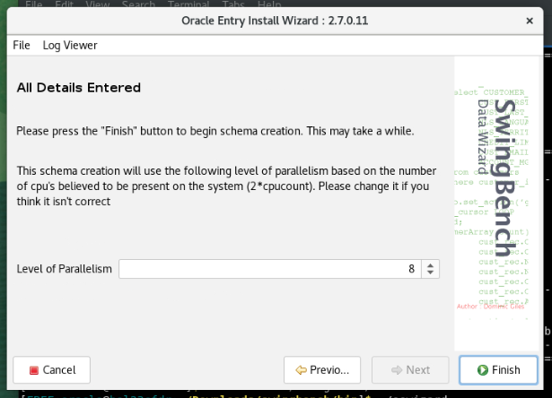

16. This step may take approximately 1-2 minutes to complete.

    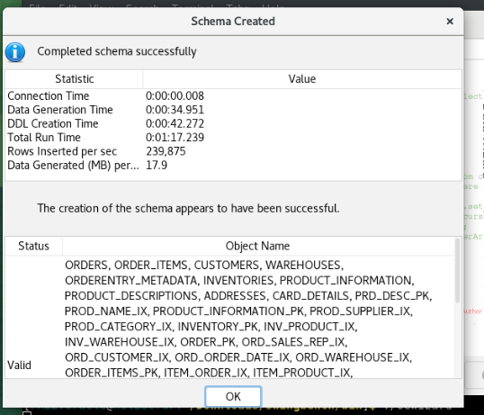

17. Once the schema has been created **click** OK. You can now close out the Order Entry Schema builder.


## Task 2: Looking at our data

1. If you don't already have a terminal open, open a new one. Lets take a look at what we just created. We can do this with a utility inside swingbench called sbutil. You need to navigate back to the bin directory where we ran the install wizard. If you are already there, skip to step two otherwise copy and paste the following command:

    ```
    <copy>
    cd Downloads/swingbench/bin
    </copy>
	```

2. The first thing we want to do is validate the schema was successfully created. From the bin directory run the following command

    ```
    <copy>
    ./sbutil -cs //localhost:1521/FREEPDB1 -u soe -p soe -soe -val
    </copy>
	```
    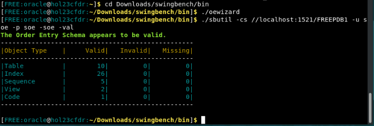

3. We can see there is nothing invalid or missing. Lets take a look at what was created. From the bin directory run the following command

    ```
    <copy>
    ./sbutil -cs //localhost:1521/FREEPDB1 -u soe -p soe -soe -tables
    </copy>
	```
    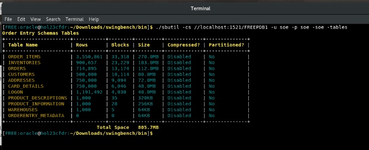

Congratulations! You have finished the setup for this workshop. You may now **proceed to the next lab** 


## Learn More

* [About Swingbench](https://www.dominicgiles.com/swingbench/#about-swingbench)
* [About Order Entry in Swingbench](https://www.dominicgiles.com/swingbench/#setting-up)

## Acknowledgements
* **Author** - Killian Lynch, Oracle Database Product Management, Product Manager
* **Contributors** - Dominic Giles, Oracle Database Product Management, Distinguished Product Manager
* **Last Updated By/Date** - Killian Lynch, Oracle Database Product Management, Product Manager, August 2023
