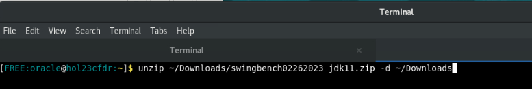
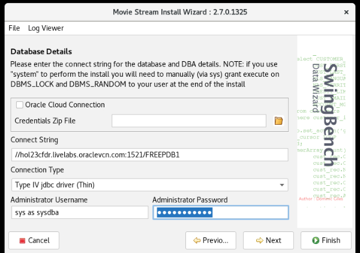
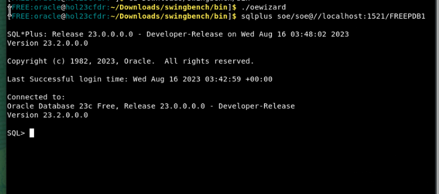
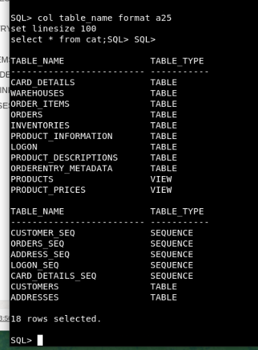
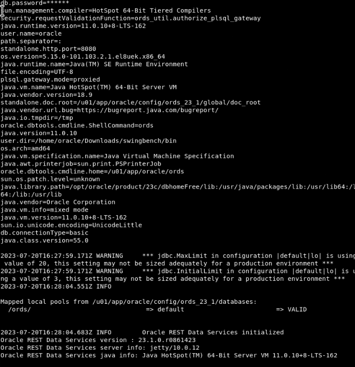
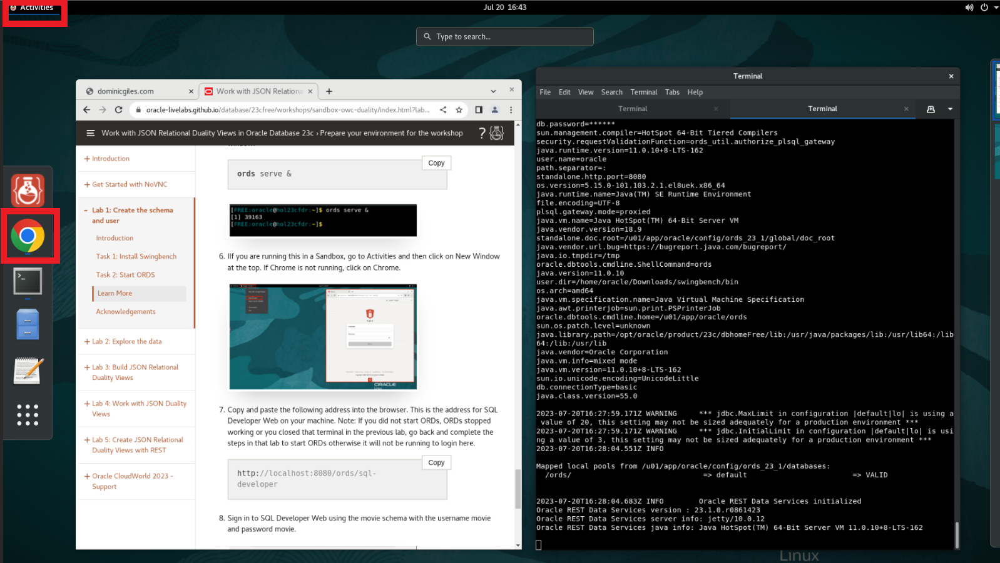

# Setup and configure Swingbench

## Introduction

Welcome to the "Swingbench Unleashed: Conquer Database Stress Testing" workshop! In this hands-on session, we will dive into the world of Swingbench, a powerful tool designed to simulate real-world database workloads and stress test your database systems effectively.

As databases play a critical role in today's software landscape, understanding how your system performs under stress is paramount. Swingbench offers a controlled environment where you can replicate actual scenarios, helping you identify performance bottlenecks before they impact your users.

In this first lab, we will guide you through the essential steps of setting up and configuring Swingbench. Think of it as laying the foundation for our stress testing journey. By the end of this lab, you'll have Swingbench up and running, ready to simulate various workloads on your target database.

So, whether you're a seasoned database professional looking to enhance your stress testing skills or a newcomer eager to learn, let's embark on this journey to master Swingbench and conquer the art of database stress testing.

Estimated Time: 5 minutes

### Objectives

In this lab, you will:
* **Understand Swingbench's Role:** Grasp the significance of Swingbench as a tool for simulating realistic database workloads and stress testing.
* **Install Swingbench:** Download and install Swingbench on their local machine or designated environment.
* **Configure Connection to Database:** Successfully configure Swingbench to connect to a target database for stress testing.
* **Customize Configuration:** Familiarize themselves with key Swingbench configuration options for tailoring the workload simulation.


### Prerequisites

This lab assumes you have:
* Oracle Database 23c Free Developer Release installed
* Terminal or console access to the database
* Internet access

## Task 1: Install Swingbench

1. The first step is to open a command prompt. If you are running in a Sandbox environment, click on **Activities** and then select **Terminal**.

  

2. Next, set your environment. The `oraenv` command will set all the environment variables based on your database. When prompted, type "FREE" for the database name. If you supplied a different database name during installation, use that instead.

    ```
    <copy>
    . oraenv
    </copy>
	```

    


3. Next click [here](https://objectstorage.us-ashburn-1.oraclecloud.com/p/VEKec7t0mGwBkJX92Jn0nMptuXIlEpJ5XJA-A6C9PymRgY2LhKbjWqHeB5rVBbaV/n/c4u04/b/livelabsfiles/o/data-management-library-files/swingbench02262023_jdk11.zip) to download the latest version of Swingbench.

4. Once the download is complete, open a terminal or command prompt on your computer and navigate to the location where the file was saved.

    ```
    <copy>
    unzip ~/Downloads/swingbench02262023_jdk11.zip -d ~/Downloads
    </copy>
	```
    

5. Navigate to the directory where Swingbench is installed. If Swingbench is installed in the "swingbench" folder within your home directory, you can use the following command:

    ```
    <copy>
    cd Downloads/swingbench/bin
    </copy>

	```

  

6. Once you are in the "swingbench/bin" directory, run the following command to execute the Movie Stream Install Wizard:

    ```
    <copy>
    ./moviewizard
    </copy>
    ```

    This command starts the Movie Stream Install Wizard, which guides you through the installation and configuration process for the Movie Stream workload.
    

7. When the Movie Stream wizard opens, click **Next** to get started.

8. Make sure the **Create the Movie Stream Schema** box is checked and click **Next**.

    

9. Under the "Connect string" box, copy (Ctrl + V) or type the following:

    ```
    <copy>
    //hol23cfdr.livelabs.oraclevcn.com:1521/FREEPDB1
    </copy>
    ```
    

11. In the Administrator Password box, copy and paste or type the following password:

    ```
    <copy>
    Welcome123#
    </copy>
    ```
    Once finished press **Next**
    
    


12. Change the username to **movie** and leave the default password of movie, then click **Next** 

    

13. Accept the defaults for the "Database Options" page and click **Next**

    

14. Change the size of the benchmark using the "User Defined Scale" option to 0.5 and click **Next**

    

15. Accept the default **Level of Parallelism** at 8 and click **Finish**

    

16. This step may take approximately 1-2 minutes to complete. You can continue to the next section while this process runs in the background.

    

17. To make this workshop as realistic as possible, let's introduce the business scenario you will be working with - **Oracle MovieStream**.

    

    * Oracle MovieStream is a fictitious online movie streaming company. Customers log into Oracle MovieStream using their computers, tablets, and phones, where they are presented with a personalized list of movies based on their viewing history. The company is now looking for better, smarter ways to track performance, identify customers for targeted campaigns promoting new services and movies, and improve the streaming platform. The scenarios in this workshop are based on challenges that companies face in their businesses. We hope that the labs and workshops will provide you with insights into how Oracle can help you solve these common everyday business and technical challenges.

    * During this workshop, we will primarily focus on three key tables: `genres`, `movie_details`, and `movies_genre_map`. As we progress through the upcoming labs, we will explore the creation of duality views spanning across these tables. Additionally, we will explore techniques for efficiently adding, updating, and manipulating the underlying data within these tables using the duality views.

## Task 2: Start ORDS

1. Open a new tab in the terminal by selecting **File** and **New Tab** 

    

2. Now you will need the Movie Schema to finish creating. Once its done, to enable the RESTful services for the new movie schema, sign into SQL*Plus using the newly created movie user. Once logged in, copy the following command into the terminal:


    ```
    <copy>
    sqlplus movie/movie@//localhost:1521/FREEPDB1
    </copy>
    ```
    

3. Run the following command in SQL*Plus:

    ```
    <copy>
    BEGIN
        ORDS.ENABLE_SCHEMA(p_enabled => TRUE, p_schema => 'MOVIE');
        END;
        /
    </copy>
    ```
    

4. Exit SQL*Plus by running the following command:

    ```
    <copy>
    exit
    </copy>
    ```
    

5. To start ORDS, enter the following command in the same command prompt window:

    ```
	<copy>
    ords serve &
    </copy>
	```
    
    

6. If Google Chrome isnt running, go to **Activities** and then click on the Google Chrome symbol. If a new window doesn't appear, click **Google Chrome** and **New Window** at the top. 

    
    


7. Copy and paste the following address into the browser. This is the address for SQL Developer Web on your machine. Note: If you did not start ORDs, ORDs stopped working or you closed that terminal in the previous lab, go back and complete the steps in that lab to start ORDs otherwise it will not be running to login here.

    ```
    <copy>
    http://localhost:8080/ords/sql-developer
    </copy>
    ```

8. Sign in to SQL Developer Web using the movie schema with the username movie and password movie.

    

Congratulations! You have finished the setup for this workshop. You may now **proceed to the next lab** 


## Learn More

* [Introducing Oracle Database 23c Free – Developer Release](https://blogs.oracle.com/database/post/oracle-database-23c-free)

## Acknowledgements
* **Author** - Killian Lynch, Oracle Database Product Management, Product Manager
* **Contributors** - Dominic Giles, Oracle Database Product Management, Distinguished Product Manager
* **Last Updated By/Date** - Killian Lynch, Oracle Database Product Management, Product Manager, May 2023
