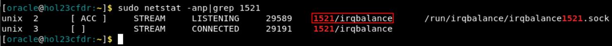
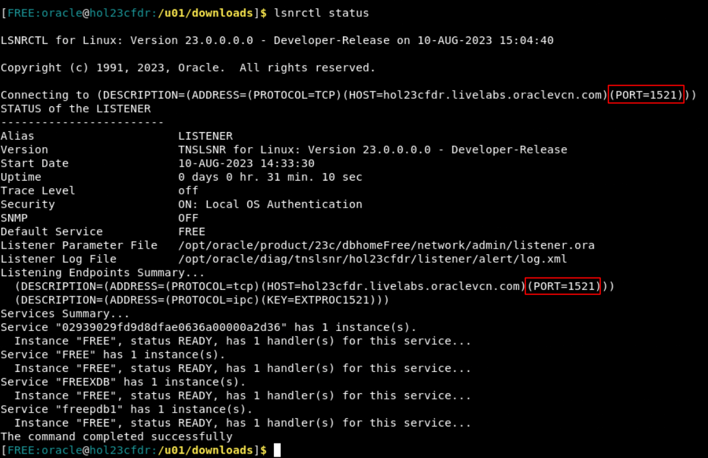

# Install and configure Oracle Database 23c Free

## Introduction

This lab walks you through installing the database software, creating the database and creating the workshop user on Linux.

There are other deployment options that will not be covered in the workshop but will be linked in the Learn More section. These include Docker and VirtualBox deployments.

Estimated Time: 25 minutes

### Objectives

In this lab, you will:
* Setup the operating system
* Install the database software
* Create the database
* Create the workshop user

### Prerequisites

This lab assumes you have:
* A virtual machine running Linux (or running the LiveLabs Sandbox environment)
* All previous labs successfully completed
* Access to the internet to download the software

Watch the video below for a quick walk-through of the lab.
[Lab Walkthrough](videohub:1_3l6mzbfq)

## Task 1: Operating System Setup

1. Open a terminal if you don't currently have one open. To open one Click on Activities and then Terminal.

    

2. Switch to root for the next set of commands including the install

    ```
    <copy>
    sudo -s
    </copy>
    ```
    

3. Before installing you should check to see if anything is running on port 1521. **If nothing is running on port 1521 you can skip to the next step.** This port is what the database configure command will use when creating the listener. If it cannot use the port it will try and use another port. You can either reboot the server and see if the service using 1521 moves to another port or restart the service. If you choose to not to move the service and just let the database run on a port other than 1521 just make sure to adjust the commands later in the workshop to use the new port.

    ````
    <copy>
    netstat -anp|grep 1521
    </copy>
    ````
    

    **Option 1:** If any services are returned you could try and reboot the server and see if they move to a different port. If you reboot you will need to wait for the server to restart and then reconnect to it and then relogin as root.

    ````
    <copy>
    reboot
    </copy>
    ````
    

    **Option 2:** The other option is to try and restart the services see if they move to another port. For a majority of the services you can restart the service using the "sudo systemctl restart" command. Make sure to replace the text below the the service from the previous command. For some of the services you might have to look up how to restart them.

    ````
    <copy>
    systemctl restart <replace with service>
    </copy>
    ````
    

4. Verify port 1521 is available

    ````
    <copy>
    netstat -anp|grep 1521
    </copy>
    ````
    

5. Enable the developer repo to be able to run the prerequisites check as a part of the install
    ```
    <copy>
    dnf config-manager --set-enabled ol8_developer
    </copy>
    ```
    

## Task 2: Database Setup

1. Get the download for 23c Free
    ```
    <copy>
    sed -i 's/23.13.177.119/23.198.64.212/g' /etc/hosts
    sed -i 's/184.84.152.88/23.201.60.87/g' /etc/hosts
    cd /tmp

    wget  -q --show-progress https://download.oracle.com/otn-pub/otn_software/db-free/oracle-database-free-23c-1.0-1.el8.x86_64.rpm
    </copy>
    ```
    

2. Install the database software using the dnf command. This will take about 5-10 minutes.
    ```
    <copy>
    dnf -y localinstall /tmp/oracle-database-free-23c-*.el8.x86_64.rpm
    </copy>
    ```
       

3. Create the database. You will be prompted for a password to be used for the database accounts. You can use any password here but you will need it later so note it down. For my examples I will use Welcome123# This should take about 5-10 minutes.
    ```
    <copy>
    /etc/init.d/oracle-free-23c configure
    </copy>
    ```
    

4. When the create finishes it will give you the two connection strings for your pluggable and container databases. If you used a different port it will be in the connection string.
    ```
    Connect to Oracle Database using one of the connect strings:
    Pluggable database: hol23cfdr.livelabs.oraclevcn.com/FREEPDB1
    Multitenant container database: hol23cfdr.livelabs.oraclevcn.com
    ```

5. To see if your database is up and running you can use the following command
    ```
    <copy>
    /etc/init.d/oracle-free-23c status
    </copy>
    ```
    

6. Exit out of root and back to oracle
    ```
    <copy>
    exit
    </copy>
    ```
    

## Task 3: Environment and User Setup

1. To set your environment each time Oracle logs in add these lines to your profile. This will specifically set it for the FREE database.
    ```
    <copy>
    echo "export ORAENV_ASK=NO" >> /home/oracle/.bashrc
    echo "export ORACLE_SID=FREE" >> /home/oracle/.bashrc
    echo ". /usr/local/bin/oraenv" >> /home/oracle/.bashrc
    echo "unset ORAENV_ASK" >> /home/oracle/.bashrc
    echo "export JAVA_HOME=/usr/bin/java" >> /home/oracle/.bashrc
    echo "export PATH=\$PATH:\$ORACLE_HOME/bin" >> /home/oracle/.bashrc

    . /home/oracle/.bashrc
    </copy>
    ```
    

2. If your listener was configured on a different port or you wanted to see your listener configuration you can use the lsnrctl command. You can use this port in the later commands if you are not running on port 1521.
    ````
    <copy>
    lsnrctl status
    </copy>
    ````
    

3. Connect to your database. The show pdbs commands will list the pluggable databases running in your container. Once you switch to a pluggable database that same command will list just the current pluggable.
    ```
    <copy>
    sqlplus / as sysdba
    </copy>
    ```
    ```
    <copy>
    show pdbs
    </copy>
    ```
    ```
    <copy>
    alter session set container = FREEPDB1;
    </copy>
    ```
    ```
    <copy>
    show pdbs
    </copy>
    ```
    

4. We will be using the user hol23c throughout the workshop. You can specify any password you want. I'm going to use Welcome123# for my examples.
    ````
    <copy>
    create user hol23c identified by Welcome123#;
    </copy>
    ````
    ````
    <copy>
    alter user hol23c quota unlimited on users;
    </copy>
    ````
    ````
    <copy>
    grant create session to hol23c;
    </copy>
    ````
    ````
    <copy>
    exit;
    </copy>
    ````
    


5. You may now **proceed to the next lab**


## Learn More

* [Oracle Database 23c Free](https://www.oracle.com/database/free/)
* [Oracle Database 23c Free VirtualBox](https://www.oracle.com/database/technologies/databaseappdev-vm.html)
* [Oracle Database Container Registry (Search for 23c Free)] (https://container-registry.oracle.com/ords/f?p=113:4)
* [Oracle Database 23c Free Installation](https://docs.oracle.com/en/database/oracle/oracle-database/23/xeinl/index.html#Oracle%C2%AE-Database-Free)

## Acknowledgements
* **Author** - David Start, Database Product Management
* **Contributors** - David Start, Database Product Management
* **Last Updated By/Date** - David Start, Database Product Management, August 2023
