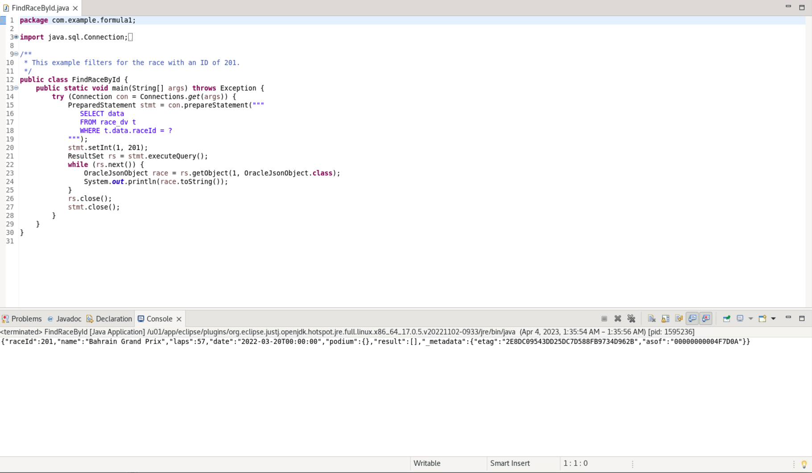
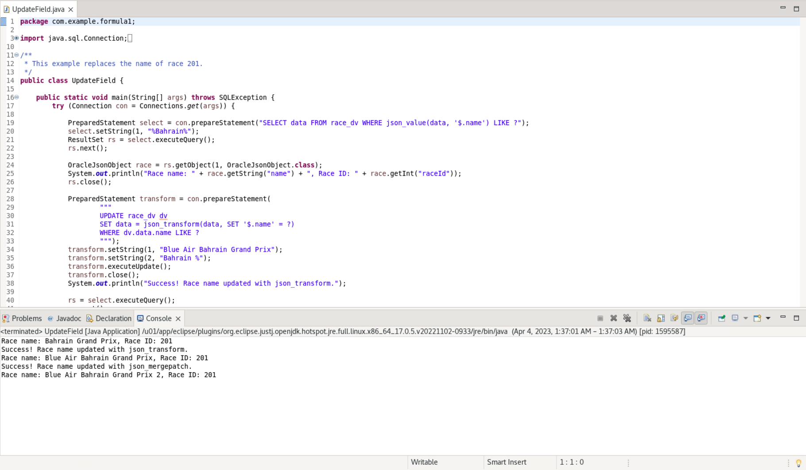
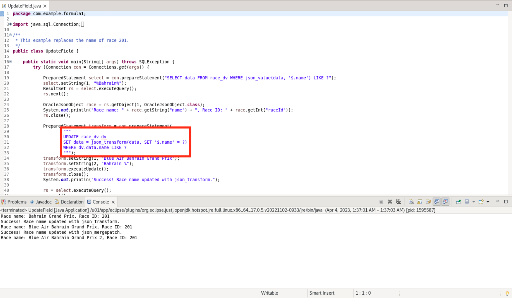
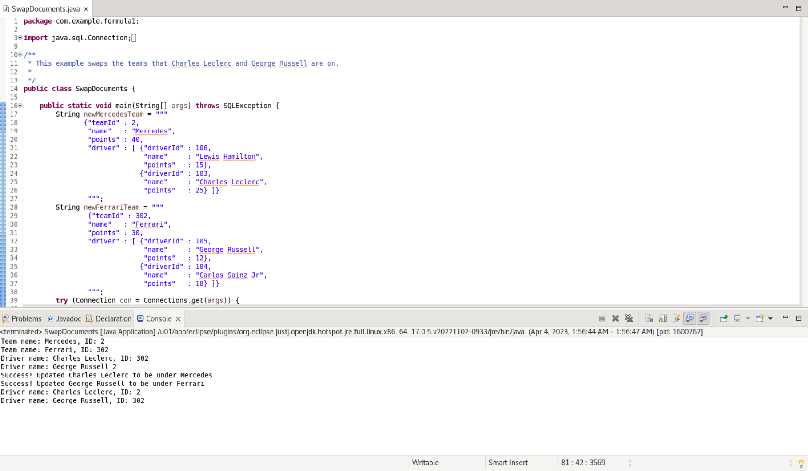

# Working with JSON and the Duality Views

## Introduction

This lab walks you through the steps to work with Java and JSON documents in the Oracle 23c database. We'll show you how to populate the tables and subsequent duality views, as well as filter, replace, fetch, update, and delete JSON documents by predicates. Finally, we'll let you test out non-updateable fields. 

Estimated Time: 15 minutes

### Objectives

In this lab, you will:
* Populate the duality views
* Work with JSON documents and predicates
* Test non-updateable fields

### Prerequisites (Optional)

This lab assumes you have:
* Oracle Database 23c Free Developer Release
* All previous labs successfully completed
* Eclipse or a compatible IDE for executing Java code

## Task 1: Find documents matching a filter (aka predicate)

1. We'll start walking you through how to filter the data. Please open the FindRaceById.java file and look through the code. This file contains code that is almost identical to ReadRacesDv.java, but utilizing dot notation in the predicate of the PreparedStatement to find the record with the ID 201.

    

2. Run the code and you can see the execution of this statement. It pulls back the expected document for the Bahrain Grand Prix. Note that the document is empty for results and podium, so the race results are not yet recorded.

    There are multiple ways to find race info by raceId. You could also use JSON functions, such as json\_value and json\_exists in predicates when querying duality views. 
    
    We will utilize json\_value later on in the lab. However, the json\_exists function is more powerful than json\_value in terms of the conditions it can express and is used by the REST interface to translate QBEs.

    

## Task 2: Replace and fetch a document by ID

1. Now, we will announce results for the Bahrain Grand Prix by updating the appropriate race entry with the details. Please open the ReplaceRace.java file.

    The first thing we do is set the variable newRace to be the JSON document containing the results of the race. The results and podium are filled out.

    The update statement uses the virtual column OBJECT\_RESID to identify where to make the change. After executing the update, we access the resulting JSON object to print out the winner. Note that this name/value pair is nested a couple layers deep within the JSON file, so to access it we have to go race -> podium -> winner.

    

2. Press the green play button to execute the file and find out who won the race. 

    

3. Now to see the entirety of the updated results for the Bahrain Grand Prix. You can use the OBJECT\_RESID virtual column to to query a document by ID. Open the FindRaceByObjId.java and execute that to see the outcome.

    

## Task 3: Update specific fields in the document identified by a predicate

1. Now we'll update the Bahrain Grand Prix's name with sponsor information. Open UpdateField.java. 

    

2. First, we select the name and ID of the Bahrain Grand Prix prior to the update. Then, we use json\_transform to update specific fields. 

    

3. The second approach shown is using json_mergepatch, which is standardized, but is limited to simple object field updates and cannot be used for updating specific array elements. The json\_transform function, however, can be used to update specific array elements. We have written the code to execute either function, but they yield the same results.
    
    Note that the "where" clause can have any valid SQL expression, e.g. equality on OBJECT\_RESID, some condition using simplified syntax, or JSON function, such as json\_value or json\_exists.

    Also, the arrow in the photo is referring to how we can construct the JSON string through an OracleJSONFactory object instead of having to write out the string ourselves. A string would work as shown in the alternative example, but they can be difficult to construct, especially as they get more complex.

    

## Task 4: Re-parenting of sub-objects between two documents
1. Switch Charles Leclerc's and George Russell's teams. This can be done by updating the Mercedes and Ferrari team_dvs, and changing their driver arrays. We will update the new list of drivers for both documents in the input. Open the SwapTeams.java file.

    

1. The program will print out the team IDs, and the IDs of the drivers before the update. After the updates, it will then show the driver IDs again, and you'll see that the former teams with Mercedes have now been swapped to Ferrari and vice versa.

    Execute the file with the green play button.

    

## Task 5: Update a non-updateable field

1. Open the NonupdateableError.java file. Remember, when we created the JSON relational duality views that some would specify UPDATE or NODELETE or etc. on an underlying base table. This is where that functionality comes into play. 
    
    This program will attempt to update the team for a driver through driver\_dv. However, NOUPDATE was specified through this duality view, so this will throw an error, as we do not allow this field to be updateable through driver_dv.

    As you execute, you will see the error message pop up. Scroll right if necessary to see the entirety of the message.

    

## Task 6: Delete by predicate

1. Finally, we are going to delete the race document for Bahrain Grand Prix. The file will print out the records in driver\_dv and race\_dv pre and post-delete.

    In the underlying base tables, rows are deleted from the race and driver\_race\_map tables, but not from the driver table because it is marked read-only in the view definition. 

    Note that the "where" clause can have any valid SQL expression, e.g. equality on OBJECT\_RESID, some condition using simplified syntax, or JSON function, such as json\_value or json\_exists.

    Click the green play button to execute DeleteById.java.

    

2. This lab is now complete.

## Learn More

* [JSON Relational Duality: The Revolutionary Convergence of Document, Object, and Relational Models](https://blogs.oracle.com/database/post/json-relational-duality-app-dev)
* [JSON Duality View documentation](http://docs.oracle.com)

## Acknowledgements
* **Author** - Kaylien Phan, Product Manager, Database Product Management
* **Last Updated By/Date** - Kaylien Phan, Database Product Management, March 2023
