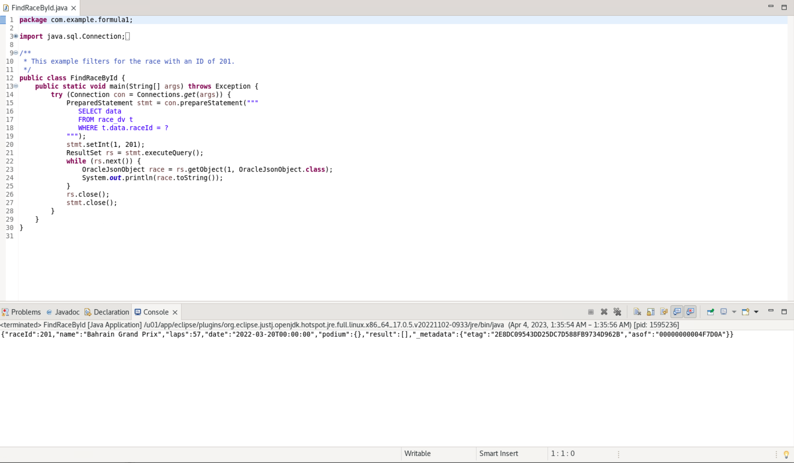
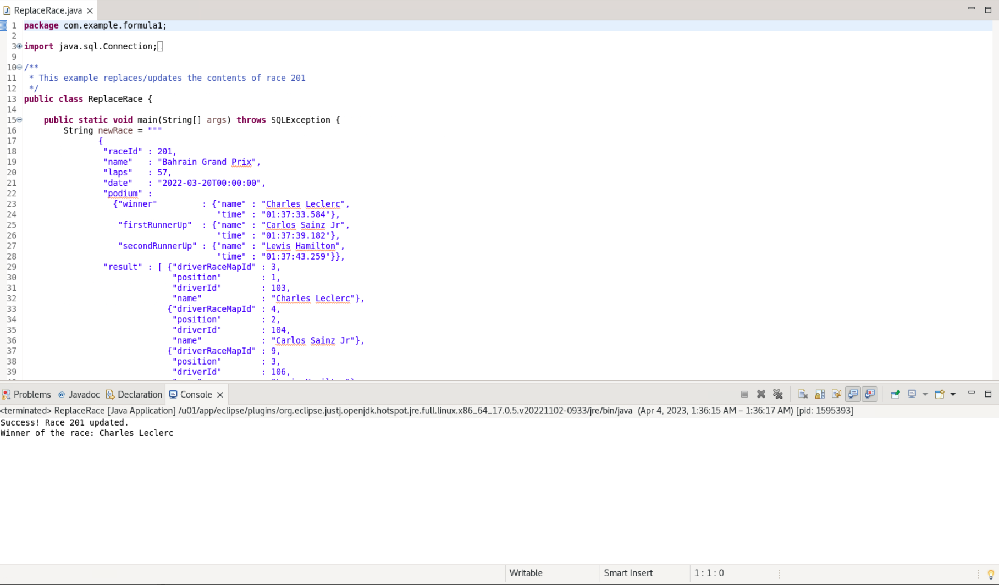
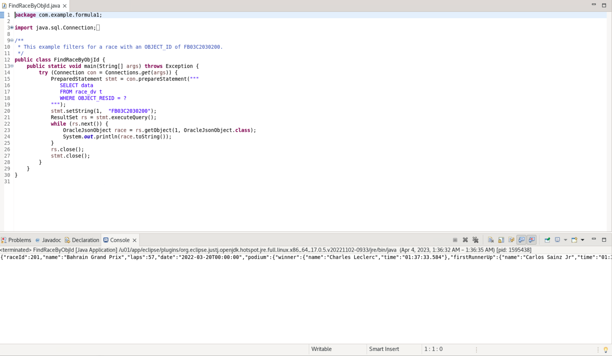
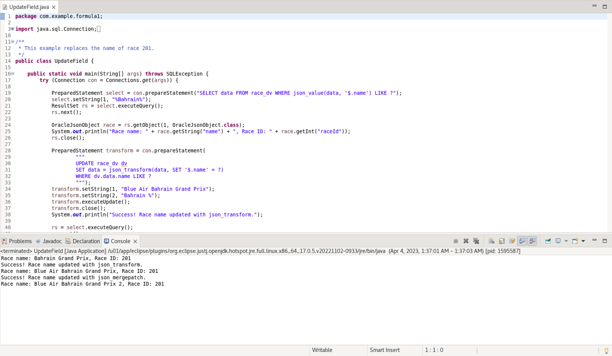
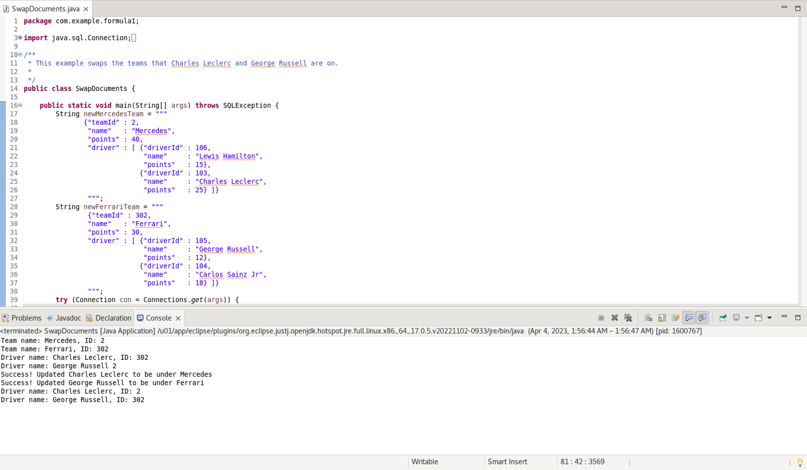
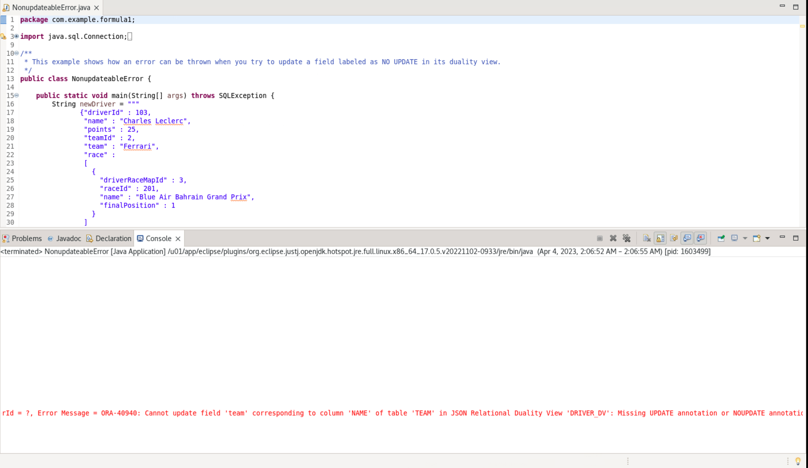
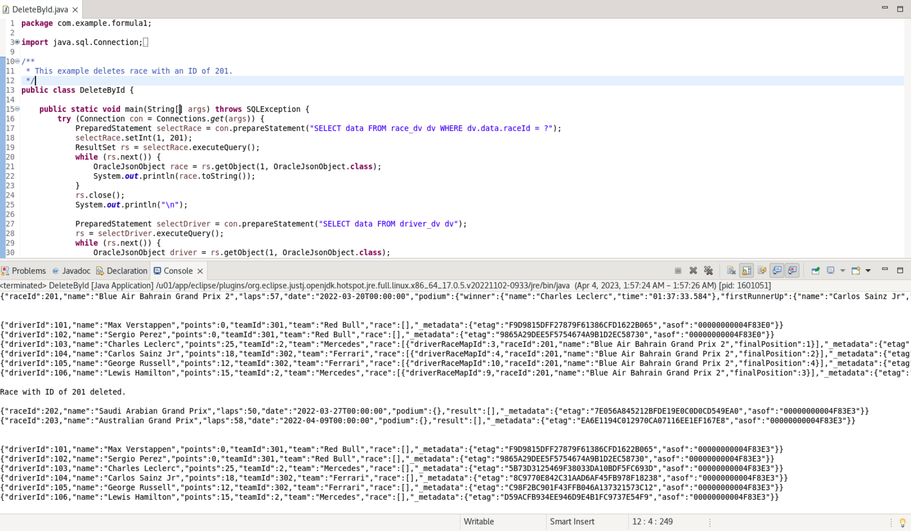

# Working with JSON and the Duality Views

## Introduction

This lab walks you through the steps to work with JSON documents in the Oracle 23c database. We'll show you how to populate the tables and subsequent duality views, as well as filter, replace, fetch, update, and delete JSON documents by predicates. Finally, we'll let you test out non-updateable fields. 

Estimated Time: 15 minutes

### Objectives

In this lab, you will:
* Populate the duality views
* Work with JSON documents and predicates
* Test non-updateable fields

### Prerequisites (Optional)

This lab assumes you have:
* An Oracle account
* A noVNC instance with 23c and SQL Developer installed
* All previous labs successfully completed

## Task 1: Find documents matching a filter (aka predicate)

1. We'll start walking you through how to filter the data. Please open the FindRaceById.java file and look through the code. This file is based around a SQL statement that is almost identical to ReadRacesDv.java, but  utlizing dot notation in the predicate to find the record matching with the ID 201.

    Run the code and you can see the execution of this statement. It pulls back the expected document for the Bahrain Grand Prix. Note that the document is empty for results and podium, so the race results have not yet been recorded in here.

    

    There are multiple ways to find race info by raceId. You could also use JSON functions, such as json\_value and json\_exists in predicates when querying duality views. We will utilize json\_value later on in the lab. However, the json\_exists function is more powerful than json\_value in terms of the conditions it can express and is used by the REST interface to translate QBEs.

## Task 2: Replace and fetch a document by ID

1. Now, we will announce results for the Bahrain Grand Prix by updating the appropriate race entry with the details. Please open the ReplaceRace.java file.

    The first thing we do is set the variable newRace to be the JSON document containing the results of the race. The results and podium are filled out. 

    The update statement uses the virtual column OBJECT\_RESID to identify where to make the change. After executing the update, we access the resulting JSON object. *in layers? idk how do we phrase this* 

    Press the green play button to execute the file and find out who won the race. *file? or script?*

    

2. Now to see the entirety of the updated results for the Bahrain Grand Prix. You can use the OBJECT\_RESID virtual column to to query a document by ID. Open the FindRaceByObjId.java and execute that to see the outcome.

    

## Task 3: Update specific fields in the document identified by a predicate

1. Now we'll update the Bahrain Grand Prix's name with sponsor information. Open UpdateField.java. 

    First, we select the name and ID of the Bahrain Grand Prix prior to the update. Then, we use json\_transform to update specific fields. 

    An alternative approach is to use json_mergepatch, which is standardized, but is limited to simple object field updates and cannot be used for updating specific array elements. The json\_transform function, however, can be used to update specific array elements. We have written the code to execute either function, but they yield the same results.
    
    Note that the "where" clause can have any valid SQL expression, e.g. equality on OBJECT\_RESID, some condition using simplified syntax, or JSON function, such as json\_value or json\_exists.

    

## Task 4: Re-parenting of sub-objects between two documents
Switch Charles Leclerc's and George Russell's teams. This can be done by updating the Mercedes and Ferrari team_dvs. The documents can be updated by simply sending the new list of drivers for both documents in the input. Open the SwapDocuments.java file.
1. First, it will show the team documents, then perform the updates. It will then show the team documents after the updates, you'll see that the former teams with Mercedes have now been swapped to Ferrari and vice versa. The drivers documents have the updates as well.

    Execute the file.

    

## Task 5: Update a non-updateable field

1. Open the NonupdateableError.java file. This will attempt to update team for a driver through driver\_dv. This will throw an error as we specified the JSON Duality View to not allow this field to be updateable through driver_dv.

    

## Task 6: Delete by predicate

1. Delete the race document for Bahrain Grand Prix. The underlying rows are deleted from the race and driver\_race\_map tables, but not from the driver table because it is marked read-only in the view definition. 

    Note that the "where" clause can have any valid SQL expression, e.g. equality on OBJECT\_RESID, some condition using simplified syntax, or JSON function, such as json\_value or json\_exists.

    

## Learn More

* [JSON Relational Duality: The Revolutionary Convergence of Document, Object, and Relational Models](https://blogs.oracle.com/database/post/json-relational-duality-app-dev)
* [JSON Duality View documentation](http://docs.oracle.com)

## Acknowledgements
* **Author** - Kaylien Phan, Product Manager, Database Product Management
* **Last Updated By/Date** - Kaylien Phan, Database Product Management, March 2023
