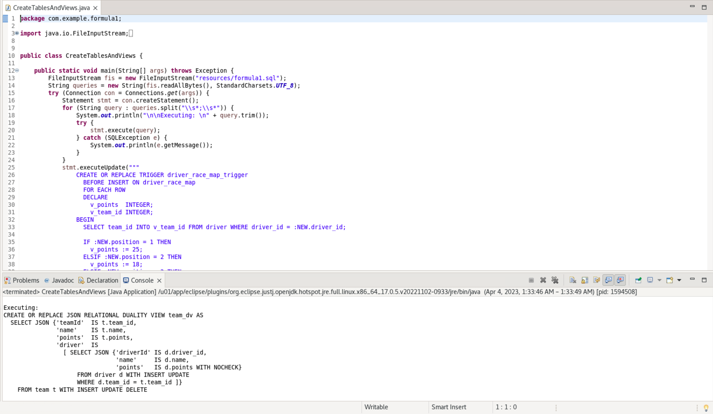

# Create the schema including JSON Duality Views

## Introduction

This lab walks you through the setup steps to create the user, tables, and JSON duality views needed to execute the rest of this workshop. Then you will populate the views and tables.

Estimated Time: 5 minutes

### Objectives

In this lab, you will:
* Login as your database user
* Create the JSON Duality Views and base tables needed
* Populate your database

### Prerequisites (Optional)

This lab assumes you have:
* An Oracle account
* A noVNC instance with 23c and SQL Developer installed
* All previous labs successfully completed

## Task 1: Connecting to your database user

When you click Login Details and Launch Remote Desktop button, you'll be sent into a new tab of your browser with an instance of noVNC. This is a VM with a preinstalled Linux desktop, and we'll need to start up SQL Developer to connect to your database.

1. Click Activities -> Show Applications. Open Eclipse and it will launch.

<!--  -->

2. Accept the default workspace. 

3. Click on Open Projects from File System.

4. Go to *fill this in*, and click Finish.

2. On the left side Package Explorer, click the dropdown menu for JdbcDuality -> src/main/java/com.example.formula1 -> Connections.java. This is the first file we will observe. It shows the Connection string that every Java Class in this program will utilize to connect to the racer database.

## Task 2: Creating your database tables and JSON duality views
1. Now, to actually execute a class. Click on CreateTablesAndViews.java. As you scroll through it, you can see that it is loading in formula1.sql under the resources folder. These are the SQL commands that will create the necessary tables/views for this lab. It will read through each query and then execute each one.

    So it will create the base SQL tables for the duality views, and the duality views themselves.

    <!--  -->

    Then following that, it will create a trigger on the driver\_race\_map table to populate the points fields in team and driver based on race results.

    <!--  -->

    Now click the small green play button drop down in the upper left of the Eclipse window. You must have the CreateTablesAndViews.java file open. We will run this program by clicking Run As -> Java Application.

    

    You may scroll through the output to see all the commands completed successfully. We have just created:
    -	Base tables for the duality views related to the F1 team, drivers, race, and their position on the map
    -	A trigger on the driver\_race\_map table to populate the points fields in team and driver based on race results
    -	JSON relational duality views for racers, drivers, and teams

    

## Task 3: Populating the database
1. Click on the LoadData.java file and open it. The main method is calling on loadJson which reads in a file that has each line as a JSON document. The method adds every line into the batch insert that we send to the database. 

    We are inserting a collection of team documents into TEAM\_DV. This automatically populates the driver and team table as well as the driver collection. Additionally, we are inserting a collection of race documents into RACE\_DV. This automatically populates the race table.

    Click the same dropdown and run this program as a Java application.
    
    

    

    From the output, you can see we loaded the JSON documents without error.

    

    
2. Now, we will look at the contents of teams_dv (the teams duality view), by opening ReadTeamsDv.java and running that.

    

    You'll see that we provided you 3 different ways to list the contents of the Duality Views:
    - JSON text = returns the entire JSON entry without formatting
    - JSON API = outputting each team using the JSON API in the package oracle.sql.json
    - Java Objects = returning each team object as a Java record or JSON-B

    

    You can see the teams_dv has been loaded with data now.
    
2. Populating a duality view automatically updates data shown in related duality views, by updating their underlying tables. 

    For example, in the previous step documents were inserted into the team\_dv duality view. This duality view joins the team table with the driver table, so on insert into this duality view both the team table as well as the driver table are populated. 
    
    If you now list the contents of the driver\_dv duality view, which is based on the driver table, it has documents as well.

    To see these contents, we will run both the ReadDriversDv.java and ReadRacesDv.java.

    

    

    Your setup is now complete.
  

## Learn More

* [JSON Relational Duality: The Revolutionary Convergence of Document, Object, and Relational Models](https://blogs.oracle.com/database/post/json-relational-duality-app-dev)
* [JSON Duality View documentation](http://docs.oracle.com)

## Acknowledgements
* **Author** - Kaylien Phan, Product Manager, Database Product Management
* **Last Updated By/Date** - Kaylien Phan, Database Product Management, March 2023
