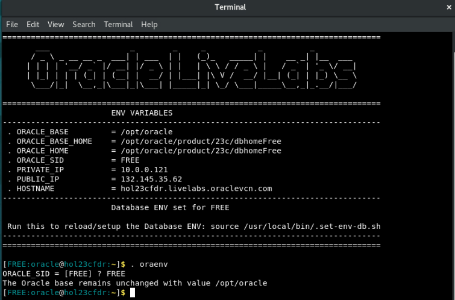
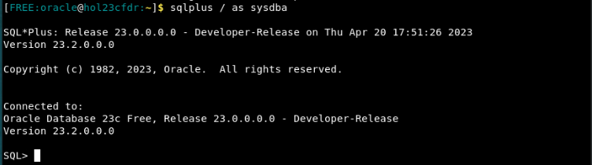
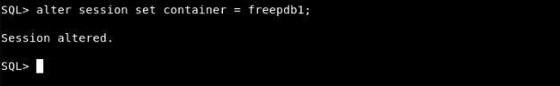
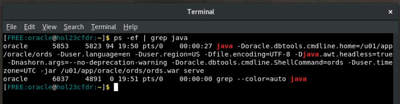

# Change schema user's password and start ORDS for JRDV and APEX access

## Introduction

In this lab you will reset the password for the **hol23c** user in the Oracle Database and then start up **Oracle REST Data Services** (ORDS), which will be needed to execute HTTP commands against JRDVs as well as run  **Oracle Application Express** (APEX) applications.

Estimated Time: 5 minutes

### Objectives

In this lab, you will:
* Reset the password for the **hol23c** user
* Start ORDS

### Prerequisites

This lab assumes you have:
* Oracle Database 23c Free Developer Release
* A terminal or console access to the database

## Task 1:Resetting database user password

1. The first step is to get to a command prompt. If you need to open a terminal and you are running in a Sandbox environment, click on Activities and then Terminal.

    

2. Next, configure your Oracle environment. The oraenv command will set all of the environment variables based on your database. When prompted, type ***FREE** for the database name; if you supplied a different database name, use that instead.
    ```
    <copy>. oraenv</copy>
    ```

    


3. Next, connect to your database.
    ```
    <copy>sqlplus / as sysdba</copy>
    ```
    

4. Now change your container to your pluggable database. If your pluggable database has a different name, make sure to change it in the command below.
    ```
    <copy>alter session set container = freepdb1;</copy>
    ```
    
    

5. To change the password for the **hol23c** user, use the "alter user \[username\] identified by \[new password\]" command. The syntax below shows how to do this for the hol23c user; make sure to replace new\_password\_here to your new password. Throughout this workshop, we will use the **Welcome123** password.
    ```
    <copy>alter user hol23c identified by </copy> [new_password_here];
    ```

    

6. Once the password has been changed, you can exit SQL Plus.

    ```
    <copy>exit</copy>
    ```
    

## Task 2: Starting ORDS

1. To start ORDS, from the same command prompt use the following command. The output of **[1] 26895** is just an example - your output could be different.

    ```
    <copy>ords serve > /dev/null 2>&1 &</copy
    ```

    

    **NOTE:** You must leave this terminal window open and keep the process running. Closing either will stop ORDS from running, and you will not be able to access other applications that are used in this lab.


2. To confirm ORDS is running, you can run the ps -ef | grep java command, as shown below. Your results may be slightly different, but as long as you see one java process running and ORDS is mentioned in the results, it is running.
    
    

3. You may now proceed to the next lab.

## Learn More

* [Introducing Oracle Database 23c Free � Developer Release](https://blogs.oracle.com/database/post/oracle-database-23c-free)

## Acknowledgements
* **Author** - Kaylien Phan, William Masdon
* **Contributors** - Jim Czuprynski, LiveLabs Contributor, Zero Defect Computing, Inc.
* **Last Updated By/Date** - Jim Czuprynski, Zero Defect Computing, July 2023