# Explore Feature Sets of JSON Relational Duality Views

## Introduction

This lab lets you explore the rich feature set of JSON Relational Duality Views (JRDVs) that you created earlier, including the ability to modify their underlying data ... or block users from modifying data with JRDV annotations.

Estimated Time: 25 minutes.

<!-- Watch the video below for a quick walk through of the lab. -->

### Objectives
Learn how to:
- Use JSON to create, modify, and delete data within a JRDV's underlying tables
- Explore the optional limits that JRDVs can enforce against creating and modifying data

### Prerequisites
This lab assumes:
- You have already finished all prior labs
- You have already started ORDS as instructed in Lab #2
- You still have your SQL Developer session open from the prior lab step

Watch the video below for a quick walk through of the lab.
[Explore Feature Sets of JSON Relational Duality Views walkthrough](videohub:1_b7q5ieox)

## Task 1: Configure REST-Enabled JRDVs

So that we can explore using REST API commands to add, modify, or delete data from JRDVs, we first need to confirm that Oracle REST Data Services (ORDS) which you started in Lab 2 is still running. We will then enable REST Data Services for one of our JRDVs.

1. To confirm ORDS is running, you can run the ps -ef | grep java command, as shown below. Your results may be slightly different, but as long as you see one java process running and ORDS is mentioned in the results, it is running.

    

2. We will enable REST Data Services at the schema level and then for each of the JRDVs created in the prior lab.

    Open the file named **enable_rest.sql** and execute the script by either clicking the *Run Script* button or hitting *F5*:

    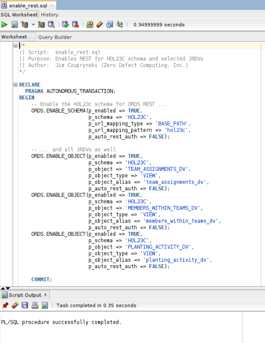

    >**Note:** For all following Tasks, it will be helpful to review the statements we used to create these JRDVs in the file named **create_jrdvs.sql** from the previous lab as we review JRDV features like the UNNEST directive and various DML annotations. An easy way to do that is to click on the *Activities* button, select the *Text Editor* option from the toolbar, then navigate to the **/home/oracle/examples/jsondrv** folder and select the file you wish to open.

    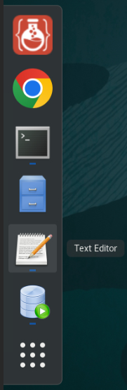
    

## Task 2: Viewing JRDV Data

Let's review the current data within each JRDV in both *JSON* and *tabular* formats.

1. Let's query these JRDVs and return their contents as native JSON documents. Use the *File...Open* button to open each file, select the **hol23c\_freepdb1** database connection when prompted, and then execute each script by either clicking the *Run Script* button or hitting *F5*.

    Open the file named **view\_planting\_activity\_as\_json.sql** and execute that script to see the contents of the **PLANTING\_ACTIVITY\_DV** JRDV. This query uses the **JSON\_SERIALIZE** SQL function to return data in native JSON format; the PRETTY directive shows output in a stacked format:

   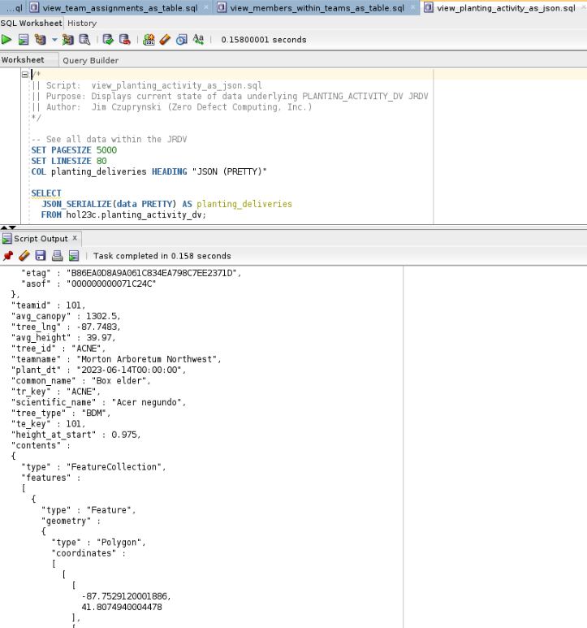

    To see the contents of the **TEAM\_ASSIGNMENTS** JRDV in JSON format, open the file named **view\_team\_assignments\_as\_json.sql** and execute it (F5):

    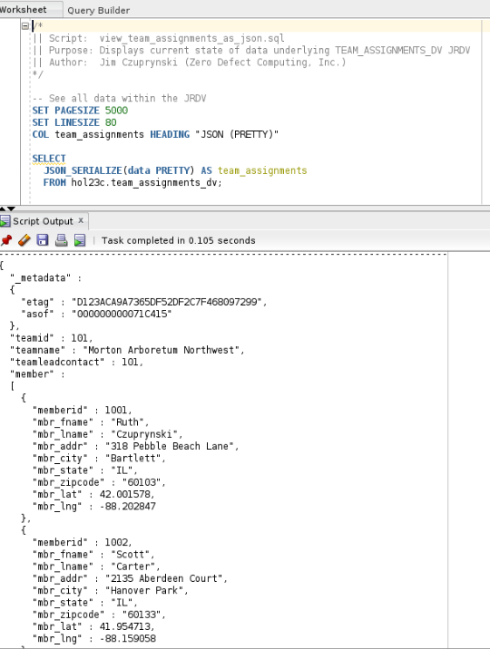

    And to see the current state of the **MEMBERS\_WITHIN\_TEAMS** JRDV in JSON format, open the file named **view\_members\_within\_teams\_as\_json.sql** and execute it (F5):

    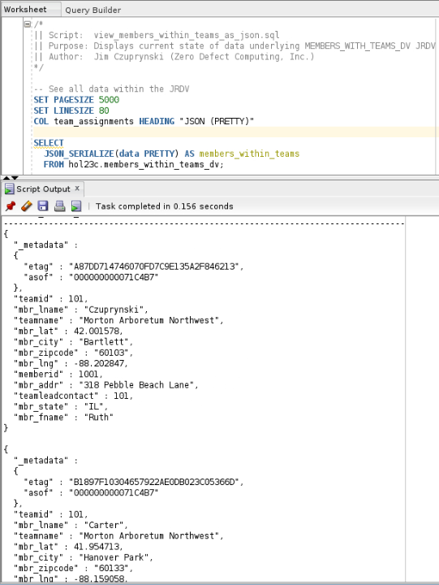

    Note that even though the **TEAM\_ASSIGNMENTS** and **MEMBERS\_WITHIN\_TEAMS** JRDVs access the same underlying tables, the way the data is returned is dramatically different. That's because the first JRDV represents member information *nested as a collection* within their corresponding teams, but the second JRDV uses the **UNNEST** keyword to *flatten* the relationship between teams and team members.

2. Even though JRDVs are designed to return data in JSON document format, it's still possible to format query output in standard tabular format. To run these tabular-format queries, use the *File...Open* button to open each file, select the **hol23c\_freepdb1** database connection when prompted, and then execute the query **by selecting any part of the query statement and then hitting CTL-Enter to execute it.**

    Let's run a tabular-formatted query against the **PLANTING\_ACTIVITY\_DV** JRDV. Open the file named **view\_planting\_activity\_as\_table.sql** and execute it:

   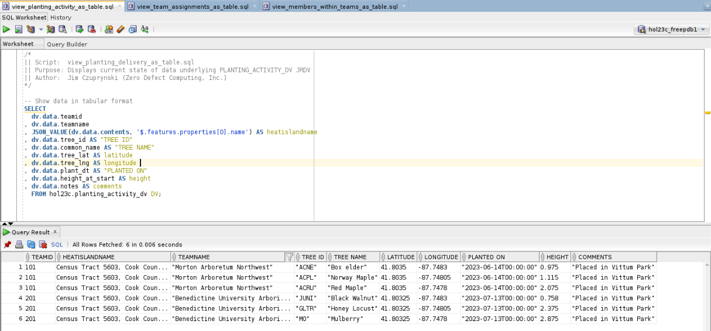

    Just as in step #1 above, you will see the combined data from the tables that underlie that JRDV. Note the query used the **JSON\_VALUE** SQL function to drill into the *CONTENTS* column because this JRDV's underlying **HEAT\_ISLANDS** table's **HI\_DOC** column stores its data within a *Native JSON* datatype.

    Similarly, here's the contents of the **TEAM\_ASSIGNMENTS** JRDV in tabular format. Open the file named **view\_team\_assignments\_as\_table.sql** and execute it (CTL-Enter):

    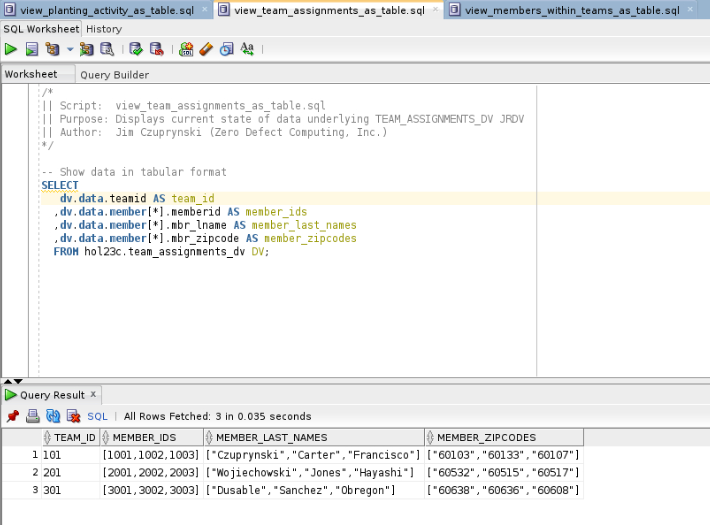

    And here's the contents of the **MEMBERS\_WITHIN\_TEAMS** JRDV in tabular format. Open the file named **view\_members\_within\_teams\_as\_table.sql** and execute it (CTL-Enter):

    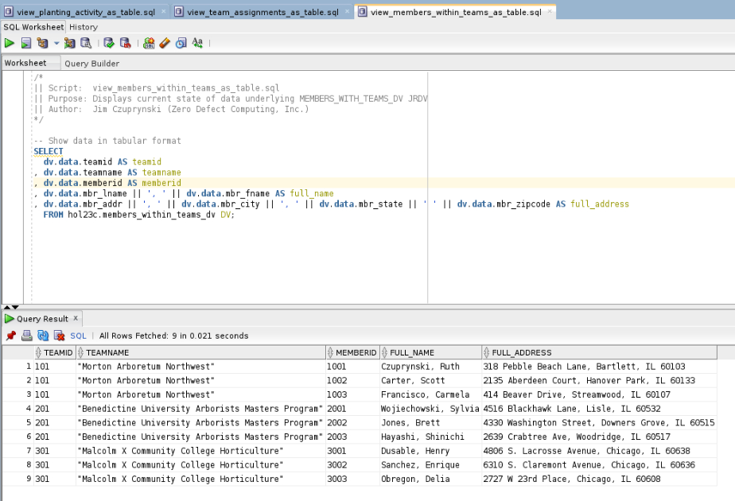

    We'll keep the **view\_planting\_activity\_as_table.sql** and **view\_members\_within\_teams\_as\_table.sql** files open so that it's easier to see the impact of DML statements against these JRDVs in the next task.

## Task 3: Managing JRDV Data Via Standard DML Against Underlying Tables

We will next explore methods for accessing and managing data that underlies some of our JRDVs by applying standard DML statements to the underlying tables. Execute each script by either clicking the *Run Script* button or hitting *F5*.

1. Let's add data by applying SQL DML statements directly against the JRDV's underlying tables. Open the file named **insert\_by\_dml.sql** and execute it (F5):

    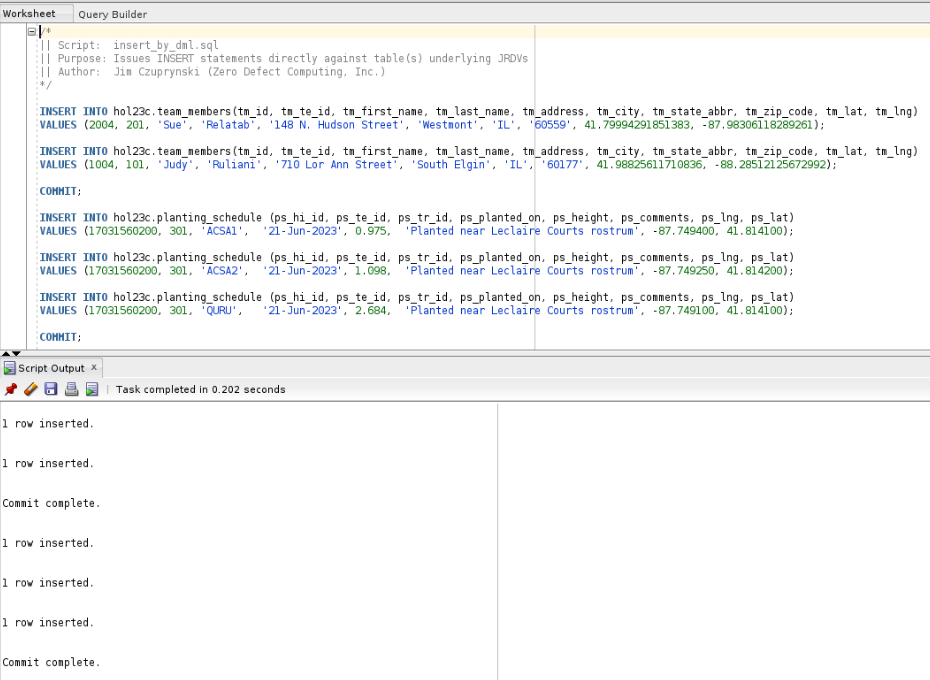

2. We can also change existing data with a standard DML UPDATE statement against the JRDV's underlying tables. Open the file named **update\_by\_dml.sql** and execute it (F5):

    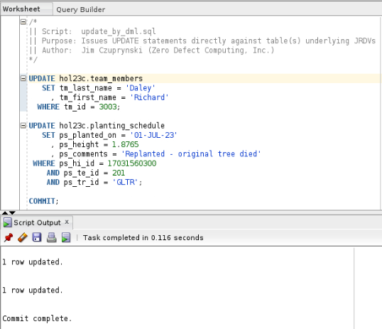

3. Now let's attempt to delete some of the data we just added with a standard DML DELETE statement against the JRDV's underlying tables. Open the file named **delete\_by\_dml.sql** and execute it (F5):

    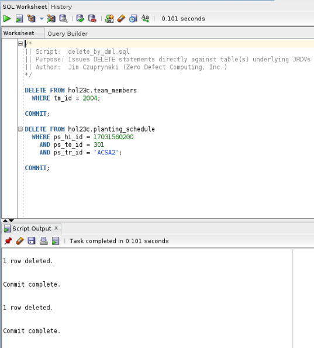

4. Finally, let's take a look at the results of our standard DML operations by rerunning the two tabular-format queries:

    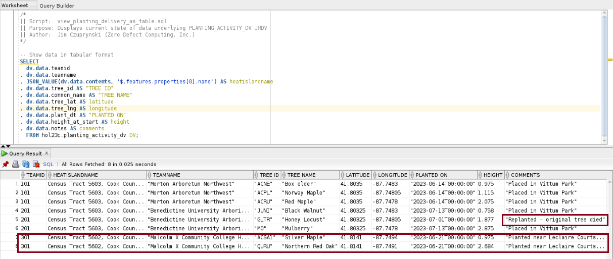

    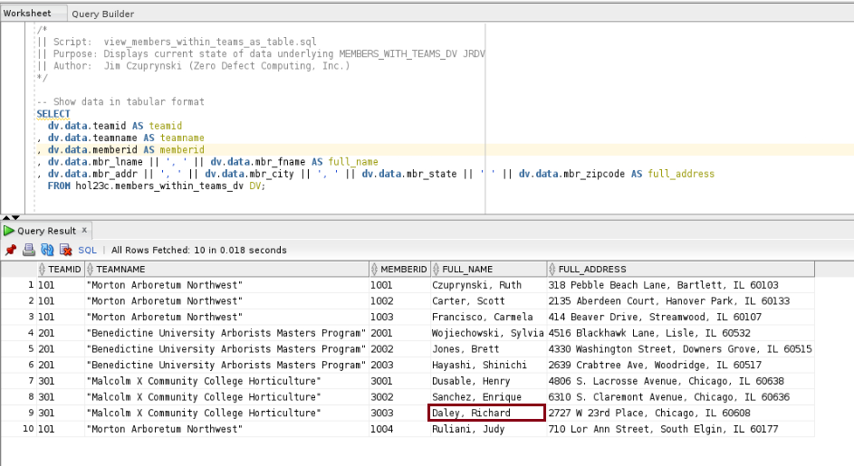

## Task 3: Managing Data Via DML Applied Directly Against JRDVs
Some of the most impressive and unique characteristics of JRDVs are their capabilities for managing data by applying SQL DML statements *directly against the JRDV itself.* Let's explore scenarios for adding, changing, and deleting data via these features.

1. First, let's add some new JRDV documents by applying a SQL INSERT statement *directly against JRDVs.* Open the file named **insert\_by\_jrdv.sql** and execute it (F5):

    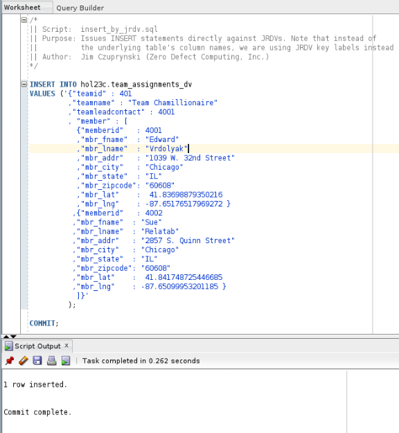

    Note that these DML statements used *JSON documents* formatted identically as their underlyiing JRDVs describe the data contained within, including the labels used to describe each JSON document's key value pair.

2. Updating data within JRDV documents is also possible  by applying a SQL UPDATE statement *against the JRDV itself.* Open the file named **update\_by\_jrdv.sql** and execute it (F5):

    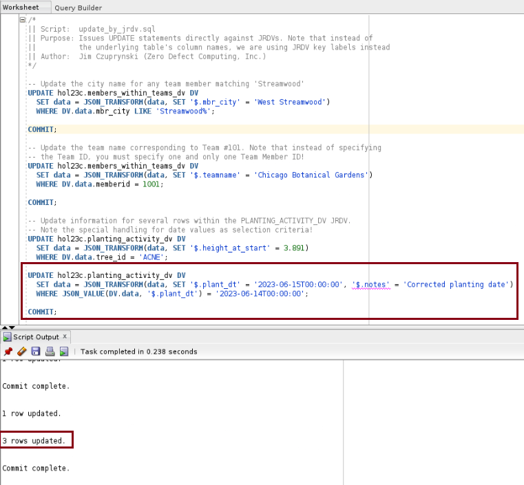

    These DML statements leveraged the **JSON\_TRANSFORM** SQL function to modify data within the tables underlying each JRDV. Note that the final statement (shown below) updated two key value pairs in the **PLANTING\_ACTIVITY\_DV** JRDV and used the JSON standard format for date value strings.

3. We can delete data within JRDVs by applying a SQL DELETE statement against the JRDV itself. Open the file named **delete\_by\_jrdv.sql** and execute it (F5):

    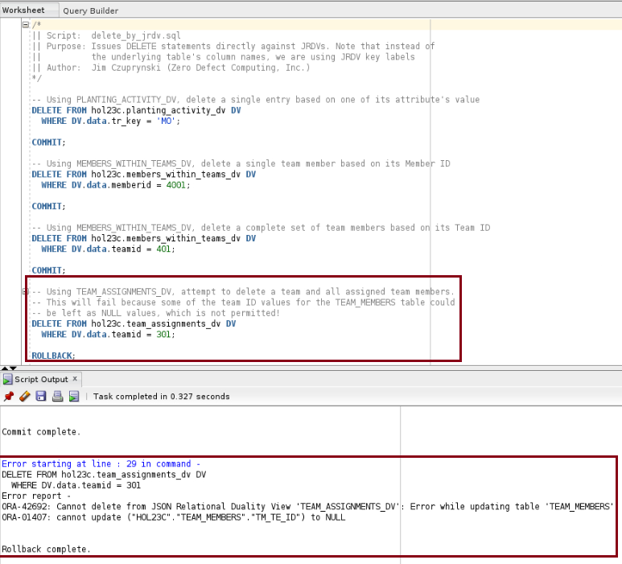

    Note that the final statement in this script caused an error when it attempted to delete Team #301 from the **TEAM\_ASSIGNMENTS\_DV** JRDV. While that JRDV does specify the TEAMS entity as the top level in its document structure, deleting that key value from that table would remove the relationship between data elements in the TEAMS and TEAM_MEMBERS tables that is enforced by a foreign key constraint between those tables. This is one of the strengths of JRDVs because *it ensures that data within JSON documents remain protected against potentially destructive data maintenance operations.*

4. What's the end result after these operations? Let's rerun the two tabular-format queries to find out:

    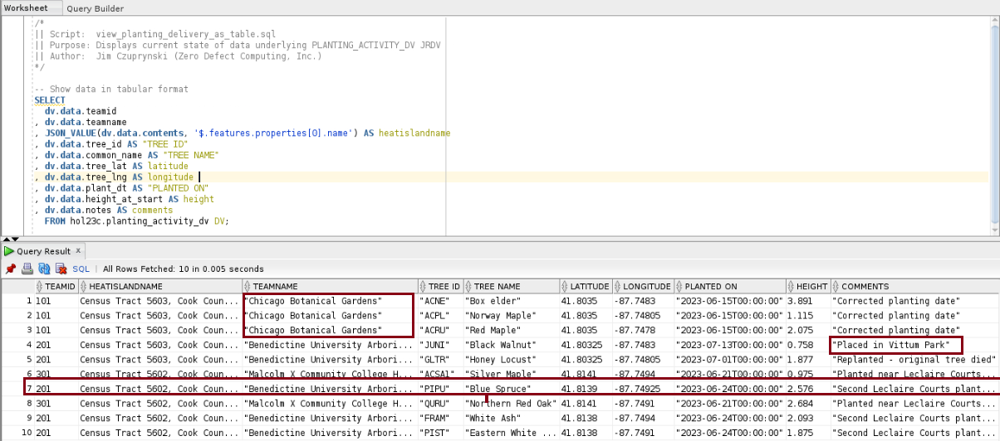

    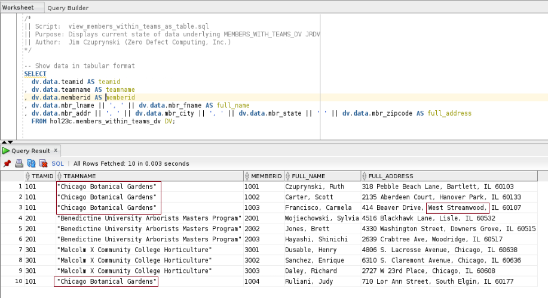

## Task 4: Managing Data Via REST

Since we started ORDS successfully in Task #1, we can now explore how to use HTTP POST, PUT and DELETE commands to manage data within a JRDV. The obvious advantage of these methods is that a developer who is familiar with making HTTP calls to APIs to add, change, or delete data doesn't need to master SQL DML commands to execute any of these statements; instead, they can easily construct and issue appropriate GET, PUT, or DELETE command to perform those actions.

1. We'll first add some new data into a JRDV using the HTTP POST command. First, open a new terminal window by clicking on the *File...New* Tab within one of your existing Terminal sessions. Then via the text editor, open the file named **insert\_by\_curl.sh.** Copy the first command line into the terminal window and hit ENTER to execute the command:

    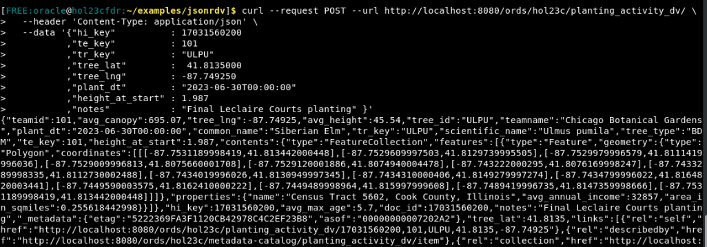

    The result that's returned shows the entire state of the new JRDV entry as a JSON document, including all of its corresponding components from all elements defined for the **PLANTING\_ACTIVITY\_DV** JRDV.

    To see another way to insert a new JSON document, copy and execute the second command line into the terminal window. The only difference in this example is that the JSON document is stored within the **add\_planting\_schedule.json** file:

    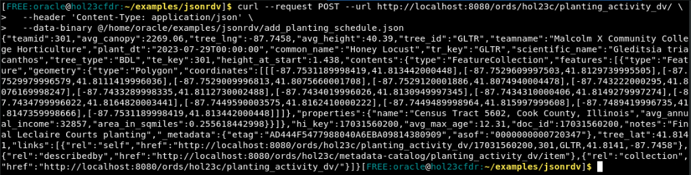

2. Now let's update some data within the JRDV via an HTTP PUT command. Via the text editor, open the file named **update\_by\_curl.sh,** copy the first command line into the terminal window and hit ENTER to execute the command to apply the change data in the **update\_team\_assignments.json** JSON document:

    ```
    {"teamid" : 201
    ,"teamname" : "Benedectine University Arborists Doctorate Pgm"
    ,"teamleadcontact" : 2003
    , "member" : [
    {"memberid"   : 2001
    ,"mbr_fname"  : "Sylvia"
    ,"mbr_lname"  : "Heinz"
    ,"mbr_addr"   : "5201 Riverview Drive"
    ,"mbr_city"   : "Lisle"
    ,"mbr_state"  : "IL"
    ,"mbr_zipcode": "60532"
    ,"mbr_lat"    :  41.79118597268099 
    ,"mbr_lng"    : -88.07606734445919 }
    ,{"memberid"   : 2002
    ,"mbr_fname"  : "Chris"
    ,"mbr_lname"  : "Anthemum"
    ,"mbr_addr"   : "21W634 Kensington Road"
    ,"mbr_city"   : "Glen Ellyn"
    ,"mbr_state"  : "IL"
    ,"mbr_zipcode": "60137"
    ,"mbr_lat"    :  41.84265072518736
    ,"mbr_lng"    : -88.04908723765195 }
    ,{"memberid"   : 2003
    ,"mbr_fname"  : "Igor"
    ,"mbr_lname"  : "Strelnikov"
    ,"mbr_addr"   : "1907 Somerset Lane"
    ,"mbr_city"   : "Wheaton"
    ,"mbr_state"  : "IL"
    ,"mbr_zipcode": "60189"
    ,"mbr_lat"    :  41.83567790635827
    ,"mbr_lng"    : -88.118925501038 }
    ]}
    ```
    Note that three different TEAM_MEMBER entries as well as the name of Team #201 were updated through just one REST operation against the **TEAM\_ASSIGNMENTS\_DV** JRDV.

    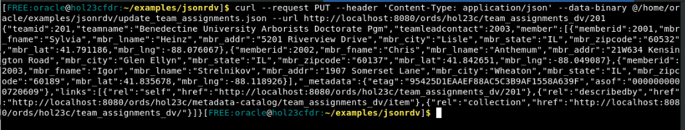

3. Finally, we'll delete some data from our JRDVs thru the HTTP DELETE command. Via the text editor, open the file named **delete\_by\_curl.sh,** copy the first command line into the terminal window and hit ENTER to execute the command:

    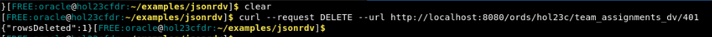

    A message that one row was deleted from the **TEAM\_ASSIGNMENTS\_DV** JRDV is returned - in this case, all documents for Team #401. Now copy and execute the second command line into the terminal window:

    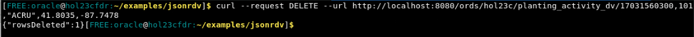

    Again, a message that one row was deleted from the **PLANTING\_ACTIVITY\_DV** JRDV is returned - in this case, just the single document as identified by the five comma-delimited key values that identify that document.

4. What's the end result after these operations? From your SQL Developer session, let's rerun the **view\_planting\_activity\_as\_table.sql** and **view\_members\_within\_teams\_as\_table.sql** statements once more to find out:

    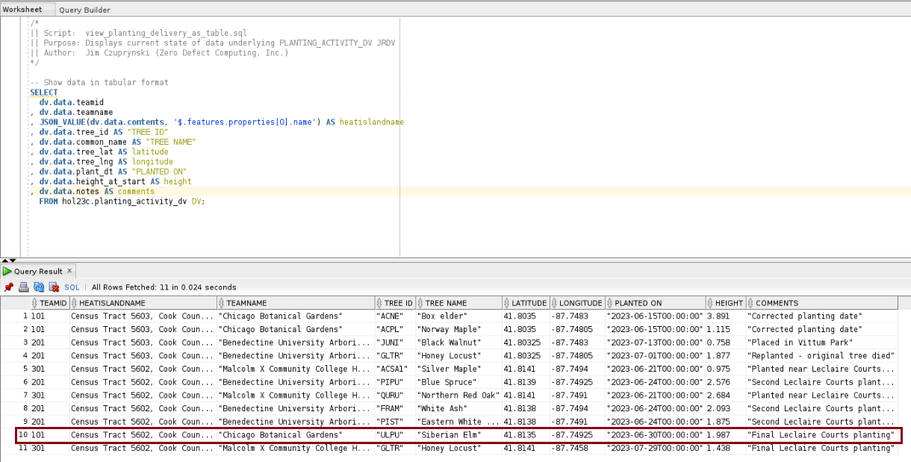

    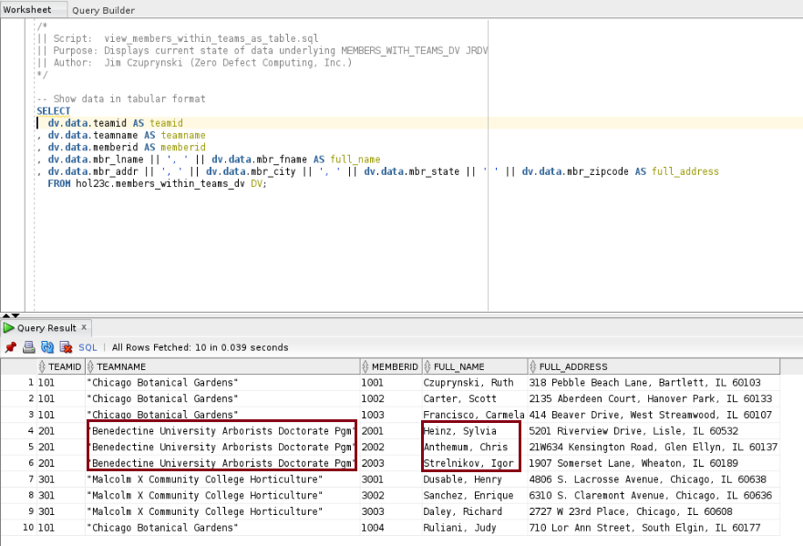

## Task 5: Limit JRDVs From Undesired Data Manipulation

One extremely useful feature of JRDVs is that while they do permit data to be manipulated within them via DML or REST API calls, it's also possible to enforce tight limits on exactly which sections of the JRDV are allowed to be changed. We'll briefly explore this feature set now.

1. In SQLDeveloper, open the script named **prohibiting-jrdv-dml.sql.** This script attempts to insert a new team member *as well as a new team* into the **MEMBERS\_WITHIN\_TEAMS\_DV** JRDV. Execute the script (F5) to see what happens when we attempt that:

    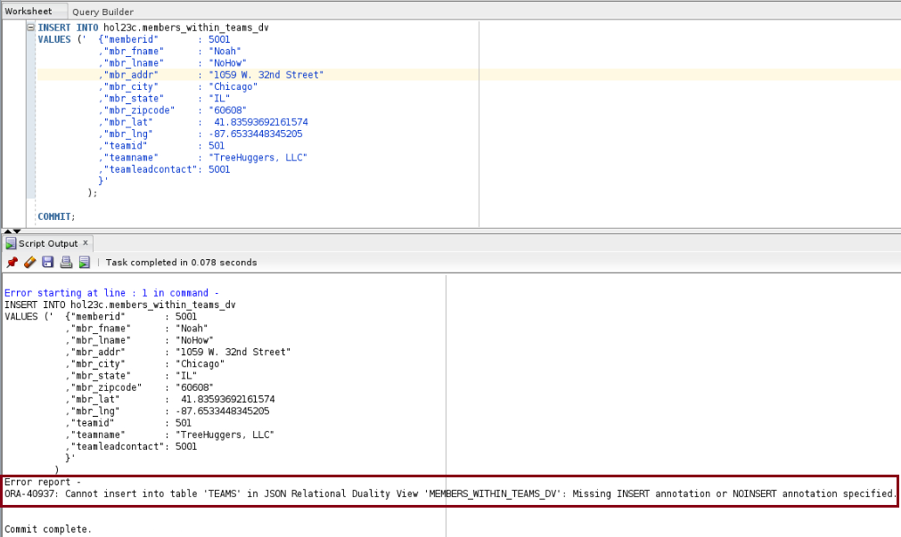

2. Why did this DML fail? The JRDV specifies that it will accept INSERT, UPDATE, and DELETE operations against the **TEAM\_MEMBERS** table, but only accept UPDATE operations against the **TEAMS** table. In fact, had we not specified any annotations for these two tables in the JRDV, *the entire contents of the JRDV would be read-only.* 

    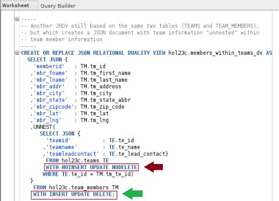

    JRDV annotations are therefore a powerful feature set that not only helps guarantee consistency between related JSON documents, but also prevents unwanted changes to data stored within a JRDV's underlying tables. It's also possible to include specific columns for UPDATE operations even though their corresponding table has been specified as NOUPDATE.

    A complete overview of these features is available [here](https://docs.oracle.com/en/database/oracle/oracle-database/23/jsnvu/updatable-json-relational-duality-views.html#GUID-936CF855-35E0-417B-912B-AD4FD16DF4CC) in the Oracle JSON-Relational Duality Developer's Guide.

You have now completed this lab.

## Learn More
* [Oracle JSON Developer's Guide](https://docs.oracle.com/en/database/oracle/oracle-database/23/adjsn/)
* [Oracle JSON-Relational Duality Developer's Guide](https://docs.oracle.com/en/database/oracle/oracle-database/23/jsnvu/)

## Acknowledgements
* **Author** - Kaylien Phan, William Masdon, Jim Czuprynski
* **Contributors** - Jim Czuprynski, LiveLabs Contributor, Zero Defect Computing, Inc.
* **Last Updated By/Date** - Jim Czuprynski, August 2023