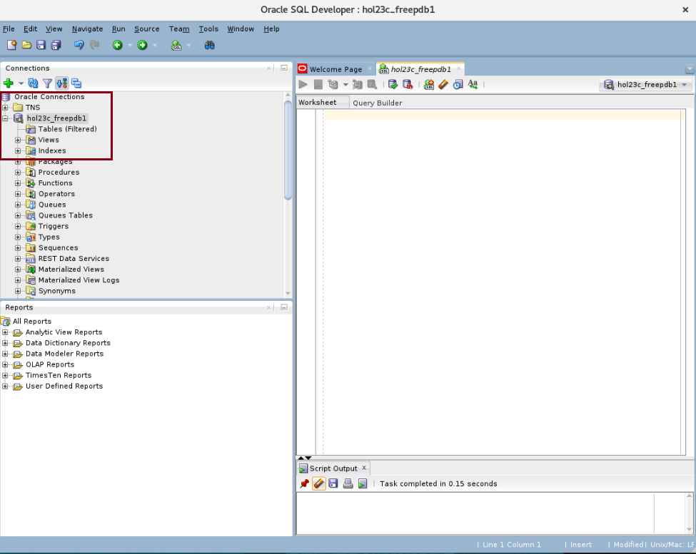

# Set Up Your Environment

## Introduction

Before we can create new JSON Relational Duality Views (JRDVs), we must first create and populate tables and other database objects containing our data sources. This lab assumes that you have already installed the Oracle Database 23c Free Developer Release on a pluggable database.

Estimated Time: 8 minutes

### Objectives

In this lab, you will:

- Connect SQL Developer to your pluggable database instance
- Create database objects and populate them with data

### Prerequisites

This lab assumes you have:
- Oracle Database 23c Free Developer Release
- Completed all previous labs successfully

Watch the video below for a quick walk through of the lab.
[Set Up Your Environment walkthrough](videohub:1_bm92oiqn)

## Task 1: Download the schema creation and population scripts

1. Click Activities in the upper left corner, then click Terminal.

    
<!-- Select File -> New Tab since ORDS is running in your current Terminal tab.-->
2. Go into the right directory.

    ```
    $ <copy>cd ~/examples</copy>
    ```

    

3. Pull down the materials for setup.

    ```
    $ <copy>wget https://c4u04.objectstorage.us-ashburn-1.oci.customer-oci.com/p/EcTjWk2IuZPZeNnD_fYMcgUhdNDIDA6rt9gaFj_WZMiL7VvxPBNMY60837hu5hga/n/c4u04/b/livelabsfiles/o/partner-solutions/json-relational-duality-views-in-23c/jsonrdv.zip</copy>
    ```

    <!---->

4. Unzip the file. Inside this zip file are the files to set up your schema's database objects and create JRDVs.

    ```
    $ <copy>unzip -o jsonrdv.zip</copy>
    ```

    

5. Remove the remaining zip file after you've unzipped it.

    ```
    $ <copy>rm -rf jsonrdv.zip</copy>
    ```

    <!--  -->


## Task 2: Open SQL Developer

1. From an open Terminal Window, navigate to the correct directory to open SQL Developer, and then run the command to start up SQL Developer.

    ```
    $ <copy>cd /opt/sqldeveloper/</copy>
    ```
    ```
    $ <copy>./sqldeveloper.sh</copy>
    ```

    

3. On the left side menu, you'll see **hol23c_freepdb1** underneath Oracle Connections. Double click it to open the connection.


    

4. Fill out the connection information with your password. The default password we will be using throughout this lab is **Welcome123**. If you have changed yours, please use that one. After you click okay, you should be connected to your user.

    

## Task 3: Create and populate database tables and related objects

1. Now that you have logged into SQL Developer, let's get familiar with some of its tools and features.

    From the left-side panel, you can view information about the different database components within the HOL23C schema. Expand the hol23c_freepdb1 node on the tree view to see tables, indexes, and other objects. If you click into the **tables** node, you'll note that there are no tables present yet.

    

2. Click File -> Open and navigate to the **/home/oracle/examples/jsondrv** folder. Your list of files may feature more than those shown here. You can filter this list to show only files with an extension of ***.sql** in the *File Type* field to make it easier to locate the required file.

    

3. First, we will create and populate all database objects our JRDV examples will be using.

    - Open the file named **create_tables.sql** by clicking on the File ... Open icon. 
    - Click the button that shows a document with the small green play button on it to run the whole script.
    - If it asks you to select a connection in a popup window, choose **hol23c_freepdb1** from the drop down and then click OK.

    

4. You should see that all of the following actions have completed successfully:

    - All tables have been proactively dropped (if they had existed) and were then created.
    - Tables were loaded using either the SQL Developer LOAD command or by inserting rows directly into tables.
    - Primary and foreign key constraints and any underlying UNIQUE indexes were created as well.
    - Finally, a spatial index was created on the PS\_GEOMETRY column within the PLANTING\_SCHEDULE table.

    

5. Your schema setup is now complete. 

You may now **proceed to the next lab.**

## Learn More
- [Oracle SQL Developer 23.1 Concepts and Usage](https://docs.oracle.com/en/database/oracle/sql-developer/23.1/rptug/sql-developer-concepts-usage.html#GUID-464C045C-FBDF-417A-A20B-037D294B3BDA)
- [Oracle SQLcl 23.2 User Guide](https://docs.oracle.com/en/database/oracle/sql-developer-command-line/23.2/)
- [Indexing and Querying Spatial Data](https://docs.oracle.com/en/database/oracle/oracle-database/23/spatl/indexing-querying-spatial-data.html)

## Acknowledgements
* **Author** - Kaylien Phan, William Masdon, Jim Czuprynski
* **Contributors** - Jim Czuprynski, LiveLabs Contributor, Zero Defect Computing, Inc.
* **Last Updated By/Date** - Jim Czuprynski, July 2023
