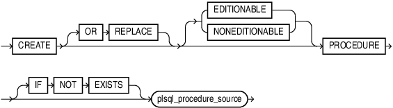
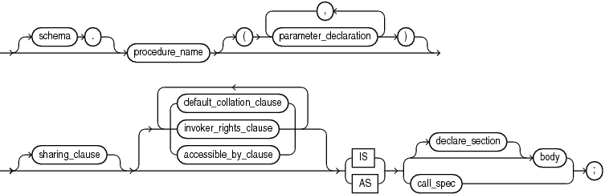
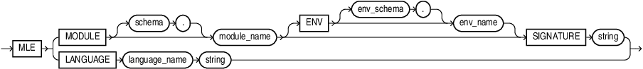

# Generate meaningful JavaScript functions

## Introduction

After creating JavaScript modules and environments in the previous lab you will now learn how to expose JavaScript code in SQL and PL/SQL. After completing this step you can call JavaScript code anywhere you can invoke SQL and PL/SQL functions. All client code,regardless whether it's written in Java, Python, or even with `node-oracledb`, can access JavaScript stored procedures.

Estimated Lab Time: 10 minutes

### Objectives

In this lab, you will:

- Learn more about call specifications
- Create call specifications for JavaScript modules
- Invoke JavaScript code in SQL and PL/SQL
- Understand inline JavaScript functions

### Prerequisites

This lab assumes you have:

- An Oracle Database 23c Free - Developer Release environment available to use
- Created the `jstest` account as per Lab 1
- Completed Lab 2 where you created a number of JavaScript modules in the database

## Task 1: Learn more about call specifications

Call specifications are a standard extension to the PL/SQL language allowing you to provide instructions in a different programming language. Typically you would provide the function or procedure body in PL/SQL unless you want to link it to Java or JavaScript code.

Technically speaking the call specification follows the `IS|AS` keyword in the `CREATE PROCEDURE` or `CREATE FUNCTION` statement. Call specifications come in many different variants as you can see in the PL/SQL language reference. The following railroad diagram has been copied from the `CREATE PROCEDURE` statement.



The call specification replaces the PL/SQL function or procedure's body:



> **Note**: For more information about call specifications, including context for the above syntax diagrams, see Oracle Database PL/SQL Language Reference.

You can define call specifications for multiple languages. The JavaScript syntax is defined as follows:



JavaScript developers can choose from 2 options:

- Refer to a function in a JavaScript module
- Provide the JavaScript code inline with the PL/SQL code unit

Both options will be covered in this lab.

## Task 2: Establish a database connection

Connect to `freepdb1` just as you did in the previous labs, and don't forget to substitute the dummy password with yours

```bash
<copy>sqlplus jstest/yourNewPasswordGoesHere@localhost/freepdb1</copy>
```

## Task 3: Create a simple call specification referring to functions in a module

In this task you will learn how to create a call specification based on the MLE module name and (JavaScript) function.

1. Review the source code for `helper_module_inline`

    Before you can invoke functions defined in a module you need to ensure they are exported.

    ```sql
    <copy>
    col line for 9999
    col text for a90
    set lines 120 pages 100
    select 
        line, 
        text 
    from
        user_source 
    where 
        name = 'HELPER_MODULE_INLINE';</copy>
    ```

    You should see the following output:

    ```
    LINE TEXT
    ----- -----------------------------------------------------------------------------------
        1 function string2obj(inputString) {
        2     if ( inputString === undefined ) {
        3         throw `must provide a string in the form of key1=value1;...;keyN=valueN`;
        4     }
        5     let myObject = {};
        6     if ( inputString.length === 0 ) {
        7         return myObject;
        8     }
        9     const kvPairs = inputString.split(";");
        10     kvPairs.forEach( pair => {
        11         const tuple = pair.split("=");
        12         if ( tuple.length === 1 ) {
        13             tuple[1] = false;
        14         } else if ( tuple.length != 2 ) {
        15             throw "parse error: you need to use exactly one '=' between " +
        16                   "key and value and not use '=' in either key or value";
        17         }
        18         myObject[tuple[0]] = tuple[1];
        19     });
        20     return myObject;
        21 }
        22 /**
        23  * convert a JavaScript object to a string
        24  * @param {object} inputObject - the object to transform to a string
        25  * @returns {string}
        26  */
        27 function obj2String(inputObject) {
        28     if ( typeof inputObject != 'object' ) {
        29         throw "inputObject isn't an object";
        30     }
        31     return JSON.stringify(inputObject);
        32 }
        33 export { string2obj, obj2String }
    ```

2. Create call specification for `helper_module_inline`

    You can see from the output above that both functions in the module are exported (line 32). This allows us to create call specifications. Before you go ahead and create one you need to decide whether you need a PL/SQL function or procedure. In the above case both JavaScript functions return data:

    - `string2obj(string)` returns a JavaScript object
    - `object2String(object)` returns a string

    A PL/SQL function is the best fit. You can either create stand-alone functions like you did in lab 1, or as demonstrated in this case you can group the functions in a PL/SQL package. Using the syntax diagrams from task 1 you can create the call specification as follows:

    ```sql
    <copy>
    create or replace package helper_pkg as
        
        function string2obj(
            p_inputString varchar2
        ) return JSON
            as mle module helper_module_inline
            signature 'string2obj';
        
        function obj2String(
            p_inputObject JSON
        ) return varchar2
            as mle module helper_module_inline
            signature 'obj2String';

    end helper_pkg;
    /
    </copy>
    ```

    Since `helper_module_inline` does not import functionality from any other module an `ENV` clause is not necessary.

3. Invoke the JavaScript code

    With the JavaScript code available to SQL and PL/SQL it is time to try it out. Begin by converting a JSON document to a string

    ```sql
    <copy>
    select helper_pkg.obj2String(
        JSON('{"a": 1, "b": 2, "c": 3, "d": false}')
    ) obj2String;
    </copy>
    ```

    You should see the following output:

    ```
    OBJ2STRING
    ----------------------------------------
    {"a":1,"b":2,"c":3,"d":false}
    ```

    Now convert a string to a JavaScript object:

    ```sql
    <copy>
    select json_serialize(
        helper_pkg.string2obj(
            'order_id=1;order_date=2023-04-24T10:27:52;order_mode=mail;promotion_id=1'
        )
        pretty
    ) string2obj;
    </copy>
    ```

    You should see the following output:

    ```
    STRING2OBJ
    ----------------------------------------
    {
        "order_id" : "1",
        "order_date" : "2023-04-24T10:27:52",
        "order_mode" : "mail",
        "promotion_id" : "1"
    }
    ```

## Task 4: Create a call specification involving use of an MLE environment

Creating call specifications for functions exported by the `business_logic` module requires an extra step. Remember from the previous lab that `business_logic` relies on `string2JSON()` provided by `helper_module_inline`. Here is the relevant section of the code:

```sql
create mle module business_logic language javascript as

import { string2obj } from 'helpers';

export function processOrder(orderData) {
    const orderDataJSON = string2obj(orderData);
    const result = session.execute("...");

// remaining code not shown
```

Before you can create a call specification for `processOrder()` you must ensure an MLE environment exists that maps the import name `helpers` to the `helpers_module_online`.

1. Review the MLE environment

    Remember from the previous lab that you created the necessary MLE environment. Make sure it is still present in your schema.

    ```sql
    <copy>
    col env_name for a30
    col import_name for a30
    col module_name for a30
    select
        env_name,
        import_name,
        module_name
    from
        user_mle_env_imports
    order by
        env_name;
    </copy>
    ```

    You should see the following output:

    ```
    ENV_NAME             IMPORT_NAME                    MODULE_NAME
    -------------------- ------------------------------ ------------------------------
    BUSINESS_MODULE_ENV  helpers                        HELPER_MODULE_INLINE
    ```

2. Create the call specification

    With the MLE environment confirmed to be present in the database you can go ahead and create the call specification. Just as with the previous example a PL/SQL package will be used. Looking at `processOrder()` you can see that the function returns true if the order has been persisted in the database, false otherwise. It does not attempt to catch any exceptions either, requiring the caller to catch any.

    ```sql
    <copy>
    create or replace package business_logic_pkg as

        function process_order(
            p_order_data varchar2
        ) return boolean
            as mle module business_logic
            env business_module_env
            signature 'processOrder';
    end business_logic_pkg;
    /
    </copy>
    ```

3. Invoke the JavaScript code

    Just like in task 3 you can now invoke the code thanks to the call specification you just created.

    ```sql
    <copy>
    set serveroutput on
    declare
        l_success boolean := false;
        l_str     varchar2(256);
    begin
        l_str := 'order_id=1;order_date=2023-04-24T10:27:52;order_mode=theMode;customer_id=1;order_status=2;order_total=42;sales_rep_id=1;promotion_id=1';
        l_success := business_logic_pkg.process_order(l_str);

        -- you should probably think of a better success/failure evaluation
        if l_success then
            dbms_output.put_line('success');
        else
            dbms_output.put_line('false');
        end if;
    end;
    /
    </copy>
    ```

    You should see the following output:

    ```
    SQL> l
     1  declare
     2    l_success  boolean := false;
     3    l_str      varchar2(256);
     4  begin
     5    l_str := 'order_id=1;order_date=2023-04-24T10:27:52;order_mode=theMode;customer_id=1;order_status=2;order_total=42; sales_rep_id=1;promotion_id=1';
     6    l_success := business_logic_pkg.process_order(l_str);
     7
     8    -- you should probably think of a better success/failure evaluation
     9    if l_success then
    10      dbms_output.put_line('success');
    11    else
    12      dbms_output.put_line('false');
    13    end if;
    14  end;
    SQL> /
    success
    ```

    In addition you will find a new row in the `ORDERS` table

    ```
    SQL> select count(*) from orders;

      COUNT(*)
    ----------
             1
    ```

## Task 5: Create inline JavaScript functions

In scenarios where you don't need the full flexibility of JavaScript modules and environments you can save some keystrokes by using inline JavaScript functions.

1. Hello World example using inline JavaScript code

    As the name implies an inline function allows you to add the JavaScript code as if it were the PL/SQL body. Refer back to Task 1 and review the figure titled `javascript_declaration`: the lower half of the railroad diagram relates to inline JavaScript functions. In its simplest form you can write the classic `hello world()` like so:

    ```sql
    <copy>
    create or replace function hello("who" varchar2) return varchar2
    as mle language javascript 
    q'~
        return `hello, ${who}`;
    ~';
    /
    </copy>
    ```

    > **Note** JavaScript identifiers are case sensitive and therefore must be enclosed in double-quotes in the PL/SQL layer or else they won't't be recognised in the JavaScript portion of the code.

    Proceed by executing the function.

    ```sql
    <copy>
    select hello('javascript') greeting;
    </copy>
    ```

    You should see the following output on screen:

    ```
    SQL> select hello('javascript') greeting;

    GREETING
    ------------------------
    hello, javascript
    ```

2. Convert string2obj() to an inline JavaScript function

    Following the same syntax diagram let's convert `string2obj()` to an inline function

    ```sql
    <copy>
    create or replace function string2obj(
        "inputString" varchar2
    ) return JSON
    as mle language javascript
    q'~
        if ( inputString === undefined ) {
            throw `must provide a string in the form of key1=value1;...;keyN=valueN`;
        }

        let myObject = {};
        if ( inputString.length === 0 ) {
            return myObject;
        }
        
        const kvPairs = inputString.split(";");
        kvPairs.forEach( pair => {
            const tuple = pair.split("=");
            if ( tuple.length === 1 ) {
                tuple[1] = false;
            } else if ( tuple.length != 2 ) {
                throw "parse error: you need to use exactly one '=' between " + 
                "key and value and not use '=' in either key or value";
            }

            myObject[tuple[0]] = tuple[1];
        });
        return myObject;
    ~';
    /
    </copy>
    ```

    Proceed by invoking the function:

    ```sql
    <copy>
    select json_serialize(
        string2obj(
            'order_id=1;order_date=2023-04-24T10:27:52;order_mode=mail;promotion_id=1'
        )
        pretty
    ) string2obj;
    </copy>
    ```

    If you see the following output on screen everything went as expected:

    ```
    SQL> select json_serialize(
      2    string2obj(
      3      'order_id=1;order_date=2023-04-24T10:27:52;order_mode=mail;promotion_id=1'
      4    )
      5    pretty
      6  ) string2obj;

    STRING2OBJ
    --------------------------------------------------
    {
      "order_id" : "1",
      "order_date" : "2023-04-24T10:27:52",
      "order_mode" : "mail",
      "promotion_id" : "1"
    }
    ```

## Task 6: View dictionary information about call specifications

The data dictionary has been enhanced in Oracle Database 23c Free-Developer Release to provide information about call specifications. A new view, named `USER_MLE_PROCEDURES` provides the mapping between PL/SQL code units and JavaScript. There are of course corresponding _ALL/DBA/CDB_ views as well.

1. Query `USER_MLE_PROCEDURES` to learn more about the existing call specifications

    ```sql
    <copy>
    set lines 120
    col object_name for a20
    col procedure_name for a20
    col module_name for a20
    col env_name for a20
    select
        object_name, 
        procedure_name, 
        module_name, 
        env_name 
    from
        user_mle_procedures 
    order by
        object_name;
    </copy>
    ```

2. Understand the query output

    The following is an example of the output generated by the previous query:

    ```
    OBJECT_NAME          PROCEDURE_NAME       MODULE_NAME          ENV_NAME
    -------------------- -------------------- -------------------- --------------------
    BUSINESS_LOGIC_PKG   PROCESS_ORDER        BUSINESS_LOGIC       BUSINESS_MODULE_ENV
    HELLO
    HELPER_PKG           OBJ2STRING           HELPER_MODULE_INLINE
    HELPER_PKG           STRING2OBJ           HELPER_MODULE_INLINE
    ISEMAIL                                   VALIDATOR
    STRING2OBJ
    ```

    Due to the way the view is defined, you will sometimes see both `object_name` and `procedure_name` populated, while sometimes just `object_name` is populated and `procedure_name` is null.

    - When using PL/SQL packages to encapsulate JavaScript functions both columns are populated with `object_name` referring to the package name and `procedure_name` to the function/procedure _within_ the package
    - In case of stand-alone PL/SQL functions and procedures `object_name` is populated and `procedure_name` is null
    - Inline JavaScript functions and procedures don't have a corresponding `module_name`

## Learn More

- [Database PL/SQL Language Reference](https://docs.oracle.com/en/database/oracle/oracle-database/23/lnpls/index.html)
- [JavaScript Developer's Guide](https://docs.oracle.com/en/database/oracle/oracle-database/23/mlejs/mle-js-modules-and-environments.html#GUID-32E2D1BB-37A0-4BA8-AD29-C967A8CA0CE1) describes call specifications and inline JavaScript functions in detail
- [Database Reference](https://docs.oracle.com/en/database/oracle/oracle-database/23/refrn/index.html) contains the definition of all dictionary views referred to in this lab

## Acknowledgements

- **Author** - Martin Bach, Senior Principal Product Manager, ST & Database Development
- **Contributors** -  Lucas Braun, Sarah Hirschfeld
- **Last Updated By/Date** - Martin Bach 02-MAY-2023
