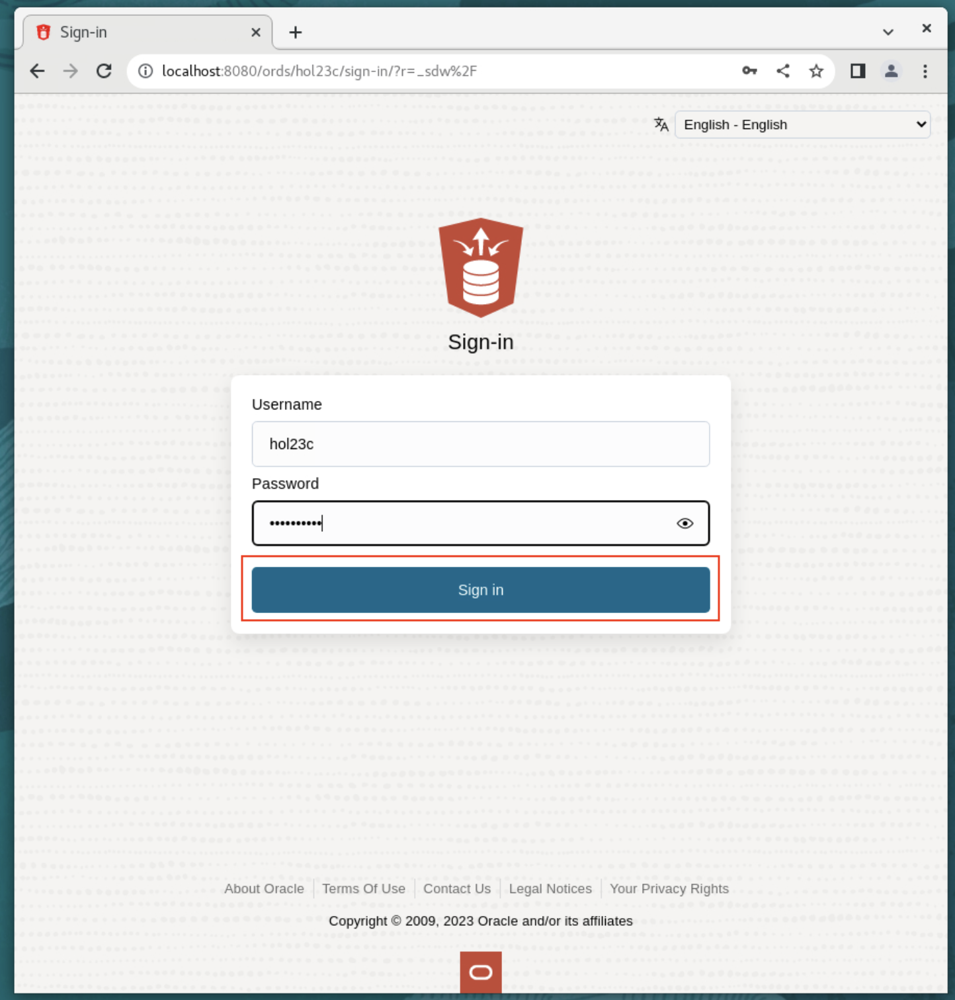

# Work with JSON collections

## Introduction

Oracle is a relational database, meaning it typically stores data in rows and columns of tables and JSON can be stored as a column value. For this lab though, we first focus on the Document Store API SODA (Simple Oracle Document Access) which allows us to store JSON data in a so-called collection. A JSON collection stores JSON documents alongside some metadata like the time of creation or update. Collections offer operations like inserts, deletes, index creation or queries.

To create a collection all you have to specify is the collection's name. Unlike a relational table, you do not have to provide any schema information. So, let's create a collection for the products we want to sell in the store.

Estimated Time: 15 minutes


### Objectives

In this lab, you will:

* Create Collection
* Insert First Document
* Find JSON documents in a collection
* Learn about JSON and Constraints
* Load more data through the Database API for MongoDB

### Prerequisites

* Have completed Lab 1: Setup User
* Have provisioned an Autonomous JSON Database instance and logged into the JSON
* Be working with a Mac OS/X (Intel Silicon) machine, a Linux x86 machine or a Windows PC

## Task 1: Create Collection

1. Open a browser window to SQL Developer Web.

	```
    <copy>http://localhost:8080/ords/hol23c/_sdw</copy>
    ```
	

2. Sign in with the username and password of the schema with ORDS enabled. If you are using the green button, this user has already been created for you. Replace the `<new_password>` with the one you entered in Lab 1: Setup User.

    ```
    username: hol23c
    password: <new_password>
    ```
	

4. On the homepage, click the JSON tile under Development.
	

5. To create a collection, click **Create Collection**.
	A tour of this section may automatically begin when the page loads. You can click `next` to continue through the tour and return to this page.

	

6. In the field **Collection Name**, provide the name **movies**. MAKE SURE you check the **MongoDB Compatible** box then click **Create**.
	Note that the collection name is case-sensitive. You must enter products in all lower-case, don't use MOVIES or Movies.

	

7. A notification pops up that displays **movies** collections has been created.

	

8. Click the refresh button to verify the **movies** collection has been created.

	

## Task 2: Insert Documents

1. Double click **movies** collection to show the **JSON-movies** worksheet.

	

2. Click the *New JSON Document* button.

	

3. A **New JSON Document** panel displays. Copy the following JSON object, paste it in the worksheet and click **Create**.

	```
	<copy>
	{
		"_id": 100,
		"type":"movie",
		"title": "Coming to America",
		"format": "DVD",
		"condition": "acceptable",
		"price": 5,
		"comment": "DVD in excellent condition, cover is blurred",
		"starring": ["Eddie Murphy", "Arsenio Hall", "James Earl Jones", "John Amos"],
		"year": 1988,
		"decade": "80s"
	}
	</copy>
	```

	

4. A notification pops up that says A New Document is created and the new document is shown in the bottom section of the JSON workshop.

	

5. Let's repeat this with the following documents:

	Click the *New JSON Document* button, copy the following JSON objects one by one, paste it into the worksheet and click **Create**.

    ```
	<copy>
	{
		"_id": 101,
		"title": "The Thing",
		"type": "movie",
		"format": "DVD",
		"condition": "like new",
		"price": 9.50,
		"comment": "still sealed",
		"starring": [
			"Kurt Russel",
			"Wilford Brimley",
			"Keith David"
		],
		"year": 1982,
		"decade": "80s"
	}
	</copy>
	```

	```
	<copy>
	{
		"_id": 102,
		"title": "Aliens",
		"type": "movie",
		" format ": "VHS",
		"condition": "unknown, cassette looks ok",
		"price": 2.50,
		"starring": [
			"Sigourney Weaver",
			"Michael Bien",
			"Carrie Henn"
		],
		"year": 1986,
		"decade": "80s"
	}
	</copy>
	```


## Task 3: Find JSON documents in a collection

Documents can be selected based on filter conditions - we call them 'Queries By Example' or 'QBE' for short. A QBE is a JSON document itself and it contains the fields and filter conditions that a JSON document in the collection must satisfy, in order to be selected. QBEs are used with SODA (only); you can use SQL functions as an alternative.

The simplest form of a QBE just contains a key-value pair. Any selected document in the collection must have the same key with the same value. More complex QBEs can contain multiple filter conditions or operators like 'negation' or 'and', etc.

The following are examples of QBEs. You can copy them into the corresponding window (see screenshot) and execute them. In a real application, those QBE-expressions would be issued directly from the programming language - the SODA drivers have APIs for common application programming languages: Python, etc.

Now let's issue some simple queries on the **movies** collection we just created.

1. Copy and paste the following queries into the worksheet and click the *Run Query* button to run a query.

2.  Lookup by one value:

	Here, it displays the document whose id value is 101.

	```
	<copy>
	{"_id":101}
	</copy>
	```
	
	

3.	Find all DVDs:

	Running the query will display two documents with format DVD.

	```
	<copy>
	{"format":"DVD"}
	</copy>
	```
	

4.	Find all non-movies:

	This query displays the documents that are not of type - movies, which is currently nothing.

	```
	<copy>
	{"type":{"$ne":"movie"}}
	</copy>
	```
	

5.	Find documents whose condition value contains "new", which means just document (with id) 101.

	```
	<copy>
	{"condition":{"$like":"%new%"}}
	</copy>
	```
	

6. Find bargains of all products costing 5 or less:

	This query displays the documents with ids 100 and 102 as those documents have price less than 5.

	```
	<copy>
	{"price":{"$lte":5}}
	</copy>
	```
	

7. Tighten the previous query to choose only movie documents:

	This query displays the documents whose ids are 100 and 102, as those documents have price less than 5 and are the type - movie.

	```
	<copy>
	{"$and":[{"price":{"$lte":5}}, {"type":"movie"}]}
	</copy>
	```
	

## Task 4: JSON and Constraints

JSON data is "schema flexible", you can add whatever data you like to a JSON document. But sometimes you will wish to impose some required structure on that data. That can be done through SQL by creating indexes and/or constraints on the JSON collection.

An index will aid fast access to an item (for example speeding up access via the "title" field), but can also be used to impose uniqueness (a unique index or primary key constraint) or to enforce particular datatypes (by triggering an error if the datatype is not what is expected).

More generally, constraints can be used to check the data being entered for various aspects.

1.  Let's add a check - or 'constraint' to check our data entry. We will do this using SQL Developer Web. Click the navigation menu on the top left and select **SQL** under Development.

	

2. We want to ensure that our JSON data satisfies minimal data quality, so we will create a constraint to enforce a couple of mandatory fields and their data types.

    Copy and paste the query below in the worksheet and click the *Run query* button to run the SQL query to alter the **movie** table and add constraints.

    ```
    <copy>alter table movies add constraint movies_json_schema
    check (data is json validate '{   "type": "object",
        "properties": {
            "_id": { "type": "number" },
            "title": { "type": "string"},
            "type": {"type" : "string"},
            "price": {"type" : "number"},
    "starring": {
    "type": "array",
    "minItems": 0,
    "items": {
    "type": "string"
    }
    }
        },
        "required": ["_id", "title", "type", "price"]
    }'
    );</copy>
    ```
	

3. Add another constraint so that the price cannot be a negative number.

	```
	<copy>
	alter table movies add constraint no_negative_price
    check (
            JSON_EXISTS(data, '$?(@.price.number() >= 0)')
          );
	</copy>
	```
	

	JSON_Exists is a SQL/JSON function that checks that a SQL/JSON path expression selects at least one value in the JSON data. The selected value(s) are not extracted – only their existence is checked. Here, *$?(@.price.number() >= 0)* is a standard, SQL/JSON path expressions. You'll learn more about SQJ/JSON functions later in this lab.

4. Once the **movie** table is altered, navigate back to JSON workshop. Click the navigation menu on the top left and select **JSON** under Development.

	

5. Validate that the following documents cannot get inserted, since fields are missing or are of wrong type.

	Click the *New JSON Document* icon, copy and paste the following query in the worksheet and click *Create*.

	This throws the error "Unable to add new JSON document" since the following document has missing fields and incorrect data types.

	```
	<copy>
    {
    "_id": "upc9800432" ,
    "title": "Love Everywhere",
    "summary": "Plucky Brit falls in love with American actress",
    "year": 2023,
    "genre": "Romance",
    "starring": "tbd"
    }
	</copy>
	```
	
	

6. The following document now satisfies all the constraints: the "id" is a unique number, "starring" is an array, it has all required fields, and the price is a positive number.

	```
	<copy>
	{
    "_id": 99999 ,
    "title": "Love Everywhere",
    "type": "movie",
    "price": 10,
    "summary": "Plucky Brit falls in love with American actress",
    "year": 2023,
    "genre": "Romance",
    "starring": ["tbd"]
    }
	</copy>
	```
	

7. Optionally, you can ask the database for the problems with your payload. Navigating back to the SQL page, you can enter this command to see the errors with your JSON payload.

    ```
    <copy>
    with x as
    (
    SELECT DBMS_JSON_SCHEMA.validate_report(
        JSON('{ _id": "upc9800432" ,
                "title": "Love Everywhere",
                "summary": "Plucky Brit falls in love with American actress",
                "year": 2023,
                "genre": "Romance",
                "starring" :"tbd" }'), json_schema  )
    AS REPORT
    from user_JSON_SCHEMA_COLUMNS where table_name = 'MOVIES')
    select json_serialize(report pretty) from x
    /
    </copy>
    ```
	

8. You may also check the JSON Schema definition in your data dictionary. In the SQL tool, run:

    ```
    <copy>
    select constraint_name, json_serialize(json_schema) from user_JSON_SCHEMA_COLUMNS where table_name = 'MOVIES';
    </copy>
    ```
	


	_Click the eye icon near any table value to view the full value._

You may now proceed to the next lab.

## Learn More

* [Oracle Database API for MongoDB](https://blogs.oracle.com/database/post/mongodb-api)

## Acknowledgements

- **Author**- William Masdon, Product Manager, Database
- **Last Updated By/Date** - William Masdon, Product Manager, Database, March 2023