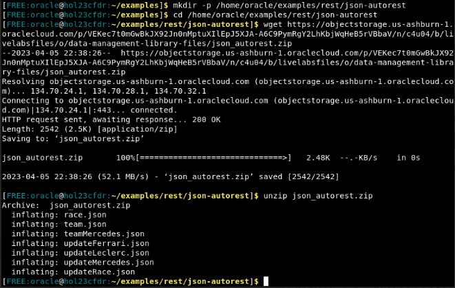
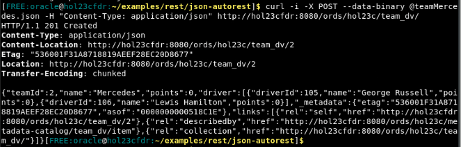
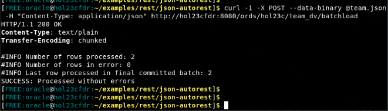
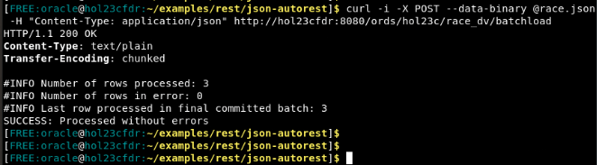

# Populate Duality Views with REST

## Introduction

This lab focuses on populating the duality views -- and therefore the underlying tables -- with POST calls. You will use REST calls to upload data into your database with the json documents you downloaded in the previous lab. 

Note that while you are POST directly to a duality view, nothing is actually stored within the view. All of the inserted data will be stored on the tables that make up the view. 

Estimated Time: 5 minutes


### Objectives

In this lab, you will:

- Download the files used in this workshop. 
- Insert a single document to team\_dv
- Bulk insert documents on team\_dv and race\_dv

### Prerequisites

This lab assumes you have:
- Oracle Database 23c Free Developer Release
- All previous labs successfully completed
- Oracle REST Data Service (ORDS) 23.1


## Task 1: Download files for this workshop


1. You need to download the json payload files we will later use to insert and update the duality views. Make a directory and download files to be used in this workshop.

    ```
    $ <copy>mkdir -p /home/oracle/examples/rest/json-autorest</copy>
    $ <copy>cd /home/oracle/examples/rest/json-autorest</copy>
    $ <copy>wget https://objectstorage.us-ashburn-1.oraclecloud.com/p/VEKec7t0mGwBkJX92Jn0nMptuXIlEpJ5XJA-A6C9PymRgY2LhKbjWqHeB5rVBbaV/n/c4u04/b/livelabsfiles/o/data-management-library-files/json_autorest.zip</copy>
    $ <copy>unzip json_autorest.zip</copy>
    ```

    

## Task 2: Insert a single document


1. View the `teamMercedes.json` file to see the document we will be inserting. 

    ```
    {
        "teamId": 2,
        "name": "Mercedes",
        "points": 0,
        "driver": [
        {
            "driverId": 105,
            "name": "George Russell",
            "points": 0
        },
        {
            "driverId": 106,
            "name": "Lewis Hamilton",
            "points": 0
        }
        ]
    }
    ```

    Notice that this document contains one JSON object, referring to team Mercedes. However, it also contains two entries for driver, George and Lewis. When you POST this document to the database, you will be inserting one entry into the duality view `team_dv` but it will translate the three entries on the underlying tables: 1 entry into the team table and 2 entries into the driver table. 

2. Using the `teamMercedes.json` file, we will insert a document into the duality view `team_dv`. 

    ```
    $ <copy>curl -i -X POST --data-binary @teamMercedes.json -H "Content-Type: application/json" http://localhost:8080/ords/hol23c/team_dv/</copy>
    ```

    

3. Examine the response you received from the database. You will see the Oracle Database generated two fields under a "_metadata" tag: "etag" and "asof".

    The eTag is a unqiue idenitifer for that version of the document used for optimistic locking. If you were to change the data in that document, the eTag would automatically change to signify a newer version of the document. The asof is a Table System Change Number (SCN) and can be used for Flashback queries. 

## Task 2: Bulk insert

1. You can also insert multiple documents into a duality view with one call. View the `team.json` file to see what we will insert. The file contains an array of 2 JSON objects, each one representing a different team document. 

    ```
    [
        {
        "teamId": 301,
        "name": "Red Bull",
        "points": 0,
        "driver": [
            {
            "driverId": 101,
            "name": "Max Verstappen",
            "points": 0
            },
            {
            "driverId": 102,
            "name": "Sergio Perez",
            "points": 0
            }
        ]
        },
        {
        "teamId": 302,
        "name": "Ferrari",
        "points": 0,
        "driver": [
            {
            "driverId": 103,
            "name": "Charles Leclerc",
            "points": 0
            },
            {
            "driverId": 104,
            "name": "Carlos Sainz Jr",
            "points": 0
            }
        ]
        }
    ]
    ```

2. Using the `team.json` file, we will bulk insert into the duality view `team_dv`. 

    **Note:** The URL is different for this call. Instead of pathing just to `team_dv`, you refer to the `/batchload` endpoint. This will allow the payload to contain multiple documents to insert. 

    ```
    $ <copy>curl -i -X POST --data-binary @team.json -H "Content-Type: application/json" http://localhost:8080/ords/hol23c/team_dv/batchload</copy>
    ```

    The AutoREST Duality View API includes a POST /batchload endpoint for ‘batch loading’ multiple JSON documents as rows in the view. 

    A successful POST bulk insert operation returns a response code 200. The response body is a JSON document containing an ID and eTag for each inserted document. 

    

3. Bulk load data into `race_dv` using the `race.json` file. 

    ```
    $ <copy>curl -i -X POST --data-binary @race.json -H "Content-Type: application/json" http://localhost:8080/ords/hol23c/race_dv/batchload</copy>
    ```

    

You may **proceed to the next lab.**

## Learn More

- [JSON Relational Duality: The Revolutionary Convergence of Document, Object, and Relational Models](https://blogs.oracle.com/database/post/json-relational-duality-app-dev)
- [JSON Duality View documentation](https://docs.oracle.com/en/database/oracle/oracle-database/23/jsnvu/index.html)
- [Blog: Key benefits of JSON Relational Duality](https://blogs.oracle.com/database/post/key-benefits-of-json-relational-duality-experience-it-today-using-oracle-database-23c-free-developer-release)
- [ORDS Documentation](https://docs.oracle.com/en/database/oracle/oracle-rest-data-services/23.1/)

## Acknowledgements

* **Author** - William Masdon, Kaylien Phan, Jeff Smith
* **Contributors** -  David Start, Ranjan Priyadarshi
* **Last Updated By/Date** - William Masdon, Database Product Manager, April 2023
