# Configure setup materials and tools

## Introduction

In this lab, we'll be downloading materials and setting up the necessary tools required to execute the rest of the LiveLab. We'll also be opening SQL Developer and starting the ORDS service that you will need to use Oracle Application Express (APEX) later.

Estimated Time: 5 minutes


### Objectives

In this lab, you will:

- Download the graph setup files and materials onto your noVNC instance
- Open SQL Developer
- Start running ORDS to enable APEX 

### Prerequisites

This lab assumes you have:
- An instance with 23c Free Developer Release database installed
- Access to the instance's remote desktop


## Task 1: Download the graph setup materials


1. Click Activities in the upper left corner, then click Terminal.

    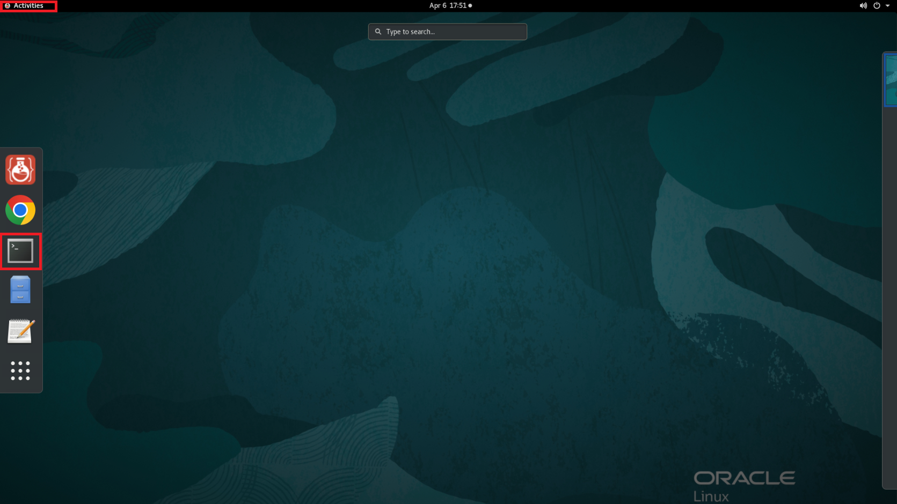

2. Go into the right directory.

    ```
    $ <copy>cd ~/examples</copy>
    ```

    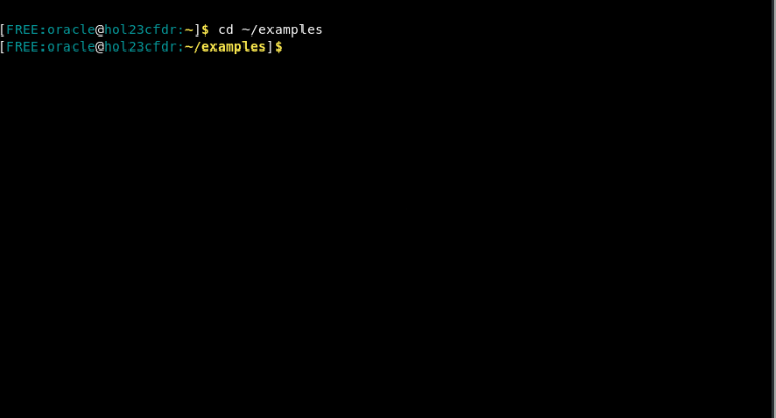

3. Pull down the materials for setup.

    ```
    $ <copy>wget https://objectstorage.us-ashburn-1.oraclecloud.com/p/VEKec7t0mGwBkJX92Jn0nMptuXIlEpJ5XJA-A6C9PymRgY2LhKbjWqHeB5rVBbaV/n/c4u04/b/livelabsfiles/o/data-management-library-files/23cfree-property-graph.zip</copy>
    ```

    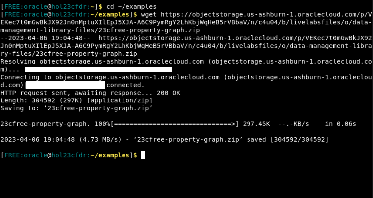

3. Unzip the file. Inside this zip file are the files to setup your schema and APEX application.

    ```
    $ <copy>unzip -o 23cfree-property-graph.zip</copy>
    ```

    <!-- 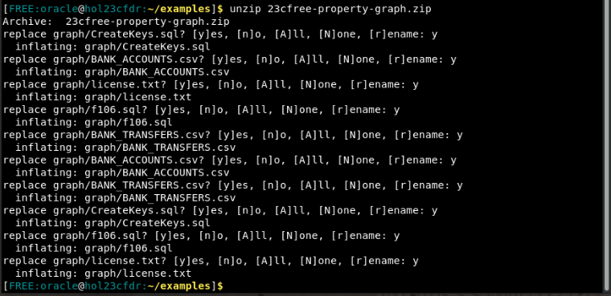 -->

4. Remove the remaining zip file after you've unzpped it.

    ```
    $ <copy>rm -rf 23cfree-property-graph.zip</copy>
    ```

    <!-- 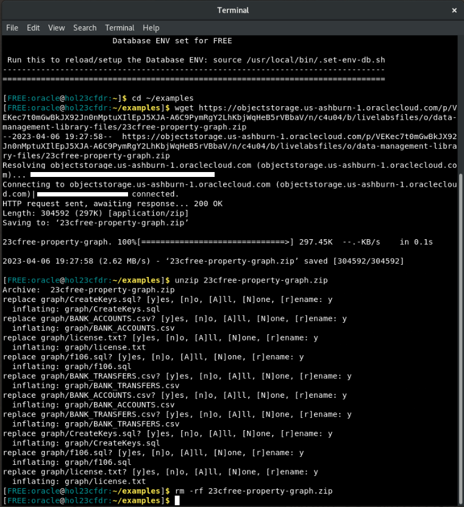 -->

## Task 2: Open SQL Developer

1. Get into the correct directory to open SQL Developer.

    ```
    $ <copy>cd /opt/sqldeveloper/</copy>
    ```

    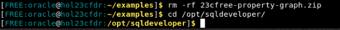

2. Run the command to start up SQL Developer.

    ```
    $ <copy>./sqldeveloper.sh</copy>
    ```

    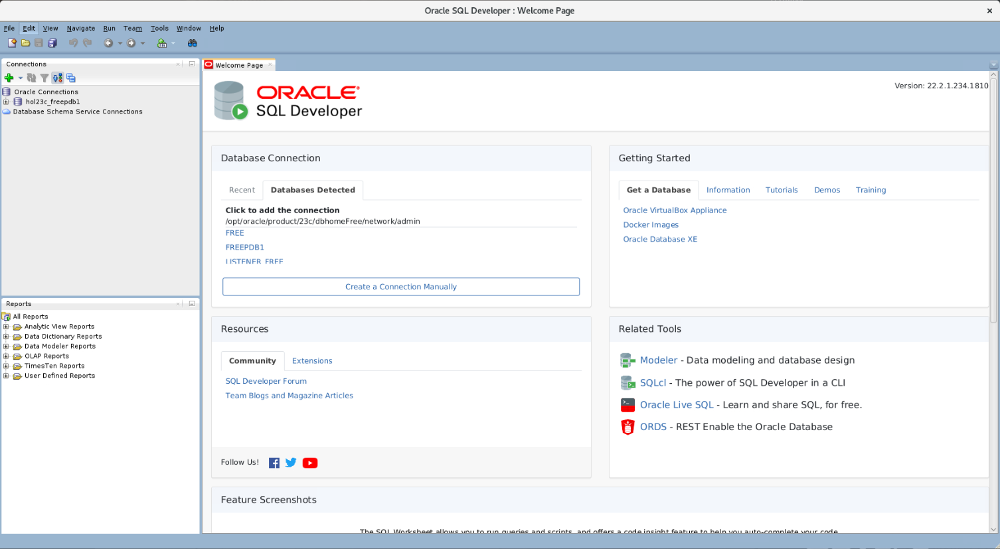

3. On the left side menu, you'll see hol23c_freepdb1 underneath Oracle Connections. Double click it to open the connection.


    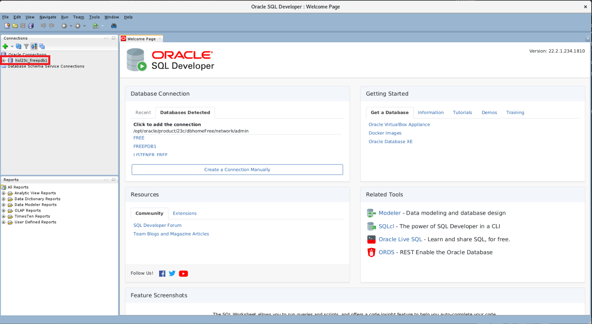

4. Fill out the connection information with your password. The default password we will be using throughout this lab is Welcome123#. If you have changed yours, please use that one. After you click okay, you should be connected to your user.

    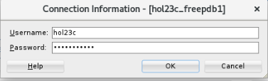

5. Click File -> Open

    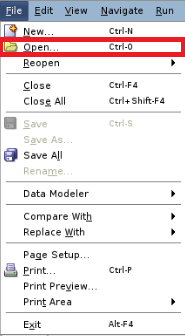

6. Click Home -> examples -> graph

    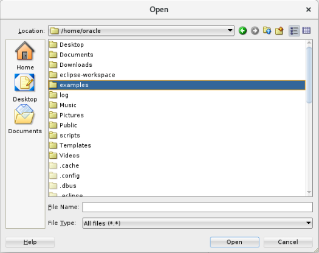

7. Open the CreateKeys.sql.

    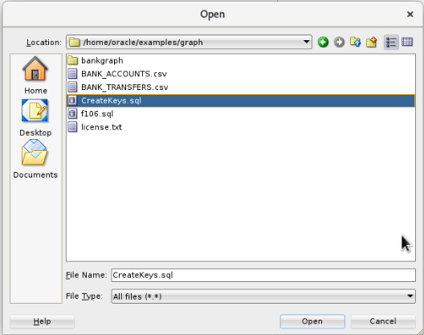

8. Click the button that shows a document with the small green play button on it to run the whole script. If it asks you to select a connection in a popup window, choose hol23c_freepdb1 from the drop down and then click okay.

    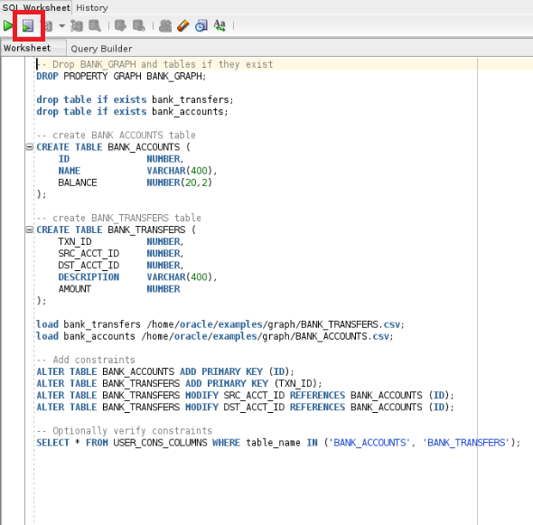

9. Scroll through the output to see that the data has been loaded. Disclaimer: If you see error, property graph does not exist, disregard it and move forward. 

    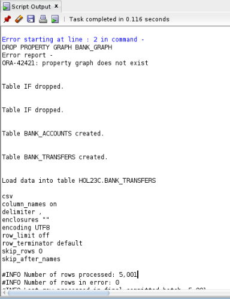

10. There should be about 5000 rows loaded into BANK\_TRANSFERS and 1000 rows loaded in BANK\_ACCOUNTS.

    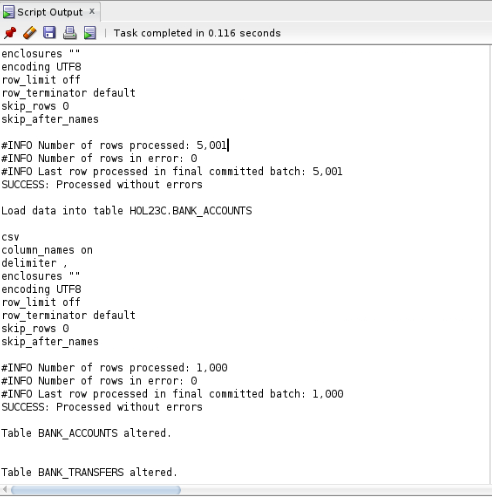

11. Your schema setup is now complete.

## Task 3: Enable ORDS in the schema

1. In your terminal window, make a new tab by clicking File -> New Tab.

2. Execute the following commands to start running ORDS. 

    ``` 
    <copy>ords serve > /dev/null 2>&1 &</copy>
    ```

    **NOTE:** You must leave this terminal open and the process running. Closing either will stop ORDS from running, and you will not be able to access APEX later in this lab. 

3. You have now completed this lab.

## Learn More
* [Oracle Property Graph](https://docs.oracle.com/en/database/oracle/property-graph/index.html)
* [SQL Property Graph syntax in Oracle Database 23c Free - Developer Release](https://docs.oracle.com/en/database/oracle/property-graph/23.1/spgdg/sql-ddl-statements-property-graphs.html#GUID-6EEB2B99-C84E-449E-92DE-89A5BBB5C96E)

## Acknowledgements

- **Author** - Kaylien Phan, Thea Lazarova, William Masdon
- **Contributors** - Melliyal Annamalai, Jayant Sharma, Ramu Murakami Gutierrez, Rahul Tasker
- **Last Updated By/Date** - Kaylien Phan, Thea Lazarova
