# Configure setup materials and tools

## Introduction

In this lab, we'll be downloading materials and setting up the necessary tools required to execute the rest of the LiveLab. We'll also be opening SQL Developer and starting the ORDS service that you will need to use Oracle Application Express (APEX) later.

Estimated Time: 5 minutes


### Objectives

In this lab, you will:

- Download the graph setup files and materials onto your noVNC instance
- Open SQL Developer
- Start running ORDS to enable APEX 

### Prerequisites

This lab assumes you have:
- An instance with 23c Free Developer Release database installed
- Access to the instance's remote desktop


## Task 1: Download the graph setup materials


1. Click Activities in the upper left corner, then click Terminal.

    

2. Go into the right directory.

    ```
    $ <copy>cd ~/examples</copy>
    ```

    

3. Pull down the materials for setup.

    ```
    $ <copy>wget https://objectstorage.us-ashburn-1.oraclecloud.com/p/VEKec7t0mGwBkJX92Jn0nMptuXIlEpJ5XJA-A6C9PymRgY2LhKbjWqHeB5rVBbaV/n/c4u04/b/livelabsfiles/o/data-management-library-files/23cfree-property-graph.zip</copy>
    ```

    

3. Unzip the file. Inside this zip file are the files to setup your schema and APEX application.

    ```
    $ <copy>unzip -o 23cfree-property-graph.zip</copy>
    ```

    <!--  -->

    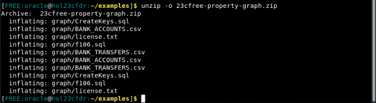

4. Remove the remaining zip file after you've unzpped it.

    ```
    $ <copy>rm -rf 23cfree-property-graph.zip</copy>
    ```

    <!--  -->


## Task 2: Login and create APEX workspace

1. Open Activities -> Google Chrome

    


2. Go to this URL and wait for the screen to load.
    ```
    <copy>
    http://localhost:8080/ords/apex_admin
    </copy>
    ```

    

3. Login as ADMIN with your password Welcome123# or whatever you had set it to in Lab 1.

    

4. You can see the welcome screen for APEX now. 

    

5. Click create workspace

    

6. Name the workspace 'graph' and click Next

    

7. Set reuse existing schema to Yes. Click the menu icon next to schema name and select HOL23C. Set your schema password to whatever but write it down. Leave the default for space quota.

    

8. Admin username: admin, password: Welcome123#, email: your email.

    

9. Review the output then click Create workspace.

    

10. Success! Now click done.

    

## Task 3: Create schema tables

1. In the upper right corner, click the admin icon then click sign out.
    

2.  Log back in as the admin info you just created along with the workspace name as graph.
    

3. Change password
    

4. Click SQL Workshop -> Utilities -> Data Workshop
    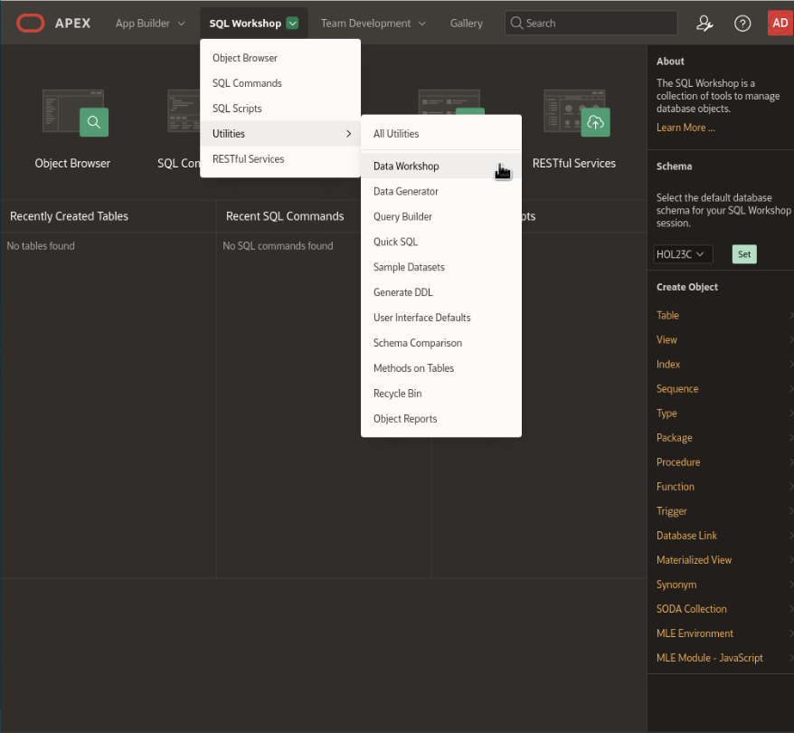

5. Click Load Data
    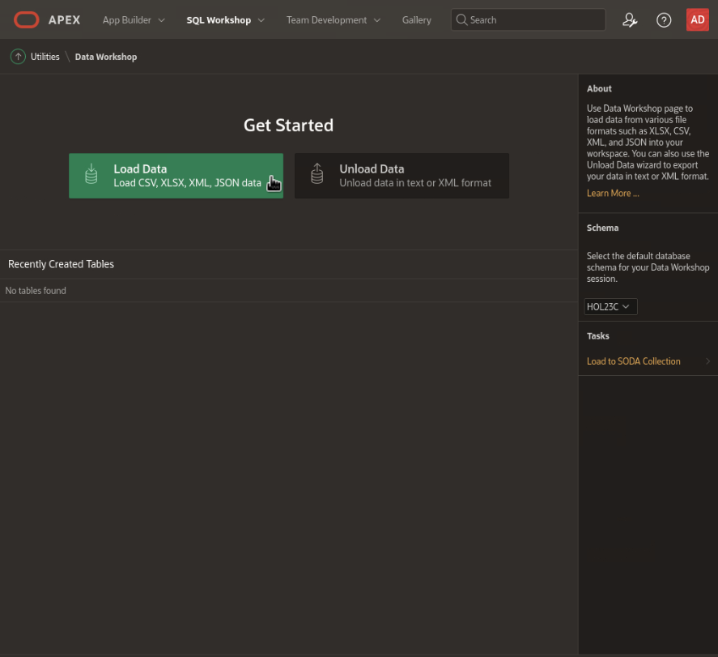

6. Click Choose File
    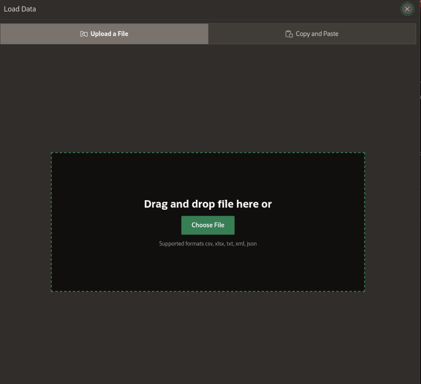

7. Click to Home -> Examples -> Graph -> BANK_ACCOUNTS.csv
    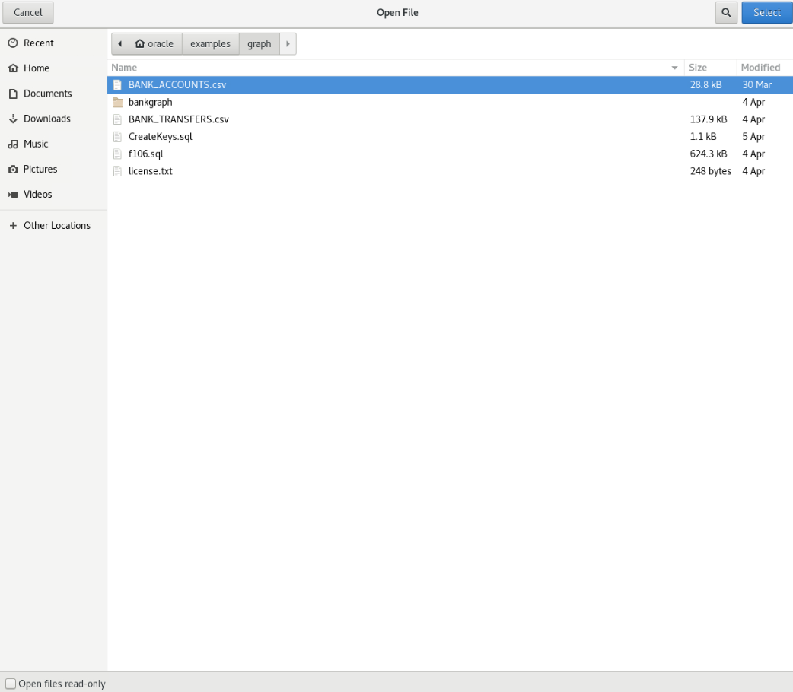

8. Add the table name to be BANK_ACCOUNTS
    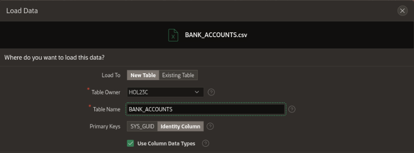

9. Accept the rest of the defaults and click load data
    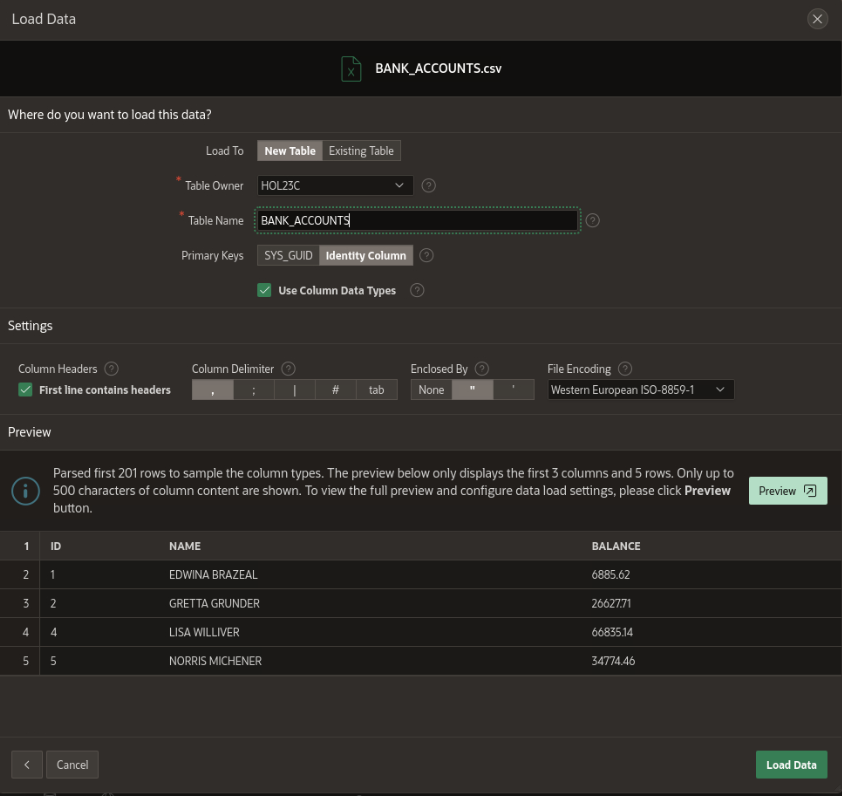

10. After seeing a successful load, click the X and click Load Data again.
    

11. Now load the file by clicking to Home -> Examples -> Graph -> BANK_TRANSFERS.csv
    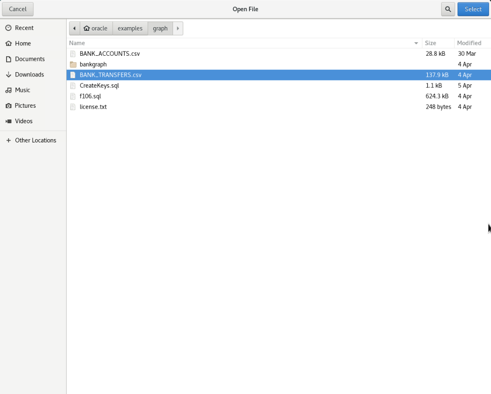

12. Add the table name to be BANK_TRANSFERS
    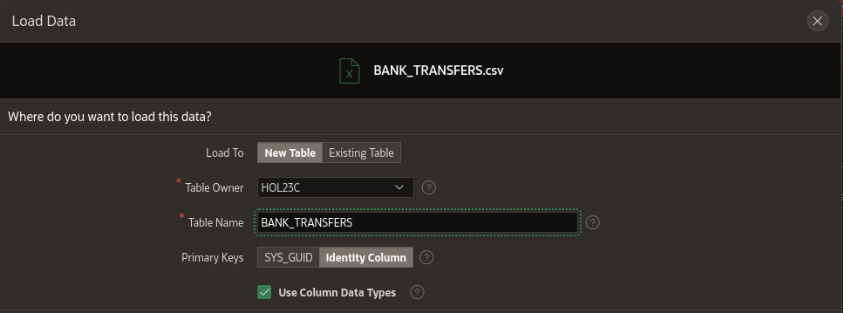

13. Accept the rest of the defaults and click load data
    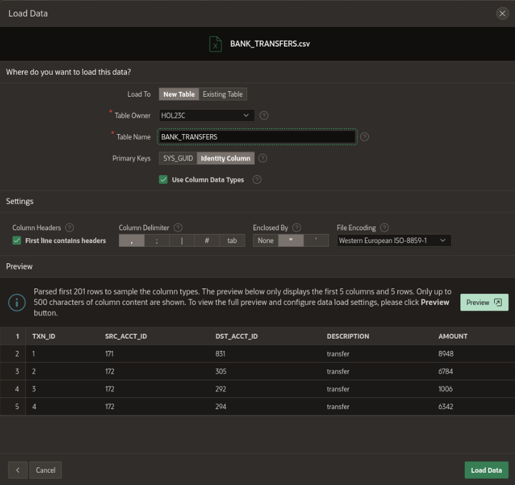

14. After seeing a successful load, click the X
    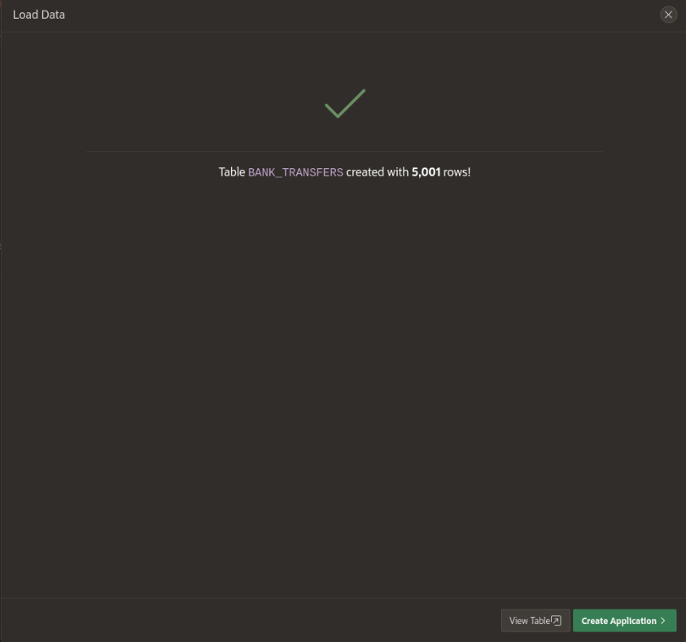

## Task 4: Alter the schema tables
Before we begin the rest of the lab, we wanted to emphasize that all of the following queries we are about to do can be achieved in SQL Developer. We are using APEX for simplicity and to show how it could be done through here, but these are standardized SQL commands that you could run on other tools, such as SQL Developer or SQL Developer Web.

1. Click SQL Workshop -> SQL Commands

    

2. Run each of the following commands one by one. You may erase the command sheet after executing by clicking Clear Command.

    ```
    $ <copy>ALTER TABLE bank_accounts DROP COLUMN ID_1;</copy>
    ```
    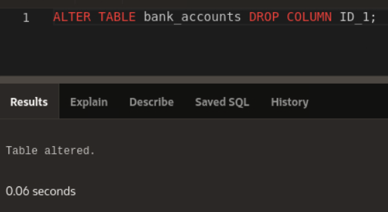

3. 

    ```
    $ <copy>ALTER TABLE bank_transfers DROP COLUMN ID;</copy>
    ```
    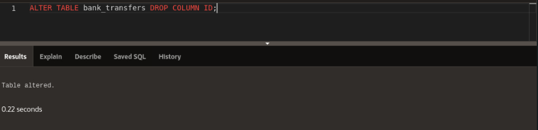
4. 

    ```
    $ <copy>ALTER TABLE bank_accounts ADD PRIMARY KEY (id);</copy>
    ```
    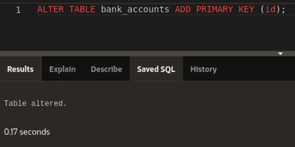

5. 
    ```
    $ <copy>ALTER TABLE bank_transfers ADD PRIMARY KEY (txn_id);</copy>
    ```
    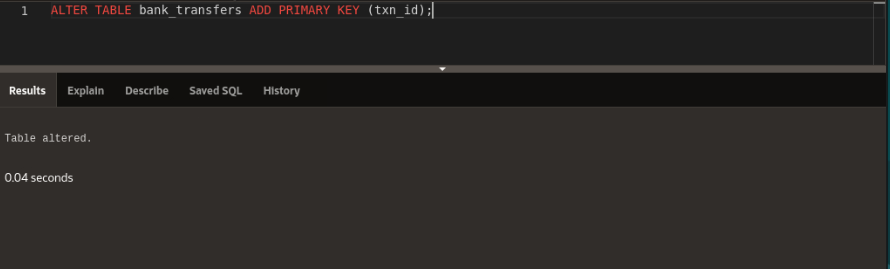

6. 

    ```
    $ <copy>ALTER TABLE bank_transfers MODIFY src_acct_id REFERENCES bank_accounts (id);</copy>
    ```
    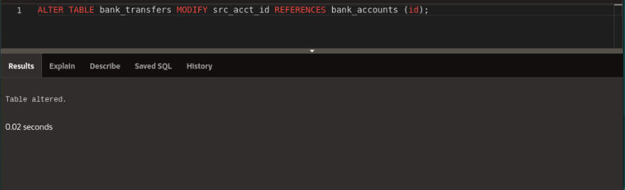

7. 

    ```
    $ <copy>ALTER TABLE bank_transfers MODIFY dst_acct_id REFERENCES bank_accounts (id);</copy>
    ```
    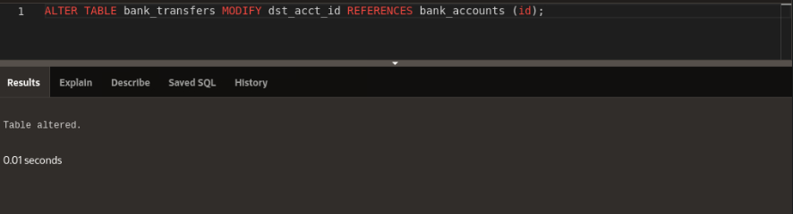

8. 

    ```
    $ <copy>SELECT * FROM USER_CONS_COLUMNS WHERE table_name IN ('BANK_ACCOUNTS', 'BANK_TRANSFERS');</copy>
    ```
    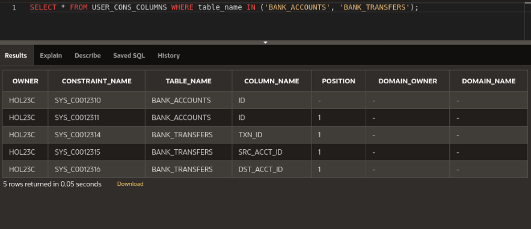


## Learn More
* [Oracle Property Graph](https://docs.oracle.com/en/database/oracle/property-graph/index.html)
* [SQL Property Graph syntax in Oracle Database 23c Free - Developer Release](https://docs.oracle.com/en/database/oracle/property-graph/23.1/spgdg/sql-ddl-statements-property-graphs.html#GUID-6EEB2B99-C84E-449E-92DE-89A5BBB5C96E)

## Acknowledgements

- **Author** - Kaylien Phan, Thea Lazarova, William Masdon
- **Contributors** - Melliyal Annamalai, Jayant Sharma, Ramu Murakami Gutierrez, Rahul Tasker
- **Last Updated By/Date** - Kaylien Phan, Thea Lazarova
