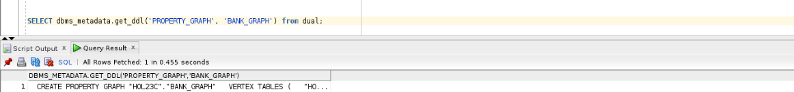

# Operational Property Graphs Example with SQL/PGQ in 23c

## Introduction

In this lab you will query the newly create graph (that is, `bank_graph`) in SQL paragraphs.

Estimated Time: 15 minutes.

Watch the video below for a quick walk through of the lab.

<!-- update video link. Previous iteration: [](youtube:XnE1yw2k5IU) -->

### Objectives
Learn how to:
- Use SQL to query, analyze, and visualize a graph.

### Prerequisites
This lab assumes:
- The graph user and graph bank_graph exists
- You're in SQL Developer and have logged into the database


### Tables are
| Name | Null? | Type |
| ------- |:--------:| --------------:|
| ID | NOT NULL | NUMBER|
| NAME |  | VARCHAR2(4000) |
| BALANCE |  | NUMBER |
{: title="BANK_ACCOUNTS"}

| Name | Null? | Type |
| ------- |:--------:| --------------:|
| TXN_ID | NOT NULL | NUMBER|
| SRC\_ACCT\_ID |  | NUMBER |
| DST\_ACCT\_ID |  | NUMBER |
| DESCRIPTION |  | VARCHAR2(4000) |
| AMOUNT |  | NUMBER |
{: title="BANK_TRANSFERS"}

## Task 1 : Define a graph view on these tables

1. Go back to your SQL Developer window and click on the tab named hol23c_freepdb1, not the CreateKeys.sql tab.

    


2. Use the following SQL statement to create a graph using the BANK\_ACCOUNTS table as vertex elements and the BANK\_TRANSFERS table as edge elements. 
    ```
    <copy>
    CREATE PROPERTY GRAPH BANK_GRAPH 
    VERTEX TABLES (
        BANK_ACCOUNTS
        KEY (ID)
        PROPERTIES (ID, Name, Balance) 
    )
    EDGE TABLES (
        BANK_TRANSFERS 
        KEY (TXN_ID) 
        SOURCE KEY (src_acct_id) REFERENCES BANK_ACCOUNTS(ID)
        DESTINATION KEY (dst_acct_id) REFERENCES BANK_ACCOUNTS(ID)
        PROPERTIES (src_acct_id, dst_acct_id, amount)
    );
    </copy>
    ```

    


3. You can check the metadata views to list the graph, its elements, their labels, and their properties. 

    First we will be listing the graphs, but there is only one property graph we have created, so BANK_GRAPH will be the only entry.
    ```
    <copy>
    select * from user_property_graphs;
    </copy>
    ```

    

4. This query shows the DDL for the BANK_GRAPH graph 

    ```
    <copy>
    SELECT dbms_metadata.get_ddl('PROPERTY_GRAPH', 'BANK_GRAPH') from dual;
    </copy>
    ```
    
    


5. Here you can look at the elements of the BANK_GRAPH graph (i.e. its vertices and edges).
    ```
    <copy>
    SELECT * FROM user_pg_elements WHERE graph_name='BANK_GRAPH';
    </copy>
    ```

    

<!-- 5. These are the labels used in the graph.
    ```
    <copy>
    select * from user_pg_labels
    where graph_name='BANK_TRANSFERS';
    </copy>
    ```

     -->

6. Get the properties associated with the labels.
    ```
    <copy>
    SELECT * FROM user_pg_label_properties WHERE graph_name='BANK_GRAPH';
    </copy>
    ```

    

<!-- 7. 

    ```
    <copy>
    select label_name, property_name, data_type from user_pg_label_properties
    where graph_name='BANK_TRANSFERS' order by label_name;
    </copy>
    ```

     -->


## Task 2 : Query the bank graph
A common query in analyzing money flows is to see if there are a sequence of transfers that connect one source account to a destination account. We'll be demonstrating that sequence of transfers in standard SQL.

1. Let's start by finding which accounts have the most incoming transfers.
    ```
    <copy>
    SELECT acct_id, COUNT(1) AS Num_Transfers 
    FROM graph_table ( BANK_GRAPH 
        MATCH (src) - [IS BANK_TRANSFERS] -> (dst) 
        COLUMNS ( dst.id AS acct_id )
    ) GROUP BY acct_id ORDER BY Num_Transfers DESC FETCH FIRST 10 ROWS ONLY;
    </copy>
    ```
    


2.  Find the top 10 accounts in the middle of a 2-hop chain of transfers
    ```
    <copy>
    SELECT acct_id, COUNT(1) AS Num_In_Middle 
    FROM graph_table ( BANK_GRAPH 
        MATCH (src) - [IS BANK_TRANSFERS] -> (via) - [IS BANK_TRANSFERS] -> (dst) 
        COLUMNS ( via.id AS acct_id )
    ) GROUP BY acct_id ORDER BY Num_In_Middle DESC FETCH FIRST 10 ROWS ONLY;
    </copy>
    ```
    


3. List accounts that received a transfer from account 387 in 1, 2, or 3 hops
    ```
    <copy>
    SELECT account_id1, account_id2 
    FROM graph_table(BANK_GRAPH
        MATCH (v1)-[IS BANK_TRANSFERS]->{1,3}(v2) 
        WHERE v1.id = 387 
        COLUMNS (v1.id AS account_id1, v2.id AS account_id2)
    );
    </copy>
    ```

    


4. Check if there are any 3-hop (triangles) transfers that start and end at the same account
    ```
    <copy>
    SELECT acct_id, COUNT(1) AS Num_Triangles 
    FROM graph_table (BANK_GRAPH 
        MATCH (src) - []->{3} (src) 
        COLUMNS (src.id AS acct_id) 
    ) GROUP BY acct_id ORDER BY Num_Triangles DESC;
    </copy>
    ```

    

5. Check if there are any 4-hop transfers that start and end at the same account 

    ```
    <copy>
    SELECT acct_id, COUNT(1) AS Num_4hop_Chains 
    FROM graph_table (BANK_GRAPH 
        MATCH (src) - []->{4} (src) 
        COLUMNS (src.id AS acct_id) 
    ) GROUP BY acct_id ORDER BY Num_4hop_Chains DESC;
    </copy>
    ```

    

6. Check if there are any 5-hop transfers that start and end at the same account

    ```
    <copy>
   SELECT acct_id, COUNT(1) AS Num_5hop_Chains 
    FROM graph_table (BANK_GRAPH 
        MATCH (src) - []->{5} (src) 
        COLUMNS (src.id AS acct_id) 
    ) GROUP BY acct_id ORDER BY Num_5hop_Chains DESC;
    </copy>
    ```

    
    
7.  List some (any 10) accounts which had a 3 to 5 hop circular payment chain 

    How many accounts transferred money into 387 in 2 or 3 hops?
    ```
    <copy>
    SELECT DISTINCT(account_id) 
    FROM GRAPH_TABLE(BANK_GRAPH
       MATCH (v1)-[IS BANK_TRANSFERS]->{3,5}(v1)
        COLUMNS (v1.id AS account_id)  
    ) FETCH FIRST 10 ROWS ONLY;
    </copy>
    ```

    

8.  Query accounts by number of 3 to 5 hops cycles in descending order. Show top 10.
    ```
    <copy>
    SELECT DISTINCT(account_id), COUNT(1) AS Num_Cycles 
    FROM graph_table(BANK_GRAPH
        MATCH (v1)-[IS BANK_TRANSFERS]->{3, 5}(v1) 
        COLUMNS (v1.id AS account_id) 
    ) GROUP BY account_id ORDER BY Num_Cycles DESC FETCH FIRST 10 ROWS ONLY;
    </copy>
    ```

    As you can see, though we are looking for longer lengths on the chain, there is no additional lines of code that need to be written.

    

9. You have now completed this lab.

## Learn More
* [Oracle Property Graph](https://docs.oracle.com/en/database/oracle/property-graph/index.html)
* [SQL Property Graph syntax in Oracle Database 23c Free - Developer Release](https://docs.oracle.com/en/database/oracle/property-graph/23.1/spgdg/sql-ddl-statements-property-graphs.html#GUID-6EEB2B99-C84E-449E-92DE-89A5BBB5C96E)

## Acknowledgements

- **Author** - Kaylien Phan, Thea Lazarova, William Masdon
- **Contributors** - Melliyal Annamalai, Jayant Sharma, Ramu Murakami Gutierrez, Rahul Tasker
- **Last Updated By/Date** - Kaylien Phan, Thea Lazarova
