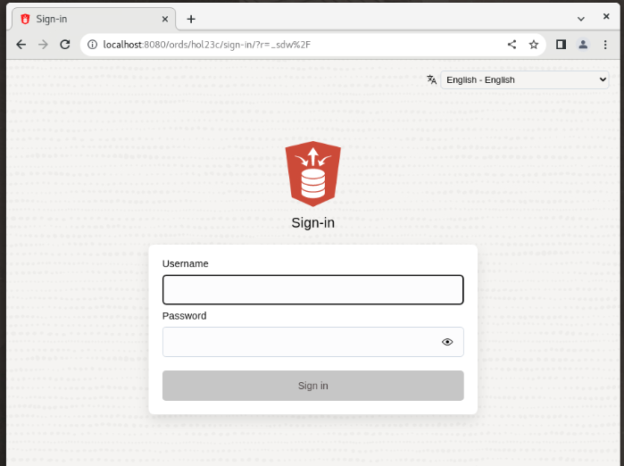
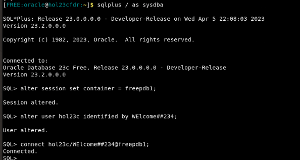
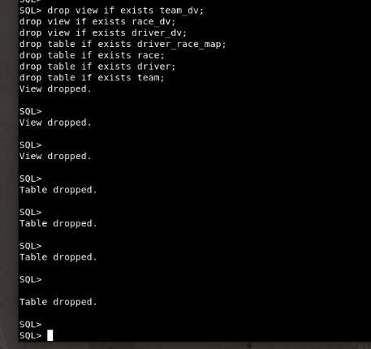
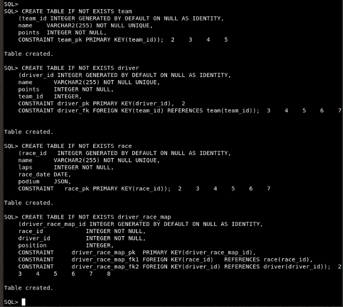
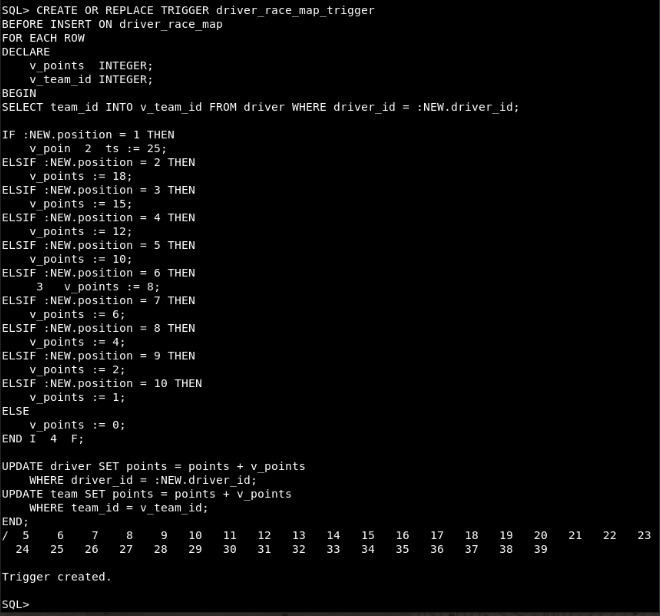
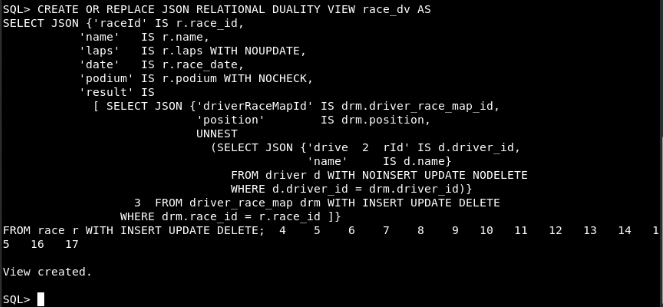
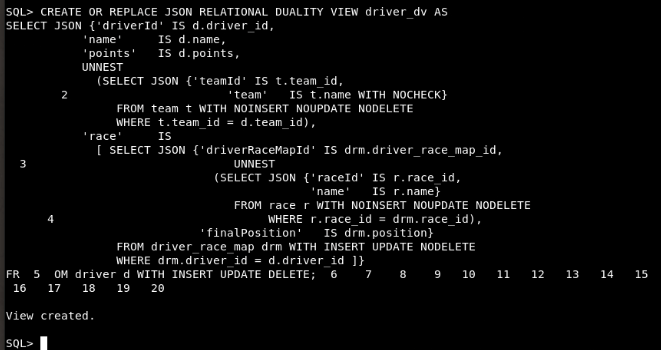
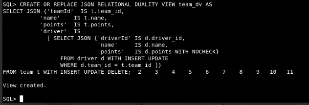
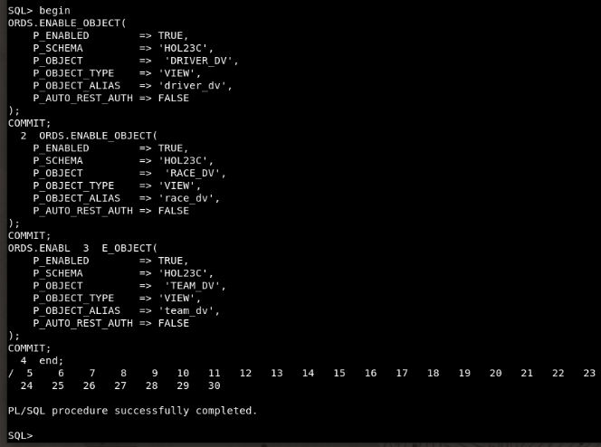
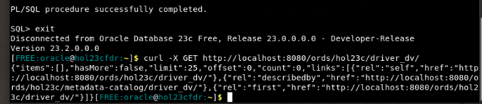

# Setup Your Environment

## Introduction

Before we can begin creating tables and JSON Duality Views, we must first start our ORDS server and update our user's password. The first 2 tasks of this lab walk you through the necessary steps to accomplish those steps. This lab assumes that you have already installed the Oracle Database 23c Free Developer Release and configured and installed ORDS on a pluggable database. 

After your database has been configured with ORDS, you will need to setup the tables and views off of which we can use ORDS and the duality views. 

In this workshop, we will be using a set of tables used to store data on F1 racing teams, drivers, and race results. We will then create JSON Duality Views on top of these tables to reference them as JSON documents. Then we will use AutoREST to enable our duality views to be used with REST calls. 

Estimated Time: 5 minutes


### Objectives

In this lab, you will:

- Startup ORDS and reset the ORDS user's password
- Create relational tables
- Create JSON Duality Views on top of relational tables
- Enable REST on the JSON Duality Views

### Prerequisites

This lab assumes you have:
- Oracle Database 23c Free Developer Release
- All previous labs successfully completed
- Oracle REST Data Service (ORDS) 23.1


## Task 1: Start the ORDS Server


1. If you have not started your ORDS server yet, do so now. Note that if you are using the _Run on LiveLabs_ option, ORDS has already been installed on your database and now must be started. 

    The following command will run ORDS in the background of your terminal. Do not close the terminal window or the ORDS server will stop. 

    ```
    $ <copy>ords serve > /dev/null 2>&1 &</copy>
    ```

    

2. After allowing a few moments for the server to startup, then use this URL to ensure ORDS is running. 

    If you are running this workshop in your own machine (i.e. not with the _Run on LiveLabs_ option), you can replace `localhost` with the your machine's hostname, if desired. You may notice in some of the screenshots that `hol23cfdr` is used instead of localhost. Please be aware that `localhost` and `hol23cfdr` refer to the same machine in the screenshots. Please continue using `localhost` unless your machine does not support it. 

    ```
    <copy>
    http://localhost:8080/ords/hol23c/_sdw
    </copy>
    ```

    

    No need to login right now. We are going to change the user's password in the next step. 

    In the lab "Query Duality Views with REST," we will return to this link later and use SQL Developer Web to run some REST calls with OpenAPI. 

## Task 2: Create database tables


1. You will now create tables in the ORDS-enabled schema. First, you must login to the database and update your workshop user's password. 

    ```
    $ <copy>sql / as sysdba</copy>
    ```

2. Change the container name appropriately to match the pluggable database name where you have ORDS installed.

    ```
    SQL> <copy>alter session set container = freepdb1;</copy>
    ```

3. Update the workshop user's password. Make sure to replace `<new_password_here>` with your chosen password. 

    **NOTE:** This user was already created and granted permissions in the _Run on LiveLabs_ version of this workshop. 

    ```
    SQL> <copy>alter user hol23c identified by <new_password_here>;</copy>
    ```

4. Connect to the pluggable database with ORDS as the user, replacing `<new_password_here>` with your password. 

    ```
    SQL> <copy>connect hol23c/<new_password_here>@freepdb1;</copy>
    ```

    

5. Now that you have logged into the database, we can create the tables that will be the underlying data structures for our JSON Duality Vies. Before doing this, drop the views tables in case they already exist, so you can start from scratch.

    **NOTE:** Make sure to press 'enter' after copy and pasting these commands so that the last command executes. 

    ```
    SQL> <copy>drop view if exists team_dv;</copy>
    SQL> <copy>drop view if exists race_dv;</copy>
    SQL> <copy>drop view if exists driver_dv;</copy>
    SQL> <copy>drop table if exists driver_race_map;</copy>
    SQL> <copy>drop table if exists race;</copy>
    SQL> <copy>drop table if exists driver;</copy>
    SQL> <copy>drop table if exists team;</copy>
    ```

    

6. Now create the tables. 

    **NOTE:** Make sure to press 'enter' after each copy and paste so that each table is created individually. 

    ```
    SQL> <copy>CREATE TABLE IF NOT EXISTS team
        (team_id INTEGER GENERATED BY DEFAULT ON NULL AS IDENTITY,
        name    VARCHAR2(255) NOT NULL UNIQUE,
        points  INTEGER NOT NULL,
        CONSTRAINT team_pk PRIMARY KEY(team_id));</copy>
    ```
    ```
    SQL> <copy>CREATE TABLE IF NOT EXISTS driver
        (driver_id INTEGER GENERATED BY DEFAULT ON NULL AS IDENTITY,
        name      VARCHAR2(255) NOT NULL UNIQUE,
        points    INTEGER NOT NULL,
        team_id   INTEGER,
        CONSTRAINT driver_pk PRIMARY KEY(driver_id),
        CONSTRAINT driver_fk FOREIGN KEY(team_id) REFERENCES team(team_id));</copy>
    ```
    ```
    SQL> <copy>CREATE TABLE IF NOT EXISTS race
        (race_id   INTEGER GENERATED BY DEFAULT ON NULL AS IDENTITY,
        name      VARCHAR2(255) NOT NULL UNIQUE,
        laps      INTEGER NOT NULL,
        race_date DATE,
        podium    JSON,
        CONSTRAINT   race_pk PRIMARY KEY(race_id));</copy>  
    ```
    ```
    SQL> <copy>CREATE TABLE IF NOT EXISTS driver_race_map
        (driver_race_map_id INTEGER GENERATED BY DEFAULT ON NULL AS IDENTITY,
        race_id            INTEGER NOT NULL,
        driver_id          INTEGER NOT NULL,
        position           INTEGER,
        CONSTRAINT     driver_race_map_pk  PRIMARY KEY(driver_race_map_id),
        CONSTRAINT     driver_race_map_fk1 FOREIGN KEY(race_id)   REFERENCES race(race_id),
        CONSTRAINT     driver_race_map_fk2 FOREIGN KEY(driver_id) REFERENCES driver(driver_id));</copy>
    ```

    

7. Create a trigger to update the points for the teams and drivers. 

    **NOTE:** Make sure to press 'enter' after copy and pasting the code block so that trigger is created.

    ```
    SQL> <copy>CREATE OR REPLACE TRIGGER driver_race_map_trigger
    BEFORE INSERT ON driver_race_map
    FOR EACH ROW
    DECLARE
        v_points  INTEGER;
        v_team_id INTEGER;
    BEGIN
    SELECT team_id INTO v_team_id FROM driver WHERE driver_id = :NEW.driver_id;

    IF :NEW.position = 1 THEN
        v_points := 25;
    ELSIF :NEW.position = 2 THEN
        v_points := 18;
    ELSIF :NEW.position = 3 THEN
        v_points := 15;
    ELSIF :NEW.position = 4 THEN
        v_points := 12;
    ELSIF :NEW.position = 5 THEN
        v_points := 10;
    ELSIF :NEW.position = 6 THEN
        v_points := 8;
    ELSIF :NEW.position = 7 THEN
        v_points := 6;
    ELSIF :NEW.position = 8 THEN
        v_points := 4;
    ELSIF :NEW.position = 9 THEN
        v_points := 2;
    ELSIF :NEW.position = 10 THEN
        v_points := 1;
    ELSE
        v_points := 0;
    END IF;

    UPDATE driver SET points = points + v_points
        WHERE driver_id = :NEW.driver_id;
    UPDATE team SET points = points + v_points
        WHERE team_id = v_team_id;
    END;
    /</copy>
    ```

    


## Task 3: Create JSON Duality Views


Oracle Database 23c JSON Relational Duality converges the benefits of the Relational and Document worlds within a single database. Data is stored in relational tables and can be accessed as such for reporting or legacy applications. The JSON Duality Views provide an additional form of access - JSON Documents - for new applications or REST calls.  Developers can thus think in terms of JSON documents for data access while using the highly efficient relational model for data storage, without having to compromise simplicity or efficiency. In addition to this, Duality Views hide all the complexities of database level concurrency control from the user, providing document level serializability.

You will now create three JSON Duality Views: race\_dv, driver\_dv, and team\_dv. Take note that while each of these views are constructed to represent one table in particular, each of the views have information collected from different tables and reference them in child objects. 


1. Create a duality view for the race table. Notice that we are using 3 different tables to create one view. We are also using the `UNNEST` command to unnest the information from the driver table into the sub-object `result` instead of it being another sub-object within that same field. 

    **NOTE:** Make sure to press 'enter' after copy and pasting the code block so that view is created.

    ```
    SQL> <copy>CREATE OR REPLACE JSON RELATIONAL DUALITY VIEW race_dv AS
    SELECT JSON {'raceId' IS r.race_id,
               'name'   IS r.name,
               'laps'   IS r.laps WITH NOUPDATE,
               'date'   IS r.race_date,
               'podium' IS r.podium WITH NOCHECK,
               'result' IS
                 [ SELECT JSON {'driverRaceMapId' IS drm.driver_race_map_id,
                                'position'        IS drm.position,
                                UNNEST
                                  (SELECT JSON {'driverId' IS d.driver_id,
                                                'name'     IS d.name}
                                     FROM driver d WITH NOINSERT UPDATE NODELETE
                                     WHERE d.driver_id = drm.driver_id)}
                     FROM driver_race_map drm WITH INSERT UPDATE DELETE
                     WHERE drm.race_id = r.race_id ]}
    FROM race r WITH INSERT UPDATE DELETE;</copy>
    ```

    

2. Create a duality view for the driver table. Notice in this duality view, we are specifying that no data alterations are allowed on the team information. That means when preforming PUT, POST, or DELETE actions on this view, we will not be able to alter the `teamId` or `team` fields. 

    **NOTE:** Make sure to press 'enter' after copy and pasting the code block so that view is created.

    ```
    SQL> <copy>CREATE OR REPLACE JSON RELATIONAL DUALITY VIEW driver_dv AS
    SELECT JSON {'driverId' IS d.driver_id,
               'name'     IS d.name,
               'points'   IS d.points,
               UNNEST
                 (SELECT JSON {'teamId' IS t.team_id,
                               'team'   IS t.name WITH NOCHECK}
                    FROM team t WITH NOINSERT NOUPDATE NODELETE
                    WHERE t.team_id = d.team_id),
               'race'     IS
                 [ SELECT JSON {'driverRaceMapId' IS drm.driver_race_map_id,
                                UNNEST
                                  (SELECT JSON {'raceId' IS r.race_id,
                                                'name'   IS r.name}
                                     FROM race r WITH NOINSERT NOUPDATE NODELETE
                                     WHERE r.race_id = drm.race_id),
                                'finalPosition'   IS drm.position}
                    FROM driver_race_map drm WITH INSERT UPDATE NODELETE
                    WHERE drm.driver_id = d.driver_id ]}
    FROM driver d WITH INSERT UPDATE DELETE;</copy>
    ```

    

3. Create a duality view for the team table. 

    **NOTE:** Make sure to press 'enter' after copy and pasting the code block so that view is created.

    ```
    SQL> <copy>CREATE OR REPLACE JSON RELATIONAL DUALITY VIEW team_dv AS
    SELECT JSON {'teamId'  IS t.team_id,
               'name'    IS t.name,
               'points'  IS t.points,
               'driver'  IS
                 [ SELECT JSON {'driverId' IS d.driver_id,
                                'name'     IS d.name,
                                'points'   IS d.points WITH NOCHECK}
                     FROM driver d WITH INSERT UPDATE
                     WHERE d.team_id = t.team_id ]}
    FROM team t WITH INSERT UPDATE DELETE;</copy>
    ```

    


## Task 4: Enable the Duality Views for REST APIs


1. Enable each of the duality views for REST APIs. 

    **NOTE:** Make sure to press 'enter' after copy and pasting the code block so that the code runs. 

    ```
    SQL> <copy>
    begin
    ORDS.ENABLE_OBJECT(
        P_ENABLED        => TRUE,
        P_SCHEMA         => 'HOL23C',
        P_OBJECT         =>  'DRIVER_DV',
        P_OBJECT_TYPE    => 'VIEW',
        P_OBJECT_ALIAS   => 'driver_dv',
        P_AUTO_REST_AUTH => FALSE
    );
    COMMIT;
    ORDS.ENABLE_OBJECT(
        P_ENABLED        => TRUE,
        P_SCHEMA         => 'HOL23C',
        P_OBJECT         =>  'RACE_DV',
        P_OBJECT_TYPE    => 'VIEW',
        P_OBJECT_ALIAS   => 'race_dv',
        P_AUTO_REST_AUTH => FALSE
    );
    COMMIT;
    ORDS.ENABLE_OBJECT(
        P_ENABLED        => TRUE,
        P_SCHEMA         => 'HOL23C',
        P_OBJECT         =>  'TEAM_DV',
        P_OBJECT_TYPE    => 'VIEW',
        P_OBJECT_ALIAS   => 'team_dv',
        P_AUTO_REST_AUTH => FALSE
    );
    COMMIT;
    end;
    /</copy>
    ```

    

2. With everything setup in the database, we can query ORDS to see the data in our tables. Exit SQLPlus and then use cURL to query the driver table. 

    ```
    SQL> <copy>exit;</copy>
    ```
    ```
    $ <copy>curl -X GET http://localhost:8080/ords/hol23c/driver_dv/</copy>
    ```

    

    There is no data in the underlying tables, which is why the "items" array is empty. SODA paginates the results by default, so "offset" and "limit" fields refer to the offset of the results and the maximum number of resutls returned at a time. Also included in the reponse are links to common read and write operations that can be preformed on the duality view collection. The contents of "links" is not show above for brevity. 

You may **proceed to the next lab.** 

## Learn More

- [JSON Relational Duality: The Revolutionary Convergence of Document, Object, and Relational Models](https://blogs.oracle.com/database/post/json-relational-duality-app-dev)
- [JSON Duality View documentation](https://docs.oracle.com/en/database/oracle/oracle-database/23/jsnvu/index.html)
- [Blog: Key benefits of JSON Relational Duality](https://blogs.oracle.com/database/post/key-benefits-of-json-relational-duality-experience-it-today-using-oracle-database-23c-free-developer-release)
- [ORDS Documentation](https://docs.oracle.com/en/database/oracle/oracle-rest-data-services/23.1/)

## Acknowledgements

* **Author** - William Masdon, Kaylien Phan, Jeff Smith
* **Contributors** -  David Start, Ranjan Priyadarshi
* **Last Updated By/Date** - William Masdon, Database Product Manager, April 2023
