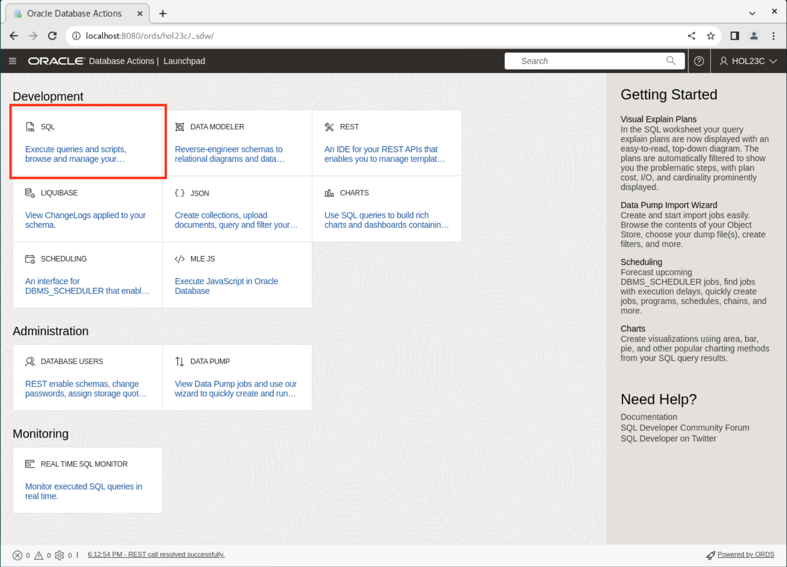

# Power Up with 23c SQL Features

## Introduction

In this lab, we'll explore the power of SQL Features in Oracle's Database 23c Free - Developer Release. We'll visit 10 features you need to know, and how they compare to their existing counterparts.

Estimated Time: 10 minutes

### Objectives

In this lab, you will practice these 10 features:
* Aliases in GROUP BY clause
* FROM clause - now optional
* Boolean for SQL
* IF [NOT] EXISTS DDL clause
* New table value constructor
* Multivalue INSERTs
* RETURNING clause of UPDATE and MERGE statement
* Joins in UPDATE and DELETE
* Annotations - new metadata for database objects
* "Lightweight object types" with SQL Domains

> Note: the order of the feature list does not reflect any ranking of importance. 

### Prerequisites

This lab assumes you have:
* Oracle Database 23c Free Developer Release
* All previous labs successfully completed
* SQL Developer Web 23.1 or a compatible tool for running SQL statements

## Task 1: Connecting to your database user

1. Your browser should still be open, if not just open a new one. If running in a Sandbox go to Activities and then at the top click on new window. If Chrome is not running then click on Chrome.

    

2. The address for SQL Developer Web on your machine is below. Copy and paste that into the browser.
    >Note: If you did not start ORDs, ORDs stopped working or you closed that terminal, go back and complete the steps in Lab 2 to start ORDs. It must be running to log in here.

    ```
    <copy>
    http://localhost:8080/ords/hol23c/_sdw
    </copy>
    ```
    

3. To login use the username hol23c with the password you set into the browser.

    

4. To be able to run SQL statements you will need in the sql worksheet. Click on **SQL**.

    

5. You are now logged in and should be at a screen that looks like this.

    


## Task 2: Aliases in GROUP BY clause

Oracle Database 23c, among of a lot of other features, introduces the ability to use aliases in GROUP BY clause of a SELECT statement. This feature simplifies writing queries with complex expressions as well as ensures better compatibility with some other relational databases, like Teradata, MySQL and PostgreSQL. 
1. For example:

    ```
    SELECT to_char(hiredate,'YYYY') "Year", count(*)
    FROM emp
    GROUP BY to_char(hiredate,'YYYY');
    ```

    In Oracle Database 23c this can be written in a bit simpler way:

    ```
    <copy>
    SELECT to_char(hiredate,'YYYY') "Year", count(*)
    FROM emp
    GROUP BY "Year";
    </copy>
    ```

    The result:

    ```
    Year   COUNT(*)
    ---- ----------
    1981         10
    1987          2
    1980          1
    1982          1
    ```

## Task 3: FROM clause - now optional

Another interesting feature introduced in Oracle Database 23c is optionality of FROM clause in SELECT statements. Up to this version this clause was obligatory. However there are some databases in the market, like MS SQL Server, MySQL and PostgreSQL, where this clause is optional. Since then, as in previous case, this feature ensures better compatibility with such databases.

1. For example, the following statement executed in any earlier, than 23c, version of Oracle Database:
    ```
    SQL> SELECT sysdate;
    ```

    returns the following error:
    ```
    select sysdate
    *
    ERROR at line 1:
    ORA-00923: FROM keyword not found where expected
    ```

    While it is executed succesfully in Oracle Database 23c:
    ```
    SQL> <copy>SELECT sysdate;</copy>
    ```

    ```
    SYSDATE
    ---------
    04-APR-23
    ```

## Task 4: Boolean for SQL

Oracle Database 23c introduces the new BOOLEAN datatype. This leverages the use of true boolean columns/variables, instead of simulating them whith a numeric value. The ability to write boolean predicates simplifies the syntax of SQL statements.

1. First, we'll create a table to test with, called TEST_BOOLEAN.
    ```
    <copy>
    create table TEST_BOOLEAN
    ( name VARCHAR2(100),
    IS_SLEEPING BOOLEAN);
    </copy>
    Table created.​
    ```

2. Let's fill our new table with data. The value `IS_SLEEPING` will be set to `FALSE` as default.
    ```
    SQL> <copy>alter table TEST_BOOLEAN modify (IS_SLEEPING boolean NOT NULL);</copy>
    Table altered.
    ```

    ```
    SQL> <copy>alter table TEST_BOOLEAN modify (IS_SLEEPING default FALSE);</copy>
    Table altered.
    ```
    Here, you can see the different types of Boolean input for Mick, Keith, and Ron. All are valid.
    ```
    SQL> <copy>insert into TEST_BOOLEAN (name) values ('Mick');</copy>
    ​1 row created.​
    ```

    ```
    SQL> <copy>insert into TEST_BOOLEAN (name, is_sleeping) values ('Keith','NO');</copy>
    ​1 row created.
    ```

    ```
    SQL> <copy>insert into TEST_BOOLEAN (name, is_sleeping) values ('Ron',1);</copy>
    1 row created.
    ```

3. Now let's see the see some results based on our Boolean values.
    ```
    SQL> <copy>select name from test_boolean where not is_sleeping;</copy>
    NAME
    --------------------------------------------------------------------------------
    Mick
    Keith
    ```

    ```
    SQL> <copy>set linesize window
    SQL> select * from test_boolean;</copy>

    NAME                                                                                                 IS_SLEEPING
    ---------------------------------------------------------------------------------------------------- -----------
    Mick                                                                                                 FALSE
    Keith                                                                                                FALSE
    Ron                                                                                                  TRUE
    ```

    ```
    SQL> <copy>select dump(is_sleeping) from test_boolean where name = 'Ron';​</copy>

    DUMP(IS_SLEEPING)
    --------------------------------------------------------------------------------
    Typ=252 Len=1: 1
    ```

## Task 5: IF [NOT] EXISTS DDL clause

​Starting with Oracle Database 23c, the new "IF [NOT] EXISTS" DDL clause allows to decide how DDL errors will be handled. This simplifies the DDL scripting, as potential errors due to objects existence or inexistence can be hidden to the scripting.
1. Let's assume the table DEPT exists:
    ```
    SQL> desc dept
    Name                                      Null?    Type
    ----------------------------------------- -------- ----------------------------
    DEPTNO                                    NOT NULL NUMBER(2)
    DNAME                                              VARCHAR2(14)
    LOC                                                VARCHAR2(13)
    ```

2. We will create a table
    ```
    SQL> <copy>create table if not exists scott.dept (deptno number, dname varchar2(10), deptno varchar2(15));</copy>
    Table created.
    ```

3. Now let's drop the helper table `dept1`.
    ```
    SQL> <copy>create table dept1 as select * from dept;</copy>
    Table created.
    ```

    ```
    SQL> <copy>drop table if exists dept1;</copy>
    Table dropped.
    ```

## Task 6: New table value constructor

Starting from Oracle database 23c, table values constructor has been extended. It can now be used in `INSERT` statements, to create several rows in a single command. It can also be used in `SELECT` statements, and in the view factorization syntax. In this last case, it simplifies the syntax of the statements, and avoid using the `DUAL` table.

1. The following statement looks like a kind of table function on the fly.
    ```
    SQL> <copy>select * from (VALUES (50,'HR'), (60,'DEV'), (70,'AI')) virt_dept (deptno, dname);</copy>

        DEPTNO DNA
    ---------- ---
            50 HR
            60 DEV
            70 AI
    ```

## Task 7: Multivalue INSERTs

Another interesting feature ensuring better coexistence and compatibility with other frequently used database management systems is multivalue `INSERT` statement.
1. In previous versions of Oracle database, as an example, inserting 3 rows required three separate insert statements:
    ```
    insert into DEPT values (50,'HR','LOS ANGELES');
    insert into DEPT values (60,'IT','SAN FRANCISCO');
    insert into DEPT values (70,'MANUFACTURING','DETROIT');
    ```

    Oracle Database 23c, similar to other databases like PostgreSQL, introduced the new syntax allowing for inserting all these rows in a single one `INSERT` statement, so you may insert several tuples in one DML.
    ```
    SQL> <copy>insert into DEPT values
        (50,'HR','LOS ANGELES'),
        (60,'IT','SAN FRANCISCO'),
        (70,'MANUFACTURING','DETROIT');</copy>
    3 rows created.
    ```

    Among better compatibility with some other databases, this statement can be used to ensure consistency of some insert operations in auto-commit mode. This could be important, for example, for APEX applications using this mode to work on data.

## Task 8: RETURNING clause of UPDATE and MERGE statement

This clause has been implemented long time ago as a part of `EXECUTE IMMEDIATE` statement. However in Oracle Database 23c we can find it as a part of traditional, static DML statements. 
1. In this case it allows for obtaining old and new values of columns from a row processed by such statement:
    ```
    SQL> <copy>SELECT ename, sal FROM emp WHERE ename = 'KING';</copy>

    ENAME             SAL
    ---------- ----------
    KING             5000
    ```

    ```
    SQL> <copy>VARIABLE old_salary NUMBER</copy>
    SQL> <copy>VARIABLE new_salary NUMBER</copy>

    SQL> <copy>UPDATE emp
        SET sal=sal+1000
        WHERE ename = 'KING'
        RETURNING OLD sal, NEW sal into :old_salary, :new_salary;</copy>
    1 row updated.
    ```

    ```
    SQL> <copy>PRINT old_salary</copy>
    OLD_SALARY
    ----------
        5000
    ```

    ```
    SQL> <copy>PRINT new_salary</copy>
    NEW_SALARY
    ----------
        6000
    ```

## Task 9: Joins in UPDATE and DELETE

You may update table date via joins - based on foreign table conditions. There is no need for sub selects or `IN` clause. 
1. For example, instead of using this statement prior to 23c:
    ```
    update emp e set e.sal=e.sal*2
    where e.deptno in
    (select d.deptno from dept d where e.deptno=d.deptno
    and d.dname='RESEARCH')
    ```

    With Oracle 23c, you can now use:
    ```
    SQL> <copy>update emp e set e.sal=e.sal*2
    from dept d
    where e.deptno=d.deptno
    and d.dname='RESEARCH';</copy>
    5 rows updated.
    ```

## Task 10: Annotations, new metadata for database objects

Annotations are optional meta data for database objects. An annotation is either a name-value pair or name by itself. The name and optional value are freeform text fields.  An annotation is represented as a subordinate element to the database object to which the annotation has been added. Supported schema objects include tables, views, materialized views, and indexes. With annotations you may store and retrieve metadata about a database objects. You can use it to customize business logic, user interfaces or provide metada to metatdata repositories. It can be added with CREATE or ALTER statement. - on table or column level. 
With annotations you may store and retrieve metadata about a database objects. You can use it to customize business logic, user interfaces or provide metada to metatdata repositories.

1. Let's create an annotated table `EMP_ANNOTATED` with column and table annotations.

    ```
    <copy>
    create table emp_annotated
    ( empno number annotations(identity, display 'person_identity', details 'person_info'),
    ename varchar2(50),
    salary number annotations (display 'person_salary', col_hidden))
    annotations (display 'employee_table')
    /
    </copy>
    ```
    Data Dictionary views such as `USER_ANNOTATIONS` and `USER_ANNOTATIONS_USAGE` can help to monitor the usage.

## Task 11: "Light weight object types" with SQL Domains

A SQL domain is a dictionary object that belongs to a schema and encapsulates a set of optional properties and constraints and is created with a `CREATE DOMAIN` statement. Domains provide constraints, display, ordering and annotations attributes. After you define a SQL domain, you can define table columns to be associated with that domain, thereby explicitly applying the domain's optional properties and constraints to those columns.
SQL Domains allow users to declare the intended usage for columns. They are data dictionary objects so that abstract domain specific knowledge can be easily reused.

1. We'll look at these in more detail in the next lab, but for now, let's try a quick example. We'll create a domain named `yearbirth` and table named `person`.
    ```
    SQL> <copy>create domain yearbirth as number(4)
        constraint check ((trunc(yearbirth) = yearbirth) and (yearbirth >= 1900))
        display (case when yearbirth < 2000 then '19-' ELSE '20-' end)||mod(yearbirth, 100)
        order (yearbirth -1900)
        annotations (title 'yearformat');</copy>

    SQL> <copy>create table person
        ( id number(5),
        name varchar2(50),
        salary number,
        person_birth number(4) DOMAIN yearbirth
        )
        annotations (display 'person_table');</copy>

    Table created.

    SQL> <copy>desc person</copy>
    ```

    ```
    Name                                                                      Null?    Type
    -------------------------------------------------------------------------- -------- ----------------------------
    ID                                                                                  NUMBER(5)
    NAME                                                                                VARCHAR2(50)
    SALARY                                                                              NUMBER
    PERSON_BIRTH                                                                        NUMBER(4) SCOTT.YEARBIRTH
    ```

2. Now let's add data to our table.
    ```
    SQL> <copy>insert into person values (1,'MARTIN',3000, 1988);</copy>
    ```

3. With the new function `DOMAIN_DISPLAY` you can display the property.
    ```
    SQL> <copy>select DOMAIN_DISPLAY(person_birth) from person;</copy>
    ```

    ```
    DOMAIN_DISPLAY(PERSON_BIRTH)
    -------------------------------------------
    19-88
    ```

4. Domain usage and Annotations can be monitored with data dictionary views.
    ```
    SQL> <copy>select * from user_annotations_usage;</copy>
    ```

    ```
    OBJECT_NAME     OBJECT_TYP COLUMN_NAME     DOMAIN_NAM DOMAIN_OWN ANNOTATION_NAME      ANNOTATION_VALUE
    --------------- ---------- --------------- ---------- ---------- -------------------- ----------------
    EMP_ANNOTATED   TABLE                                            DISPLAY              employee_table
    PERSON          TABLE                                            DISPLAY              person_table
    EMP_ANNOTATED   TABLE      EMPNO                                 IDENTITY
    EMP_ANNOTATED   TABLE      EMPNO                                 DISPLAY              person_identity
    EMP_ANNOTATED   TABLE      EMPNO                                 DETAILS              person_info
    EMP_ANNOTATED   TABLE      SALARY                                DISPLAY              person_salary
    EMP_ANNOTATED   TABLE      SALARY                                COL_HIDDEN
    YEARBIRTH       DOMAIN                                           TITLE                yearformat
    PERSON          TABLE      PERSON_BIRTH    YEARBIRTH  SCOTT      TITLE                yearformat
    ```

You may now **proceed to the next lab**.

## Learn More

* [SQL Language Reference](https://docs.oracle.com/en/database/oracle/oracle-database/23/sqlrf/index.html)
* [Database Development Guide](https://docs.oracle.com/en/database/oracle/oracle-database/23/adfns/registering-application-data-usage-database.html#GUID-6F630041-B7AE-4183-9F97-E54682CA6319)
* [Blog: Oracle Database 23c Free Developer Release - 10 features you should know](https://blogs.oracle.com/coretec/post/oracle-database-23c-free-developer-sql)
* [Blog: Introducing Oracle Database 23c Free – Developer Release](https://blogs.oracle.com/database/post/oracle-database-23c-free)
* [Oracle Database Free - Developer Release User Forum](https://forums.oracle.com/ords/apexds/domain/dev-community/category/oracle-database-free)
* [Oracle Database 23c Free—Developer Release Product Site](https://www.oracle.com/database/free/)
* [Oracle Database New Features](https://docs.oracle.com/en/database/oracle/oracle-database/23/nfcoa/introduction.html#GUID-C852CD78-8F16-4449-8BE0-D85C80D38E3C)
* [Permitted Database Offering](https://docs.oracle.com/en/database/oracle/oracle-database/23/dblic/Licensing-Information.html#GUID-0F9EB85D-4610-4EDF-89C2-4916A0E7AC87)

## Acknowledgements
* **Author** - Ulrike Schwinn, Distinguished Data Management Expert; Hope Fisher, Program Manager
* **Contributors** - Witold Swierzy, Data Management Expert; Stephane Duprat, Technical End Specialist
* **Last Updated By/Date** - Hope Fisher, June 2023