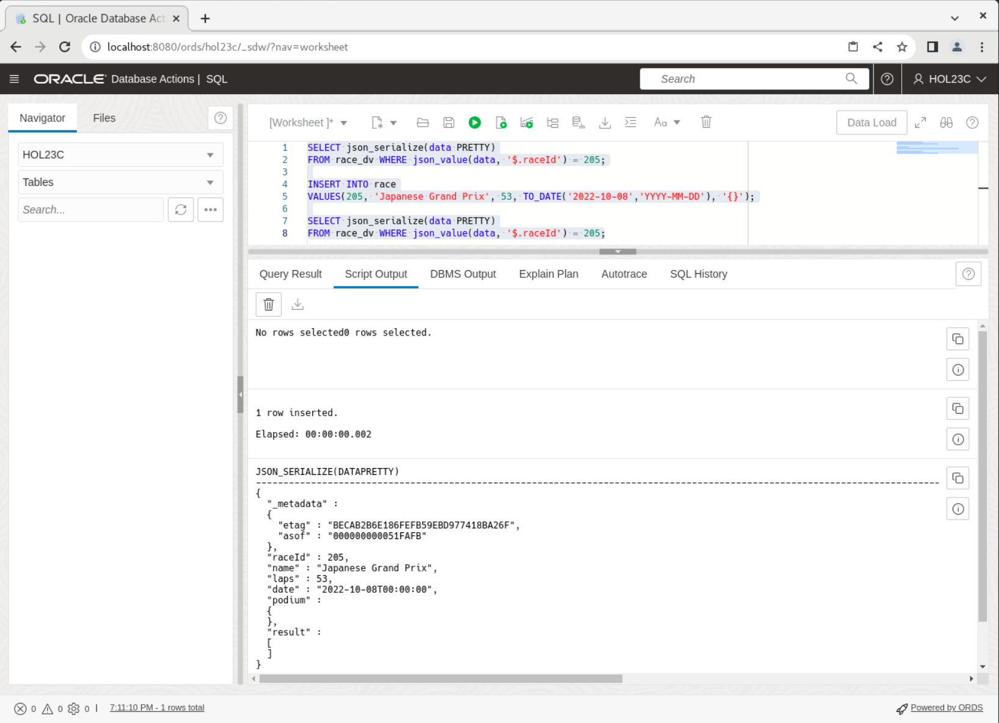
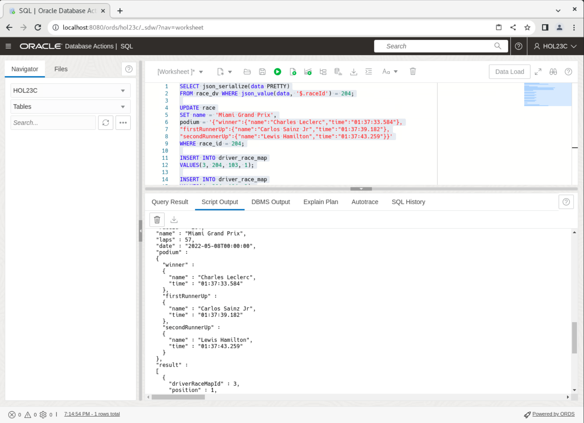
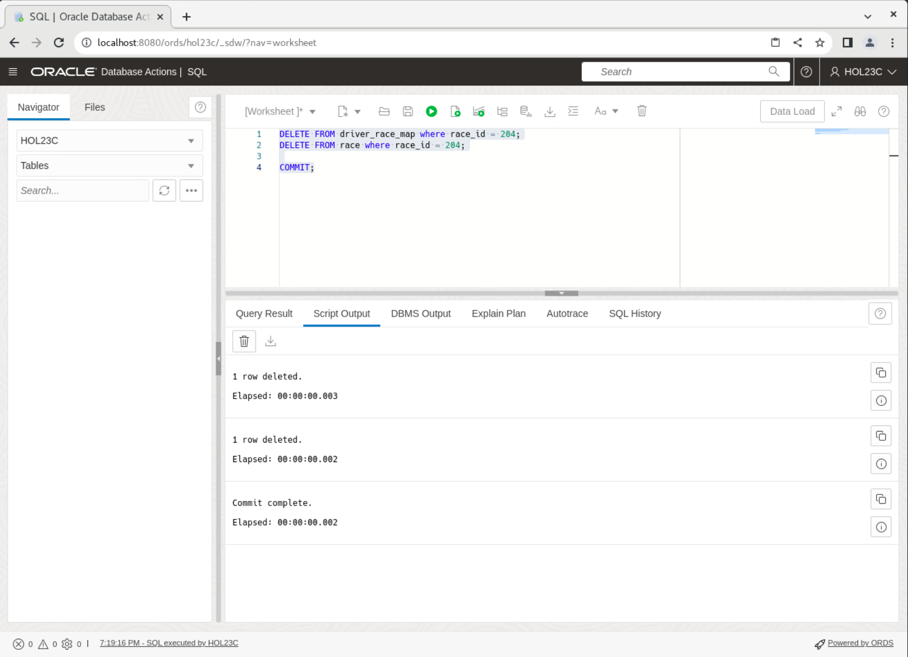
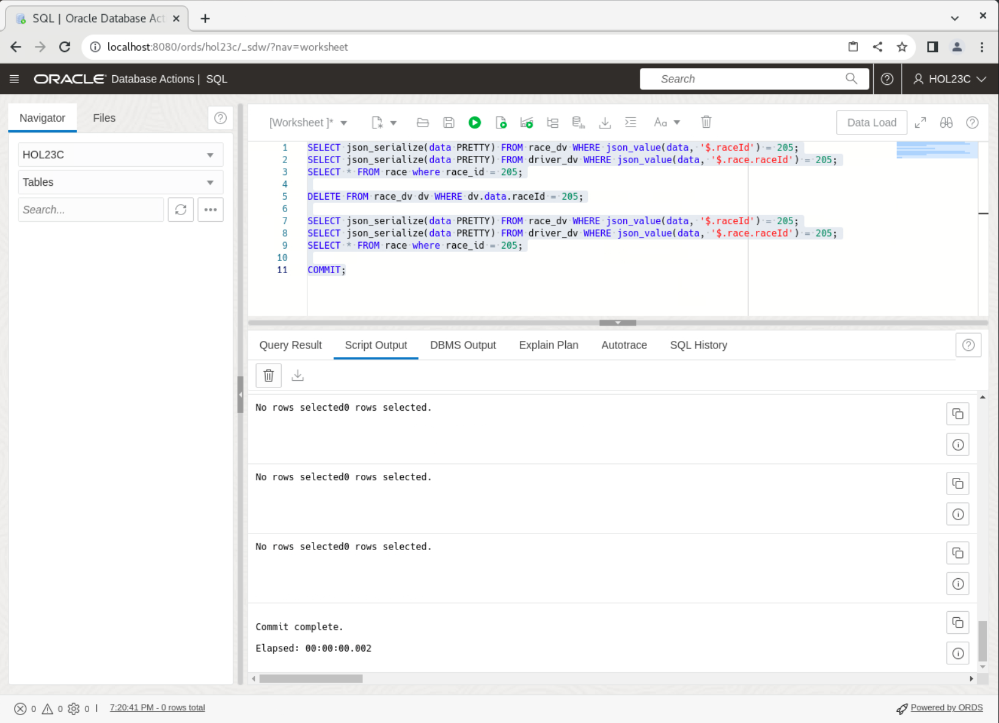

# The Extreme Flexibility of JSON Duality Views

## Introduction

This lab walks you through the steps to work with SQL data and JSON documents at the same time in the Oracle 23c database, looking at the true duality of the views.

Regardless of which one you choose to work with, the underlying result in the database is the same, with SQL access and JSON document access to all data. Developers now get the flexibility and data access benefits of the JSON document model as well as the storage efficiency and power of the relational model.

Estimated Time: 10 minutes

### Objectives

In this lab, you will:
* Insert, update, and delete on the Duality Views and SQL base tables

### Prerequisites

This lab assumes you have:
* Oracle Database 23c Free Developer Release
* All previous labs successfully completed
* SQL Developer Web 23.1 or a compatible tool for running SQL statements


## Task 1: Inserting into SQL tables and duality views
1. We mentioned how the underlying base tables get populated when you add an entry into the JSON duality view. Here we will check the base table to ensure the record does not exist, insert into the duality view, and then check the base table. Copy the code and click **Run Script**.

    ```
    <copy>
    SELECT name FROM race where race_id = 204;

    
    INSERT INTO race_dv VALUES ('{"_id" : 204,
                            "name"   : "Miami Grand Prix",
                            "laps"   : 57,
                            "date"   : "2022-05-08T00:00:00",
                            "podium" : {}}');


    SELECT name FROM race where race_id = 204;
    </copy>
    ```
    

2. Now we will look at the opposite. Let's look at the duality view, insert into the base table and then check the duality view for the record. Copy the code and click **Run Script**.
    ```
    <copy>
    SELECT json_serialize(data PRETTY)
    FROM race_dv WHERE json_value(data, '$._id') = 205;

    INSERT INTO race
    VALUES(205, 'Japanese Grand Prix', 53, TO_DATE('2022-10-08','YYYY-MM-DD'), '{}');

    SELECT json_serialize(data PRETTY)
    FROM race_dv WHERE json_value(data, '$._id') = 205;
    </copy>
    ```
    

## Task 2: Update and replace a document by ID

1. In the last lab, you were able to replace a document with the OBJECT\_ID through the duality view. You are able to get the same functionality with the SQL table. Copy the code and click **Run Script**.

    ```
    <copy>

    SELECT json_serialize(data PRETTY)
    FROM race_dv WHERE json_value(data, '$._id') = 204;

    UPDATE race
    SET name = 'Miami Grand Prix',
    podium = '{"winner":{"name":"Charles Leclerc","time":"01:37:33.584"},
    "firstRunnerUp":{"name":"Carlos Sainz Jr","time":"01:37:39.182"},
    "secondRunnerUp":{"name":"Lewis Hamilton","time":"01:37:43.259"}}'
    WHERE race_id = 204;

    INSERT INTO driver_race_map
    VALUES(3, 204, 103, 1),
    (4, 204, 104, 2),
    (9, 204, 106, 3),
    (10, 204, 105, 4);

    COMMIT;

    SELECT json_serialize(data PRETTY)
    FROM race_dv WHERE json_value(data, '$._id') = 204;

    </copy>
    ```
    

2. When you update the JSON, you can check out the changes in the SQL table as well. Here we will update race 205 and change several fields including the race_date. We will also add records to the driver\_race\_map table. **Before** you run the update make sure the etag matches the record. We have provided the SQL to check the document for race id 205. If you get an error updating the JSON that is more than likely the issue. Copy the code below and click **Run Script**.

    ```
    <copy>
    SELECT json_serialize(data PRETTY)
    FROM race_dv WHERE json_value(data, '$._id') = 205;
    </copy>
    ```
    

3. Adjust the etag if needed and copy the code below. Click **Run Script**.
    ```
    <copy>
    SELECT name, race_date FROM race where race_id = 205;
    SELECT race_id, driver_id, position from driver_race_map where race_id = 205;

    UPDATE race_dv
    SET data = ('{"_metadata": {"etag" : "BECAB2B6E186FEFB59EBD977418BA26F"},
                    "_id" : 205,
                    "name"   : "Japanese Grand Prix",
                    "laps"   : 53,
                    "date"   : "2022-03-20T00:00:00",
                    "podium" :
                    {"winner"         : {"name" : "Max Verstappen",
                                        "time" : "03:01:44.004"},
                    "firstRunnerUp"  : {"name" : "Sergio Perez",
                                        "time" : "03:02:11.070"},
                    "secondRunnerUp" : {"name" : "Carlos Sainz Jr",
                                        "time" : "03:02:15.767"}},
                    "result" : [ {"driverRaceMapId" : 3,
                                "position"        : 1,
                                "driverId"        : 101,
                                "name"            : "Max Verstappen"},
                                {"driverRaceMapId" : 4,
                                "position"        : 2,
                                "driverId"        : 102,
                                "name"            : "Sergio Perez"},
                                {"driverRaceMapId" : 9,
                                "position"        : 3,
                                "driverId"        : 104,
                                "name"            : "Carlos Sainz Jr"}]}')
    WHERE json_value(data, '$._id') = 205;

    COMMIT;
    </copy>
    ```
    

## Task 3: Delete by predicate

1. We're going to delete a couple entries, but we want to see the current state of these tables first. Copy the code below and click **Run Script**.
    ```
    <copy>
    SELECT name, race_date FROM race where race_id = 205;
    SELECT race_id, driver_id, position from driver_race_map where race_id = 205;

    SELECT json_serialize(data PRETTY) FROM race_dv WHERE json_value(data, '$._id') = 204;
    SELECT json_serialize(data PRETTY) FROM driver_dv WHERE json_value(data, '$.race.raceId') = 204;

    SELECT * FROM race where race_id = 204;
    </copy>
    ```
    

2. Delete the race document for race 204. The underlying rows are deleted from the race and driver\_race\_map tables. Copy the code and click **Run Script**.

    Note that we have to delete the rows of the race from the driver\_race\_map first, as they are child entries of the race entries in the race table. It will throw an error if you try to run the second command first.

    ```
    <copy>

    DELETE FROM driver_race_map where race_id = 204;
    DELETE FROM race where race_id = 204;

    COMMIT;
    </copy>
    ```
    

3. Select from the tables again and you'll see they're gone from the duality view as well as the base SQL table. Copy the code and click **Run Script**.


    ```
    <copy>
    SELECT json_serialize(data PRETTY) FROM race_dv WHERE json_value(data, '$._id') = 204;
    SELECT json_serialize(data PRETTY) FROM driver_dv WHERE json_value(data, '$.race.raceId') = 204;

    SELECT * FROM race where race_id = 204;
    </copy>
    ```
    

4. Lastly, we'll delete with JSON and view the tables again. Copy the code and click **Run Script**.


    ```
    <copy>

    SELECT json_serialize(data PRETTY) FROM race_dv WHERE json_value(data, '$._id') = 205;
    SELECT json_serialize(data PRETTY) FROM driver_dv WHERE json_value(data, '$.race.raceId') = 205;
    SELECT * FROM race where race_id = 205;

    DELETE FROM race_dv dv WHERE dv.data."_id" = 205;

    SELECT json_serialize(data PRETTY) FROM race_dv WHERE json_value(data, '$._id') = 205;
    SELECT json_serialize(data PRETTY) FROM driver_dv WHERE json_value(data, '$.race.raceId') = 205;
    SELECT * FROM race where race_id = 205;

    COMMIT;

    </copy>
    ```
    

## Learn More

* [JSON Relational Duality: The Revolutionary Convergence of Document, Object, and Relational Models](https://blogs.oracle.com/database/post/json-relational-duality-app-dev)
* [JSON Duality View documentation](http://docs.oracle.com)
* [Blog: Key benefits of JSON Relational Duality] (https://blogs.oracle.com/database/post/key-benefits-of-json-relational-duality-experience-it-today-using-oracle-database-23c-free-developer-release)

## Acknowledgements
* **Author** - Kaylien Phan, William Masdon
* **Contributors** - David Start, Ranjan Priyadarshi
* **Last Updated By/Date** - Kaylien Phan, Database Product Management, April 2023
