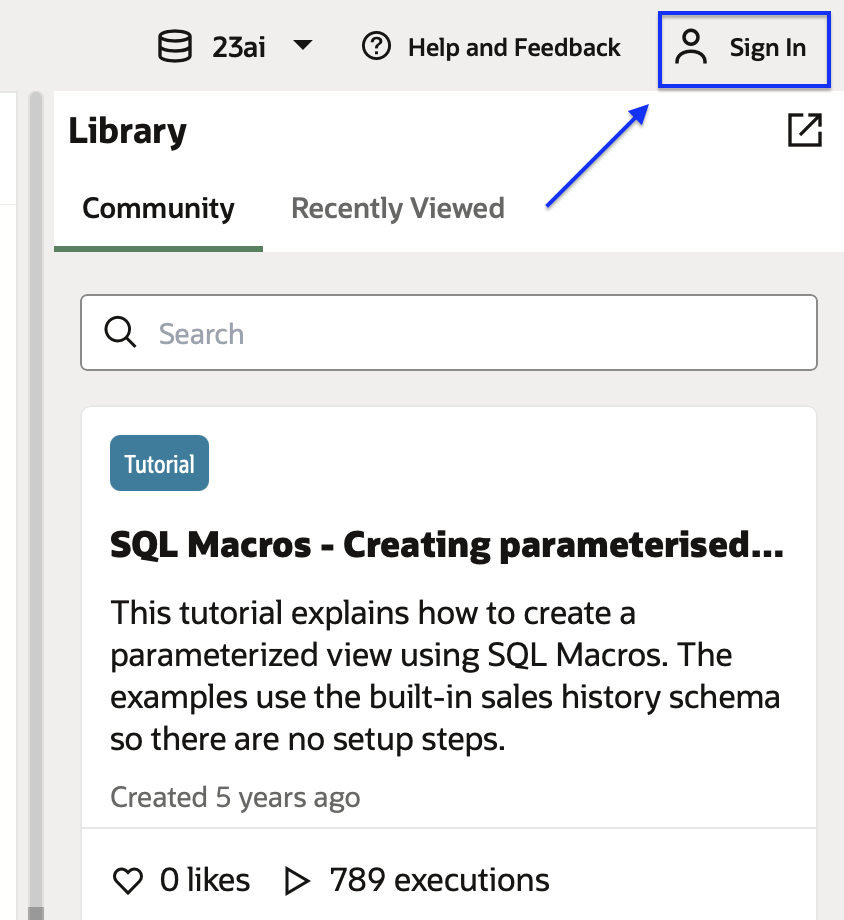
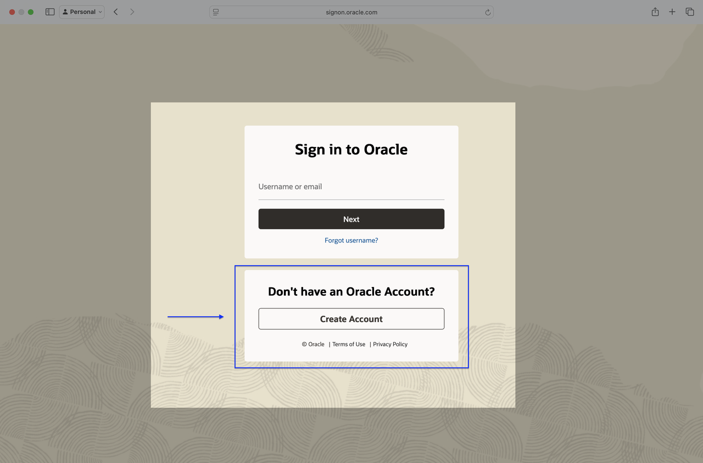
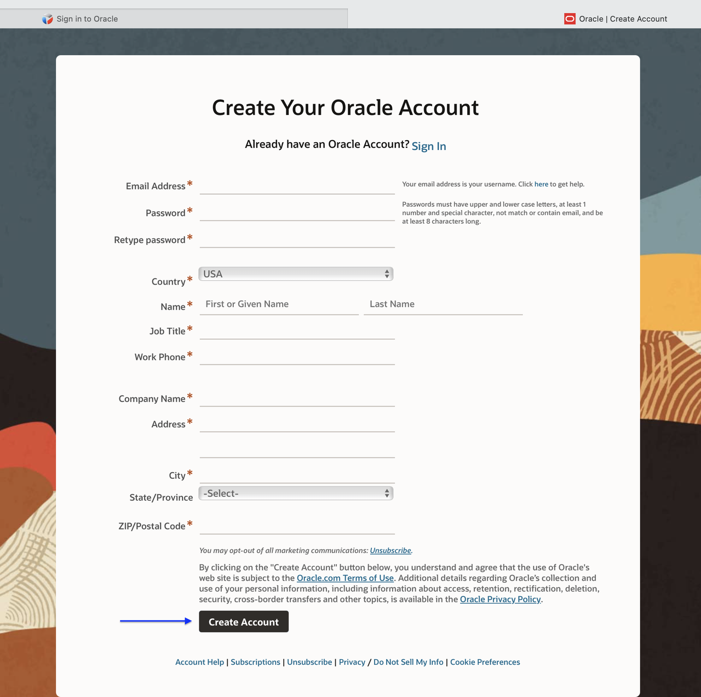
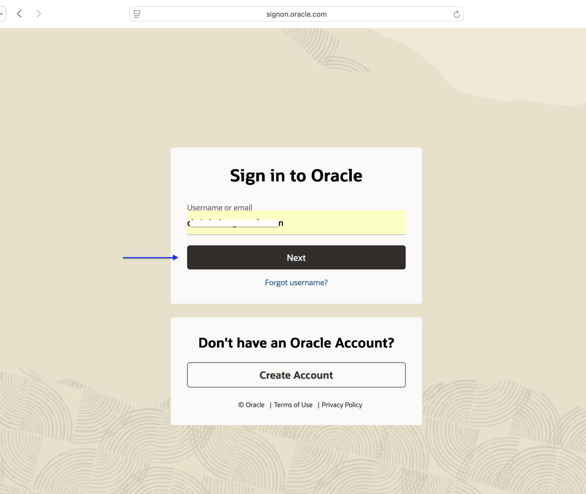
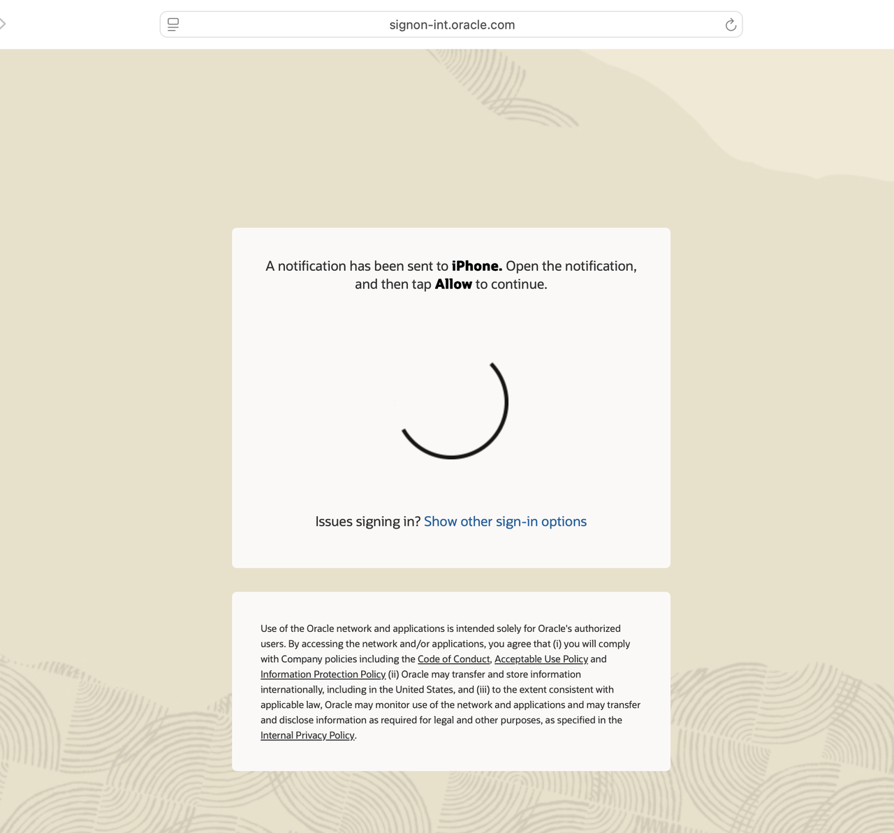
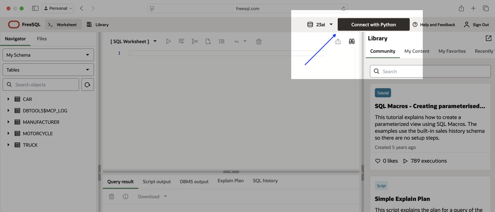
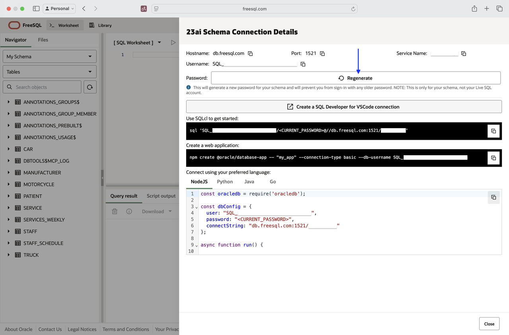
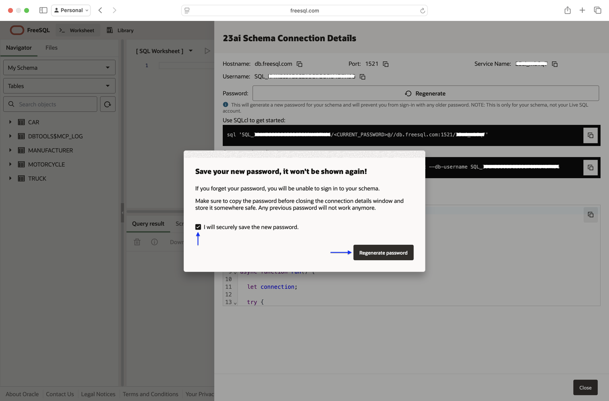
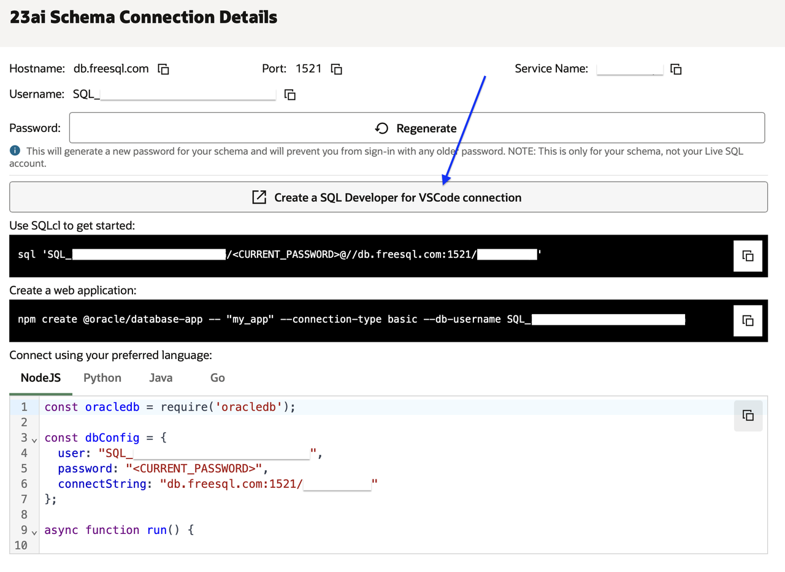
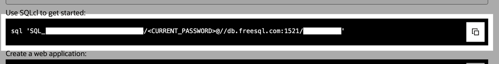

# Connect to your FreeSQL schema from VS Code

## Introduction

Connect your FreeSQL schema to VS Code to write and execute SQL directly against your FreeSQL environment, making it easy to develop, test, and manage queries from within your local workflow.

### Objectives

In this lab, you will:

- Create or sign in to a FreeSQL account
- Retrieve your schema connection details
- Install the Oracle SQL Developer for VS Code extension
- Capture connection information for later use

Estimated Time: 10 minutes

## Task 1: Navigate to FreeSQL.com and sign in or create a new account

<freesql-button>

## Task 2: Log into FreeSQL

Once logged in, click the <strong>Connect with [rotating language option]</strong> button.

## Task 3: Grab your FreeSQL connection details

Your new FreeSQL connection details will appear. Your password will appear only once. Copy the SQLcl connect string for future use. If you need a new password, click <strong>&circlearrowleft; Regenerate</strong>.

## Task 4: Install the SQL Developer VS Code extension

Install the SQL Developer for VS Code extension, found [here](https://marketplace.visualstudio.com/items?itemName=Oracle.sql-developer). Take note of your password, click the <strong>&#8689; Create a SQL Developer for VS Code connection</strong> button, and continue to the next task. Visual Studio Code should open automatically.

## Task 5: Note your FreeSQL connection details for later

If you do not yet have the SQL Developer for VS Code extension installed, note your FreeSQL credentials for later use:

- Username
- Password
- Hostname
- Port
- Service Name

## Acknowledgements

* **Author** – Layla Elwakhi, Oracle
* **Last Updated By** – Layla Elwakhi, March 2026