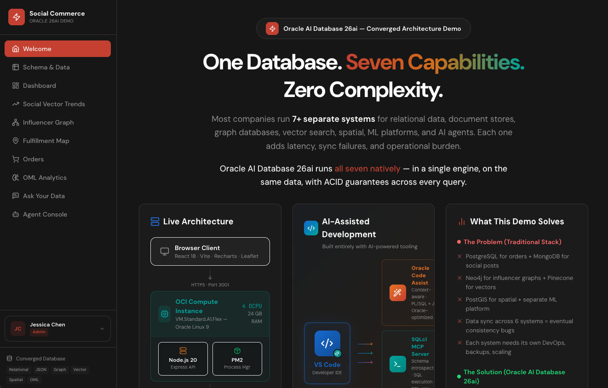
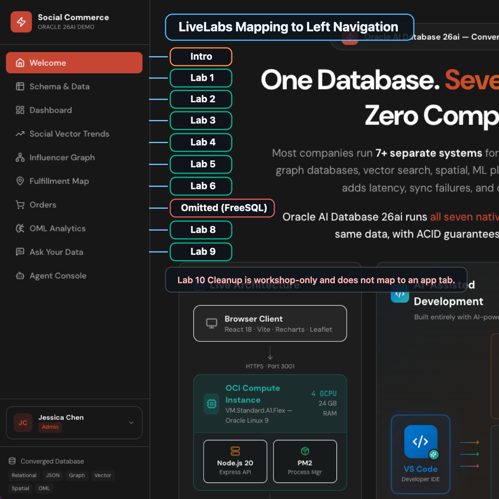

# Build a Social Commerce MVP with Oracle Database and FreeSQL

## Introduction

This workshop maps directly to the TIM app database workflow and uses FreeSQL SQL prompt capabilities only.

Estimated Workshop Time: 88 minutes

### Objectives

In this workshop, you will:
- Create and seed a social-commerce schema used by the application.
- Run KPI, vector, graph-style, spatial, JSON, and agent-audit SQL patterns.
- Practice prompt-compatible SQL workflows that mirror real app operations.

## Walk Through the Application First

Before you start the labs, open the app and click through the left navigation:

`http://152.70.54.67:5500/`

Use this screen capture as a guide:

You can see these flows in action (based on the app source in `frontend/src/pages`):
- **Schema & Data**: interactive table model across relational, JSON, graph, vector, spatial, AI, and security tags.
- **Dashboard**: command-center KPIs for orders, revenue, trends, and operational status.
- **Social Vector Trends**: semantic search and momentum scoring over social/product signals.
- **Influencer Graph**: SQL/PGQ and network-style traversal patterns.
- **Fulfillment Map**: spatial routing, nearest-center logic, and delivery coverage.
- **Orders**: order lifecycle plus JSON duality-style projections.
- **Ask Your Data**: NL-to-SQL flow with generated SQL inspection.
- **Agent Console**: multi-agent actions, tool traces, and audit/event views.

Mapped tab-to-lab version:

### Workshop Labs

1. Lab 1: Schema & Data
2. Lab 2: Dashboard
3. Lab 3: Social Vector Trends
4. Lab 4: Influencer Graph
5. Lab 5: Fulfillment Map
6. Lab 6: Orders
7. Lab 8: Ask Your Data
8. Lab 9: Agent Console
9. Lab 10: Cleanup

> Note: Lab 7 (OML Analytics) is intentionally omitted in this FreeSQL-only MVP path.

## Acknowledgements

* **Author** - Pat Shepherd + Codex
* **Last Updated By/Date** - Codex, April 2026
