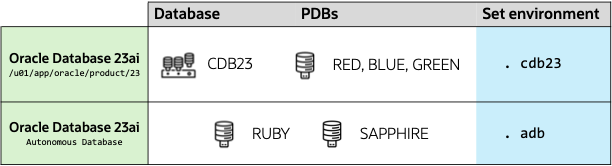

# Introduction

## About this Workshop

An autonomous database (ADB) is a cloud database that uses machine learning to automate database tuning, security, backups, updates, and other routine management tasks traditionally performed by DBAs. Unlike a conventional database, an autonomous database performs all these tasks and more without human intervention.

In this lab, you will learn all the steps to move your current workload to ADB, in a number of ways, and to test its power and flexibility.

Estimated Workshop Time: 2 hours

### Objectives

In this workshop, you will:

* Learn about the ADB architecture
* Check your environment for readiness before you move
* Use Cloud Migration Analyzer to get the recommended move approach
* Check if the latency between your system and ADB is acceptable
* Export data with Data Pump and import into ADB
* Move data using Data Pump with DB Link method
* Monitor, troubleshoot and analyze ADB performance

## About the workshop contents

This workshop comes with pre-installed Oracle homes and pre-created databases. The 2 Autonomous Databases instances are running on *podman* the Autonomous Database Free Container Image.
You can switch between environments using the shortcuts shown in the last column of the diagram below.

## Learn More

* [Webinar, Migration to Oracle Autonomous Database, Parts 1 - 4](https://dohdatabase.com/webinars/)
* [YouTube channel](https://www.youtube.com/@upgradenow/)

## Acknowledgments

* **Author** - Rodrigo Jorge
* **Contributors** - William Beauregard, Daniel Overby Hansen, Mike Dietrich, Klaus Gronau, Alex Zaballa
* **Last Updated By/Date** - Rodrigo Jorge, August 2025
