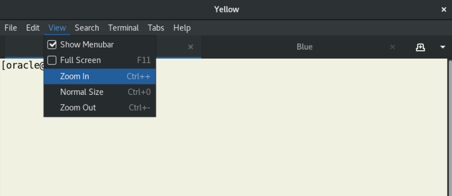

# Initialize Environment

## Introduction

In this lab, you will review and start-up all components required to run this workshop successfully.

Estimated Time: 5 Minutes

### Objectives

In this lab, you will:

* Familiarize yourself with the workshop environment.
* Initialize the workshop environment.

## Task 1: Familiarize yourself with the workshop environment

1. The easiest way to complete the lab is to copy/paste the lab instructions directly into a terminal. Be sure to execute all commands in a code block. After pasting, you must hit *RETURN*.

2. Before copy/pasting, take notice of the commands that you execute; it is important to understand what the commands will do.

3. Double-click on the *Terminal* shortcut on the desktop.

    

4. The terminal has two tabs, *yellow* 🟨 and *blue* 🟦.

5. The instructions will tell you which terminal to use.

6. Optionally, in the terminal, you can zoom in to make the text larger.

    

## Task 2: Initialize the workshop environment

1. When you start the lab, the following components should be started.

    * Database Listener
        * LISTENER
    * Database Server Instances
        * CDB23
        * POD1

2. Use the *yellow* terminal 🟨. Ensure the listeners are started.

    ``` bash
    <copy>
    ps -ef | grep LISTENER | grep -v grep
    </copy>
    ```

    <details>
    <summary>*click to see the output*</summary>

    ``` text
    $ ps -ef | grep LISTENER | grep -v grep
    oracle     25062       1  0 Jun23 ?        00:00:00 /u01/app/oracle/product/23/bin/tnslsnr LISTENER -inherit
    oracle    713114  713054  0 Jun23 ?        00:00:00 /u01/app/oracle/product/23.0.0.0/dbhome_1/bin/tnslsnr LISTENER -inherit
    ```

    </details>

    Please note there are 2 listener. One for the databases in your local host and another for the ADB instances running on the podman container.

3. Ensure that the databases (*POD1* and *CDB23*) are started.

    ``` bash
    <copy>
    ps -ef | grep ora_ | grep pmon | grep -v grep
    </copy>
    ```

    * You might see other databases started as well. It doesn't matter.

    <details>
    <summary>*click to see the output*</summary>

    ``` text
    $ ps -ef | grep ora_ | grep pmon | grep -v grep
    oracle      3851       1  0 20:19 ?        00:00:00 ora_pmon_POD1
    oracle      5345       1  0 20:19 ?        00:00:00 ora_pmon_CDB23
    ```

    </details>

    Note: POD1 is the podman container for the ADB Free Container.

4. If *POD1* or *CDB23* are not running, start them.

    ``` bash
    <copy>
    sudo podman start adb-free
    . cdb23
    sql / as sysdba <<< "startup"
    </copy>

    # Be sure to hit RETURN
    ```

You may now [*proceed to the next lab*](#next).

## Acknowledgments

* **Author** - Rodrigo Jorge
* **Contributors** - William Beauregard, Daniel Overby Hansen, Mike Dietrich, Klaus Gronau, Alex Zaballa
* **Last Updated By/Date** - Rodrigo Jorge, August 2025
