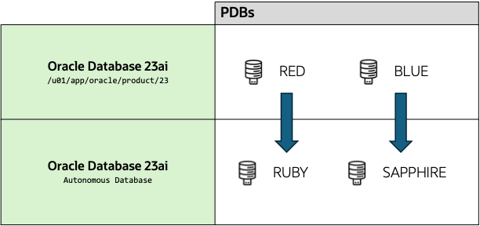

# Migration Strategy

## Introduction

In this lab, you will have a look at the necessary steps to move an Oracle Database running on your local environment to Oracle Autonomous Database (ADB).

Estimated Time: 5 Minutes

### Objectives

In this lab, you will:

* Familiarize yourself with ADB migration steps

### Prerequisites

This lab assumes:

* You have completed Lab 1: Initialize Environment

This is an optional lab. You can skip it if you are already familiar with ADB migration steps.

## Task 1: Understand the Migration Strategy

For moving a database to ADB, we need to perform basically four steps:

1. Checking source database for readiness.

    To evaluate the compatibility of the source database before you migrate to an Oracle database, use the Cloud Premigration Advisor Tool (CPAT).

    The purpose of the Cloud Premigration Advisor Tool (CPAT) is to help plan successful migrations to Oracle Databases in the Oracle Cloud or on-premises. It analyzes the compatibility of the source database with your database target and chosen migration method, and suggests a course of action for potential incompatibilities. CPAT provides you with information to consider for different migration tools.

2. Evaluating the best migration method.

    There are multiple ways of migrating a database. You could ether use Data Pump, database links, Oracle GoldenGate, Database Migration Service or Zero Downtime Migration, to name a few. In this lab, we will check how Oracle Cloud Migration Advisor (CMA) enables you to complete a successful migration to Oracle Autonomous Database.

3. Performing the migration.

    Next, we will move:

    * The *RED* local PDB to *RUBY* running on ADB using Data Pump with database links.
    * The *BLUE* local PDB to *SAPPHIRE* running on ADB using Data Pump with dump files over NFS.

    

    We will explore both options allowing you to evaluate which method would suit your own migration.

4. Post-migration steps.

    After finishing a migration, you will check how to perform some maintainance tasks using the ADB "Database Actions" page.

## Task 2: Test connection on the source PDBs: Blue and Red

1. Use the *yellow* terminal 🟨. Let's connect to the cdb23.

    ``` sql
    <copy>
    . cdb23
    sql / as sysdba
    </copy>

    -- Be sure to hit RETURN
    ```

2. List the PDBS.

    ``` sql
    <copy>
    show pdbs
    </copy>
    ```

    <details>
    <summary>*click to see the output*</summary>

    ``` text
    SQL> show pdbs

        CON_ID CON_NAME                       OPEN MODE  RESTRICTED
    ---------- ------------------------------ ---------- ----------
             2 PDB$SEED                       READ ONLY  NO
             3 RED                            READ WRITE NO
             4 BLUE                           READ WRITE NO
             5 GREEN                          MOUNTED
    ```

    </details>

3. Switch to the *BLUE* PDB and check all the non-internal users already created on the database.

    ``` sql
    <copy>
    alter session set container=BLUE;

    select username
      from dba_users
     where oracle_maintained='N'
       and cloud_maintained='NO'
     order by 1
    /
    </copy>

    -- Be sure to hit RETURN
    ```

    * `ADMIN` is the default PDB_DBA user on a PDB.
    * `BI`, `HR`, `IX`, `PM` and `SH` are sample schemas that we will move later to ADB.

    <details>
    <summary>*click to see the output*</summary>

    ``` text
    USERNAME
    --------------------------------------------------------------------------------
    ADMIN
    BI
    HR
    IX
    PM
    SH
    ```

    </details>

4. Connect now on the *RED* PDB and perform the same query.

    ``` sql
    <copy>
    alter session set container=RED;

    select username
      from dba_users
     where oracle_maintained='N'
       and cloud_maintained='NO'
     order by 1
    /
    </copy>

    -- Be sure to hit RETURN
    ```

    * `ADMIN` is the default PDB_DBA user on a PDB.
    * `F1` is a sample schemas that we will migrate later to ADB.

    <details>
    <summary>*click to see the output*</summary>

    ``` text
    USERNAME
    --------------------------------------------------------------------------------
    ADMIN
    F1
    ```

    </details>

5. Close SQLcl.

    ``` bash
    <copy>
    exit
    </copy>
    ```

## Task 3: Test connection on the target ADBs: Sapphire and Ruby

To connect on the ADB instance, you must use a ADB Wallet, which is already uncompressed and available at */home/oracle/adb\_tls\_wallet*.

1. Now, switch to the *blue* 🟦 terminal. Set the environment to *ADB* and check the contents TNS\_ADMIN folder.

    ``` bash
    <copy>
    . adb

    echo $TNS_ADMIN

    ls -l $TNS_ADMIN

    cat $TNS_ADMIN/tnsnames.ora
    </copy>

    # Be sure to hit RETURN
    ```

    * Note that TNS\_ADMIN was set to `/home/oracle/adb_tls_wallet`.
    * This folder contains the configuration files and keystores required to connect to ADB.
    * Check the connection strings and notice how they differ from a regular connection string. ADB requires secure connections, which is why additional configuration is required.
    * In OCI, you can download a wallet containing these files from the console (web UI) or using an API.

    <details>
    <summary>*click to see the output*</summary>

    ``` text
    $ echo $TNS_ADMIN
    /home/oracle/adb_tls_wallet
    $ ls -l $TNS_ADMIN
    total 48
    -rw-------. 1 oracle oinstall  996 Jun 18 13:49 adb_container.cert
    -rw-------. 1 oracle oinstall 3899 Jun 18 13:49 cwallet.sso
    -rw-------. 1 oracle oinstall    0 Jun 18 13:49 cwallet.sso.lck
    -rw-------. 1 oracle oinstall 3854 Jun 18 13:49 ewallet.p12
    -rw-------. 1 oracle oinstall    0 Jun 18 13:49 ewallet.p12.lck
    -rw-r--r--. 1 oracle oinstall 2874 Jun 18 13:49 ewallet.pem
    -rw-------. 1 oracle oinstall 2045 Jun 18 13:49 keystore.jks
    -rw-r--r--. 1 oracle oinstall  692 Jun 18 13:49 ojdbc.properties
    -rw-r--r--. 1 oracle oinstall   34 Jun 18 13:49 README
    -rw-r--r--. 1 oracle oinstall   98 Jun 18 13:49 sqlnet.ora
    -rw-r--r--. 1 oracle oinstall 5823 Jun 18 14:16 tnsnames.ora
    -rw-r--r--. 1 oracle oinstall 2651 Jun 18 13:57 tnsnames_ruby.ora
    -rw-------. 1 oracle oinstall 2128 Jun 18 13:51 truststore.jks
    $ cat $TNS_ADMIN/tnsnames.ora
    sapphire_medium = (description=(retry_count=0)(retry_delay=3)
                     (address=(protocol=tcps)(port=1523)(host=holserv1.livelabs.oraclevcn.com))
                     (connect_data=(service_name=sapphire_medium.adb.oraclecloud.com))(security=(SSL_SERVER_DN_MATCH=TRUE)    (SSL_SERVER_CERT_DN="CN=93ced68f921a")))

    sapphire_high = (description=(retry_count=0)(retry_delay=3)
                     (address=(protocol=tcps)(port=1523)(host=holserv1.livelabs.oraclevcn.com))
                     (connect_data=(service_name=sapphire_high.adb.oraclecloud.com))(security=(SSL_SERVER_DN_MATCH=TRUE)    (SSL_SERVER_CERT_DN="CN=93ced68f921a")))

    sapphire_low = (description=(retry_count=0)(retry_delay=3)
                     (address=(protocol=tcps)(port=1523)(host=holserv1.livelabs.oraclevcn.com))
                     (connect_data=(service_name=sapphire_low.adb.oraclecloud.com))(security=(SSL_SERVER_DN_MATCH=TRUE)    (SSL_SERVER_CERT_DN="CN=93ced68f921a")))

    sapphire_tp = (description=(retry_count=0)(retry_delay=3)
                (address=(protocol=tcps)(port=1523)(host=holserv1.livelabs.oraclevcn.com))
                (connect_data=(service_name=sapphire_tp.adb.oraclecloud.com))(security=(SSL_SERVER_DN_MATCH=TRUE)    (SSL_SERVER_CERT_DN="CN=93ced68f921a")))

    sapphire_tpurgent = (description=(retry_count=0)(retry_delay=3)
                       (address=(protocol=tcps)(port=1523)(host=holserv1.livelabs.oraclevcn.com))
                       (connect_data=(service_name=sapphire_tpurgent.adb.oraclecloud.com))(security=(SSL_SERVER_DN_MATCH=TRUE)    (SSL_SERVER_CERT_DN="CN=93ced68f921a")))

    sapphire_medium_tls = (description=(retry_count=0)(retry_delay=3)
                        (address=(protocol=tcps)(port=1523)(host=holserv1.livelabs.oraclevcn.com))
                        (connect_data=(service_name=sapphire_medium.adb.oraclecloud.com))(security=(ssl_server_dn_match=no)))

    sapphire_high_tls = (description=(retry_count=0)(retry_delay=3)
                        (address=(protocol=tcps)(port=1523)(host=holserv1.livelabs.oraclevcn.com))
                        (connect_data=(service_name=sapphire_high.adb.oraclecloud.com))(security=(ssl_server_dn_match=no)))

    sapphire_low_tls = (description=(retry_count=0)(retry_delay=3)
                        (address=(protocol=tcps)(port=1523)(host=holserv1.livelabs.oraclevcn.com))
                        (connect_data=(service_name=sapphire_low.adb.oraclecloud.com))(security=(ssl_server_dn_match=no)))

    sapphire_tp_tls = (description=(retry_count=0)(retry_delay=3)
                    (address=(protocol=tcps)(port=1523)(host=holserv1.livelabs.oraclevcn.com))
                    (connect_data=(service_name=sapphire_tp.adb.oraclecloud.com))(security=(ssl_server_dn_match=no)))

    sapphire_tpurgent_tls = (description=(retry_count=0)(retry_delay=3)
                          (address=(protocol=tcps)(port=1523)(host=holserv1.livelabs.oraclevcn.com))
                          (connect_data=(service_name=sapphire_tpurgent.adb.oraclecloud.com))(security=(ssl_server_dn_match=no)))

    ruby_medium = (description=(retry_count=0)(retry_delay=3)
                     (address=(protocol=tcps)(port=1523)(host=holserv1.livelabs.oraclevcn.com))
                     (connect_data=(service_name=ruby_medium.adb.oraclecloud.com))(security=(SSL_SERVER_DN_MATCH=TRUE)    (SSL_SERVER_CERT_DN="CN=93ced68f921a")))

    ruby_high = (description=(retry_count=0)(retry_delay=3)
                     (address=(protocol=tcps)(port=1523)(host=holserv1.livelabs.oraclevcn.com))
                     (connect_data=(service_name=ruby_high.adb.oraclecloud.com))(security=(SSL_SERVER_DN_MATCH=TRUE)    (SSL_SERVER_CERT_DN="CN=93ced68f921a")))

    ruby_low = (description=(retry_count=0)(retry_delay=3)
                     (address=(protocol=tcps)(port=1523)(host=holserv1.livelabs.oraclevcn.com))
                     (connect_data=(service_name=ruby_low.adb.oraclecloud.com))(security=(SSL_SERVER_DN_MATCH=TRUE)    (SSL_SERVER_CERT_DN="CN=93ced68f921a")))

    ruby_tp = (description=(retry_count=0)(retry_delay=3)
                (address=(protocol=tcps)(port=1523)(host=holserv1.livelabs.oraclevcn.com))
                (connect_data=(service_name=ruby_tp.adb.oraclecloud.com))(security=(SSL_SERVER_DN_MATCH=TRUE)    (SSL_SERVER_CERT_DN="CN=93ced68f921a")))

    ruby_tpurgent = (description=(retry_count=0)(retry_delay=3)
                       (address=(protocol=tcps)(port=1523)(host=holserv1.livelabs.oraclevcn.com))
                       (connect_data=(service_name=ruby_tpurgent.adb.oraclecloud.com))(security=(SSL_SERVER_DN_MATCH=TRUE)    (SSL_SERVER_CERT_DN="CN=93ced68f921a")))

    ruby_medium_tls = (description=(retry_count=0)(retry_delay=3)
                        (address=(protocol=tcps)(port=1523)(host=holserv1.livelabs.oraclevcn.com))
                        (connect_data=(service_name=ruby_medium.adb.oraclecloud.com))(security=(ssl_server_dn_match=no)))

    ruby_high_tls = (description=(retry_count=0)(retry_delay=3)
                        (address=(protocol=tcps)(port=1523)(host=holserv1.livelabs.oraclevcn.com))
                        (connect_data=(service_name=ruby_high.adb.oraclecloud.com))(security=(ssl_server_dn_match=no)))

    ruby_low_tls = (description=(retry_count=0)(retry_delay=3)
                        (address=(protocol=tcps)(port=1523)(host=holserv1.livelabs.oraclevcn.com))
                        (connect_data=(service_name=ruby_low.adb.oraclecloud.com))(security=(ssl_server_dn_match=no)))

    ruby_tp_tls = (description=(retry_count=0)(retry_delay=3)
                    (address=(protocol=tcps)(port=1523)(host=holserv1.livelabs.oraclevcn.com))
                    (connect_data=(service_name=ruby_tp.adb.oraclecloud.com))(security=(ssl_server_dn_match=no)))

    ruby_tpurgent_tls = (description=(retry_count=0)(retry_delay=3)
                          (address=(protocol=tcps)(port=1523)(host=holserv1.livelabs.oraclevcn.com))
                          (connect_data=(service_name=ruby_tpurgent.adb.oraclecloud.com))(security=(ssl_server_dn_match=no)))
    ```

    </details>

2. Connect to the *SAPPHIRE* ADB.

    ``` sql
    <copy>
    . adb
    sql admin/Welcome_1234@sapphire_tp
    </copy>

    -- Be sure to hit RETURN
    ```

3. Check all the non-internal users already created in the database.

    ``` sql
    <copy>
    select username
      from dba_users
     where oracle_maintained='N'
       and cloud_maintained='NO'
     order by 1
    /
    </copy>
    ```

    * `ADMIN` is the default DBA user on ADB.
    * `CMA` is the schema where CMA tool was deployed.
    * `MPACK_OEE` is a pre-created schema available in ADB Free Container with the Estate Explorer tool. This tool can help you get an enterprise-wide overview of your Oracle Databases and determine the best candidates for ADB migration. This tool is out-of-scope of this lab.
    * `ORDS_PLSQL_GATEWAY2` and `ORDS_PUBLIC_USER2` are schemas created to handle ORDS access.

    <details>
    <summary>*click to see the output*</summary>

    ``` text
    USERNAME
    --------------------------------------------------------------------------------
    ADMIN
    CMA
    MPACK_OEE
    ORDS_PLSQL_GATEWAY2
    ORDS_PUBLIC_USER2
    ```

    </details>

4. Connect now on the *RUBY* ADB and perform the same query.

    ``` sql
    <copy>
    connect admin/Welcome_1234@ruby_tp

    select username
      from dba_users
     where oracle_maintained='N'
       and cloud_maintained='NO'
     order by 1
    /
    </copy>

    -- Be sure to hit RETURN
    ```

    * The output is the very similar, but CMA tool was only deployed on the *SAPPHIRE* ADB.

    <details>
    <summary>*click to see the output*</summary>

    ``` text
    USERNAME
    --------------------------------------------------------------------------------
    ADMIN
    MPACK_OEE
    ORDS_PLSQL_GATEWAY2
    ORDS_PUBLIC_USER2
    ```

    </details>

5. Close SQLcl.

    ``` bash
    <copy>
    exit
    </copy>
    ```

You may now [*proceed to the next lab*](#next).

## Acknowledgments

* **Author** - Rodrigo Jorge
* **Contributors** - William Beauregard, Daniel Overby Hansen, Mike Dietrich, Klaus Gronau, Alex Zaballa
* **Last Updated By/Date** - Rodrigo Jorge, August 2025
