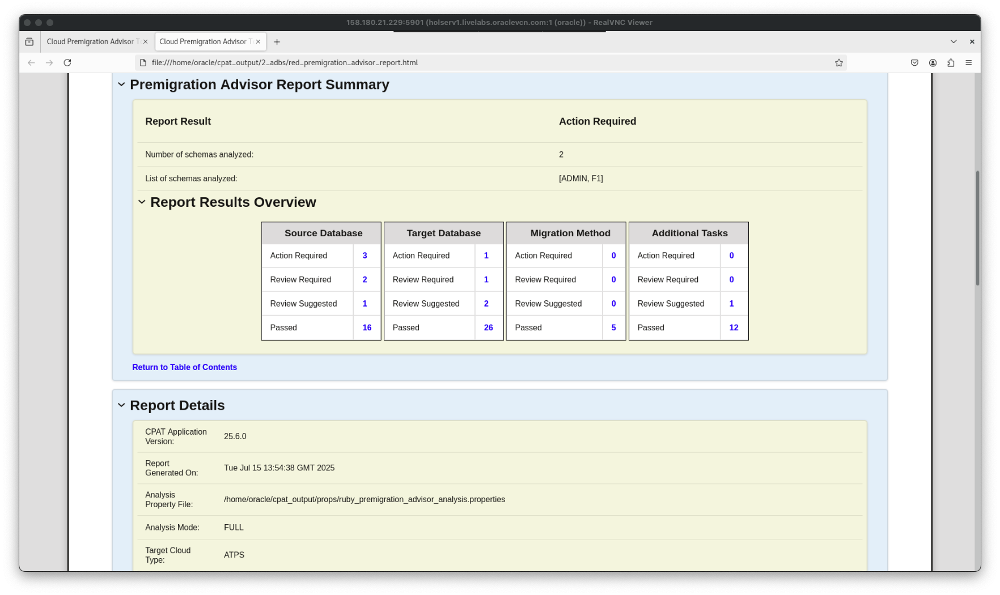

# Getting Started

## Introduction

In this lab, you will evaluate an Oracle Database for compatibility with Autonomous Database, using Cloud Premigration Advisor Tool (CPAT).

Estimated Time: 10 Minutes

### Objectives

In this lab, you will:

* Understand how CPAT works
* Where to download and unzip CPAT
* Start CPAT
* Open and check report

### Prerequisites

This lab assumes:

* You have completed Lab 1: Initialize Environment

## Task 1: Download CPAT

CPAT tool is available in *My Oracle Support*, on [Doc ID 2758371.1](https://support.oracle.com/epmos/faces/DocContentDisplay?id=2758371.1).


The tool has already been downloaded and is available at `/home/oracle/scripts`.

1. Use the *yellow* terminal 🟨. Unzip CPAT file.

    ``` bash
    <copy>
    mkdir -p /home/oracle/cpat

    unzip /home/oracle/scripts/p32613591_112048_Generic.zip -d /home/oracle/cpat

    ls -l /home/oracle/cpat
    </copy>

    # Be sure to hit RETURN
    ```

    <details>
    <summary>*click to see the output*</summary>

    ``` text
    $ mkdir -p /home/oracle/cpat
    $ unzip /home/oracle/scripts/p32613591_112048_Generic.zip -d /home/oracle/cpat
    Archive:  /home/oracle/scripts/p32613591_112048_Generic.zip
      inflating: /home/oracle/cpat/README.txt
      inflating: /home/oracle/cpat/LICENSE.txt
      inflating: /home/oracle/cpat/THIRD_PARTY_LICENSES.txt
       creating: /home/oracle/cpat/bin/
      inflating: /home/oracle/cpat/bin/cma.cmd
      inflating: /home/oracle/cpat/bin/cma.sh
      inflating: /home/oracle/cpat/bin/premigration.ps1
      inflating: /home/oracle/cpat/premigration.cmd
      inflating: /home/oracle/cpat/premigration.sh
       creating: /home/oracle/cpat/lib/
      inflating: /home/oracle/cpat/lib/premigration.jar
      inflating: /home/oracle/cpat/lib/ojdbc8-19.3.0.0.jar
      inflating: /home/oracle/cpat/lib/ucp-19.3.0.0.jar
      inflating: /home/oracle/cpat/lib/oraclepki-19.3.0.0.jar
      inflating: /home/oracle/cpat/lib/oraclepki-23.5.0.24.07.jar
      inflating: /home/oracle/cpat/lib/osdt_core-19.3.0.0.jar
      inflating: /home/oracle/cpat/lib/osdt_cert-19.3.0.0.jar
      inflating: /home/oracle/cpat/lib/orai18n-19.3.0.0.jar
      inflating: /home/oracle/cpat/lib/ons-19.3.0.0.jar
      inflating: /home/oracle/cpat/lib/simplefan-19.3.0.0.jar
      inflating: /home/oracle/cpat/lib/commons-cli-1.9.0.jar
       creating: /home/oracle/cpat/misc/
      inflating: /home/oracle/cpat/misc/CPATReportSchema.json
    $ ls -l /home/oracle/cpat
    total 48
    drwxr-xr-x. 2 oracle oinstall    59 Jun 17 00:45 bin
    drwxr-xr-x. 2 oracle oinstall  4096 Jun 17 00:45 lib
    -rw-r--r--. 1 oracle oinstall  6069 Jun 17 00:45 LICENSE.txt
    drwxr-xr-x. 2 oracle oinstall    35 Jun 17 00:45 misc
    -rw-r--r--. 1 oracle oinstall   139 Jun 17 00:45 premigration.cmd
    -rwxr-xr-x. 1 oracle oinstall 10519 Jun 17 00:45 premigration.sh
    -rw-r--r--. 1 oracle oinstall  7619 Jun 17 00:45 README.txt
    -rw-r--r--. 1 oracle oinstall 11533 Jun 17 00:45 THIRD_PARTY_LICENSES.txt
    ```

    </details>

## Task 2: Generate and open a generic CPAT report

CPAT can evaluate multiple different migration methods, like GoldenGate and Data Pump, and also to multiple different targets, like ADB Serverless, ADB Dedicated, Exadata, and others. In this task, we will generate a generic CPAT report that will show all checks and issues related to every possible combination of migration method and target type.

1. Generate a CPAT report for PDBs *BLUE* and *RED*.

    ``` bash
    <copy>
    . cdb23

    ~/cpat/premigration.sh \
       --connectstring jdbc:oracle:oci:@ --sysdba \
       --targetcloud ALL \
       --migrationmethod ALL \
       --reportformat JSON HTML TEXT \
       --outdir ~/cpat_output/1_generic/
    </copy>

    # Be sure to hit RETURN
    ```

    * *--connectstring jdbc:oracle:oci:@ --sysdba* is used for OS Authentication.
      * It will connect to *CDB23* as set by the environment.
      * It will run CPAT for all opened PDBs: *BLUE* and *RED*.
    * *--targetcloud ALL* is used to run checks against all possible targets, like ATP, ADW and Exadata.
    * *--migrationmethod ALL* is used to run checks for all possible migration methods.
    * *--reportformat JSON HTML TEXT* is used to generate report in HTML, JSON and TEXT.
    * *--outdir ~/cpat\_output/1\_generic/* is the target output folder.
    * To get all the possible parameter options for CPAT, run *~/cpat/premigration.sh -help*.

    <details>
    <summary>*click to see the output*</summary>

    ``` text
    $ ~/cpat/premigration.sh \
    >   --connectstring jdbc:oracle:oci:@ --sysdba \
    >   --targetcloud ALL \
    >   --migrationmethod ALL \
    >   --reportformat JSON HTML TEXT \
    >   --outdir ~/cpat_output/1_generic/
    CPAT-1018: Informational: The amount of memory available to CPAT is 3926 MB. Oracle recommends running CPAT using a 64-bit JVM on a system with at least 8 GB of memory.
    Increase the memory by setting _JAVA_OPTIONS=-Xmx4g or higher if additional memory is available.

    Cloud Premigration Advisor Tool Version 25.6.0
    CPAT-1013: Informational: No analysis properties file found on the command line. Source analysis will not be as complete as possible.
    See the help text for information on using an analysis properties file.

    Analyzing 2 PDBs from CDB$ROOT
    Completed 0 of 2 PDB analysis tasks as of Jun 27, 2025, 1:35:53 AM.  There are 2 PDB analysis tasks currently running.
    Completed 0 of 2 PDB analysis tasks as of Jun 27, 2025, 1:36:03 AM.  There are 2 PDB analysis tasks currently running.
    Completed 2 of 2 PDB analysis tasks as of Jun 27, 2025, 1:36:13 AM.  There are 0 PDB analysis tasks currently running.
    Cloud Premigration Advisor Tool generated report location: /home/oracle/cpat_output/1_generic/premigration_advisor_summary_report.json
    Cloud Premigration Advisor Tool generated report location: /home/oracle/cpat_output/1_generic/premigration_advisor_summary_report.html
    Cloud Premigration Advisor Tool generated report location: /home/oracle/cpat_output/1_generic/premigration_advisor_summary_report.txt
    ```

    </details>

2. Check the generated report files.

    ``` bash
    <copy>
    ls -l ~/cpat_output/1_generic/
    </copy>
    ```

    * Note that the output folder contains 3 different file types: JSON, TEXT and HTML.
      * The JSON file will be later consumed by CMA in the next lab.
      * The TEXT file can be read in a terminal.
      * The HTML file can be opened in a browser.
    * Only the *BLUE* and *RED* PDBs were checked. As *GREEN* PDB was closed, it was skipped.

    <details>
    <summary>*click to see the output*</summary>

    ``` text
    $ ls -l ~/cpat_output/1_generic/
    total 40
    drwxr-xr-x. 2 oracle oinstall   177 Jun 27 12:44 BLUE
    -rw-r--r--. 1 oracle oinstall 10684 Jun 27 12:44 premigration_advisor_summary.log
    -rw-r--r--. 1 oracle oinstall 17072 Jun 27 12:44 premigration_advisor_summary_report.html
    -rw-r--r--. 1 oracle oinstall  1289 Jun 27 12:44 premigration_advisor_summary_report.json
    -rw-r--r--. 1 oracle oinstall  2185 Jun 27 12:44 premigration_advisor_summary_report.txt
    drwxr-xr-x. 2 oracle oinstall   173 Jun 27 12:44 RED
    ```

    </details>

3. Open and explore the text-based summary.

    ``` bash
    <copy>
    cat ~/cpat_output/1_generic/premigration_advisor_summary_report.txt
    </copy>
    ```

    * There is a summary for each PDB.
    * The summary contains the overall status and links to a detailed report in multiple formats.

    <details>
    <summary>*click to see the output*</summary>

    ``` text
    ====================================================================================================================================
    Cloud Premigration Advisor Tool (CPAT) Report
    ====================================================================================================================================

    Report Details
    --------------
      CPAT Application Version: 25.6.0
      Report Generated On:      2025-08-04T06:55:15Z
      OPEN PDBs:                BLUE, RED
      CLOSED PDBs:              GREEN

    ------------------------------------------------------------------------------------------------------------------------------------
    List of PDB Analysis Summaries
    ------------------------------------------------------------------------------------------------------------------------------------

    PDB Analysis Summary
    --------------------
      PDB Name:              BLUE
      Overall Report Result: Action Required
      Analysis Duration:     00:00:10.000
      Output File Base Path: /home/oracle/cpat_output/1_generic
      Analysis Log File:     BLUE/BLUE_premigration_advisor.log
      CPAT Report File(s)
        JSON:                BLUE/BLUE_premigration_advisor_report.json
        HTML:                BLUE/BLUE_premigration_advisor_report.html
        TEXT:                BLUE/BLUE_premigration_advisor_report.txt
    ------------------------------------------------------------------------------------------------------------------------------------

    PDB Analysis Summary
    --------------------
      PDB Name:              RED
      Overall Report Result: Action Required
      Analysis Duration:     00:00:10.000
      Output File Base Path: /home/oracle/cpat_output/1_generic
      Analysis Log File:     RED/RED_premigration_advisor.log
      CPAT Report File(s)
        JSON:                RED/RED_premigration_advisor_report.json
        HTML:                RED/RED_premigration_advisor_report.html
        TEXT:                RED/RED_premigration_advisor_report.txt
    ------------------------------------------------------------------------------------------------------------------------------------
    ====================================================================================================================================
    ```

    </details>

4. Take a look at the text report for the *RED* PDB.

    ``` bash
    <copy>
    ls -1 ~/cpat_output/1_generic/RED/

    head -n 100 ~/cpat_output/1_generic/RED/RED_premigration_advisor_report.txt
    </copy>

    # Be sure to hit RETURN
    ```

    * You're seeing only the first 100 lines.
    * Examine the output.

    <details>
    <summary>*click to see the output*</summary>

    ``` text
    ====================================================================================================================================
    Cloud Premigration Advisor Tool (CPAT) Report
    ====================================================================================================================================

    Report Details
    --------------
      Analysis Mode:            FULL
      CPAT Application Version: 25.6.0
      CPAT Checks Version:      25.6.0
      Target Cloud Type:        ALL
      Migration Method(s):      DATAPUMP, DATAPUMP_DBLINK, GOLDENGATE
      Report Generated On:      2025-08-04T06:55:16Z
      Report Result:            Action Required

    Database Details
    --------------
      Source Database Applications:                                             No Known Applications Detected
      Source Cloud Vendor:                                                      Oracle Cloud Infrastructure (Database)
      Source Database Container Name:                                           RED
      Source Database Host Name:                                                holserv1.livelabs.oraclevcn.com
      Source Instance Name:                                                     CDB23
      Source Database Name:                                                     CDB23
      Source Database Platform ID:                                              13
      Source Database Port String:                                              x86_64/Linux 2.4.xx
      Source Oracle SID:                                                        CDB23
      Source DB Block Size in KB:                                               8
      Source DB Combined Size of DATA, TEMP, LOG, and CONTROL File Usage in GB: 2.223
      Source DB Size of DATA File Usage in GB:                                  1.588
      Source DB Size of TEMP File Usage in GB:                                  0.031
      Source DB Size of LOG File Usage in GB:                                   0.586
      Source DB Size of CONTROL File Usage in GB:                               0.018
      Source Database Username:                                                 SYS

    Report Analysis Notes
    ---------------------
      Note # Note Info
      ------ ---------------------------------------------------------------------------------------------------------------------------
      1      CAUSE: Informational: No analysis properties file found on the command line. Source analysis will not be as complete
             as possible.
             ACTION: See the help text for information on using an analysis properties file.
      2      CAUSE: Informational: This report was generated by CPAT running in FULL mode thus INSTANCE scoped checks were executed and
             SCHEMA_ONLY scoped checks were not.
             ACTION: If SCHEMA mode was intended then use --schemas and omit the --full option.  See Oracle Support Document
             ID 2758371.1 for more information about CPAT analysis 'mode' and check 'scopes'.
      3      Passed: In rare cases there may be users who have objects being migrated but those users do not have any associated quota
             (or the UNLIMTED TABLESPACE privilege). Such objects will fail to be created on the target instance. Oracle
             recommends running the following query to verify whether such objects exist. The query may take a significant amount
             of time, which, along with the rarity of such objects, is why CPAT does not run the query automatically:   WITH TS AS
             (SELECT USERNAME,TABLESPACE_NAME,MAX_BYTES FROM DBA_TS_QUOTAS q1 WHERE USERNAME IN ('SYS','SYSTEM') UNION SELECT
             DISTINCT OWNER USERNAME,TABLESPACE_NAME, NULL MAX_BYTES FROM DBA_SEGMENTS s WHERE OWNER IN ('SYS','SYSTEM')
             AND TABLESPACE_NAME NOT IN ('SYSTEM','SYSAUX') AND NOT EXISTS (SELECT 1 FROM DBA_TS_QUOTAS q2 WHERE q2.USERNAME =
             s.OWNER AND q2.TABLESPACE_NAME=s.TABLESPACE_NAME)) SELECT u.USERNAME, DECODE(p.PRIVILEGE,'UNLIMITED
             TABLESPACE','YES','NO') UNLIMITED_TABLESPACE, q.TABLESPACE_NAME, DECODE(q.MAX_BYTES,-1,'UNLIMITED',q.MAX_BYTES) MAX_BYTES,
             NVL(DECODE(p.PRIVILEGE,'UNLIMITED TABLESPACE','NO',DECODE(q.MAX_BYTES,-1,'NO')),'YES') ANALYZE_SEG_SIZE FROM DBA_USERS u
             ,DBA_SYS_PRIVS p , TS q WHERE u.USERNAME IN ('SYS','SYSTEM') AND u.USERNAME <>'PDB_ADMIN' AND EXISTS(SELECT 1
             FROM DBA_SEGMENTS s WHERE s.OWNER=u.USERNAME AND ROWNUM=1) AND p.GRANTEE(+)=u.USERNAME AND p.PRIVILEGE(+) =
             'UNLIMITED TABLESPACE' AND q.USERNAME(+)=u.USERNAME AND NVL(DECODE(p.privilege, 'UNLIMITED TABLESPACE', 'NO',
             DECODE(q.max_bytes, -1, 'NO')),'YES' ) = 'YES' ORDER BY USERNAME, TABLESPACE_NAME;

    Source Database Version Information
    -----------------------------------
      PRODUCT                                  VERSION    VERSION_FULL STATUS
      ---------------------------------------- ---------- ------------ ---------------------------------------
      Oracle Database 23ai Enterprise Edition  23.0.0.0.0 23.9.0.25.07 for Oracle Cloud and Engineered Systems
      Source Database Compatible Version: 23.0.0
      Source Database Version:            23.9.0.25.07

    Source Database Patch Information
    ---------------------------------
      COMMENTS                                                          SOURCE_VERSION TARGET_VERSION ACTION     ACTION_TIME
      ----------------------------------------------------------------- -------------- -------------- ---------- --------------------
      RDBMS_23.9.0.25.07DBRU_LINUX.X64_250416                           23                            BOOTSTRAP
      ca1d019aff30b2db3fdfd55985a5968e|AC94252451E296090CF0DA55B54EDD60 23                            BOOTSTRAP
      395f6924a8636b0c79d567b200887def|EC8FDCD4372C30FB3659559AD3155574 23                            BOOTSTRAP
      cc33d7b58f7f4efa82f56bcd4e4cc655|CFE1C0F9D24EFBEAA05917AD4A3957B9 23                            BOOTSTRAP
      e0b85a0176a706b50918f5ba985f7bde|40E31CE3CE567D947FFFBE286C3BA439 23                            BOOTSTRAP
      Installed RU 23.9.0.25.07                                         23.9.0.25.07                  RU_INSTALL 03-MAY-2025 09:22:24
      DATAPUMP BUNDLE PATCH 23.9.0.25.07                                23.9.0.25.07   23.9.0.25.07   APPLY      03-MAY-2025 09:21:36
      Database Release Update : 23.9.0.25.07 (37701421) Gold Image      23.9.0.25.07   23.9.0.25.07   APPLY      03-MAY-2025 09:22:24

    ------------------------------------------------------------------------------------------------------------------------------------
    Premigration Advisor Report Check Summary
    ------------------------------------------------------------------------------------------------------------------------------------
      Number of checks run:           A total of 87 checks were performed
      Number of schemas analyzed:     2
      Number of schemas in source DB: 27
      List of schemas analyzed:       ADMIN, F1
      Fatal Checks:                   There were 0 checks with Failed results
      Action Required Checks:         There were 5 checks with Action Required results: has_data_in_other_tablespaces_dedicated
                                      (33 relevant objects), has_users_lack_create_privileges (19 relevant objects),
                                      gg_enabled_replication (1 relevant objects), gg_supplemental_log_data_min (1 relevant objects),
                                      has_role_privileges (1 relevant objects)
      Review Required Checks:         There were 6 checks with Review Required results: has_directories (12 relevant objects),
                                      gg_has_low_streams_pool_size (4 relevant objects), timezone_table_compatibility_higher_dedicated
                                      (1 relevant objects), timezone_table_compatibility_higher_serverless (1 relevant objects),
                                      timezone_table_compatibility_higher_default (1 relevant objects), gg_force_logging (1
                                      relevant objects)
      Review Suggested Checks:        There were 7 checks with Review Suggested results: has_enabled_scheduler_jobs (12 relevant
                                      objects), modified_db_parameters_dedicated (3 relevant objects),
                                      modified_db_parameters_serverless (3 relevant objects), has_default_tablespace_not_data
    ```

    </details>

5. A text-based report might be hard to read. The HTML report gives a much better overview.

    ``` bash
    <copy>
    ls -1 ~/cpat_output/1_generic/

    find ~/cpat_output/1_generic/ -name "*.html" | xargs sed -i -E 's|https://[^ ]+\.com/|https://objectstorage.eu-frankfurt-1.oraclecloud.com/n/oradbclouducm/b/oracle-jet/o/|g'

    firefox ~/cpat_output/1_generic/premigration_advisor_summary_report.html &
    </copy>

    # Be sure to hit RETURN
    ```

    * The *sed* command is used as a workaround since the Oracle JET JavaScript files required for handling CPAT HTML output are not accessible from this lab.

    

    * This is a summary page with information about execution on all the PDBs.
    * Note that only the *BLUE* and *RED* PDBs were checked. As *GREEN* PDB was closed, it was skipped.

6. Click and expand the "> BLUE - Action Required" option. Open the HTML Report *BLUE/BLUE\_premigratrion\_advisor\_report.html*.

    

    * Note that for each different category (source database, target database, migration method and additional tasks), we have total checks and their results.

7. Go to "Premigration Advisor Check Details List". Navigate though the report.

    

    * Note that some of the checks that have "Action Required" are related to GoldenGate, which is not the migration method we will use on this lab.
    * Also, there are some false positive results related to "Timezone Version" under "Additional Tasks". This is because CPAT has no information about the target ADB.

8. Close Firefox.

9. The report you just created were a generic report because you didn't specify a target. CPAT had to list all possible issues. In the next task, you will specify a target which enables CPAT to list only issues related to that target type.

## Task 3: Collect target info to reduce CPAT warnings

In this lab, we will be moving:

* *BLUE* PDB to *SAPPHIRE* ADB.
* *RED* PDB to *RUBY* ADB.

Knowing the target type enables you to create a much more specific report.

1. Use the *yellow* terminal 🟨. Use CPAT to collect information about the target database. Run it for the *SAPPHIRE* ADB.

    ``` bash
    <copy>
    . adb

    ~/cpat/premigration.sh \
       --connectstring jdbc:oracle:thin:@sapphire_tp?TNS_ADMIN=$TNS_ADMIN \
       --username ADMIN \
       --gettargetprops \
       --outdir ~/cpat_output/props/ \
       --outfileprefix sapphire <<< 'Welcome_1234'
    </copy>

    # Be sure to hit RETURN
    ```

    * *connectstring* points to the ADB using the ADB wallet.
    * *gettargetprops* instructs CPAT to connect and examine the target database.
    * CPAT stores the information in the directory specified by *outdir*.
    * CPAT can use the property files when examining the source database later on.
    * The ADMIN password *Welcome_1234* is provided as "Here Strings".

    <details>
    <summary>*click to see the output*</summary>

    ``` text
    $ ~/cpat/premigration.sh \
    >   --connectstring jdbc:oracle:thin:@sapphire_tp?TNS_ADMIN=$TNS_ADMIN \
    >   --username ADMIN \
    >   --gettargetprops \
    >   --outdir ~/cpat_output/props/ \
    >   --outfileprefix sapphire <<< 'Welcome_1234'
    Enter password for ADMIN user:
    CPAT-1018: Informational: The amount of memory available to CPAT is 3926 MB. Oracle recommends running CPAT using a 64-bit JVM on a system with at least 8 GB of memory.
    Increase the memory by setting _JAVA_OPTIONS=-Xmx4g or higher if additional memory is available.

    Cloud Premigration Advisor Tool Version 25.6.0
    Cloud Premigration Advisor Tool generated properties file location: /home/oracle/cpat_output/props/sapphire_premigration_advisor_analysis.properties
    ```

    </details>

2. Next, run for the *RUBY* ADB.

    ``` bash
    <copy>
    . adb

    ~/cpat/premigration.sh \
       --connectstring jdbc:oracle:thin:@ruby_tp?TNS_ADMIN=$TNS_ADMIN \
       --username ADMIN \
       --gettargetprops \
       --outdir ~/cpat_output/props/ \
       --outfileprefix ruby <<< 'Welcome_1234'
    </copy>

    # Be sure to hit RETURN
    ```

    * The ADMIN password *Welcome_1234* is provided as "Here Strings".

    <details>
    <summary>*click to see the output*</summary>

    ``` text
    $ ~/cpat/premigration.sh \
    >   --connectstring jdbc:oracle:thin:@ruby_tp?TNS_ADMIN=$TNS_ADMIN \
    >   --username ADMIN \
    >   --gettargetprops \
    >   --outdir ~/cpat_output/props/ \
    >   --outfileprefix ruby <<< 'Welcome_1234'
    Enter password for ADMIN user:
    CPAT-1018: Informational: The amount of memory available to CPAT is 3926 MB. Oracle recommends running CPAT using a 64-bit JVM on a system with at least 8 GB of memory.
    Increase the memory by setting _JAVA_OPTIONS=-Xmx4g or higher if additional memory is available.

    Cloud Premigration Advisor Tool Version 25.6.0
    Cloud Premigration Advisor Tool generated properties file location: /home/oracle/cpat_output/props/ruby_premigration_advisor_analysis.properties
    ```

    </details>

3. Verify the generated property files.

    ``` bash
    <copy>
    ls -l ~/cpat_output/props/
    </copy>
    ```

    * Notice the *.properties* files.

    <details>
    <summary>*click to see the output*</summary>

    ``` text
    $ ls -l ~/cpat_output/props/
    -rw-r--r--. 1 oracle oinstall   8326 Jun 27 13:26 ruby_premigration_advisor_analysis.properties
    -rw-r--r--. 1 oracle oinstall   7098 Jun 27 13:26 ruby_premigration_advisor.log
    -rw-r--r--. 1 oracle oinstall   8326 Jun 27 13:26 sapphire_premigration_advisor_analysis.properties
    -rw-r--r--. 1 oracle oinstall   7110 Jun 27 13:26 sapphire_premigration_advisor.log
    ```

    </details>

4. Check the contents of the *RUBY* properties file.

    ``` bash
    <copy>
    cat ~/cpat_output/props/ruby_premigration_advisor_analysis.properties
    </copy>
    ```

    * This is a key-value format text file.
    * This is information about the target ADB, *RUBY*.
    * Examine the output.

    <details>
    <summary>*click to see the output*</summary>

    ``` text
    #Created by CPAT version 25.6.0
    #Fri Jun 27 13:26:17 GMT 2025
    TargetInstanceProp.NLS_CHARACTERSET=AL32UTF8
    TargetInstanceProp.TABLESPACE_BLOCK_SIZE.TEMP=8192
    TargetInstanceProp.TABLESPACE_BLOCK_SIZE.DBFS_DATA=8192
    TargetInstanceProp.PDB_LOCKDOWN=OLTP
    SourceAnalysisProp.ADDITIONAL_EXCLUDED_SCHEMAS=SYS,APEX_PUBLIC_ROUTER,OML$MODELS,ORDS_PLSQL_GATEWAY,OMLMOD$PROXY,SYSRAC,GRAPH$METADATA,ORDS_PUBLIC_USER,GRAPH$PROXY_USER,SYSTEM,XS$NULL,LBACSYS,OUTLN,DBSNMP,APPQOSSYS,C\#\#CLOUD$SERVICE,VECSYS,DBSFWUSER,C\#\#ADP$SERVICE,GGSYS,FLOWS_FILES,CTXSYS,ORDS_METADATA,C\#\#OMLIDM,AUDSYS,GSMADMIN_INTERNAL,GGSHAREDCAP,MDSYS,XDB,APEX_240200,GSMCATUSER,C\#\#CLOUD_OPS,C\#\#DNSREST,MDDATA,REMOTE_SCHEDULER_AGENT,C\#\#API,SYSBACKUP,GSMUSER,C\#\#RFS,C\#\#QUEUE$SERVICE,C\#\#DATA$SHARE,MTSSYS,LBAC_TRIGGER,DVF,DVSYS,DIP,DGPDB_INT,SYSKM,SYS$UMF,C\#\#DV_ACCT_ADMIN,C\#\#DV_OWNER,SYSDG
    TargetInstanceProp.DB_PLATFORM_ID=13
    TargetInstanceProp.DIRECTORIES=DATA_PUMP_DIR,JAVA$JOX$CUJS$DIRECTORY$,OPATCH_INST_DIR,OPATCH_LOG_DIR,OPATCH_SCRIPT_DIR,ORACLE_BASE,ORACLE_HOME,SDO_DIR_ADMIN,SQL_TCB_DIR
    TargetInstanceProp.ROLEPRIVILEGE=ACCHK_READ,ADB_MONITOR,ADM_PARALLEL_EXECUTE_TASK,ADPADMIN,ADPUSER,APEX_ADMINISTRATOR_READ_ROLE,APEX_ADMINISTRATOR_ROLE,AQ_ADMINISTRATOR_ROLE,AQ_USER_ROLE,AUDIT_ADMIN,AUDIT_VIEWER,CAPTURE_ADMIN,CONNECT,CONSOLE_ADMIN,CONSOLE_DEVELOPER,CONSOLE_MONITOR,CONSOLE_OPERATOR,CTXAPP,DATAPUMP_CLOUD_EXP,DATAPUMP_CLOUD_IMP,DATA_TRANSFORM_USER,DB_DEVELOPER_ROLE,DCAT_SYNC,DGPDB_ROLE,DV_ACCTMGR,DV_ADMIN,DV_AUDIT_CLEANUP,DV_DATAPUMP_NETWORK_LINK,DV_GOLDENGATE_ADMIN,DV_GOLDENGATE_REDO_ACCESS,DV_MONITOR,DV_OWNER,DV_PATCH_ADMIN,DV_POLICY_OWNER,DV_SECANALYST,DV_STREAMS_ADMIN,DV_XSTREAM_ADMIN,DWROLE,GATHER_SYSTEM_STATISTICS,GRAPH_ADMINISTRATOR,GRAPH_DEVELOPER,HS_ADMIN_SELECT_ROLE,LBAC_DBA,LINEAGE_AUTHOR,OEM_ADVISOR,OPTIMIZER_PROCESSING_RATE,ORDS_ADMINISTRATOR_ROLE,OSAK_ADMIN_ROLE,PDB_DBA,PGX_SERVER_GET_INFO,PGX_SERVER_MANAGE,PGX_SESSION_ADD_PUBLISHED_GRAPH,PGX_SESSION_COMPILE_ALGORITHM,PGX_SESSION_CREATE,PGX_SESSION_GET_PUBLISHED_GRAPH,PGX_SESSION_MODIFY_MODEL,PGX_SESSION_NEW_GRAPH,PGX_SESSION_READ_MODEL,PPLB_ROLE,PROVISIONER,RESOURCE,SAGA_ADM_ROLE,SAGA_CONNECT_ROLE,SAGA_PARTICIPANT_ROLE,SELECT_CATALOG_ROLE,SODA_APP,SQL_FIREWALL_ADMIN,SQL_FIREWALL_VIEWER,XS_CACHE_ADMIN,XS_CONNECT,XS_NAMESPACE_ADMIN,XS_SESSION_ADMIN
    TargetInstanceProp.TABLESPACE_BLOCK_SIZE.SYSAUX=8192
    TargetInstanceProp.DB_VERSION=23.8.0.25.05
    TargetInstanceProp.TABLESPACE_BLOCK_SIZE.UNDOTBS1=8192
    TargetInstanceProp.CLOUD_SERVICE=OLTP
    TargetInstanceProp.SYSPRIVILEGE=ADMINISTER ANY SQL TUNING SET,ADMINISTER DATABASE TRIGGER,ADMINISTER FINE GRAINED AUDIT POLICY,ADMINISTER REDACTION POLICY,ADMINISTER RESOURCE MANAGER,ADMINISTER ROW LEVEL SECURITY POLICY,ADMINISTER SQL FIREWALL,ADMINISTER SQL MANAGEMENT OBJECT,ADMINISTER SQL TUNING SET,ADVISOR,ALTER ANY ANALYTIC VIEW,ALTER ANY ASSEMBLY,ALTER ANY ATTRIBUTE DIMENSION,ALTER ANY CLUSTER,ALTER ANY CUBE,ALTER ANY CUBE BUILD PROCESS,ALTER ANY CUBE DIMENSION,ALTER ANY DIMENSION,ALTER ANY DOMAIN,ALTER ANY EDITION,ALTER ANY EVALUATION CONTEXT,ALTER ANY HIERARCHY,ALTER ANY INDEX,ALTER ANY INDEXTYPE,ALTER ANY LIBRARY,ALTER ANY MATERIALIZED VIEW,ALTER ANY MEASURE FOLDER,ALTER ANY MINING MODEL,ALTER ANY MLE,ALTER ANY OPERATOR,ALTER ANY OUTLINE,ALTER ANY PROCEDURE,ALTER ANY PROPERTY GRAPH,ALTER ANY ROLE,ALTER ANY RULE,ALTER ANY RULE SET,ALTER ANY SEQUENCE,ALTER ANY SQL PROFILE,ALTER ANY SQL TRANSLATION PROFILE,ALTER ANY TABLE,ALTER ANY TRIGGER,ALTER ANY TYPE,ALTER DATABASE,ALTER LOCKDOWN PROFILE,ALTER PROFILE,ALTER RESOURCE COST,ALTER ROLLBACK SEGMENT,ALTER SESSION,ALTER SYSTEM,ALTER TABLESPACE,ALTER USER,ANALYZE ANY,ANALYZE ANY DICTIONARY,AUDIT ANY,AUDIT SYSTEM,BECOME USER,CHANGE NOTIFICATION,CLEAR ALL LOCAL CONTEXTS,COMMENT ANY MINING MODEL,COMMENT ANY TABLE,CREATE ANALYTIC VIEW,CREATE ANY ANALYTIC VIEW,CREATE ANY ASSEMBLY,CREATE ANY ATTRIBUTE DIMENSION,CREATE ANY CLUSTER,CREATE ANY CONTEXT,CREATE ANY CUBE,CREATE ANY CUBE BUILD PROCESS,CREATE ANY CUBE DIMENSION,CREATE ANY DIMENSION,CREATE ANY DIRECTORY,CREATE ANY DOMAIN,CREATE ANY EDITION,CREATE ANY EVALUATION CONTEXT,CREATE ANY HIERARCHY,CREATE ANY INDEX,CREATE ANY INDEXTYPE,CREATE ANY JOB,CREATE ANY MATERIALIZED VIEW,CREATE ANY MEASURE FOLDER,CREATE ANY MINING MODEL,CREATE ANY MLE,CREATE ANY OPERATOR,CREATE ANY OUTLINE,CREATE ANY PROCEDURE,CREATE ANY PROPERTY GRAPH,CREATE ANY RULE,CREATE ANY RULE SET,CREATE ANY SEQUENCE,CREATE ANY SQL PROFILE,CREATE ANY SQL TRANSLATION PROFILE,CREATE ANY SYNONYM,CREATE ANY TABLE,CREATE ANY TRIGGER,CREATE ANY TYPE,CREATE ANY VIEW,CREATE ASSEMBLY,CREATE ATTRIBUTE DIMENSION,CREATE CLUSTER,CREATE CUBE,CREATE CUBE BUILD PROCESS,CREATE CUBE DIMENSION,CREATE DATABASE LINK,CREATE DIMENSION,CREATE DOMAIN,CREATE EVALUATION CONTEXT,CREATE HIERARCHY,CREATE INDEXTYPE,CREATE JOB,CREATE LOCKDOWN PROFILE,CREATE LOGICAL PARTITION TRACKING,CREATE MATERIALIZED VIEW,CREATE MEASURE FOLDER,CREATE MINING MODEL,CREATE MLE,CREATE OPERATOR,CREATE PLUGGABLE DATABASE,CREATE PROCEDURE,CREATE PROFILE,CREATE PROPERTY GRAPH,CREATE PUBLIC DATABASE LINK,CREATE PUBLIC SYNONYM,CREATE ROLE,CREATE ROLLBACK SEGMENT,CREATE RULE,CREATE RULE SET,CREATE SEQUENCE,CREATE SESSION,CREATE SQL TRANSLATION PROFILE,CREATE SYNONYM,CREATE TABLE,CREATE TABLESPACE,CREATE TRIGGER,CREATE TYPE,CREATE USER,CREATE VIEW,DEBUG ANY PROCEDURE,DEBUG CONNECT ANY,DEBUG CONNECT SESSION,DELETE ANY CUBE DIMENSION,DELETE ANY MEASURE FOLDER,DELETE ANY TABLE,DEQUEUE ANY QUEUE,DROP ANY ANALYTIC VIEW,DROP ANY ASSEMBLY,DROP ANY ATTRIBUTE DIMENSION,DROP ANY CLUSTER,DROP ANY CONTEXT,DROP ANY CUBE,DROP ANY CUBE BUILD PROCESS,DROP ANY CUBE DIMENSION,DROP ANY DIMENSION,DROP ANY DIRECTORY,DROP ANY DOMAIN,DROP ANY EDITION,DROP ANY EVALUATION CONTEXT,DROP ANY HIERARCHY,DROP ANY INDEX,DROP ANY INDEXTYPE,DROP ANY LIBRARY,DROP ANY MATERIALIZED VIEW,DROP ANY MEASURE FOLDER,DROP ANY MINING MODEL,DROP ANY MLE,DROP ANY OPERATOR,DROP ANY OUTLINE,DROP ANY PROCEDURE,DROP ANY PROPERTY GRAPH,DROP ANY ROLE,DROP ANY RULE,DROP ANY RULE SET,DROP ANY SEQUENCE,DROP ANY SQL PROFILE,DROP ANY SQL TRANSLATION PROFILE,DROP ANY SYNONYM,DROP ANY TABLE,DROP ANY TRIGGER,DROP ANY TYPE,DROP ANY VIEW,DROP LOCKDOWN PROFILE,DROP LOGICAL PARTITION TRACKING,DROP PROFILE,DROP PUBLIC DATABASE LINK,DROP PUBLIC SYNONYM,DROP ROLLBACK SEGMENT,DROP TABLESPACE,DROP USER,ENQUEUE ANY QUEUE,EXECUTE ANY ASSEMBLY,EXECUTE ANY CLASS,EXECUTE ANY DOMAIN,EXECUTE ANY EVALUATION CONTEXT,EXECUTE ANY INDEXTYPE,EXECUTE ANY LIBRARY,EXECUTE ANY OPERATOR,EXECUTE ANY PROCEDURE,EXECUTE ANY PROGRAM,EXECUTE ANY RULE,EXECUTE ANY RULE SET,EXECUTE ANY TYPE,EXECUTE ASSEMBLY,EXECUTE DYNAMIC MLE,EXEMPT ACCESS POLICY,EXEMPT REDACTION POLICY,FLASHBACK ANY TABLE,FORCE ANY TRANSACTION,FORCE TRANSACTION,GLOBAL QUERY REWRITE,GRANT ANY OBJECT PRIVILEGE,GRANT ANY ROLE,GRANT ANY SCHEMA PRIVILEGE,INSERT ANY CUBE DIMENSION,INSERT ANY MEASURE FOLDER,INSERT ANY TABLE,KEEP DATE TIME,KEEP SYSGUID,LOCK ANY TABLE,LOGMINING,MANAGE ANY QUEUE,MANAGE SCHEDULER,MANAGE TABLESPACE,MERGE ANY VIEW,ON COMMIT REFRESH,PURGE DBA_RECYCLEBIN,QUERY REWRITE,READ ANY ANALYTIC VIEW CACHE,READ ANY PROPERTY GRAPH,READ ANY TABLE,REDEFINE ANY TABLE,RESTRICTED SESSION,RESUMABLE,SELECT ANY CUBE,SELECT ANY CUBE BUILD PROCESS,SELECT ANY CUBE DIMENSION,SELECT ANY DICTIONARY,SELECT ANY MEASURE FOLDER,SELECT ANY MINING MODEL,SELECT ANY SEQUENCE,SELECT ANY TABLE,SELECT ANY TRANSACTION,SET CONTAINER,TABLE RETENTION,TRANSLATE ANY SQL,UNDER ANY TABLE,UNDER ANY TYPE,UNDER ANY VIEW,UNLIMITED TABLESPACE,UPDATE ANY CUBE,UPDATE ANY CUBE BUILD PROCESS,UPDATE ANY CUBE DIMENSION,UPDATE ANY TABLE,USE ANY JOB RESOURCE,WRITE ANY ANALYTIC VIEW CACHE
    TargetInstanceProp.TABLESPACE_BLOCK_SIZE.DATA=8192
    TargetInstanceProp.TABLESPACES=DATA,DBFS_DATA,SYSAUX,SYSTEM,TEMP,UNDOTBS1
    TargetInstanceProp.JAVAVM_STATUS=
    TargetInstanceProp.TZ_VERSION=44
    TargetInstanceProp.DB_BLOCK_SIZE=8192
    TargetInstanceProp.ALLOW_ROWID_COLUMN_TYPE=FALSE
    TargetInstanceProp.DB_TIME_ZONE=+00\:00
    TargetInstanceProp.CPAT_VERSION=25.6.0
    TargetInstanceProp.TABLESPACE_BLOCK_SIZE.SYSTEM=8192
    TargetInstanceProp.NLS_NCHAR_CHARACTERSET=AL16UTF16
    TargetInstanceProp.MAX_STRING_SIZE=EXTENDED
    TargetInstanceProp.PROFILES=DEFAULT,ORA_ADMIN_PROFILE,ORA_APP_PROFILE,ORA_CIS_PROFILE,ORA_EXTAPP_PROFILE,ORA_MANDATORY_PROFILE,ORA_MANDATORY_PROFILE_GOV,ORA_PROTECTED_PROFILE,ORA_STIG_PROFILE
    ```

    </details>

5. Now, generate a new CPAT report for *BLUE* PDB. This time, generate a specific using the property files that you just generated.

    ``` bash
    <copy>
    . cdb23

    ~/cpat/premigration.sh \
       --connectstring jdbc:oracle:oci:@ --sysdba \
       --pdbname BLUE \
       --targetcloud ATPS \
       --analysisprops ~/cpat_output/props/sapphire_premigration_advisor_analysis.properties \
       --migrationmethod ALL \
       --reportformat JSON HTML TEXT \
       --outdir ~/cpat_output/2_adbs/ \
       --outfileprefix blue
    </copy>

    # Be sure to hit RETURN
    ```

    * Since you know the target type and have a property file, you can add that to CPAT using *targetcloud* and *analysisprops*.
    * You still don't know which method to use, so you specify *migrationmethod ALL*.
    * Generate the output in different formats and prefix each of the reports using *outfileprefix*.

    <details>
    <summary>*click to see the output*</summary>

    ``` text
    $ ~/cpat/premigration.sh \
    >   --connectstring jdbc:oracle:oci:@ --sysdba \
    >   --pdbname BLUE \
    >   --targetcloud ATPS \
    >   --analysisprops ~/cpat_output/props/sapphire_premigration_advisor_analysis.properties \
    >   --migrationmethod ALL \
    >   --reportformat JSON HTML TEXT \
    >   --outdir ~/cpat_output/2_adbs/ \
    >   --outfileprefix blue
    CPAT-1018: Informational: The amount of memory available to CPAT is 3926 MB. Oracle recommends running CPAT using a 64-bit JVM on a system with at least 8 GB of memory.
    Increase the memory by setting _JAVA_OPTIONS=-Xmx4g or higher if additional memory is available.

    Cloud Premigration Advisor Tool Version 25.6.0
    CPAT-4007: Warning: the build date for this version of the Cloud Premigration Advisor Tool is over 137 days.  Please run "premigration.sh --updatecheck" to see if a more recent version of this tool is available.
    Please download the latest available version of the CPAT application.

    Cloud Premigration Advisor Tool completed with overall result: Action Required
    Cloud Premigration Advisor Tool generated report location: /home/oracle/cpat_output/2_adbs/blue_premigration_advisor_report.json
    Cloud Premigration Advisor Tool generated report location: /home/oracle/cpat_output/2_adbs/blue_premigration_advisor_report.html
    Cloud Premigration Advisor Tool generated report location: /home/oracle/cpat_output/2_adbs/blue_premigration_advisor_report.txt
    ```

    </details>

6. Next, let's do the same for *RED* PDB.

    ``` bash
    <copy>
    ~/cpat/premigration.sh \
       --connectstring jdbc:oracle:oci:@ --sysdba \
       --pdbname RED \
       --targetcloud ATPS \
       --analysisprops ~/cpat_output/props/ruby_premigration_advisor_analysis.properties \
       --migrationmethod ALL \
       --reportformat JSON HTML TEXT \
       --outdir ~/cpat_output/2_adbs/ \
       --outfileprefix red
    </copy>
    ```

    <details>
    <summary>*click to see the output*</summary>

    ``` text
    $ ~/cpat/premigration.sh \
    >   --connectstring jdbc:oracle:oci:@ --sysdba \
    >   --pdbname RED \
    >   --targetcloud ATPS \
    >   --analysisprops ~/cpat_output/props/ruby_premigration_advisor_analysis.properties \
    >   --migrationmethod ALL \
    >   --reportformat JSON HTML TEXT \
    >   --outdir ~/cpat_output/2_adbs/ \
    >   --outfileprefix red
    CPAT-1018: Informational: The amount of memory available to CPAT is 3926 MB. Oracle recommends running CPAT using a 64-bit JVM on a system with at least 8 GB of memory.
    Increase the memory by setting _JAVA_OPTIONS=-Xmx4g or higher if additional memory is available.

    Cloud Premigration Advisor Tool Version 25.6.0
    CPAT-4007: Warning: the build date for this version of the Cloud Premigration Advisor Tool is over 137 days.  Please run "premigration.sh --updatecheck" to see if a more recent version of this tool is available.
    Please download the latest available version of the CPAT application.

    Cloud Premigration Advisor Tool completed with overall result: Action Required
    Cloud Premigration Advisor Tool generated report location: /home/oracle/cpat_output/2_adbs/red_premigration_advisor_report.json
    Cloud Premigration Advisor Tool generated report location: /home/oracle/cpat_output/2_adbs/red_premigration_advisor_report.html
    Cloud Premigration Advisor Tool generated report location: /home/oracle/cpat_output/2_adbs/red_premigration_advisor_report.txt
    ```

    </details>

## Task 4: Check that total issues were reduced

Now that we executed CPAT for both PDBs on our specific migration scenarios, let's take a look at the CPAT files:

1. Open and explore the HTML files.

    ``` bash
    <copy>
    ls -1 ~/cpat_output/2_adbs/

    find ~/cpat_output/2_adbs/ -name "*.html" | xargs sed -i -E 's|https://[^ ]+\.com/|https://objectstorage.eu-frankfurt-1.oraclecloud.com/n/oradbclouducm/b/oracle-jet/o/|g'

    firefox ~/cpat_output/2_adbs/{blue_premigration_advisor_report.html,red_premigration_advisor_report.html} &
    </copy>

    # Be sure to hit RETURN
    ```

2. Check the issues on *BLUE* PDB. On the first tab, which is the *BLUE* PDB, explore the CPAT findings. If you click on *Premigration Advisor Report Summary*, you can see there are significantly less issues to be analysed.

    

    * Actions Required reduced from 8 to 6
    * Reviews Required reduced from 10 to 7
    * Reviews Suggested reduced from 9 to 6

3. Check the issues on *RED* PDB. On the second tab, which is the *RED* PDB, explore the CPAT findings. If you click on *Premigration Advisor Report Summary*, you can see there are almost nothing to be analysed.

    

    * Actions Required reduced from 5 to 4
    * Reviews Required reduced from 6 to 3
    * Reviews Suggested reduced from 6 to 4

4. Note, there are still many checks that are related to GoldenGate. You won't use that migration method in this lab. In the next task, we will try to reduce the number of results now by gathering information only related to the target method we will.

5. Close Firefox.

## Task 5: Generate and open a CPAT report for our lab

So far, you have generated reports for all possible migration methods. When you know which method you will use for the migration, you can specify that when you create the CPAT reports. This will generate precise reports which just the relevant information.

In this lab, you will be moving:

* *BLUE* PDB using Data Pump.
* *RED* PDB using Data Pump with database links.

By specifying the migration method, you can create a CPAT report with the most accurate recommendations.

1. Execute CPAT for *BLUE* PDB, generating a specific report.

    ``` bash
    <copy>
    . cdb23

    ~/cpat/premigration.sh \
       --connectstring jdbc:oracle:oci:@ --sysdba \
       --pdbname BLUE \
       --targetcloud ATPS \
       --analysisprops ~/cpat_output/props/sapphire_premigration_advisor_analysis.properties \
       --migrationmethod DATAPUMP \
       --reportformat JSON HTML TEXT \
       --outdir ~/cpat_output/3_adbs_datapump/ \
       --outfileprefix blue
    </copy>

    # Be sure to hit RETURN
    ```

    * The commands are similar to the previous commands except for *migrationmethod*.
    * We changed from *--migrationmethod ALL* to *--migrationmethod DATAPUMP*.
    * This enables CPAT to produce more accurate findings.

    <details>
    <summary>*click to see the output*</summary>

    ``` text
    $ ~/cpat/premigration.sh \
    >   --connectstring jdbc:oracle:oci:@ --sysdba \
    >   --pdbname BLUE \
    >   --targetcloud ATPS \
    >   --analysisprops ~/cpat_output/props/sapphire_premigration_advisor_analysis.properties \
    >   --migrationmethod DATAPUMP \
    >   --reportformat JSON HTML TEXT \
    >   --outdir ~/cpat_output/3_adbs_datapump/ \
    >   --outfileprefix blue
    CPAT-1018: Informational: The amount of memory available to CPAT is 3926 MB. Oracle recommends running CPAT using a 64-bit JVM on a system with at least 8 GB of memory.
    Increase the memory by setting _JAVA_OPTIONS=-Xmx4g or higher if additional memory is available.

    Cloud Premigration Advisor Tool Version 25.6.0
    CPAT-4007: Warning: the build date for this version of the Cloud Premigration Advisor Tool is over 137 days.  Please run "premigration.sh --updatecheck" to see if a more recent version of this tool is available.
    Please download the latest available version of the CPAT application.

    Cloud Premigration Advisor Tool completed with overall result: Action Required
    Cloud Premigration Advisor Tool generated report location: /home/oracle/cpat_output/3_adbs_datapump/blue_premigration_advisor_report.json
    Cloud Premigration Advisor Tool generated report location: /home/oracle/cpat_output/3_adbs_datapump/blue_premigration_advisor_report.html
    Cloud Premigration Advisor Tool generated report location: /home/oracle/cpat_output/3_adbs_datapump/blue_premigration_advisor_report.txt
    ```

    </details>

2. Next, let's do the same for *RED* PDB, generating a specific report.

    ``` bash
    <copy>
    ~/cpat/premigration.sh \
       --connectstring jdbc:oracle:oci:@ --sysdba \
       --pdbname RED \
       --targetcloud ATPS \
       --analysisprops ~/cpat_output/props/ruby_premigration_advisor_analysis.properties \
       --migrationmethod DATAPUMP_DBLINK \
       --reportformat JSON HTML TEXT \
       --outdir ~/cpat_output/3_adbs_datapump/ \
       --outfileprefix red
    </copy>

    # Be sure to hit RETURN
    ```

    * We changed from *--migrationmethod ALL* to *--migrationmethod DATAPUMP_DBLINK*.

    <details>
    <summary>*click to see the output*</summary>

    ``` text
    $ ~/cpat/premigration.sh \
    >   --connectstring jdbc:oracle:oci:@ --sysdba \
    >   --pdbname RED \
    >   --targetcloud ATPS \
    >   --analysisprops ~/cpat_output/props/ruby_premigration_advisor_analysis.properties \
    >   --migrationmethod DATAPUMP_DBLINK \
    >   --reportformat JSON HTML TEXT \
    >   --outdir ~/cpat_output/3_adbs_datapump/ \
    >   --outfileprefix red
    CPAT-1018: Informational: The amount of memory available to CPAT is 3926 MB. Oracle recommends running CPAT using a 64-bit JVM on a system with at least 8 GB of memory.
    Increase the memory by setting _JAVA_OPTIONS=-Xmx4g or higher if additional memory is available.

    Cloud Premigration Advisor Tool Version 25.6.0
    CPAT-4007: Warning: the build date for this version of the Cloud Premigration Advisor Tool is over 137 days.  Please run "premigration.sh --updatecheck" to see if a more recent version of this tool is available.
    Please download the latest available version of the CPAT application.

    Cloud Premigration Advisor Tool completed with overall result: Action Required
    Cloud Premigration Advisor Tool generated report location: /home/oracle/cpat_output/3_adbs_datapump/red_premigration_advisor_report.json
    Cloud Premigration Advisor Tool generated report location: /home/oracle/cpat_output/3_adbs_datapump/red_premigration_advisor_report.html
    Cloud Premigration Advisor Tool generated report location: /home/oracle/cpat_output/3_adbs_datapump/red_premigration_advisor_report.txt
    ```

    </details>

## Task 6: Check issues that will affect this migration

Now that we executed CPAT for both PDBs on our specific migration scenarios, let's take a look on the CPAT files:

1. Open and explore the HTML files.

    ``` bash
    <copy>
    ls -1 ~/cpat_output/3_adbs_datapump/

    find ~/cpat_output/3_adbs_datapump/ -name "*.html" | xargs sed -i -E 's|https://[^ ]+\.com/|https://objectstorage.eu-frankfurt-1.oraclecloud.com/n/oradbclouducm/b/oracle-jet/o/|g'

    firefox ~/cpat_output/3_adbs_datapump/{blue_premigration_advisor_report.html,red_premigration_advisor_report.html} &
    </copy>

    # Be sure to hit RETURN
    ```

2. Check the issues on *BLUE* PDB.

    On the first tab, which is the *BLUE* PDB, explore the CPAT findings. If you click on *Premigration Advisor Report Summary*,  you can see there are significantly less issues to be analysed.

    

    * The "Action Required" actions are:
        * "User Defined Objects in SYS"
        * "Users who Own Objects but Have Insufficient Privileges to Create Them"
        * "Role Privileges"
    * The "Review Required" actions are:
        * "Database Links"
        * "External Tables for Serverless"
        * "Directories"
        * "Non-Exported Object Grants"
    * We will later on another lab see how to fix each of them while moving to ADB

3. Check the issues on *RED* PDB.

    On the second tab, which is the *RED* PDB, explore the CPAT findings. If you click on *Premigration Advisor Report Summary*, you can see there are almost nothing to be analysed.

    

    * The "Action Required" actions are:
        * "Users who Own Objects but Have Insufficient Privileges to Create Them"
        * "Role Privileges"
    * The "Review Required" action is:
        * "Directories" (Review Required)
    * However, it only lists internal directories that don't exists in ADB, but are not being used by the application, so this can be safelly ignored

    Now that we know what needs to be adapted before moving to ADB, we can move to the next lab.

4. Close Firefox.

You may now [*proceed to the next lab*](#next).

## Additional information

The network mode import is simpler than using dump files. You need to call Data Pump only once. However, there are certain restrictions in a network mode import that can severely impact performance. Especially around parallel jobs and LOBs you might find that a network mode import is much slower. In such cases, use dump files instead.

## Acknowledgments

* **Author** - Rodrigo Jorge
* **Contributors** - William Beauregard, Daniel Overby Hansen, Mike Dietrich, Klaus Gronau, Alex Zaballa
* **Last Updated By/Date** - Rodrigo Jorge, August 2025
