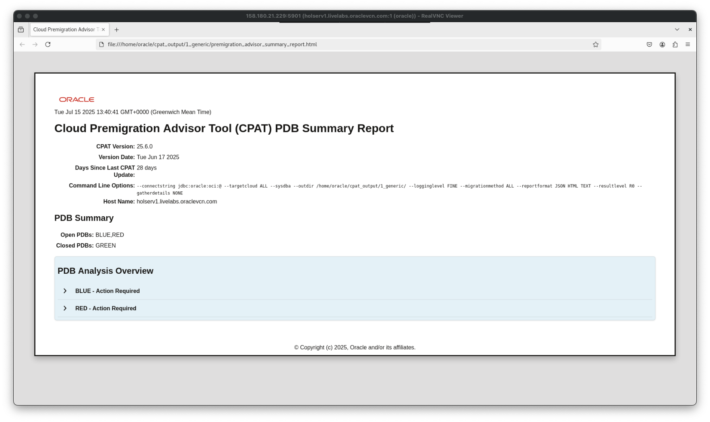

# Getting Started

## Introduction

In this lab, you will evaluate an Oracle Database for compatibility with Autonomous Database, using Cloud Premigration Advisor Tool (CPAT).

Estimated Time: 10 Minutes

### Objectives

In this lab, you will:

* Understand how CPAT works
* Where to download and unzip CPAT
* Start CPAT
* Open and check report

### Prerequisites

This lab assumes:

- You have completed Lab 1: Initialize Environment

## Task 1: Download CPAT

CPAT tool is available in *My Oracle Support*, on Doc ID 2758371.1.


The tool was already pre-downloaded on this lab and is available at */home/oracle/scripts/*.

1. Use the *yellow* terminal 🟨. Unzip CPAT file.

    ``` shell
    <copy>
    mkdir -p /home/oracle/cpat

    unzip /home/oracle/scripts/p32613591_112048_Generic.zip -d /home/oracle/cpat

    ls -l /home/oracle/cpat
    </copy>

    # Be sure to hit RETURN
    ```

    <details>
    <summary>*click to see the output*</summary>
    ``` text
    [CDB23:oracle@holserv1:~]$ mkdir -p /home/oracle/cpat
    [CDB23:oracle@holserv1:~]$ unzip /home/oracle/scripts/p32613591_112048_Generic.zip -d /home/oracle/cpat
    Archive:  /home/oracle/scripts/p32613591_112048_Generic.zip
      inflating: /home/oracle/cpat/README.txt
      inflating: /home/oracle/cpat/LICENSE.txt
      inflating: /home/oracle/cpat/THIRD_PARTY_LICENSES.txt
      creating: /home/oracle/cpat/bin/
      inflating: /home/oracle/cpat/bin/cma.cmd
      inflating: /home/oracle/cpat/bin/cma.sh
      inflating: /home/oracle/cpat/bin/premigration.ps1
      inflating: /home/oracle/cpat/premigration.cmd
      inflating: /home/oracle/cpat/premigration.sh
      creating: /home/oracle/cpat/lib/
      inflating: /home/oracle/cpat/lib/premigration.jar
      inflating: /home/oracle/cpat/lib/ojdbc8-19.3.0.0.jar
      inflating: /home/oracle/cpat/lib/ucp-19.3.0.0.jar
      inflating: /home/oracle/cpat/lib/oraclepki-19.3.0.0.jar
      inflating: /home/oracle/cpat/lib/osdt_core-19.3.0.0.jar
      inflating: /home/oracle/cpat/lib/osdt_cert-19.3.0.0.jar
      inflating: /home/oracle/cpat/lib/orai18n-19.3.0.0.jar
      inflating: /home/oracle/cpat/lib/ons-19.3.0.0.jar
      inflating: /home/oracle/cpat/lib/simplefan-19.3.0.0.jar
      inflating: /home/oracle/cpat/lib/commons-cli-1.9.0.jar
      creating: /home/oracle/cpat/misc/
      inflating: /home/oracle/cpat/misc/CPATReportSchema.json
    [CDB23:oracle@holserv1:~]$ ls -l /home/oracle/cpat
    total 44
    drwxr-xr-x. 2 oracle oinstall    59 Feb 10 14:09 bin
    drwxr-xr-x. 2 oracle oinstall  4096 Feb 10 14:09 lib
    -rw-r--r--. 1 oracle oinstall  6069 Feb 10 14:09 LICENSE.txt
    drwxr-xr-x. 2 oracle oinstall    35 Feb 10 14:09 misc
    -rw-r--r--. 1 oracle oinstall   139 Feb 10 14:09 premigration.cmd
    -rwxr-xr-x. 1 oracle oinstall 10519 Feb 10 14:09 premigration.sh
    -rw-r--r--. 1 oracle oinstall  1782 Feb 10 14:09 README.txt
    -rw-r--r--. 1 oracle oinstall 11533 Feb 10 14:09 THIRD_PARTY_LICENSES.txt
    ```
    </details>

## Task 2: Generate and open a generic CPAT report

CPAT can evaluate multiple different migration methods, like golden gate and data pump, and also to multiple different targets, like ADB Serverless, ADB Dedicated and Exadata. In this task, we will generate a generic CPAT report that will show all checks and issues related to every possible combination of migration method and target type.

1. Execute CPAT for both *BLUE* and *RED* PDBs, generating a generic report.

    ``` shell
    <copy>
    . cdb23
    ~/cpat/premigration.sh --connectstring jdbc:oracle:oci:@ --sysdba --targetcloud ALL --migrationmethod ALL --reportformat JSON HTML TEXT --outdir ~/cpat_output/1_generic/
    </copy>

    # Be sure to hit RETURN
    ```

    * To get all the possible parameter options for CPAT, run *~/cpat/premigration.sh -help*.
    * *--connectstring jdbc:oracle:oci:@ --sysdba* is used for OS Authentication.
      + It will connect on cdb23 as it is the currently exported *ORACLE\_HOME* and *ORACLE\_SID*.
      + It will run CPAT for all opened PDBs: *BLUE* and *RED*.
    * *--targetcloud ALL* is used to run checks against all possible targets, like ATP, ADW and Exadata.
    * *--migrationmethod ALL* is used to run checks for all possible migration methods.
    * *--reportformat JSON HTML TEXT* is used to generate report in HTML, JSON and TEXT.
    * *--outdir ~/cpat\_output/1\_generic/* is the target output folder.

    <details>
    <summary>*click to see the output*</summary>
    ``` text
    [CDB23:oracle@holserv1:~]$ ~/cpat/premigration.sh --connectstring jdbc:oracle:oci:@ --sysdba --targetcloud ALL --migrationmethod ALL --reportformat JSON HTML TEXT --outdir ~/cpat_output/1_generic/
    CPAT-1018: Informational: The amount of memory available to CPAT is 3926 MB. Oracle recommends running CPAT using a 64-bit JVM on a system with at least 8 GB of memory.
    Increase the memory by setting _JAVA_OPTIONS=-Xmx4g or higher if additional memory is available.

    Cloud Premigration Advisor Tool Version 25.2.0
    CPAT-1013: Informational: No analysis properties file found on the command line. Source analysis will not be as complete as possible.
    See the help text for information on using an analysis properties file.

    Analyzing 2 PDBs from CDB$ROOT
    Completed 0 of 2 PDB analysis tasks as of Jun 27, 2025, 1:35:53 AM.  There are 2 PDB analysis tasks currently running.
    Completed 0 of 2 PDB analysis tasks as of Jun 27, 2025, 1:36:03 AM.  There are 2 PDB analysis tasks currently running.
    Completed 2 of 2 PDB analysis tasks as of Jun 27, 2025, 1:36:13 AM.  There are 0 PDB analysis tasks currently running.
    Cloud Premigration Advisor Tool generated report location: /home/oracle/cpat_output/1_generic/premigration_advisor_summary_report.json
    Cloud Premigration Advisor Tool generated report location: /home/oracle/cpat_output/1_generic/premigration_advisor_summary_report.html
    Cloud Premigration Advisor Tool generated report location: /home/oracle/cpat_output/1_generic/premigration_advisor_summary_report.txt
    ```
    </details>

2. Check the generated report files.

    ``` shell
    <copy>
    ls -l ~/cpat_output/1_generic/
    </copy>

    # Be sure to hit RETURN
    ```

    * Note that the output folder contains 3 different file types: JSON, TEXT and HTML.
      + The JSON file will be later consumed by CMA, on the next lab.
      + The TEXT file can be read on a terminal.
      + The HTML file can be opened in a brownser.
    * Only the *BLUE* and *RED* PDBs were checked. As *GREEN* PDB was closed, it was skipped.

    ``` text
    [CDB23:oracle@holserv1:~]$ ls -l ~/cpat_output/1_generic/
    total 40
    drwxr-xr-x. 2 oracle oinstall   177 Jun 27 12:44 BLUE
    -rw-r--r--. 1 oracle oinstall 10684 Jun 27 12:44 premigration_advisor_summary.log
    -rw-r--r--. 1 oracle oinstall 17072 Jun 27 12:44 premigration_advisor_summary_report.html
    -rw-r--r--. 1 oracle oinstall  1289 Jun 27 12:44 premigration_advisor_summary_report.json
    -rw-r--r--. 1 oracle oinstall  2185 Jun 27 12:44 premigration_advisor_summary_report.txt
    drwxr-xr-x. 2 oracle oinstall   173 Jun 27 12:44 RED
    ```

3. Open and explore the TEXT files.

    ``` shell
    <copy>
    cat ~/cpat_output/1_generic/premigration_advisor_summary_report.txt
    </copy>

    # Be sure to hit RETURN
    ```

    Now take a look on the contents of the text report for the *RED* PDB.

    ``` shell
    <copy>
    ls -1 ~/cpat_output/1_generic/RED/

    head -n 100 ~/cpat_output/1_generic/RED/RED_premigration_advisor_report.txt
    </copy>

    # Be sure to hit RETURN
    ```

4. Open and explore the HTML files.

    ``` shell
    <copy>
    ls -1 ~/cpat_output/1_generic/

    firefox ~/cpat_output/1_generic/premigration_advisor_summary_report.html &
    </copy>

    # Be sure to hit RETURN
    ```

    

    * This is a summary page with information about execution on all the PDBs.
    * Note that only the *BLUE* and *RED* PDBs were checked. As *GREEN* PDB was closed, it was skipped.

    Now click and expand the "> BLUE - Action Required" option.

    Open the HTML Report *BLUE/BLUE\_premigratrion\_advisor\_report.html*.

    

    * Note that for each different category (source database, target database, migration method and additional tasks), we have total checks and their results.

    Go to "Premigration Advisor Check Details List". Navigate though the report.

    

    * Note that some of the checks that have "Action Required" are related to Golden Gate, which is not the migration method we will use on this lab.
    * Also, there are some false positive results related to "Timezone Version" under "Additional Tasks". This is because CPAT has no information about the target ADB.

    In the next task, we will try to reduce the number of false positive results by gathering some information of our target ADB in advance.

    Now, close Firefox.

## Task 3: Collect target info to reduce CPAT warnings

Now that we could see that CPAT could generate a report when you still don't know the migration method that will be used and the target type, let's create a more specific report, where I know where we are going, but haven't decided yet which method to use.

In this lab, we will be moving:
* *BLUE* PDB to *SAPPHIRE* ADB.
* *RED* PDB to *RUBY* ADB.

So, let's create a CPAT report where we only list issues for those specifics ADBs.

1. First, let's collect information from our target ADBs to help CPAT identify the issues.

    Use the *yellow* terminal 🟨. Run it first for the *SAPPHIRE* ADB:

    ``` shell
    <copy>
    . adb
    ~/cpat/premigration.sh --connectstring jdbc:oracle:thin:@sapphire_tp?TNS_ADMIN=$TNS_ADMIN --username ADMIN --gettargetprops --outdir ~/cpat_output/props/ --outfileprefix sapphire
    </copy>

    # Be sure to hit RETURN
    ```
    * When ADMIN password is requested, type *Welcome_1234*

    <details>
    <summary>*click to see the output*</summary>
    ``` text
    [ADB:oracle@holserv1:~]$ ~/cpat/premigration.sh --connectstring jdbc:oracle:thin:@sapphire_tp?TNS_ADMIN=$TNS_ADMIN --username ADMIN --gettargetprops --outdir ~/cpat_output/props/ --outfileprefix sapphire
    Enter password for ADMIN user:
    CPAT-1018: Informational: The amount of memory available to CPAT is 3926 MB. Oracle recommends running CPAT using a 64-bit JVM on a system with at least 8 GB of memory.
    Increase the memory by setting _JAVA_OPTIONS=-Xmx4g or higher if additional memory is available.

    Cloud Premigration Advisor Tool Version 25.2.0
    Cloud Premigration Advisor Tool generated properties file location: /home/oracle/cpat_output/props/sapphire_premigration_advisor_analysis.properties
    ```
    </details>

    Next, run for the *RUBY* ADB:

    ``` shell
    <copy>
    . adb
    ~/cpat/premigration.sh --connectstring jdbc:oracle:thin:@ruby_tp?TNS_ADMIN=$TNS_ADMIN --username ADMIN --gettargetprops --outdir ~/cpat_output/props/ --outfileprefix ruby
    </copy>

    # Be sure to hit RETURN
    ```

    * When ADMIN password is requested, type *Welcome_1234*

    <details>
    <summary>*click to see the output*</summary>
    ``` text
    [ADB:oracle@holserv1:~]$ ~/cpat/premigration.sh --connectstring jdbc:oracle:thin:@ruby_tp?TNS_ADMIN=$TNS_ADMIN --username ADMIN --gettargetprops --outdir ~/cpat_output/props/ --outfileprefix ruby
    Enter password for ADMIN user:
    CPAT-1018: Informational: The amount of memory available to CPAT is 3926 MB. Oracle recommends running CPAT using a 64-bit JVM on a system with at least 8 GB of memory.
    Increase the memory by setting _JAVA_OPTIONS=-Xmx4g or higher if additional memory is available.

    Cloud Premigration Advisor Tool Version 25.2.0
    Cloud Premigration Advisor Tool generated properties file location: /home/oracle/cpat_output/props/ruby_premigration_advisor_analysis.properties
    ```
    </details>

    Verify the generated property files:

    ``` shell
    <copy>
    ls -l ~/cpat_output/props/
    </copy>

    # Be sure to hit RETURN
    ```

    <summary>*Output:*</summary>
    ``` text
    $ ls -l ~/cpat_output/props/
    -rw-r--r--. 1 oracle oinstall   8326 Jun 27 13:26 ruby_premigration_advisor_analysis.properties
    -rw-r--r--. 1 oracle oinstall   7098 Jun 27 13:26 ruby_premigration_advisor.log
    -rw-r--r--. 1 oracle oinstall   8326 Jun 27 13:26 sapphire_premigration_advisor_analysis.properties
    -rw-r--r--. 1 oracle oinstall   7110 Jun 27 13:26 sapphire_premigration_advisor.log
    ```

    Check the contents:

    ``` shell
    <copy>
    cat ~/cpat_output/props/ruby_premigration_advisor_analysis.properties
    </copy>

    # Be sure to hit RETURN
    ```
    * When ADMIN password is requested, type *Welcome_1234*

    <details>
    <summary>*click to see the output*</summary>
    ``` text
    #Created by CPAT version 25.2.0
    #Fri Jun 27 13:26:17 GMT 2025
    TargetInstanceProp.NLS_CHARACTERSET=AL32UTF8
    TargetInstanceProp.TABLESPACE_BLOCK_SIZE.TEMP=8192
    TargetInstanceProp.TABLESPACE_BLOCK_SIZE.DBFS_DATA=8192
    TargetInstanceProp.PDB_LOCKDOWN=OLTP
    SourceAnalysisProp.ADDITIONAL_EXCLUDED_SCHEMAS=SYS,APEX_PUBLIC_ROUTER,OML$MODELS,ORDS_PLSQL_GATEWAY,OMLMOD$PROXY,SYSRAC,GRAPH$METADATA,ORDS_PUBLIC_USER,GRAPH$PROXY_USER,SYSTEM,XS$NULL,LBACSYS,OUTLN,DBSNMP,APPQOSSYS,C\#\#CLOUD$SERVICE,VECSYS,DBSFWUSER,C\#\#ADP$SERVICE,GGSYS,FLOWS_FILES,CTXSYS,ORDS_METADATA,C\#\#OMLIDM,AUDSYS,GSMADMIN_INTERNAL,GGSHAREDCAP,MDSYS,XDB,APEX_240200,GSMCATUSER,C\#\#CLOUD_OPS,C\#\#DNSREST,MDDATA,REMOTE_SCHEDULER_AGENT,C\#\#API,SYSBACKUP,GSMUSER,C\#\#RFS,C\#\#QUEUE$SERVICE,C\#\#DATA$SHARE,MTSSYS,LBAC_TRIGGER,DVF,DVSYS,DIP,DGPDB_INT,SYSKM,SYS$UMF,C\#\#DV_ACCT_ADMIN,C\#\#DV_OWNER,SYSDG
    TargetInstanceProp.DB_PLATFORM_ID=13
    TargetInstanceProp.DIRECTORIES=DATA_PUMP_DIR,JAVA$JOX$CUJS$DIRECTORY$,OPATCH_INST_DIR,OPATCH_LOG_DIR,OPATCH_SCRIPT_DIR,ORACLE_BASE,ORACLE_HOME,SDO_DIR_ADMIN,SQL_TCB_DIR
    TargetInstanceProp.ROLEPRIVILEGE=ACCHK_READ,ADB_MONITOR,ADM_PARALLEL_EXECUTE_TASK,ADPADMIN,ADPUSER,APEX_ADMINISTRATOR_READ_ROLE,APEX_ADMINISTRATOR_ROLE,AQ_ADMINISTRATOR_ROLE,AQ_USER_ROLE,AUDIT_ADMIN,AUDIT_VIEWER,CAPTURE_ADMIN,CONNECT,CONSOLE_ADMIN,CONSOLE_DEVELOPER,CONSOLE_MONITOR,CONSOLE_OPERATOR,CTXAPP,DATAPUMP_CLOUD_EXP,DATAPUMP_CLOUD_IMP,DATA_TRANSFORM_USER,DB_DEVELOPER_ROLE,DCAT_SYNC,DGPDB_ROLE,DV_ACCTMGR,DV_ADMIN,DV_AUDIT_CLEANUP,DV_DATAPUMP_NETWORK_LINK,DV_GOLDENGATE_ADMIN,DV_GOLDENGATE_REDO_ACCESS,DV_MONITOR,DV_OWNER,DV_PATCH_ADMIN,DV_POLICY_OWNER,DV_SECANALYST,DV_STREAMS_ADMIN,DV_XSTREAM_ADMIN,DWROLE,GATHER_SYSTEM_STATISTICS,GRAPH_ADMINISTRATOR,GRAPH_DEVELOPER,HS_ADMIN_SELECT_ROLE,LBAC_DBA,LINEAGE_AUTHOR,OEM_ADVISOR,OPTIMIZER_PROCESSING_RATE,ORDS_ADMINISTRATOR_ROLE,OSAK_ADMIN_ROLE,PDB_DBA,PGX_SERVER_GET_INFO,PGX_SERVER_MANAGE,PGX_SESSION_ADD_PUBLISHED_GRAPH,PGX_SESSION_COMPILE_ALGORITHM,PGX_SESSION_CREATE,PGX_SESSION_GET_PUBLISHED_GRAPH,PGX_SESSION_MODIFY_MODEL,PGX_SESSION_NEW_GRAPH,PGX_SESSION_READ_MODEL,PPLB_ROLE,PROVISIONER,RESOURCE,SAGA_ADM_ROLE,SAGA_CONNECT_ROLE,SAGA_PARTICIPANT_ROLE,SELECT_CATALOG_ROLE,SODA_APP,SQL_FIREWALL_ADMIN,SQL_FIREWALL_VIEWER,XS_CACHE_ADMIN,XS_CONNECT,XS_NAMESPACE_ADMIN,XS_SESSION_ADMIN
    TargetInstanceProp.TABLESPACE_BLOCK_SIZE.SYSAUX=8192
    TargetInstanceProp.DB_VERSION=23.8.0.25.05
    TargetInstanceProp.TABLESPACE_BLOCK_SIZE.UNDOTBS1=8192
    TargetInstanceProp.CLOUD_SERVICE=OLTP
    TargetInstanceProp.SYSPRIVILEGE=ADMINISTER ANY SQL TUNING SET,ADMINISTER DATABASE TRIGGER,ADMINISTER FINE GRAINED AUDIT POLICY,ADMINISTER REDACTION POLICY,ADMINISTER RESOURCE MANAGER,ADMINISTER ROW LEVEL SECURITY POLICY,ADMINISTER SQL FIREWALL,ADMINISTER SQL MANAGEMENT OBJECT,ADMINISTER SQL TUNING SET,ADVISOR,ALTER ANY ANALYTIC VIEW,ALTER ANY ASSEMBLY,ALTER ANY ATTRIBUTE DIMENSION,ALTER ANY CLUSTER,ALTER ANY CUBE,ALTER ANY CUBE BUILD PROCESS,ALTER ANY CUBE DIMENSION,ALTER ANY DIMENSION,ALTER ANY DOMAIN,ALTER ANY EDITION,ALTER ANY EVALUATION CONTEXT,ALTER ANY HIERARCHY,ALTER ANY INDEX,ALTER ANY INDEXTYPE,ALTER ANY LIBRARY,ALTER ANY MATERIALIZED VIEW,ALTER ANY MEASURE FOLDER,ALTER ANY MINING MODEL,ALTER ANY MLE,ALTER ANY OPERATOR,ALTER ANY OUTLINE,ALTER ANY PROCEDURE,ALTER ANY PROPERTY GRAPH,ALTER ANY ROLE,ALTER ANY RULE,ALTER ANY RULE SET,ALTER ANY SEQUENCE,ALTER ANY SQL PROFILE,ALTER ANY SQL TRANSLATION PROFILE,ALTER ANY TABLE,ALTER ANY TRIGGER,ALTER ANY TYPE,ALTER DATABASE,ALTER LOCKDOWN PROFILE,ALTER PROFILE,ALTER RESOURCE COST,ALTER ROLLBACK SEGMENT,ALTER SESSION,ALTER SYSTEM,ALTER TABLESPACE,ALTER USER,ANALYZE ANY,ANALYZE ANY DICTIONARY,AUDIT ANY,AUDIT SYSTEM,BECOME USER,CHANGE NOTIFICATION,CLEAR ALL LOCAL CONTEXTS,COMMENT ANY MINING MODEL,COMMENT ANY TABLE,CREATE ANALYTIC VIEW,CREATE ANY ANALYTIC VIEW,CREATE ANY ASSEMBLY,CREATE ANY ATTRIBUTE DIMENSION,CREATE ANY CLUSTER,CREATE ANY CONTEXT,CREATE ANY CUBE,CREATE ANY CUBE BUILD PROCESS,CREATE ANY CUBE DIMENSION,CREATE ANY DIMENSION,CREATE ANY DIRECTORY,CREATE ANY DOMAIN,CREATE ANY EDITION,CREATE ANY EVALUATION CONTEXT,CREATE ANY HIERARCHY,CREATE ANY INDEX,CREATE ANY INDEXTYPE,CREATE ANY JOB,CREATE ANY MATERIALIZED VIEW,CREATE ANY MEASURE FOLDER,CREATE ANY MINING MODEL,CREATE ANY MLE,CREATE ANY OPERATOR,CREATE ANY OUTLINE,CREATE ANY PROCEDURE,CREATE ANY PROPERTY GRAPH,CREATE ANY RULE,CREATE ANY RULE SET,CREATE ANY SEQUENCE,CREATE ANY SQL PROFILE,CREATE ANY SQL TRANSLATION PROFILE,CREATE ANY SYNONYM,CREATE ANY TABLE,CREATE ANY TRIGGER,CREATE ANY TYPE,CREATE ANY VIEW,CREATE ASSEMBLY,CREATE ATTRIBUTE DIMENSION,CREATE CLUSTER,CREATE CUBE,CREATE CUBE BUILD PROCESS,CREATE CUBE DIMENSION,CREATE DATABASE LINK,CREATE DIMENSION,CREATE DOMAIN,CREATE EVALUATION CONTEXT,CREATE HIERARCHY,CREATE INDEXTYPE,CREATE JOB,CREATE LOCKDOWN PROFILE,CREATE LOGICAL PARTITION TRACKING,CREATE MATERIALIZED VIEW,CREATE MEASURE FOLDER,CREATE MINING MODEL,CREATE MLE,CREATE OPERATOR,CREATE PLUGGABLE DATABASE,CREATE PROCEDURE,CREATE PROFILE,CREATE PROPERTY GRAPH,CREATE PUBLIC DATABASE LINK,CREATE PUBLIC SYNONYM,CREATE ROLE,CREATE ROLLBACK SEGMENT,CREATE RULE,CREATE RULE SET,CREATE SEQUENCE,CREATE SESSION,CREATE SQL TRANSLATION PROFILE,CREATE SYNONYM,CREATE TABLE,CREATE TABLESPACE,CREATE TRIGGER,CREATE TYPE,CREATE USER,CREATE VIEW,DEBUG ANY PROCEDURE,DEBUG CONNECT ANY,DEBUG CONNECT SESSION,DELETE ANY CUBE DIMENSION,DELETE ANY MEASURE FOLDER,DELETE ANY TABLE,DEQUEUE ANY QUEUE,DROP ANY ANALYTIC VIEW,DROP ANY ASSEMBLY,DROP ANY ATTRIBUTE DIMENSION,DROP ANY CLUSTER,DROP ANY CONTEXT,DROP ANY CUBE,DROP ANY CUBE BUILD PROCESS,DROP ANY CUBE DIMENSION,DROP ANY DIMENSION,DROP ANY DIRECTORY,DROP ANY DOMAIN,DROP ANY EDITION,DROP ANY EVALUATION CONTEXT,DROP ANY HIERARCHY,DROP ANY INDEX,DROP ANY INDEXTYPE,DROP ANY LIBRARY,DROP ANY MATERIALIZED VIEW,DROP ANY MEASURE FOLDER,DROP ANY MINING MODEL,DROP ANY MLE,DROP ANY OPERATOR,DROP ANY OUTLINE,DROP ANY PROCEDURE,DROP ANY PROPERTY GRAPH,DROP ANY ROLE,DROP ANY RULE,DROP ANY RULE SET,DROP ANY SEQUENCE,DROP ANY SQL PROFILE,DROP ANY SQL TRANSLATION PROFILE,DROP ANY SYNONYM,DROP ANY TABLE,DROP ANY TRIGGER,DROP ANY TYPE,DROP ANY VIEW,DROP LOCKDOWN PROFILE,DROP LOGICAL PARTITION TRACKING,DROP PROFILE,DROP PUBLIC DATABASE LINK,DROP PUBLIC SYNONYM,DROP ROLLBACK SEGMENT,DROP TABLESPACE,DROP USER,ENQUEUE ANY QUEUE,EXECUTE ANY ASSEMBLY,EXECUTE ANY CLASS,EXECUTE ANY DOMAIN,EXECUTE ANY EVALUATION CONTEXT,EXECUTE ANY INDEXTYPE,EXECUTE ANY LIBRARY,EXECUTE ANY OPERATOR,EXECUTE ANY PROCEDURE,EXECUTE ANY PROGRAM,EXECUTE ANY RULE,EXECUTE ANY RULE SET,EXECUTE ANY TYPE,EXECUTE ASSEMBLY,EXECUTE DYNAMIC MLE,EXEMPT ACCESS POLICY,EXEMPT REDACTION POLICY,FLASHBACK ANY TABLE,FORCE ANY TRANSACTION,FORCE TRANSACTION,GLOBAL QUERY REWRITE,GRANT ANY OBJECT PRIVILEGE,GRANT ANY ROLE,GRANT ANY SCHEMA PRIVILEGE,INSERT ANY CUBE DIMENSION,INSERT ANY MEASURE FOLDER,INSERT ANY TABLE,KEEP DATE TIME,KEEP SYSGUID,LOCK ANY TABLE,LOGMINING,MANAGE ANY QUEUE,MANAGE SCHEDULER,MANAGE TABLESPACE,MERGE ANY VIEW,ON COMMIT REFRESH,PURGE DBA_RECYCLEBIN,QUERY REWRITE,READ ANY ANALYTIC VIEW CACHE,READ ANY PROPERTY GRAPH,READ ANY TABLE,REDEFINE ANY TABLE,RESTRICTED SESSION,RESUMABLE,SELECT ANY CUBE,SELECT ANY CUBE BUILD PROCESS,SELECT ANY CUBE DIMENSION,SELECT ANY DICTIONARY,SELECT ANY MEASURE FOLDER,SELECT ANY MINING MODEL,SELECT ANY SEQUENCE,SELECT ANY TABLE,SELECT ANY TRANSACTION,SET CONTAINER,TABLE RETENTION,TRANSLATE ANY SQL,UNDER ANY TABLE,UNDER ANY TYPE,UNDER ANY VIEW,UNLIMITED TABLESPACE,UPDATE ANY CUBE,UPDATE ANY CUBE BUILD PROCESS,UPDATE ANY CUBE DIMENSION,UPDATE ANY TABLE,USE ANY JOB RESOURCE,WRITE ANY ANALYTIC VIEW CACHE
    TargetInstanceProp.TABLESPACE_BLOCK_SIZE.DATA=8192
    TargetInstanceProp.TABLESPACES=DATA,DBFS_DATA,SYSAUX,SYSTEM,TEMP,UNDOTBS1
    TargetInstanceProp.JAVAVM_STATUS=
    TargetInstanceProp.TZ_VERSION=44
    TargetInstanceProp.DB_BLOCK_SIZE=8192
    TargetInstanceProp.ALLOW_ROWID_COLUMN_TYPE=FALSE
    TargetInstanceProp.DB_TIME_ZONE=+00\:00
    TargetInstanceProp.CPAT_VERSION=25.2.0
    TargetInstanceProp.TABLESPACE_BLOCK_SIZE.SYSTEM=8192
    TargetInstanceProp.NLS_NCHAR_CHARACTERSET=AL16UTF16
    TargetInstanceProp.MAX_STRING_SIZE=EXTENDED
    TargetInstanceProp.PROFILES=DEFAULT,ORA_ADMIN_PROFILE,ORA_APP_PROFILE,ORA_CIS_PROFILE,ORA_EXTAPP_PROFILE,ORA_MANDATORY_PROFILE,ORA_MANDATORY_PROFILE_GOV,ORA_PROTECTED_PROFILE,ORA_STIG_PROFILE
    ```
    </details>

2. Now, execute CPAT for *BLUE* and *RED* PDBs, generating a specific report.

    ``` shell
    <copy>
    . cdb23

    ~/cpat/premigration.sh --connectstring jdbc:oracle:oci:@ --sysdba --pdbname BLUE --targetcloud ATPS --migrationmethod ALL --reportformat JSON HTML TEXT --analysisprops ~/cpat_output/props/sapphire_premigration_advisor_analysis.properties --outdir ~/cpat_output/2_adbs/ --outfileprefix blue

    ~/cpat/premigration.sh --connectstring jdbc:oracle:oci:@ --sysdba --pdbname RED --targetcloud ATPS --migrationmethod ALL --reportformat JSON HTML TEXT --analysisprops ~/cpat_output/props/ruby_premigration_advisor_analysis.properties --outdir ~/cpat_output/2_adbs/ --outfileprefix red
    </copy>

    # Be sure to hit RETURN
    ```

    <details>
    <summary>*click to see the output*</summary>
    ``` text
    [CDB23:oracle@holserv1:~]$ ~/cpat/premigration.sh --connectstring jdbc:oracle:oci:@ --sysdba --pdbname BLUE --targetcloud ATPS --migrationmethod ALL --reportformat JSON HTML TEXT --analysisprops ~/cpat_output/props/sapphire_premigration_advisor_analysis.properties --outdir ~/cpat_output/2_adbs/ --outfileprefix blue
    CPAT-1018: Informational: The amount of memory available to CPAT is 3926 MB. Oracle recommends running CPAT using a 64-bit JVM on a system with at least 8 GB of memory.
    Increase the memory by setting _JAVA_OPTIONS=-Xmx4g or higher if additional memory is available.

    Cloud Premigration Advisor Tool Version 25.2.0
    CPAT-4007: Warning: the build date for this version of the Cloud Premigration Advisor Tool is over 137 days.  Please run "premigration.sh --updatecheck" to see if a more recent version of this tool is available.
    Please download the latest available version of the CPAT application.

    Cloud Premigration Advisor Tool completed with overall result: Action Required
    Cloud Premigration Advisor Tool generated report location: /home/oracle/cpat_output/2_adbs/blue_premigration_advisor_report.json
    Cloud Premigration Advisor Tool generated report location: /home/oracle/cpat_output/2_adbs/blue_premigration_advisor_report.html
    Cloud Premigration Advisor Tool generated report location: /home/oracle/cpat_output/2_adbs/blue_premigration_advisor_report.txt
    [CDB23:oracle@holserv1:~]$ ~/cpat/premigration.sh --connectstring jdbc:oracle:oci:@ --sysdba --pdbname RED --targetcloud ATPS --migrationmethod ALL --reportformat JSON HTML TEXT --analysisprops ~/cpat_output/props/ruby_premigration_advisor_analysis.properties --outdir ~/cpat_output/2_adbs/ --outfileprefix red
    CPAT-1018: Informational: The amount of memory available to CPAT is 3926 MB. Oracle recommends running CPAT using a 64-bit JVM on a system with at least 8 GB of memory.
    Increase the memory by setting _JAVA_OPTIONS=-Xmx4g or higher if additional memory is available.

    Cloud Premigration Advisor Tool Version 25.2.0
    CPAT-4007: Warning: the build date for this version of the Cloud Premigration Advisor Tool is over 137 days.  Please run "premigration.sh --updatecheck" to see if a more recent version of this tool is available.
    Please download the latest available version of the CPAT application.

    Cloud Premigration Advisor Tool completed with overall result: Review Required
    Cloud Premigration Advisor Tool generated report location: /home/oracle/cpat_output/2_adbs/red_premigration_advisor_report.json
    Cloud Premigration Advisor Tool generated report location: /home/oracle/cpat_output/2_adbs/red_premigration_advisor_report.html
    Cloud Premigration Advisor Tool generated report location: /home/oracle/cpat_output/2_adbs/red_premigration_advisor_report.txt
    ```
    </details>

## Task 4: Check that total issues were reduced

Now that we executed CPAT for both PDBs on our specific migration scenarios, let's take a look on the CPAT files:

1. Open and explore the HTML files.

    ``` shell
    <copy>
    ls -1 ~/cpat_output/2_adbs/

    firefox ~/cpat_output/2_adbs/{blue_premigration_advisor_report.html,red_premigration_advisor_report.html} &
    </copy>

    # Be sure to hit RETURN
    ```
2. Check the issues on *BLUE* PDB.

    On the first tab, which is the *BLUE* PDB, explore the CPAT findings. If you click on *Premigration Advisor Report Summary*, you can see there are significantly less issues to be analysed.

    

    * Actions Required reduced from 6 to 4
    * Reviews Required reduced from 10 to 7
    * Reviews Suggested reduced from 9 to 6

3. Check the issues on *RED* PDB.

    On the second tab, which is the *RED* PDB, explore the CPAT findings. If you click on *Premigration Advisor Report Summary*, you can see there are almost nothing to be analysed.

    

    * Actions Required reduced from 3 to 2
    * Reviews Required reduced from 6 to 3
    * Reviews Suggested reduced from 7 to 4

    Note that are still many checks that are related to Golden Gate, which is not the migration method we will use on this lab. In the next task, we will try to reduce the number of results now by gathering information only related to the target method we will.

    Now, close Firefox.

## Task 5: Generate and open a CPAT report for our lab

Now that we could see that CPAT could generate a report when you still don't know the migration method that will be used, let's create a more specific report, where I want to specify which method we are using.

In this lab, we will be moving:
* *BLUE* PDB using Data Pump.
* *RED* PDB using Data Pump with DB Links.

So, let's create a CPAT report where we only list issues for this specific migration methods.

1. Execute CPAT for *BLUE* and *RED* PDBs, generating a specific report.

    ``` shell
    <copy>
    . cdb23

    ~/cpat/premigration.sh --connectstring jdbc:oracle:oci:@ --sysdba --pdbname BLUE --targetcloud ATPS --migrationmethod DATAPUMP --reportformat JSON HTML TEXT --analysisprops ~/cpat_output/props/sapphire_premigration_advisor_analysis.properties --outdir ~/cpat_output/3_adbs_datapump/ --outfileprefix blue

    ~/cpat/premigration.sh --connectstring jdbc:oracle:oci:@ --sysdba --pdbname RED --targetcloud ATPS --migrationmethod DATAPUMP_DBLINK --reportformat JSON HTML TEXT --analysisprops ~/cpat_output/props/ruby_premigration_advisor_analysis.properties --outdir ~/cpat_output/3_adbs_datapump/ --outfileprefix red
    </copy>

    # Be sure to hit RETURN
    ```

    * Note we changed from *--migrationmethod ALL* to *--migrationmethod DATAPUMP* (for BLUE) and *--migrationmethod DATAPUMP_DBLINK* (for RED).

    <details>
    <summary>*click to see the output*</summary>
    ``` text
    [CDB23:oracle@holserv1:~]$ ~/cpat/premigration.sh --connectstring jdbc:oracle:oci:@ --sysdba --pdbname BLUE --targetcloud ATPS --migrationmethod DATAPUMP --reportformat JSON HTML TEXT --analysisprops ~/cpat_output/props/sapphire_premigration_advisor_analysis.properties --outdir ~/cpat_output/3_adbs_datapump/ --outfileprefix blue
    CPAT-1018: Informational: The amount of memory available to CPAT is 3926 MB. Oracle recommends running CPAT using a 64-bit JVM on a system with at least 8 GB of memory.
    Increase the memory by setting _JAVA_OPTIONS=-Xmx4g or higher if additional memory is available.

    Cloud Premigration Advisor Tool Version 25.2.0
    CPAT-4007: Warning: the build date for this version of the Cloud Premigration Advisor Tool is over 137 days.  Please run "premigration.sh --updatecheck" to see if a more recent version of this tool is available.
    Please download the latest available version of the CPAT application.

    Cloud Premigration Advisor Tool completed with overall result: Action Required
    Cloud Premigration Advisor Tool generated report location: /home/oracle/cpat_output/3_adbs_datapump/blue_premigration_advisor_report.json
    Cloud Premigration Advisor Tool generated report location: /home/oracle/cpat_output/3_adbs_datapump/blue_premigration_advisor_report.html
    Cloud Premigration Advisor Tool generated report location: /home/oracle/cpat_output/3_adbs_datapump/blue_premigration_advisor_report.txt
    [CDB23:oracle@holserv1:~]$ ~/cpat/premigration.sh --connectstring jdbc:oracle:oci:@ --sysdba --pdbname RED --targetcloud ATPS --migrationmethod DATAPUMP_DBLINK --reportformat JSON HTML TEXT --analysisprops ~/cpat_output/props/ruby_premigration_advisor_analysis.properties --outdir ~/cpat_output/3_adbs_datapump/ --outfileprefix red
    CPAT-1018: Informational: The amount of memory available to CPAT is 3926 MB. Oracle recommends running CPAT using a 64-bit JVM on a system with at least 8 GB of memory.
    Increase the memory by setting _JAVA_OPTIONS=-Xmx4g or higher if additional memory is available.

    Cloud Premigration Advisor Tool Version 25.2.0
    CPAT-4007: Warning: the build date for this version of the Cloud Premigration Advisor Tool is over 137 days.  Please run "premigration.sh --updatecheck" to see if a more recent version of this tool is available.
    Please download the latest available version of the CPAT application.

    Cloud Premigration Advisor Tool completed with overall result: Review Required
    Cloud Premigration Advisor Tool generated report location: /home/oracle/cpat_output/3_adbs_datapump/red_premigration_advisor_report.json
    Cloud Premigration Advisor Tool generated report location: /home/oracle/cpat_output/3_adbs_datapump/red_premigration_advisor_report.html
    Cloud Premigration Advisor Tool generated report location: /home/oracle/cpat_output/3_adbs_datapump/red_premigration_advisor_report.txt
    ```
    </details>

## Task 6: Check issues that will affect this migration

Now that we executed CPAT for both PDBs on our specific migration scenarios, let's take a look on the CPAT files:

1. Open and explore the HTML files.

    ``` shell
    <copy>
    ls -1 ~/cpat_output/3_adbs_datapump/

    firefox ~/cpat_output/3_adbs_datapump/{blue_premigration_advisor_report.html,red_premigration_advisor_report.html} &
    </copy>

    # Be sure to hit RETURN
    ```

2. Check the issues on *BLUE* PDB.

   On the first tab, which is the *BLUE* PDB, explore the CPAT findings. If you click on *Premigration Advisor Report Summary*, you can see there are significantly less issues to be analysed.

   

   * Action Requireds reduced now to just 1, on Source Database
   * The checks that will need a closer attention are:
     + "User Defined Objects in SYS" (Action Required)
     + "Database Links" (Review Required)
     + "External Tables for Serverless" (Review Required)
     + "Directories" (Review Required)
     + "Non-Exported Object Grants" (Review Required)
   + We will later on another lab see how to fix each of them while moving to ADB.

3. Check the issues on *RED* PDB.

   On the second tab, which is the *RED* PDB, explore the CPAT findings. If you click on *Premigration Advisor Report Summary*, you can see there are almost nothing to be analysed.

   

   * Action Requireds reduced to 0
   * The only check that will need a closer attention is:
     + "Directories" (Review Required)
   + However, it only lists internal directories that don't exists in ADB, but are not being used by the application. So this can be safelly ignored

   Now that we know what needs to be adapted before moving to ADB, we can move to the next lab.

   Close Firefox.

You may now *proceed to the next lab*.

## Additional information

The network mode import is simpler than using dump files. You need to call Data Pump only once. However, there are certain restrictions in a network mode import that can severely impact performance. Especially around parallel jobs and LOBs you might find that a network mode import is much slower. In such cases, use dump files instead.

## Acknowledgments

* **Author** - Rodrigo Jorge
* **Contributors** - William Beauregard, Daniel Overby Hansen, Mike Dietrich, Klaus Gronau, Alex Zaballa
* **Last Updated By/Date** - Rodrigo Jorge, May 2025