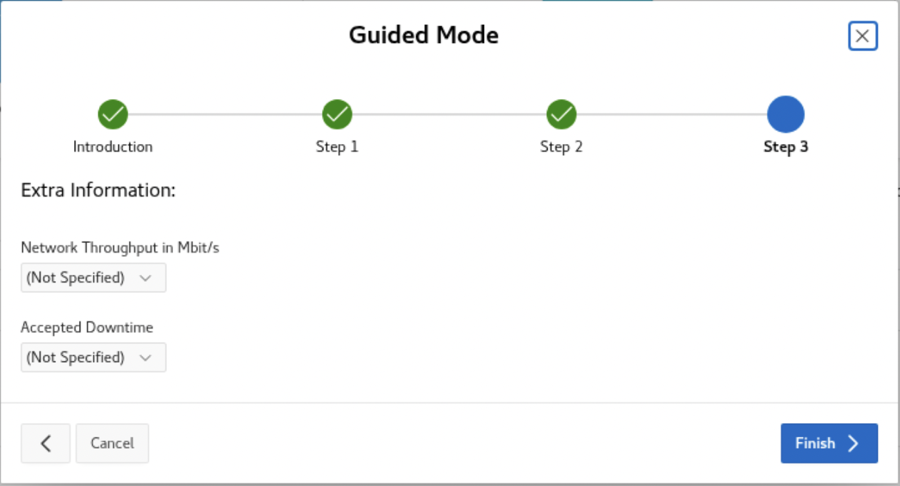

# Cloud Migration Advisor

## Introduction

In this lab, you will see use Cloud Migration Advisor (CMA) to get the recommended migration method for each database and check which is the easiest to move.

Estimated Time: 15 Minutes

### Objectives

In this lab, you will:

* Open Cloud Migration Advisor
* Upload CPAT findings
* Generate report

### Prerequisites

This lab assumes:

* You have completed Lab 3: Evaluate Database Compatibility

This is an optional lab. You can skip it if you are already familiar with CMA.

## Task 1: Prepare the environment

Due to network restrictions in the lab environment, the APEX instance cannot access external resources, such as the Oracle CDN at https://static.oracle.com. To ensure that all required JavaScript, CSS, and image files load correctly, the path for static HTML and supporting files has been redirected to a pre-configured OCI Object Storage location.

1. Use the *yellow* terminal 🟨. Let's first connect on ADB:

    ``` sql
    <copy>
    . adb
    sql admin/Welcome_1234@sapphire_tp
    </copy>

    -- Be sure to hit RETURN
    ```

2. Change Oracle APEX image location:

    ``` sql
    <copy>
    BEGIN
      APEX_INSTANCE_ADMIN.set_parameter(
                  p_parameter => 'IMAGE_PREFIX',
                  p_value => 'https://objectstorage.eu-frankfurt-1.oraclecloud.com/n/oradbclouducm/b/oracle-jet/o/cdn/apex/24.2.0/');
      COMMIT;
    END;
    /
    </copy>

    -- Be sure to hit RETURN
    ```

    <details>
    <summary>*click to see the output*</summary>

    ``` text
    SQL> BEGIN
      2    APEX_INSTANCE_ADMIN.set_parameter(
      3                p_parameter => 'IMAGE_PREFIX',
      4                p_value => 'https://objectstorage.eu-frankfurt-1.oraclecloud.com/n/oradbclouducm/b/oracle-jet/o/cdn/apex/24.2.0/');
      5    COMMIT;
      6  END;
      7* /

    PL/SQL procedure successfully completed.
    ```

    </details>

3. Set the account to never expire:

    ``` sql
    <copy>
    BEGIN
      APEX_INSTANCE_ADMIN.set_parameter(
                  p_parameter => 'EXPIRE_FND_USER_ACCOUNTS',
                  p_value => 'N');
      COMMIT;
    END;
    /
    </copy>

    -- Be sure to hit RETURN
    ```

    <details>
    <summary>*click to see the output*</summary>

    ``` text
    SQL> BEGIN
      2    APEX_INSTANCE_ADMIN.set_parameter(
      3                p_parameter => 'EXPIRE_FND_USER_ACCOUNTS',
      4                p_value => 'N');
      5    COMMIT;
      6  END;
      7* /

    PL/SQL procedure successfully completed.
    ```

    </details>

4. Close SQLcl.

    ``` bash
    <copy>
    exit
    </copy>
    ```

## Task 2: Download and open CMA

CMA is available for everyone and shared on request. The tool is licensed under Oracle Free Use Terms and Conditions (FUTC).

If you are interest on the tool, you can request a copy from the Upgrades, Migration and Patching Product Management Team via our social media, e-mail or website.

In this lab, CMA is already configured and available at *[https://localhost/ords/r/cma/cma](https://localhost/ords/r/cma/cma)*.

1. Double-click on the *ADB_Actions* shortcut on the desktop.

    

2. Click on the second tab.

    

3. Connect to CMA.

    * Username: *CMA*
    * Password: *Welcome\_1234*

4. You're now connected.

    

## Task 3: Run CMA Guided Mode

Cloud Migration Advisor is a tool with many options and flows. In this lab, we will use it in a simple mode, just to get the recommended method for the two PDBs that we want to move to ADB.

1. In the top left corner, click on the *hamburger icon* and click on *Guided Mode*.

2. The guide mode opens a pop-up. Read the introduction and click *Next* and go to "Step 1".

    

3. On "Step 1", select *I have my target defined. What is the best migration method?* option.

    

4. Now, select *ADBS - Autonomous Database Serverless* on the select list and click *Next*.

    

5. On "Step 2", click the *Upload JSONs* button. After the pop-up opens, click on *Choose Files*.

    

6. First, click on the *Home* shortcut in the left menu and load: *cpat\_output/2\_adbs/blue_premigration\_advisor\_report.json*.

    

7. Click *Open* and next *Upload*. It will show "1" database loaded.

    

8. Repeat the steps above to load now *cpat\_output/2\_adbs/red\_premigration\_advisor\_report.json*.

    

9. Click *Open* and next *Upload*. It will show "2" databases loaded!

    

10. Click *Next* and on "Step 3", finally click *Finish*.

    

## Task 3: Check CMA Solution Report

1. The solution report page opens. Examine it.

    * CMA recommends using "Data Pump Conventional Export/Import" for both databases.
    * The CPAT report that you uploaded were based on all migration methods. CMA scans and shows which one would be the most simple.
    * CMA is showing that RED database is less complex to move (scored 9.19) than the BLUE database (scored 9.00). This is because RED has less CPAT findings than BLUE. Notice the "Checks" columns.

    

2. Click on the *Solution# 1* link at the breadcrumb bar.

3. On the *Solution* overview, click on *Checks Report* button in the upper right corner.

4. When the *Checks Report* open, you can view all CPAT checks for both databases, and their CPAT status.

    

5. Find the *has_directories* check and the select row. Only the first 10 rows are shown. You may have to go to the next rows to find the check.

6. Now, scroll to the end of the page. Notice that on the "Databases" report table at the bottom, you can check the list of affected objects for that specific check.

    

You may now [*proceed to the next lab*](#next).

## Additional information

* [Database Upgrades and Migrations](https://www.oracle.com/database/upgrades/)

## Acknowledgments

* **Author** - Rodrigo Jorge
* **Contributors** - William Beauregard, Daniel Overby Hansen, Mike Dietrich, Klaus Gronau, Alex Zaballa
* **Last Updated By/Date** - Rodrigo Jorge, August 2025
