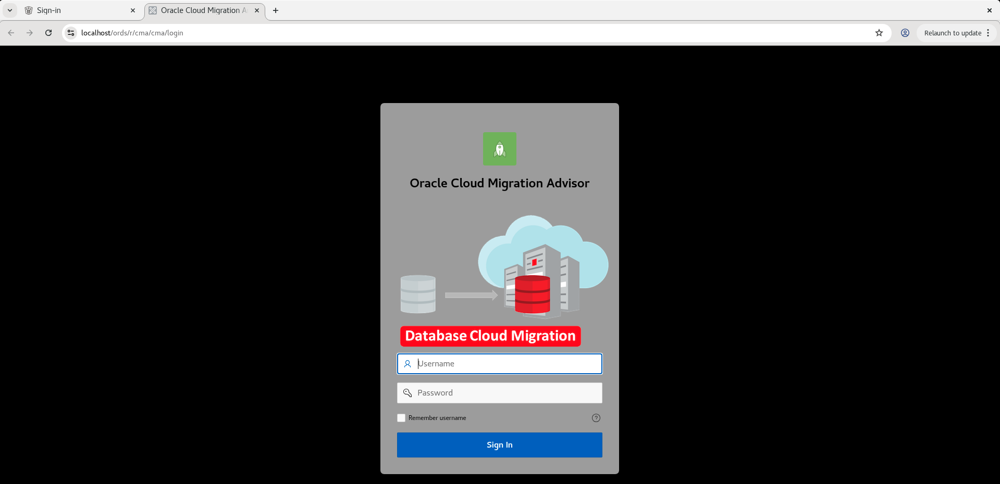
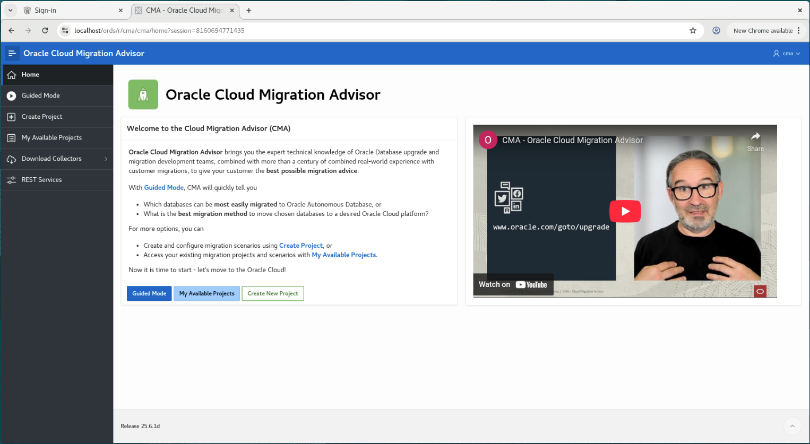
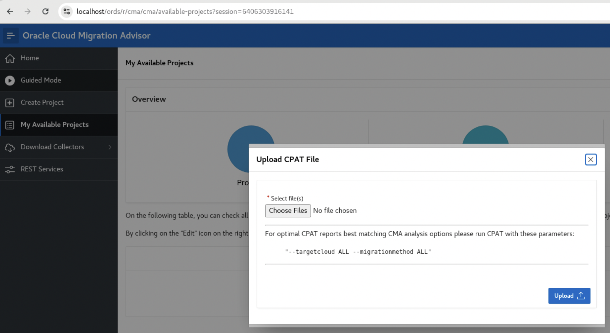
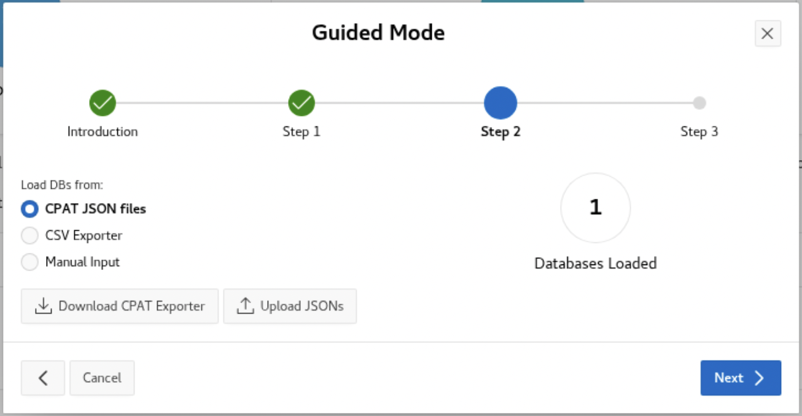

# Cloud Migration Advisor

## Introduction

In this lab, you will see use Cloud Migration Advisor to get the recommended migration method for each database and check which is the easiest to move first.

Estimated Time: 15 Minutes

### Objectives

In this lab, you will:

* Open Cloud Migration Advisor
* Upload CPAT findings to it and process
* Check the generated report

### Prerequisites

This lab assumes:

* You have completed Lab 3: Evaluate Database Compatibility

This is an optional lab. You can skip it if you are already familiar with CMA.

## Task 1: Download and open CMA

CMA tool is available and shared on request basis. The tool is licensed under Oracle Free Use Terms and Conditions (FUTC).

If you are interest on the tool, you can request a copy to the Upgrades, Migration and Patching Product Management Team via our social media, e-mail or website.

The tool was already pre-downloaded and installed on this lab and is available at *[https://localhost/ords/r/cma/cma](https://localhost/ords/r/cma/cma)*.

1. Double-click on the *ADB_Actions* shortcut on the desktop.

    

2. Click on the second tab.

    

3. Connect on CMA.

    Type the CMA user and password

    * Username: *CMA*
    * Password: *Welcome\_1234*

## Task 2: Run CMA Guided Mode

Cloud Migration Advisor is a tool with many options and flows.
In this lab, we will use it on a simple mode, just to get the recommended method for the 2 PDBs that we want to move to ADB.

1. Open on the *hamburger icon* on the top left and click on *Guided Mode*.

    

2. After the "Guided Mode" windows is opened, click *Next* and go to "Step 1".

3. On "Step 1", select *I have my target defined. What is the best migration method?* option.

    

4. Now, select *ADBS - Autonomous Database Serverless* on the select list and click *Next*.

    

5. On "Step 2", click the *Upload JSONs* button. After the pop-up opens, click on *Choose Files*.

    

6. First, click on the *Home* shortcut in the left menu and load: *cpat\_output/2\_adbs/blue_premigration\_advisor\_report.json*.

    

7. Click *Open* and next *Upload*. It will show "1" database loaded.

    

8. Repeat the steps above to load now *cpat\_output/2\_adbs/red\_premigration\_advisor\_report.json*.

    

9. Click *Open* and next *Upload*. It will show "2" databases loaded!

    

10. Click *Next* and on "Step 3", finally click *Finish*.

    

## Task 3: Check CMA Solution Report

When the Solution Report page is opened, we can see that:

1. CMA is recommending using for both databases the "Data Pump Conventional Export/Import" method. Please note we used the ADB CPAT file where other methods were collected, like "GoldenGate" and "Data Pump with DB Link", so CMA scans and shows which one would be the most simple.

2. CMA is showing that RED database is less complex to move (scored 9.19) than the BLUE database (scored 9.00). This is because RED has less CPAT findings than BLUE:

    * 2 x 3 in Actions Required.
    * 1 x 4 in Review Required.
    * 4 x 6 in Review Suggested.

3. Click on the *Solution# 1* link at the breadcrumb bar. On the new page that opens, click on *Checks Report* button on the top right.

    

4. In this page, you can view all CPAT checks for both databases, and their CPAT status. Click on the row "has_directories", now scroll down to the end of the page. Notice that on the "Databases" report table at the bottom, you can check the list of affected objects for that specific check.

    

You may now [*proceed to the next lab*](#next).

## Additional information

* [Database Upgrades and Migrations](https://www.oracle.com/database/upgrades/)

## Acknowledgments

* **Author** - Rodrigo Jorge
* **Contributors** - William Beauregard, Daniel Overby Hansen, Mike Dietrich, Klaus Gronau, Alex Zaballa
* **Last Updated By/Date** - Rodrigo Jorge, May 2025
