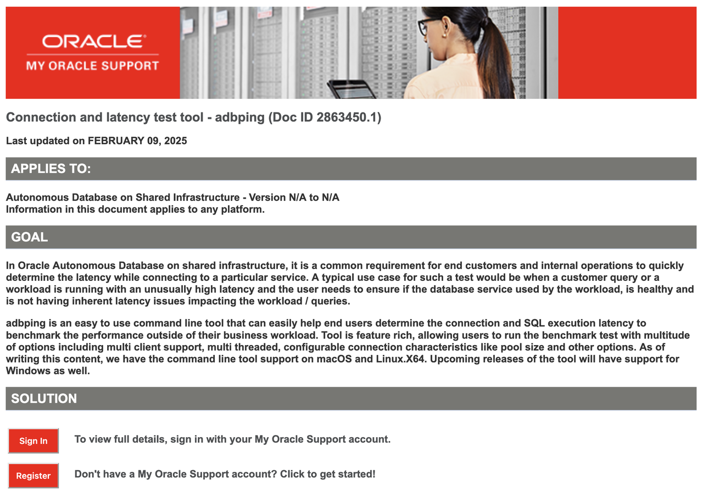

# Latency Test

## Introduction

In Oracle Autonomous Database Serverless, it is a common requirement for end customers and internal operations to quickly determine the latency while connecting to a particular service.

A typical use case for such a test would be when a customer query or a workload is running with an unusually high latency and the user needs to ensure if the database service used by the workload, is healthy and is not having inherent latency issues impacting the workload / queries.

*adbping* is an easy to use command line tool that can easily help end users determine the connection and SQL execution latency to benchmark the performance outside of their business workload.

Tool is feature rich, allowing users to run the benchmark test with multitude of options including multi client support, multi threaded, configurable connection characteristics like pool size and other options.

Estimated Time: 20 Minutes

### Objectives

In this lab, you will:

* Learn where to download *adbping*
* Use *adbping* on ADB.
* Check and compare the latencies.

### Prerequisites

This lab assumes:

* You have completed Lab 1: Initialize Environment

This is an optional lab. You can skip it if you are already familiar with ADBPing.

## Task 1: Download ADBPing

ADBPing tool is available in *My Oracle Support*, on [Doc ID 2863450.1](https://support.oracle.com/epmos/faces/DocContentDisplay?id=2863450.1).



You find the tool in */home/oracle/scripts/*.

1. Use the *yellow* terminal 🟨. Set the environment and unzip the file.

    ``` bash
    <copy>
    . adb

    mkdir -p /home/oracle/adbping

    unzip /home/oracle/scripts/adbping_Linux.X64_230127.zip -d /home/oracle/adbping

    ls -l /home/oracle/adbping
    </copy>

    # Be sure to hit RETURN
    ```

    <details>
    <summary>*click to see the output*</summary>

    ``` text
    $ . adb
    $ mkdir -p /home/oracle/adbping
    $ unzip /home/oracle/scripts/adbping_Linux.X64_230127.zip -d /home/oracle/adbping
    Archive:  /home/oracle/scripts/adbping_Linux.X64_230127.zip
    inflating: /home/oracle/adbping/adbping
    inflating: /home/oracle/adbping/ConnectAndSQLExecTest.class
    inflating: /home/oracle/adbping/ConnectAndSQLExecTest$Worker.class
    inflating: /home/oracle/adbping/ojdbc8.jar
    inflating: /home/oracle/adbping/oraclepki.jar
    inflating: /home/oracle/adbping/osdt_cert.jar
    inflating: /home/oracle/adbping/osdt_core.jar
    creating: /home/oracle/adbping/rootwallet_for_onewaytls/
    creating: /home/oracle/adbping/samples/
    creating: /home/oracle/adbping/samples/java_client/
    inflating: /home/oracle/adbping/samples/java_client/simplequery.sql
    extracting: /home/oracle/adbping/samples/java_client/simpleinsert.sql
    creating: /home/oracle/adbping/samples/sqlplus_client/
    inflating: /home/oracle/adbping/samples/sqlplus_client/createfunc.sql
    inflating: /home/oracle/adbping/samples/sqlplus_client/simplequery.sql
    inflating: /home/oracle/adbping/samples/sqlplus_client/anonblock.sql
    extracting: /home/oracle/adbping/samples/sqlplus_client/simpleinsert.sql
    inflating: /home/oracle/adbping/samples/sqlplus_client/large_resultset.sql
    inflating: /home/oracle/adbping/ucp.jar
    $ ls -l /home/oracle/adbping
    total 13176
    -rwxr-xr-x. 1 oracle oinstall 7080448 Jan 27  2023  adbping
    -rw-r--r--. 1 oracle oinstall    4458 Jan 27  2023 'ConnectAndSQLExecTest$Worker.class'
    -rw-r--r--. 1 oracle oinstall    9528 Jan 27  2023  ConnectAndSQLExecTest.class
    -rwxrwxrwx. 1 oracle oinstall 4161744 Jan 27  2023  ojdbc8.jar
    -rwxrwxrwx. 1 oracle oinstall  307817 Jan 27  2023  oraclepki.jar
    -rwxrwxrwx. 1 oracle oinstall  203111 Jan 27  2023  osdt_cert.jar
    -rwxrwxrwx. 1 oracle oinstall  306854 Jan 27  2023  osdt_core.jar
    drwxr-xr-x. 2 oracle oinstall       6 Jan 27  2023  rootwallet_for_onewaytls
    drwxr-xr-x. 4 oracle oinstall      47 Jan 27  2023  samples
    -rwxrwxrwx. 1 oracle oinstall 1398331 Jan 27  2023  ucp.jar
    ```

    </details>

## Task 2: Generate ADBPing report for ADB

ADBPing can evaluate multiple connection methods, like Java or SQL*Plus. It connects and execute a simple query (`select 1 from dual`) as many times it can for a period. Based on timings on the executions, it generates a report.

1. Execute *adbping* for *SAPPHIRE* ADB and check the SQL*Plus method.

    ``` bash
    <copy>
    . adb

    cd ~/adbping/

    ./adbping -u admin -p Welcome_1234 -w $TNS_ADMIN -c sqlplus -s sapphire_tp -d 10 -t 10
    </copy>

    # Be sure to hit RETURN
    ```

    * The tool runs the test for 10 seconds (*-d 10*).
    * It opens 10 threads in parallel (*-t 10*).

    <details>
    <summary>*click to see the output*</summary>

    ``` text
    $ ./adbping -u admin -p Welcome_1234 -w $TNS_ADMIN -c sqlplus -s sapphire_tp -d 10 -t 10
    +++Test Summary+++
       Test Client: sqlplus
       Number of concurrent threads: 10
       Duration (secs): 10
       SQL executed: select 1 from dual;
       Pass: 670 Fail: 0
       Test start date: 2025-07-01 15:01:25.454593+00:00
       Test end date: 2025-07-01 15:01:35.548338+00:00
       SQL Execution Time(ms) : Min:0 Max:10 Avg:0.478 Median:0 Perc90:0 Perc95:0 Perc99:10
       Connect + SQL Execution Time(ms) : Min:104.76 Max:304.012 Avg:127.897 Median:125.965 Perc90:135.369 Perc95:137.86 Perc99:261.863
    ```

    </details>

    * In 10 seconds, 670 times the session was opened and *select 1 from dual* was executed.
    * The time to execute each SQL was avg 0.478 ms. This is less than 1 ms, which is very fast.
    * The time to connect and execute was about 127 ms.
    * The connection time accounted almost 100% of the total time.

2. Execute the same check, now using the Java method.

    ``` bash
    <copy>
    ./adbping -u admin -p Welcome_1234 -w $TNS_ADMIN -c java -s sapphire_tp -d 10 -t 10
    </copy>
    ```

    * *-c java* tells the tool to use a Java connection instead.

    <details>
    <summary>*click to see the output*</summary>

    ``` text
    $ ./adbping -u admin -p Welcome_1234 -w $TNS_ADMIN -c java -s sapphire_tp -d 10 -t 10
    +++Test Summary+++
       Test Client: java
       Number of concurrent threads: 10
       Duration (secs): 10
       SQL executed: select 1 from dual;
       Pass: 123896 Fail: 0
       Test start date: 2025-07-01 15:09:39.354181+00:00
       Test end date: 2025-07-01 15:09:54.074017+00:00
       Java connection pool Stats: Initsize:10, Maxsize:10, Pool setup time(ms):2391.163
       SQL Execution Time(ms) : Min:0.108 Max:1052.673 Avg:0.826 Median:0.213 Perc90:0.302 Perc95:0.336 Perc99:0.458
       Connect + SQL Execution Time(ms) : Min:0.114 Max:1052.705 Avg:0.858 Median:0.235 Perc90:0.355 Perc95:0.392 Perc99:0.582
    ```

    </details>

    * Java connects once and create a connection pool, that saves all the time it takes for the authentication handshake process.
    * In 10 seconds, 123896 times the session was opened and *select 1 from dual* was executed. This is almost 200x more than using SQL*Plus method.
    * The time to execute each SQL was avg 0.826 ms, less than 1 ms, which is still very fast.
    * The time to connect and execute was about 0.858 ms.
    * The connection time accounted less than 1% of the total time now.
    * Reason for all this gain is because Java will connect once and use a pool to run the statements.

## Task 3: Compare result with current PDBs

Even though ADBPing was a tool created to check latency for ADB, it can also be used to connect in any oracle database, including the local ones.

In this lab, we will run it against the *BLUE* PDB and compare the results with the previously gathered for *SAPPHIRE*.

1. Execute *adbping* for *BLUE* PDB, via SQL*Plus method.

    ``` bash
    <copy>
    ./adbping -u system -p oracle -w $TNS_ADMIN -c sqlplus -s //localhost:1521/blue -d 10 -t 2
    </copy>
    ```

    * Checking how many times in 10 seconds (*-d 10*) we can execute a simple SQL (*select 1 from dual*).
    * Connecting to ADB using "sqlplus".
    * Opening 2 threads (*-t 2*) in parallel.
    * We only 2 parallel process or we may cause starvation on the local connection resources.

    <details>
    <summary>*click to see the output*</summary>

    ``` text
    $ ./adbping -u system -p oracle -w $TNS_ADMIN -c sqlplus -s //localhost:1521/blue -d 10 -t 2
    +++Test Summary+++
       Test Client: sqlplus
       Number of concurrent threads: 2
       Duration (secs): 10
       SQL executed: select 1 from dual;
       Pass: 380 Fail: 0
       Test start date: 2025-07-01 17:20:48.866061+00:00
       Test end date: 2025-07-01 17:20:58.895275+00:00
       SQL Execution Time(ms) : Min:0 Max:10 Avg:0.368 Median:0 Perc90:0 Perc95:0 Perc99:10
       Connect + SQL Execution Time(ms) : Min:46.792 Max:62.586 Avg:49.405 Median:48.921 Perc90:50.691 Perc95:52.303 Perc99:60.038
    ```

    </details>

    * In 10 seconds, 380 times the session was opened and *select 1 from dual* was executed.
    * The time to execute each SQL was avg 0.368 ms.
    * This was about the same time it took in ADB.
    * The time to connect and execute was about 49 ms.
    * The connection time accounted almost 100% of the total time.
    * It took 2.5x more time to stablish SQL*Plus connection on *SAPPHIRE* ADB than on the local *BLUE* PDB.

2. Execute *adbping* for *BLUE* PDB, via Java method. This time on the local PDB.

    ``` bash
    <copy>
    ./adbping -u system -p oracle -w $TNS_ADMIN -c java -s //localhost:1521/blue -d 10 -t 10
    </copy>
    ```

    * This command is similar to the previous one. However, this time we connect using Java method.

    <details>
    <summary>*click to see the output*</summary>

    ``` text
    $ ./adbping -u system -p oracle -w $TNS_ADMIN -c java -s //localhost:1521/blue -d 10 -t 10
    +++Test Summary+++
       Test Client: java
       Number of concurrent threads: 10
       Duration (secs): 10
       SQL executed: select 1 from dual;
       Pass: 555099 Fail: 0
       Test start date: 2025-07-01 17:29:20.502776+00:00
       Test end date: 2025-07-01 17:29:35.560124+00:00
       Java connection pool Stats: Initsize:10, Maxsize:10, Pool setup time(ms):837.821
       SQL Execution Time(ms) : Min:0.074 Max:8.441 Avg:0.145 Median:0.131 Perc90:0.194 Perc95:0.22 Perc99:0.289
       Connect + SQL Execution Time(ms) : Min:0.079 Max:12.98 Avg:0.162 Median:0.144 Perc90:0.223 Perc95:0.25 Perc99:0.334
    ```

    </details>

    * In 10 seconds, 555099 times the session was opened and *select 1 from dual* was executed.
    * This is about 1500x faster than using SQL*Plus method.
    * This is 3x more than using java method on ADB.
    * The time to execute each SQL was avg 0.145 ms.
    * The time to connect and execute was about 0.162 ms.
    * The connection time accounted less than 1% of the total time.

3. After mesuring and comparing the total latency for ADB vs the local PDB, we can see PDB is faster, specially as the authentication process does not use TLS or mTLS. However, both runs so fast that the difference is only spotted at the sub-milisecond layer.

4. As this difference will not represent any problem to our application, we can move forward with this migration. In case the latency passes any threshold defined by the application team, it would be needed to move the application closer to ADB, before moving forward with the process.

You may now [*proceed to the next lab*](#next).

## Additional information

* [Webinar, Migration to Oracle Autonomous Database, Part 3](https://dohdatabase.com/webinars/)

## Acknowledgments

* **Author** - Rodrigo Jorge
* **Contributors** - William Beauregard, Daniel Overby Hansen, Mike Dietrich, Klaus Gronau, Alex Zaballa
* **Last Updated By/Date** - Rodrigo Jorge, August 2025
