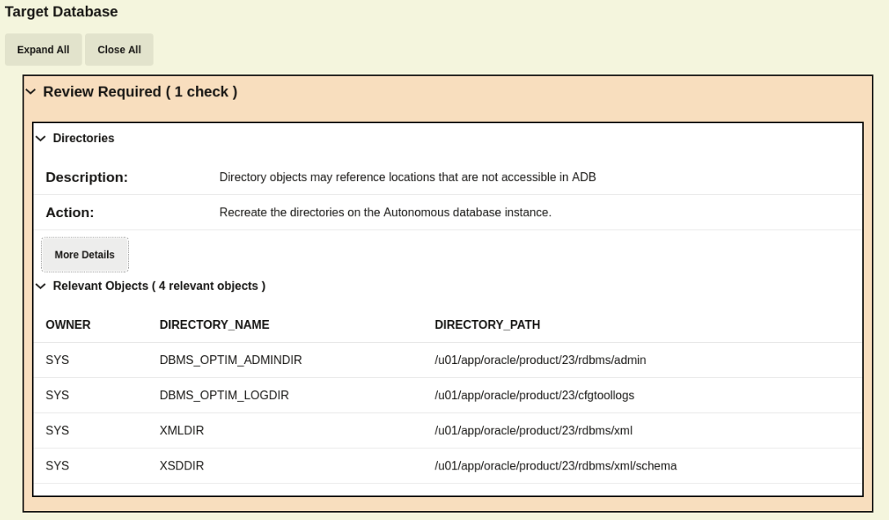

# Check Ruby Migration

## Introduction

When you move complex data around or when you're doing full exports/imports, it's common to find errors in the Data Pump log file. In this lab, you will learn about errors and how to determine whether the *RUBY* import was successful.

Estimated Time: 10 Minutes

### Objectives

In this lab, you will:

* Examine errors and log files
* Compare schemas

### Prerequisites

This lab assumes:

* You have completed Lab 7: Migrate with Data Pump over DB Link

## Task 1: Verify Data Pump errors

During export and import, Data Pump may face errors or situations that can't be resolved.

1. Use the *blue* 🟦 terminal. If Data Pump encounters an error or faces a situation it can't resolve, it will print an error to the console and into the logfile. At the end of the output, Data Pump summarizes and lists the number of errors faced during the job. Examine the last lines of a Data Pump import log file.

    ``` bash
    <copy>
    tail -1 /nfs_mount/schemas_import_dblink.log
    </copy>
    ```

    * The last line for *schemas\_import\_nfs.log* says *successfully completed*.
    * There were no errors.

## Task 2: Revisiting the CPAT checks

1. When we executed CPAT for the *RED* database, the only "Review Required" action that we had for the target database was "Directories".

    

2. However, as all the directories mentioned on this check are Oracle internal and were not in use by the *F1* schema, we are good to go.

3. This is a good opportunity to read the CPAT file for any other finding, including the "Review Suggested" ones.

## Task 3: Comparing source and target data and metadata

After moving data you can perform simple checks to validate the outcome. You will try such on the *F1* schema in the *RUBY* ADB that you imported in lab 7.

1. Still in the *blue* 🟦 terminal, connect to the *RUBY* ADB. This is our target database.

    ``` sql
    <copy>
    . adb
    sql admin/Welcome_1234@ruby_tp
    </copy>

    -- Be sure to hit RETURN
    ```

    * The *RUBY* ADB contains an *F1* schema moved from the *RED* database.

2. Count the number of objects grouped by types in the target database and compare it to the source database.

    ``` sql
    <copy>
    select object_type, count(*) from dba_objects where owner='F1' group by object_type
    minus
    select object_type, count(*) from dba_objects@source_dblink where owner='F1' group by object_type;
    </copy>
    ```

    * *No rows selected* means the count of different object types matches.
    * It does not mean that there are no differences between the source and target.
    * This is just a simple count.

    <details>
    <summary>*click to see the output*</summary>

    ``` text
    SQL> select object_type, count(*) from dba_objects where owner='F1' group by object_type
         minus
         select object_type, count(*) from dba_objects@source_dblink where owner='F1' group by object_type;

    no rows selected
    ```

    </details>

3. If you want to compare the amount of rows, you can do that too.

    ``` sql
    <copy>
    select
       (select count(*) from f1.f1_laptimes@source_dblink) as source,
       (select /*+parallel*/ count(*) from f1.f1_laptimes) as target
    from dual;
    </copy>
    ```

    * You can use parallel query to speed up the process, however, selects over a database link can't use parallel query.
    * For big tables it might be faster to run the query on each database, spool to a file and compare the two files.
    * Counting rows works most efficiently if the table has an index on a column with a NOT NULL constraint, like a primary key index.

    <details>
    <summary>*click to see the output*</summary>

    ``` text
    SOURCE     TARGET
    ---------- ----------
    571047     571047
    ```

    </details>

4. The examples used in this task are not a complete guide. It should give you an idea of how you can use the data dictionary information and queries to compare your source and target environments. Comparing objects becomes more complicated when you have system-generated names for indexes and partitions and when you use Advanced Queueing. The latter because it creates a varying number of objects recursively depending on how you use the queues.

## Task 4: Using DBMS_COMPARISON

The `DBMS_COMPARISON` package allows you to compare the rows of the same table in two different databases.

1. Still in the *blue* 🟦 terminal, and connected to the *RUBY* ADB from the previous task. Create a new comparison.

    ``` sql
    <copy>
    ! cat /home/oracle/scripts/adb-08-dbms_compare.sql

    @/home/oracle/scripts/adb-08-dbms_compare.sql
    </copy>

    -- Be sure to hit RETURN
    ```

    * The code creates a comparison and uses `SCAN_MODE` set to full because it is a small database.
    * If you have bigger tables, you can select just a sample.
    * In the end, it reports the findings for each table.
    * *MATCH* means that the two tables are identical. The migration didn't corrupt any data.

    <details>
    <summary>*click to see the output*</summary>

    ``` text
    SQL> ! cat /home/oracle/scripts/adb-08-dbms_compare.sql
    SET SERVEROUT ON

    DECLARE
      V_COMPARISON_NAME VARCHAR2(128);
      V_RESULT          BOOLEAN;
      V_COMPARISON_OUT  DBMS_COMPARISON.COMPARISON_TYPE;
    BEGIN
      FOR T IN (
        SELECT OWNER, TABLE_NAME
          FROM ALL_TABLES
         WHERE OWNER IN ('F1','HR','PM','IX','SH','BI')
      ) LOOP
        BEGIN
          V_COMPARISON_NAME := 'CMP_' || T.TABLE_NAME;

          -- Drop if exists
          BEGIN
            DBMS_COMPARISON.DROP_COMPARISON(V_COMPARISON_NAME);
          EXCEPTION
            WHEN OTHERS THEN
              NULL;
          END;

          -- Create comparison
          DBMS_COMPARISON.CREATE_COMPARISON(
            COMPARISON_NAME => V_COMPARISON_NAME,
            SCHEMA_NAME => T.OWNER,
            OBJECT_NAME => T.TABLE_NAME,
            DBLINK_NAME => 'SOURCE_DBLINK',
            REMOTE_SCHEMA_NAME => T.OWNER,
            REMOTE_OBJECT_NAME => T.TABLE_NAME,
            SCAN_MODE => DBMS_COMPARISON.CMP_SCAN_MODE_FULL
          );

          -- Run comparison
          V_RESULT := DBMS_COMPARISON.COMPARE(COMPARISON_NAME => V_COMPARISON_NAME, SCAN_INFO => V_COMPARISON_OUT);
          DBMS_OUTPUT.PUT_LINE(T.OWNER || '.' || T.TABLE_NAME || ': ' || CASE
            WHEN V_RESULT THEN
              'MATCH'
            ELSE 'DIFFER'
          END);

        EXCEPTION
          WHEN OTHERS THEN
            DBMS_OUTPUT.PUT_LINE('Error comparing ' || T.TABLE_NAME || ': ' || SQLERRM);
        END;
      END LOOP;
    END;
    /

    SQL> @/home/oracle/scripts/adb-08-dbms_compare.sql
    F1.F1_CONSTRUCTORRESULTS: MATCH
    F1.F1_QUALIFYING: MATCH
    F1.F1_SPRINTRESULTS: MATCH
    F1.F1_PITSTOPS: MATCH
    F1.F1_LAPTIMES: MATCH
    F1.F1_RESULTS: MATCH
    F1.F1_STATUS: MATCH
    F1.F1_CONSTRUCTORSTANDINGS: MATCH
    F1.F1_RACES: MATCH
    F1.F1_CONSTRUCTORS: DIFFER
    F1.F1_CIRCUITS: MATCH
    F1.F1_SEASONS: MATCH
    F1.F1_DRIVERSTANDINGS: MATCH

    PL/SQL procedure successfully completed.
    ```

    </details>

2. Close SQLcl.

    ``` bash
    <copy>
    exit
    </copy>
    ```

You may now [*proceed to the next lab*](#next).

## Additional information

* Webinar, [Data Pump Best Practices and Real World Scenarios, Verification and Checks when you use Data Pump](https://www.youtube.com/watch?v=960ToLE-ZE8&t=4857s)
* [Data Pump Log Analyzer](https://github.com/macsdata/data-pump-log-analyzer)

## Acknowledgments

* **Author** - Rodrigo Jorge
* **Contributors** - William Beauregard, Daniel Overby Hansen, Mike Dietrich, Klaus Gronau, Alex Zaballa
* **Last Updated By/Date** - Rodrigo Jorge, August 2025
