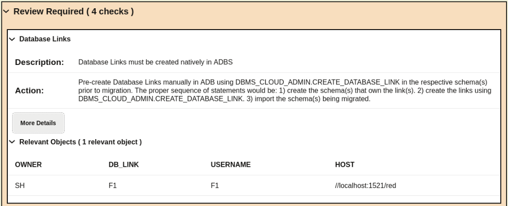
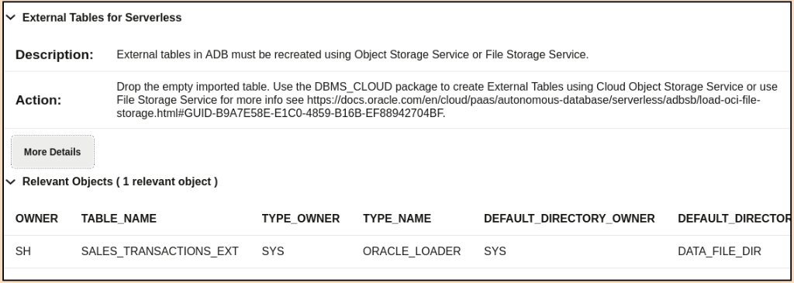
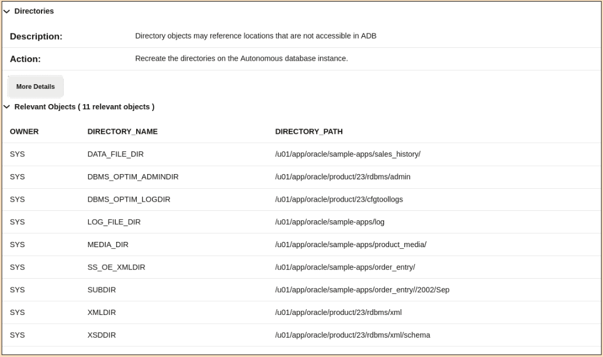

# Check Sapphire Migration

## Introduction

In this lab, we will perform the same post-migration tasks we did for *RUBY*, but now on to determine whether the *SAPHIRE* import was successful.

Estimated Time: 10 Minutes

### Objectives

In this lab, you will:

* Examine errors and log files
* Compare schemas

### Prerequisites

This lab assumes:

* You have completed Lab 6: Migrate with Data Pump over NFS

## Task 1: Verify Data Pump errors

1. Use the *yellow* terminal 🟨. Examine the last lines of a Data Pump import log file.

    ``` bash
    <copy>
    tail -1 /nfs_mount/schemas_import_nfs.log
    </copy>
    ```

    * The last line for *schemas\_import\_nfs.log* says *completed with 1 error*.
    * You need to examine the entire log file if you want to find the details.

    <details>
    <summary>*click to see the output*</summary>

    ``` text
    $ tail -1 /nfs_mount/schemas_import_nfs.log
    02-JUL-25 13:43:11.295: Job "ADMIN"."SYS_IMPORT_SCHEMA_01" completed with 1 error(s) at Wed Jul 2 13:43:11 2025 elapsed 0 00:00:46
    ```

    </details>

2. In the Data Pump NFS import, we experience an error. What is it about it?

    ``` bash
    <copy>
    grep -B 1 -A 2 'ORA-' /nfs_mount/schemas_import_nfs.log
    </copy>
    ```

    * We are getting all lines containing 'ORA-', plus the 1 line before (-B) and 2 lines after (-A) it.
    * Notice there was a *insufficient privileges* error when trying to create a DB Link.

    <details>
    <summary>*click to see the output*</summary>

    ``` text
    02-JUL-25 13:42:30.736: W-1 Processing object type SCHEMA_EXPORT/DB_LINK
    02-JUL-25 13:42:30.809: ORA-31685: Object type DB_LINK:"SH"."F1" failed due to insufficient privileges. Failing sql is:
    CREATE DATABASE LINK "F1"  CONNECT TO "F1" IDENTIFIED BY VALUES ':1'  USING '//localhost:1521/red'
    02-JUL-25 13:42:30.819: W-1      Completed 1 DB_LINK objects in 0 seconds
    ```

    </details>

3. These are just examples of the errors you might encounter. In each situation, you must investigate the situation and determine whether or not it influences the integrity of the data you're moving.

## Task 2: Comparing total rows on Data Pump export/import logs

1. You can also compare total rows returned in both import/export logs. This is a good way for tracking overall missing objects and errors.

    ``` bash
    <copy>
    grep -w exported /nfs_mount/schemas_export.log | grep -w rows | awk '{print $7,$10}' | sort > /nfs_mount/schemas_export_rows.log

    grep -w imported /nfs_mount/schemas_import_nfs.log | grep -w rows | awk '{print $7,$10}' | sort > /nfs_mount/schemas_import_nfs_rows.log

    head /nfs_mount/schemas_export_rows.log

    diff -s /nfs_mount/schemas_export_rows.log /nfs_mount/schemas_import_nfs_rows.log
    </copy>
    ```

    * The commands extract the number of rows exported and imported from the Data Pump log files and store them in separate files.
    * It then prints one of the files - then one with the number of exported rows.
    * Then it uses *diff* to find differences in the files. If the number of rows exported and imported for a given table didn't match, there would be a difference in the files.
    * This is not the case here, so the same amount of rows were exported and imported.
    * This does, however, not say if the content of the rows are actually the same.

    <details>
    <summary>*click to see the output*</summary>

    ``` text
    $ grep -w exported /nfs_mount/schemas_export.log | grep -w rows | awk '{print $7,$10}' | sort > /nfs_mount/schemas_export_rows.log
    $ grep -w imported /nfs_mount/schemas_import_nfs.log | grep -w rows | awk '{print $7,$10}' | sort > /nfs_mount/schemas_import_nfs_rows.log
    $ head /nfs_mount/schemas_export_rows.log
    "HR"."COUNTRIES" 25
    "HR"."DEPARTMENTS" 27
    "HR"."EMPLOYEES" 107
    "HR"."JOB_HISTORY" 10
    "HR"."JOBS" 19
    "HR"."LOCATIONS" 23
    "HR"."REGIONS" 4
    "IX"."AQ$_ORDERS_QUEUETABLE_G" 0
    "IX"."AQ$_ORDERS_QUEUETABLE_H" 0
    "IX"."AQ$_ORDERS_QUEUETABLE_I" 0
    $ diff -s /nfs_mount/schemas_export_rows.log /nfs_mount/schemas_import_nfs_rows.log
    Files /nfs_mount/schemas_export_rows.log and /nfs_mount/schemas_import_nfs_rows.log are identical
    ```

    </details>

## Task 3: Revisiting the CPAT checks

When we executed CPAT for the *BLUE* database, there were some items on the "Review Required" action that we had for the target database:

1. Database Links.

    

2. External Tables.

    

3. Directories.

    

    So it's not a surprise that some issues will need to be fixed after the migration. On the next tasks, we will check and fix them.

    This is also again a good opportunity to read the CPAT file for any other finding, including the "Review Suggested" ones.

## Task 4: Fix the database link error

In ADB Serverless, the syntax to create a database link is different. We must use *DBMS\_CLOUD\_ADMIN* instead for the *CREATE DATABASE LINK* command.

First, this DB Link was connecting from (*BLUE* -> *RED*). As both databases were migrated, now this needs to be changed to connect from (*SAPPHIRE* -> *RUBY*). Also, we need to upload the *RED* wallet to ADB directory.

1. Use the *yellow* terminal 🟨. Let's first connect on ADB:

    ``` sql
    <copy>
    . adb
    sql admin/Welcome_1234@sapphire_tp
    </copy>

    -- Be sure to hit RETURN
    ```

2. Create a directory to keep the wallet files.

    ``` sql
    <copy>
    create directory ruby_dblink_wallet_dir as 'ruby_dblink_wallet_dir';

    grant execute on dbms_cloud to SH;

    grant execute on dbms_cloud_admin to SH;

    grant read on directory ruby_dblink_wallet_dir to SH;
    </copy>

    -- Be sure to hit RETURN
    ```

    <details>
    <summary>*click to see the output*</summary>

    ``` text
    SQL> create directory ruby_dblink_wallet_dir as 'ruby_dblink_wallet_dir';

    Directory RUBY_DBLINK_WALLET_DIR created.

    SQL> grant execute on dbms_cloud to SH;

    Grant succeeded.

    SQL> grant execute on dbms_cloud_admin to SH;

    Grant succeeded.

    SQL> grant read on directory ruby_dblink_wallet_dir to SH;

    Grant succeeded.
    ```

    </details>

3. Next, let's upload the local wallet files to this directory.

    ``` sql
    <copy>
    @~/scripts/adb-07-upload_file.sql /home/oracle/adb_tls_wallet/cwallet.sso RUBY_DBLINK_WALLET_DIR cwallet.sso
    </copy>
    ```

    * *adb-07-upload\_file.sql* will upload a file to an *Oracle Directory* using SQLcl and JavaScript.

    <details>
    <summary>*click to see the output*</summary>

    ``` text
    SQL> @~/scripts/adb-07-upload_file.sql /home/oracle/adb_tls_wallet/cwallet.sso RUBY_DBLINK_WALLET_DIR cwallet.sso
    Starting upload_file.js script...
    Local file path: /home/oracle/adb_tls_wallet/cwallet.sso
    Oracle directory: RUBY_DBLINK_WALLET_DIR
    Target file name: cwallet.sso
    Creating BLOB and opening binary stream...
    Reading local file into stream...
    File read and copied into BLOB stream.
    Saving BLOB to Oracle Directory...
    File successfully written to Oracle directory.
    File uploaded successfully.
    ```

    </details>

4. Check if file was uploaded.

    ``` sql
    <copy>
    select * from dbms_cloud.list_files('ruby_dblink_wallet_dir');
    </copy>
    ```

    <details>
    <summary>*click to see the output*</summary>

    ``` text
    SQL> select * from dbms_cloud.list_files('ruby_dblink_wallet_dir');

    OBJECT_NAME       BYTES CHECKSUM    CREATED                                LAST_MODIFIED
    ______________ ________ ___________ ______________________________________ ______________________________________
    cwallet.sso        3899             02-JUL-25 03.28.11.618341000 PM GMT    02-JUL-25 03.28.11.713437000 PM GMT
    ```

    </details>

5. Now connect as SH user. Create the DB link credentials.

    ``` sql
    <copy>
    conn sh/oracle@sapphire_tp

    begin
      dbms_cloud.create_credential(
        credential_name => 'F1_RUBY_CRED',
        username => 'F1',
        password => 'oracle');
    end;
    /
    </copy>

    -- Be sure to hit RETURN
    ```

    * Please note that *username* and *password* are case sensitive.

    <details>
    <summary>*click to see the output*</summary>

    ``` text
    SQL> conn sh/oracle@sapphire_tp

    Connected.
    SQL> begin
      2    dbms_cloud.create_credential(
      3      credential_name => 'F1_RUBY_CRED',
      4      username => 'F1',
      5      password => 'oracle');
      6  end;
      7* /

    PL/SQL procedure successfully completed.
    ```

    </details>

6. Create the DB link and test it.

    ``` sql
    <copy>
    begin
      dbms_cloud_admin.create_database_link(
        db_link_name => 'F1',
        hostname => 'adb-free',
        port => '1522',
        service_name => 'ruby_tp.adb.oraclecloud.com',
        ssl_server_cert_dn => 'CN=93ced68f921a',
        credential_name => 'F1_RUBY_CRED',
        directory_name => 'RUBY_DBLINK_WALLET_DIR');
    end;
    /

    select count(*) from F1_RESULTS@F1;
    </copy>

    -- Be sure to hit RETURN
    ```

    * To get CN (Common Name), you can run: *openssl x509 -in ~/adb\_tls\_wallet/adb\_container.cert -noout -subject*

    <details>
    <summary>*click to see the output*</summary>

    ``` text
    SQL> begin
      2    dbms_cloud_admin.create_database_link(
      3      db_link_name => 'F1',
      4      hostname => 'adb-free',
      5      port => '1522',
      6      service_name => 'ruby_tp.adb.oraclecloud.com',
      7      ssl_server_cert_dn => 'CN=93ced68f921a',
      8      credential_name => 'F1_RUBY_CRED',
      9      directory_name => 'RUBY_DBLINK_WALLET_DIR');
     10  end;
     11* /

    PL/SQL procedure successfully completed.

    SQL> select count(*) from F1_RESULTS@F1;

       COUNT(*)
    ___________
          26439
    ```

    </details>

7. Close SQLcl.

    ``` bash
    <copy>
    exit
    </copy>
    ```

## Task 5: Comparing objects metadata

Let's now try the same code on the *SAPPHIRE* database. However, we need to create a database link to the source environment first, so we can compare more easily.

1. Still in the *yellow* 🟨 terminal, connect to the *SAPPHIRE* ADB. This is our target database.

    ``` sql
    <copy>
    . adb
    sql admin/Welcome_1234@sapphire_tp
    </copy>

    -- Be sure to hit RETURN
    ```

2. Create a directory to keep the wallet files.

    ``` sql
    <copy>
    create directory blue_dblink_wallet_dir as 'blue_dblink_wallet_dir';
    </copy>
    ```

    <details>
    <summary>*click to see the output*</summary>

    ``` text
    SQL> create directory blue_dblink_wallet_dir as 'blue_dblink_wallet_dir';

    Directory BLUE_DBLINK_WALLET_DIR created.
    ```

    </details>

3. Next, let's upload the local wallet files to this directory.

    ``` sql
    <copy>
    @~/scripts/adb-07-upload_file.sql /home/oracle/client_tls_wallet/cwallet.sso BLUE_DBLINK_WALLET_DIR cwallet.sso
    </copy>
    ```

    * *adb-07-upload\_file.sql* will upload a file to an *Oracle Directory* using SQLcl and JavaScript.

    <details>
    <summary>*click to see the output*</summary>

    ``` text
    SQL> @~/scripts/adb-07-upload_file.sql /home/oracle/client_tls_wallet/cwallet.sso BLUE_DBLINK_WALLET_DIR cwallet.sso
    Starting upload_file.js script...
    Local file path: /home/oracle/client_tls_wallet/cwallet.sso
    Oracle directory: BLUE_DBLINK_WALLET_DIR
    Target file name: cwallet.sso
    Creating BLOB and opening binary stream...
    Reading local file into stream...
    File read and copied into BLOB stream.
    Saving BLOB to Oracle Directory...
    File successfully written to Oracle directory.
    File uploaded successfully.
    ```

    </details>

4. Check if file was uploaded.

    ``` sql
    <copy>
    select * from dbms_cloud.list_files('blue_dblink_wallet_dir');
    </copy>
    ```

    <details>
    <summary>*click to see the output*</summary>

    ``` text
    SQL> select * from dbms_cloud.list_files('blue_dblink_wallet_dir');

    OBJECT_NAME       BYTES CHECKSUM    CREATED                                LAST_MODIFIED
    ______________ ________ ___________ ______________________________________ ______________________________________
    cwallet.sso        3035             02-JUL-25 03.28.11.618341000 PM GMT    02-JUL-25 03.28.11.713437000 PM GMT
    ```

    </details>

5. Create the DB link credentials.

    ``` sql
    <copy>
    begin
      dbms_cloud.create_credential(
        credential_name => 'SYSTEM_BLUE_CRED',
        username => 'SYSTEM',
        password => 'oracle');
    end;
    /
    </copy>
    ```

    * Please note that *username* and *password* are case sensitive.

    <details>
    <summary>*click to see the output*</summary>

    ``` text
    SQL> begin
      2    dbms_cloud.create_credential(
      3      credential_name => 'SYSTEM_BLUE_CRED',
      4      username => 'SYSTEM',
      5      password => 'oracle');
      6  end;
      7* /

    PL/SQL procedure successfully completed.
    ```

    </details>

6. Create the DB link and test it.

    ``` sql
    <copy>
    begin
      dbms_cloud_admin.create_database_link(
        db_link_name => 'SOURCE_DBLINK',
        hostname => 'host.containers.internal',
        port => '1522',
        service_name => 'blue',
        ssl_server_cert_dn => 'CN=holserv1',
        credential_name => 'SYSTEM_BLUE_CRED',
        directory_name => 'BLUE_DBLINK_WALLET_DIR');
    end;
    /

    select * from dual@SOURCE_DBLINK;
    </copy>

    -- Be sure to hit RETURN
    ```

   * host.containers.internal is the hostname of the machine running the BLUE database.

    <details>
    <summary>*click to see the output*</summary>

    ``` text
    SQL> begin
      2    dbms_cloud_admin.create_database_link(
      3      db_link_name => 'SOURCE_DBLINK',
      4      hostname => 'host.containers.internal',
      5      port => '1522',
      6      service_name => 'blue',
      7      ssl_server_cert_dn => 'CN=holserv1',
      8      credential_name => 'SYSTEM_BLUE_CRED',
      9      directory_name => 'BLUE_DBLINK_WALLET_DIR');
     10  end;
     11* /

    PL/SQL procedure successfully completed.

    SQL> select * from dual@SOURCE_DBLINK;

    DUMMY
    ________
    X
    ```

    </details>

7. Count the number of objects grouped by types in the target database and compare it to the source database.

    ``` sql
    <copy>
    select object_type, count(*) from dba_objects where owner in ('HR','PM','IX','SH','BI') group by object_type
    minus
    select object_type, count(*) from dba_objects@source_dblink where owner in ('HR','PM','IX','SH','BI') group by object_type;
    </copy>
    ```

    <summary>*Output:*</summary>

    ``` text
    OBJECT_TYPE       COUNT(*)
    ______________ ___________
    CREDENTIAL               1
    ```

    * The only difference is the extra credential we created for the previous database link.
    * It does not mean that there are no differences between the source and target.
    * This is just a simple count.

8. Also, check the total number of constraints, as they are not on dba_objects, grouped by tables, in the target database and compare it to the source database.

    ``` sql
    <copy>
    select owner, table_name, count(table_name)
    from dba_constraints where owner in ('HR','PM','IX','SH','BI') group by owner, table_name
    minus
    select owner, table_name, count(table_name)
    from dba_constraints@source_dblink where owner in ('HR','PM','IX','SH','BI') group by owner, table_name;
    </copy>
    ```

    <summary>*Output:*</summary>

    ``` text
    no rows selected
    ```

    * Again, it does not mean that there are no differences between the source and target.
    * This is just a simple count.

9. Even though total number of tables match, let's compare now the dba_tables:

    ``` sql
    <copy>
    ! cat /home/oracle/scripts/adb-09-dba_tables-compare.sql

    @/home/oracle/scripts/adb-09-dba_tables-compare.sql
    </copy>

    -- Be sure to hit RETURN
    ```

    <details>
    <summary>*click to see the output*</summary>

    ``` text
    SQL> ! cat /home/oracle/scripts/adb-09-dba_tables-compare.sql
    with src_tab as (select /*+ materialize */ owner,table_name,logging,iot_type,monitoring,segment_created,external from dba_tables@source_dblink where owner in ('F1','HR','PM','IX','SH','BI')),
         dst_tab as (select /*+ materialize */ owner,table_name,logging,iot_type,monitoring,segment_created,external from dba_tables where owner in ('F1','HR','PM','IX','SH','BI'))
    select *
    from (
        (
        select 'src' env, t.* from src_tab t
        minus
        select 'src', t.* from dst_tab t
        )
    union all
        (
        select 'dst' env, t.* from dst_tab t
        minus
        select 'dst', t.* from src_tab t
        )
    )
    order by owner, table_name, env desc
    ;

    SQL> @/home/oracle/scripts/adb-09-dba_tables-compare.sql

    ENV    OWNER    TABLE_NAME                LOGGING    IOT_TYPE        MONITORING    SEGMENT_CREATED    EXTERNAL
    ______ ________ _________________________ __________ _______________ _____________ __________________ ___________
    src    HR       COUNTRIES                            IOT             YES           YES                NO
    dst    HR       COUNTRIES                 YES                        YES           YES                NO
    src    IX       SYS_IOT_OVER_30516        YES        IOT_OVERFLOW    YES           YES                NO
    src    IX       SYS_IOT_OVER_30545        YES        IOT_OVERFLOW    YES           YES                NO
    dst    IX       SYS_IOT_OVER_94231        YES        IOT_OVERFLOW    YES           YES                NO
    dst    IX       SYS_IOT_OVER_94263        YES        IOT_OVERFLOW    YES           YES                NO
    src    SH       SALES_TRANSACTIONS_EXT    YES                        NO            YES                YES
    dst    SH       SALES_TRANSACTIONS_EXT    YES                        YES           NO                 NO

    8 rows selected.
    ```

    </details>

10. From the output, we can check that:

    ``` text
    ENV    OWNER    TABLE_NAME                LOGGING    IOT_TYPE        MONITORING    SEGMENT_CREATED    EXTERNAL
    ______ ________ _________________________ __________ _______________ _____________ __________________ ___________
    src    HR       COUNTRIES                            IOT             YES           YES                NO
    dst    HR       COUNTRIES                 YES                        YES           YES                NO
    src    IX       SYS_IOT_OVER_30516        YES        IOT_OVERFLOW    YES           YES                NO
    src    IX       SYS_IOT_OVER_30545        YES        IOT_OVERFLOW    YES           YES                NO
    dst    IX       SYS_IOT_OVER_94231        YES        IOT_OVERFLOW    YES           YES                NO
    dst    IX       SYS_IOT_OVER_94263        YES        IOT_OVERFLOW    YES           YES                NO
    src    SH       SALES_TRANSACTIONS_EXT    YES                        NO            YES                YES
    dst    SH       SALES_TRANSACTIONS_EXT    YES                        YES           NO                 NO
    ```

    * *HR.COUNTRIES* was IOT in source but was converted to HEAP on target.

        Index-organized tables are not supported, but attempting to create one does not generate an error.
        Instead, a heap-organized table with a primary key index is created.
        Therefore, if you use index-organized tables, you should test the applications that use index-organized tables to confirm that they work using heap-organized tables with a primary key indexes.

    * *SH.SALES\_TRANSACTIONS\_EXT* was an EXTERNAL in source but was converted to HEAP on target.

        This is a problem we have to fix.

    * *SYS\_IOT\_OVER\_NNNNN* tables are internal objects that only differ on the sequence and can be ignored.

        This can be ignored.

## Task 6: Fix the Directories issue

When we perform a Data Pump schema export/import, directories are not moved as those objects are owner by SYS. On the CPAT report, we could check there are some directories that are used by those schemas. As External Tables depends on Directories, let's fix it first.

1. Create same directories as source database:

    Let's check the directories that needs to be created:

    ``` sql
    <copy>
    select grantee,directory_name,directory_path,privilege
    from dba_tab_privs@source_dblink t1, dba_directories@source_dblink t2
    where t1.table_name = t2.directory_name
    and   t1.grantee in ('HR','PM','IX','SH','BI');
    </copy>
    ```

    <summary>Output</summary>

    ``` text
    GRANTEE    DIRECTORY_NAME    DIRECTORY_PATH                                PRIVILEGE
    __________ _________________ _____________________________________________ ____________
    SH         DATA_FILE_DIR     /u01/app/oracle/sample-apps/sales_history/    READ
    PM         MEDIA_DIR         /u01/app/oracle/sample-apps/product_media/    READ
    SH         LOG_FILE_DIR      /u01/app/oracle/sample-apps/log               READ
    SH         LOG_FILE_DIR      /u01/app/oracle/sample-apps/log               WRITE
    ```

    Create directories and grant permissions to users:

    ``` sql
    <copy>
    create directory data_file_dir as 'sample-apps/sales_history';

    grant read on directory data_file_dir to SH;

    create directory log_file_dir as 'sample-apps/log';

    grant read,write on directory log_file_dir to SH;

    create directory media_dir as 'sample-apps/product_media';

    grant read on directory log_file_dir to PM;

    grant read on directory data_pump_dir to SH;
    </copy>

    -- Be sure to hit RETURN
    ```

    * Please note we also added *DATA\_PUMP\_DIR* as this is a requirement for external tables as of 23.8.

    <details>
    <summary>*click to see the output*</summary>

    ``` text
    SQL> create directory data_file_dir as 'sample-apps/sales_history';

    Directory DATA_FILE_DIR created.

    SQL> grant read on directory data_file_dir to SH;

    Grant succeeded.

    SQL> create directory log_file_dir as 'sample-apps/log';

    Directory LOG_FILE_DIR created.

    SQL> grant read,write on directory log_file_dir to SH;

    Grant succeeded.

    SQL> create directory media_dir as 'sample-apps/product_media';

    Directory MEDIA_DIR created.

    SQL> grant read on directory log_file_dir to PM;

    Grant succeeded.

    SQL> grant read on directory data_pump_dir to SH;

    Grant succeeded.

    SQL>
    ```

    </details>

## Task 7: Fix the External Table issue

In ADB Serverless, the syntax to create an external table is different. We must use DBMS\_CLOUD. Let's fix it.

1. Let's first check if the objects are really different on ADB:

    ``` sql
    <copy>
    select count(*) from sh.sales_transactions_ext;

    select count(*) from sh.sales_transactions_ext@source_dblink;
    </copy>

    -- Be sure to hit RETURN
    ```

    * The heap table created on the ADB has no rows on it.

    <details>
    <summary>*click to see the output*</summary>

    ``` text
    SQL> select count(*) from sh.sales_transactions_ext;

       COUNT(*)
    ___________
              0

    SQL> select count(*) from sh.sales_transactions_ext@source_dblink;

       COUNT(*)
    ___________
         916039

    ```

    </details>

2. Now, switch to the *blue* 🟦 terminal. Set the environment to *ADB* and get the DDL for this table.

    ``` bash
    <copy>
    . adb

    impdp userid=admin/Welcome_1234@sapphire_tp \
    directory=nfs_dir \
    dumpfile=schemas_export_%L.dmp \
    sqlfile=sh.sales_transactions_ext.sql \
    tables=sh.sales_transactions_ext

    cat /nfs_mount/sh.sales_transactions_ext.sql
    </copy>

    # Be sure to hit RETURN
    ```

    * The heap table created on the ADB has no rows on it.

    <details>
    <summary>*click to see the output*</summary>

    ``` text
    $ impdp userid=admin/Welcome_1234@sapphire_tp \
    > directory=nfs_dir \
    > dumpfile=schemas_export_%L.dmp \
    > sqlfile=sh.sales_transactions_ext.sql \
    > tables=sh.sales_transactions_ext

    Import: Release 23.0.0.0.0 - for Oracle Cloud and Engineered Systems on Thu Jul 3 20:06:48 2025
    Version 23.9.0.25.07

    Copyright (c) 1982, 2025, Oracle and/or its affiliates.  All rights reserved.

    Connected to: Oracle Database 23ai Enterprise Edition Release 23.0.0.0.0 - for Oracle Cloud and Engineered Systems
    Master table "ADMIN"."SYS_SQL_FILE_TABLE_01" successfully loaded/unloaded
    Starting "ADMIN"."SYS_SQL_FILE_TABLE_01":  userid=admin/********@sapphire_tp directory=nfs_dir dumpfile=schemas_export_%L.dmp sqlfile=sh.sales_transactions_ext.sql tables=sh.sales_transactions_ext
    Processing object type SCHEMA_EXPORT/TABLE/TABLE
    Processing object type SCHEMA_EXPORT/TABLE/STATISTICS/TABLE_STATISTICS
    Job "ADMIN"."SYS_SQL_FILE_TABLE_01" successfully completed at Thu Jul 3 20:06:54 2025 elapsed 0 00:00:04

    $ cat /nfs_mount/sh.sales_transactions_ext.sql
    -- CONNECT ADMIN
    ALTER SESSION SET EVENTS '10150 TRACE NAME CONTEXT FOREVER, LEVEL 1';
    ALTER SESSION SET EVENTS '10904 TRACE NAME CONTEXT FOREVER, LEVEL 1';
    ALTER SESSION SET EVENTS '25475 TRACE NAME CONTEXT FOREVER, LEVEL 1';
    ALTER SESSION SET EVENTS '10407 TRACE NAME CONTEXT FOREVER, LEVEL 1';
    ALTER SESSION SET EVENTS '10851 TRACE NAME CONTEXT FOREVER, LEVEL 1';
    GSMADMIN_INTERNAL.DBMS_GSM_UTILITY.TurnOffTrigger routine
    ALTER SESSION SET EVENTS '22830 TRACE NAME CONTEXT FOREVER, LEVEL 192 ';
    -- new object type path: SCHEMA_EXPORT/TABLE/TABLE
    CREATE TABLE "SH"."SALES_TRANSACTIONS_EXT"
       ( "PROD_ID" NUMBER,
         "CUST_ID" NUMBER,
         "TIME_ID" DATE,
         "CHANNEL_ID" NUMBER,
         "PROMO_ID" NUMBER,
         "QUANTITY_SOLD" NUMBER,
         "AMOUNT_SOLD" NUMBER(10,2),
         "UNIT_COST" NUMBER(10,2),
         "UNIT_PRICE" NUMBER(10,2)
       )  DEFAULT COLLATION "USING_NLS_COMP"
       ORGANIZATION EXTERNAL
        ( TYPE ORACLE_LOADER
          DEFAULT DIRECTORY "DATA_FILE_DIR"
          ACCESS PARAMETERS
          ( RECORDS DELIMITED BY NEWLINE CHARACTERSET US7ASCII
        TERRITORY AMERICA
        BADFILE log_file_dir:'ext_1v3.bad'
        LOGFILE log_file_dir:'ext_1v3.log'
        FIELDS TERMINATED BY "|" OPTIONALLY ENCLOSED BY '^' LDRTRIM
        ( PROD_ID         ,
          CUST_ID         ,
          TIME_ID         DATE(10) "YYYY-MM-DD",
          CHANNEL_ID      ,
          PROMO_ID        ,
          QUANTITY_SOLD   ,
          AMOUNT_SOLD     ,
          UNIT_COST       ,
          UNIT_PRICE
        )
     )
          LOCATION
           ( 'sale1v3.dat'
           )
        )
       REJECT LIMIT 100 ;
    -- new object type path: SCHEMA_EXPORT/TABLE/STATISTICS/TABLE_STATISTICS
    -- new object type path: SCHEMA_EXPORT/STATISTICS/MARKER
    ```

    </details>

3. The generate DDL is:

    ```text
    CREATE TABLE "SH"."SALES_TRANSACTIONS_EXT"
       ( "PROD_ID" NUMBER,
         "CUST_ID" NUMBER,
         "TIME_ID" DATE,
         "CHANNEL_ID" NUMBER,
         "PROMO_ID" NUMBER,
         "QUANTITY_SOLD" NUMBER,
         "AMOUNT_SOLD" NUMBER(10,2),
         "UNIT_COST" NUMBER(10,2),
         "UNIT_PRICE" NUMBER(10,2)
       )  DEFAULT COLLATION "USING_NLS_COMP"
       ORGANIZATION EXTERNAL
        ( TYPE ORACLE_LOADER
          DEFAULT DIRECTORY "DATA_FILE_DIR"
          ACCESS PARAMETERS
          ( RECORDS DELIMITED BY NEWLINE CHARACTERSET US7ASCII
        TERRITORY AMERICA
        BADFILE log_file_dir:'ext_1v3.bad'
        LOGFILE log_file_dir:'ext_1v3.log'
        FIELDS TERMINATED BY "|" OPTIONALLY ENCLOSED BY '^' LDRTRIM
        ( PROD_ID         ,
          CUST_ID         ,
          TIME_ID         DATE(10) "YYYY-MM-DD",
          CHANNEL_ID      ,
          PROMO_ID        ,
          QUANTITY_SOLD   ,
          AMOUNT_SOLD     ,
          UNIT_COST       ,
          UNIT_PRICE
        )
     )
          LOCATION
           ( 'sale1v3.dat'
           )
        )
       REJECT LIMIT 100 ;
    ```

    We can see it points to 2 just created directories: *DATA\_FILE\_DIR* and *LOG\_FILE\_DIR*.

4. Now, switch back to the *yellow* terminal 🟨. Next, let's upload the local external table file, *sale1v3.dat*, to the same directory.

    ``` sql
    <copy>
    @~/scripts/adb-07-upload_file.sql /u01/app/oracle/sample-apps/sales_history/sale1v3.dat DATA_FILE_DIR sale1v3.dat
    </copy>
    ```

    * *adb-07-upload\_file.sql* will upload a file to an *Oracle Directory* using SQLcl and JavaScript.

    <details>
    <summary>*click to see the output*</summary>

    ``` text
    SQL> @~/scripts/adb-07-upload_file.sql /u01/app/oracle/sample-apps/sales_history/sale1v3.dat DATA_FILE_DIR sale1v3.dat
    Starting upload_file.js script...
    Local file path: /u01/app/oracle/sample-apps/sales_history/sale1v3.dat
    Oracle directory: DATA_FILE_DIR
    Target file name: sale1v3.dat
    Creating BLOB and opening binary stream...
    Reading local file into stream...
    File read and copied into BLOB stream.
    Saving BLOB to Oracle Directory...
    File successfully written to Oracle directory.
    File uploaded successfully.
    ```

    </details>

5. Check if file was uploaded.

    ``` sql
    <copy>
    select * from dbms_cloud.list_files('data_file_dir');
    </copy>
    ```

    <details>
    <summary>*click to see the output*</summary>

    ``` text
    SQL> select * from dbms_cloud.list_files('data_file_dir');

    OBJECT_NAME          BYTES CHECKSUM    CREATED                                LAST_MODIFIED
    ______________ ___________ ___________ ______________________________________ ______________________________________
    sale1v3.dat       42445678             03-JUL-25 08.40.05.617442000 PM GMT    03-JUL-25 08.40.06.807438000 PM GMT
    ```

    </details>

6. Now connect as SH user. Create the external table and test it.

    ``` sql
    <copy>
    conn sh/oracle@sapphire_tp

    ! cat /home/oracle/scripts/adb-08-sales_transactions_ext.sql

    rename sales_transactions_ext to sales_transactions_ext_old;

    @/home/oracle/scripts/adb-08-sales_transactions_ext.sql

    select count(*) from sales_transactions_ext;
    </copy>

    -- Be sure to hit RETURN
    ```

    <details>
    <summary>*click to see the output*</summary>

    ``` text
    SQL> conn sh/oracle@sapphire_tp

    Connected.
    SQL> ! cat /home/oracle/scripts/adb-08-sales_transactions_ext.sql
    BEGIN
       DBMS_CLOUD.CREATE_EXTERNAL_TABLE(
          table_name =>'SALES_TRANSACTIONS_EXT',
          file_uri_list =>'DATA_FILE_DIR:sale1v3.dat',
          format => json_object (
            'type' value 'csv',
            'characterset' value 'US7ASCII',
            'delimiter' value '|',
            'quote' value '^',
            'endquote' value '^',
            'recorddelimiter' value '''\n''',
            'territory' value 'AMERICA',
            'logdir' value 'LOG_FILE_DIR',
            'rejectlimit' value '100'
            ),
          field_list =>
            'PROD_ID         ,
             CUST_ID         ,
             TIME_ID         DATE(10) "YYYY-MM-DD",
             CHANNEL_ID      ,
             PROMO_ID        ,
             QUANTITY_SOLD   ,
             AMOUNT_SOLD     ,
             UNIT_COST       ,
             UNIT_PRICE',
          column_list =>
             '"PROD_ID" NUMBER,
              "CUST_ID" NUMBER,
              "TIME_ID" DATE,
              "CHANNEL_ID" NUMBER,
              "PROMO_ID" NUMBER,
              "QUANTITY_SOLD" NUMBER,
              "AMOUNT_SOLD" NUMBER(10,2),
              "UNIT_COST" NUMBER(10,2),
              "UNIT_PRICE" NUMBER(10,2)');
       END;
    /

    SQL> rename sales_transactions_ext to sales_transactions_ext_old;

    Table renamed.

    SQL> @/home/oracle/scripts/adb-08-sales_transactions_ext.sql

    PL/SQL procedure successfully completed.

    SQL> select count(*) from sales_transactions_ext;

       COUNT(*)
    ___________
         916039
    ```

    </details>

    Now the external table is fixed and returning the same ammount of rows as on the source environment.

## Task 8: What about the MEDIA_DIR directory?

After creating the missing directories, *DATA\_FILE\_DIR* and *LOG\_FILE\_DIR* were used by the *SH* external table. What about the *MEDIA\_DIR* directory?

Actually, this directory is used by BFILEs of the PM.PRINT\_MEDIA. We need to fix that.

* Note: BFILEs are large data objects stored in the server's operating system files outside the database tablespaces.

1. Still in the *yellow* 🟨 terminal, check the PM.PRINT\_MEDIA table structure.

    ``` sql
    <copy>
    conn admin/Welcome_1234@sapphire_tp

    desc PM.PRINT_MEDIA
    </copy>

    -- Be sure to hit RETURN
    ```

    <details>
    <summary>*click to see the output*</summary>

    ``` text
    SQL> conn admin/Welcome_1234@sapphire_tp
    Connected.

    SQL> desc PM.PRINT_MEDIA

    Name                Null?       Type
    ___________________ ___________ __________________
    PRODUCT_ID          NOT NULL    NUMBER(6)
    AD_ID               NOT NULL    NUMBER(6)
    AD_COMPOSITE                    BLOB
    AD_SOURCETEXT                   CLOB
    AD_FINALTEXT                    CLOB
    AD_FLTEXTN                      NCLOB
    AD_TEXTDOCS_NTAB                TEXTDOC_TAB
    AD_PHOTO                        BLOB
    AD_GRAPHIC                      BINARY FILE LOB
    AD_HEADER                       ADHEADER_TYP

    SQL>
    ```

    </details>

2. Check what are the files and directories refenced by this table.

    ``` sql
    <copy>
    WITH
      FUNCTION GET_DIR_NAME (BF BFILE) RETURN VARCHAR2 IS
        DIR_ALIAS VARCHAR2(255);
        FILE_NAME VARCHAR2(255);
      BEGIN
        IF BF IS NULL THEN
          RETURN NULL;
        ELSE
          DBMS_LOB.FILEGETNAME(BF, DIR_ALIAS, FILE_NAME);
          RETURN DIR_ALIAS || ' ' || FILE_NAME;
        END IF;
      END;
    SELECT GET_DIR_NAME(AD_GRAPHIC)
      FROM PM.PRINT_MEDIA;
    </copy>
    ```

    <summary>*Output:*</summary>

    ``` text
    GET_DIR_NAME(AD_GRAPHIC)
    ___________________________
    MEDIA_DIR monitor.jpg
    MEDIA_DIR mousepad.jpg
    MEDIA_DIR keyboard.jpg
    MEDIA_DIR modem.jpg
    ```

    * There are just 4 files that we need to replicate from the original directory to ADB directory.
    * Ideally, this could be a good opportunity for having this directory now converted to a object storage or NFS.

3. Move the missing files do ADB.

    We need to connect back with ADMIN, as PM user has no *WRITE* privileges under this directory.

    ``` sql
    <copy>
    @~/scripts/adb-07-upload_file.sql /u01/app/oracle/sample-apps/product_media/monitor.jpg MEDIA_DIR monitor.jpg

    @~/scripts/adb-07-upload_file.sql /u01/app/oracle/sample-apps/product_media/mousepad.jpg MEDIA_DIR mousepad.jpg

    @~/scripts/adb-07-upload_file.sql /u01/app/oracle/sample-apps/product_media/keyboard.jpg MEDIA_DIR keyboard.jpg

    @~/scripts/adb-07-upload_file.sql /u01/app/oracle/sample-apps/product_media/modem.jpg MEDIA_DIR modem.jpg
    </copy>

    -- Be sure to hit RETURN
    ```

    * *adb-07-upload\_file.sql* will upload a file to an *Oracle Directory* using SQLcl and JavaScript.

    <details>
    <summary>*click to see the output*</summary>

    ``` text
    SQL> @~/scripts/adb-07-upload_file.sql /u01/app/oracle/sample-apps/product_media/monitor.jpg MEDIA_DIR monitor.jpg
    Starting upload_file.js script...
    Local file path: /u01/app/oracle/sample-apps/product_media/monitor.jpg
    Oracle directory: MEDIA_DIR
    Target file name: monitor.jpg
    Creating BLOB and opening binary stream...
    Reading local file into stream...
    File read and copied into BLOB stream.
    Saving BLOB to Oracle Directory...
    File successfully written to Oracle directory.
    File uploaded successfully.
    SQL> @~/scripts/adb-07-upload_file.sql /u01/app/oracle/sample-apps/product_media/mousepad.jpg MEDIA_DIR mousepad.jpg
    Starting upload_file.js script...
    Local file path: /u01/app/oracle/sample-apps/product_media/mousepad.jpg
    Oracle directory: MEDIA_DIR
    Target file name: mousepad.jpg
    Creating BLOB and opening binary stream...
    Reading local file into stream...
    File read and copied into BLOB stream.
    Saving BLOB to Oracle Directory...
    File successfully written to Oracle directory.
    File uploaded successfully.
    SQL> @~/scripts/adb-07-upload_file.sql /u01/app/oracle/sample-apps/product_media/keyboard.jpg MEDIA_DIR keyboard.jpg
    Starting upload_file.js script...
    Local file path: /u01/app/oracle/sample-apps/product_media/keyboard.jpg
    Oracle directory: MEDIA_DIR
    Target file name: keyboard.jpg
    Creating BLOB and opening binary stream...
    Reading local file into stream...
    File read and copied into BLOB stream.
    Saving BLOB to Oracle Directory...
    File successfully written to Oracle directory.
    File uploaded successfully.
    SQL> @~/scripts/adb-07-upload_file.sql /u01/app/oracle/sample-apps/product_media/modem.jpg MEDIA_DIR modem.jpg
    Starting upload_file.js script...
    Local file path: /u01/app/oracle/sample-apps/product_media/modem.jpg
    Oracle directory: MEDIA_DIR
    Target file name: modem.jpg
    Creating BLOB and opening binary stream...
    Reading local file into stream...
    File read and copied into BLOB stream.
    Saving BLOB to Oracle Directory...
    File successfully written to Oracle directory.
    File uploaded successfully.
    SQL>
    ```

    </details>

4. Check if table now validates the BFILEs.

    ``` sql
    <copy>
    select dbms_lob.fileexists(ad_graphic) from pm.print_media;
    </copy>
    ```

    * The "1" output means that the files could be located.

    <details>
    <summary>*click to see the output*</summary>

    ``` text
    SQL> select dbms_lob.fileexists(ad_graphic) from pm.print_media;

       DBMS_LOB.FILEEXISTS(AD_GRAPHIC)
    __________________________________
                                     1
                                     1
                                     1
                                     1
        ```

    </details>

5. Close SQLcl.

    ``` bash
    <copy>
    exit
    </copy>
    ```

The *BLUE* database schemas are now 100% successfully cloned to the *SAPPHIRE* ADB.

You may now [*proceed to the next lab*](#next).

## Additional information

* Webinar, [Data Pump Best Practices and Real World Scenarios, Verification and Checks when you use Data Pump](https://www.youtube.com/watch?v=960ToLE-ZE8&t=4857s)
* [Data Pump Log Analyzer](https://github.com/macsdata/data-pump-log-analyzer)

## Acknowledgments

* **Author** - Rodrigo Jorge
* **Contributors** - William Beauregard, Daniel Overby Hansen, Mike Dietrich, Klaus Gronau, Alex Zaballa
* **Last Updated By/Date** - Rodrigo Jorge, August 2025
