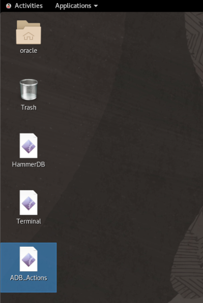
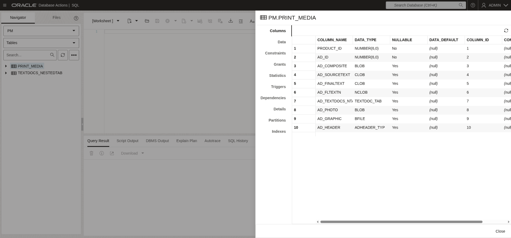
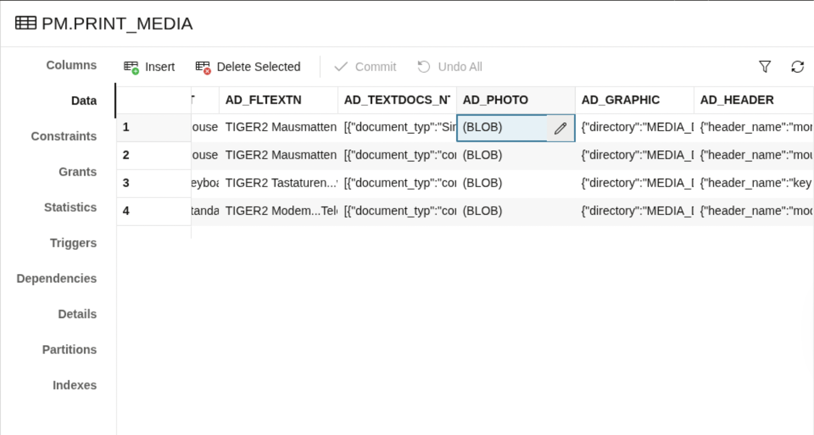
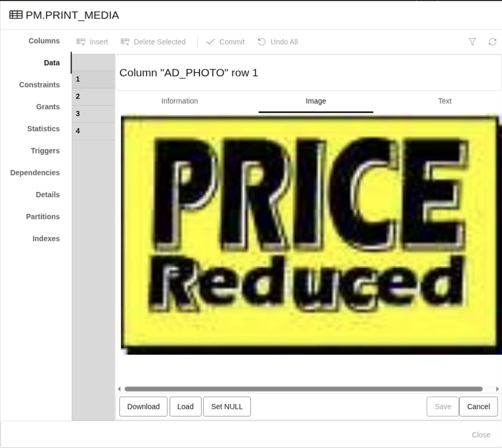
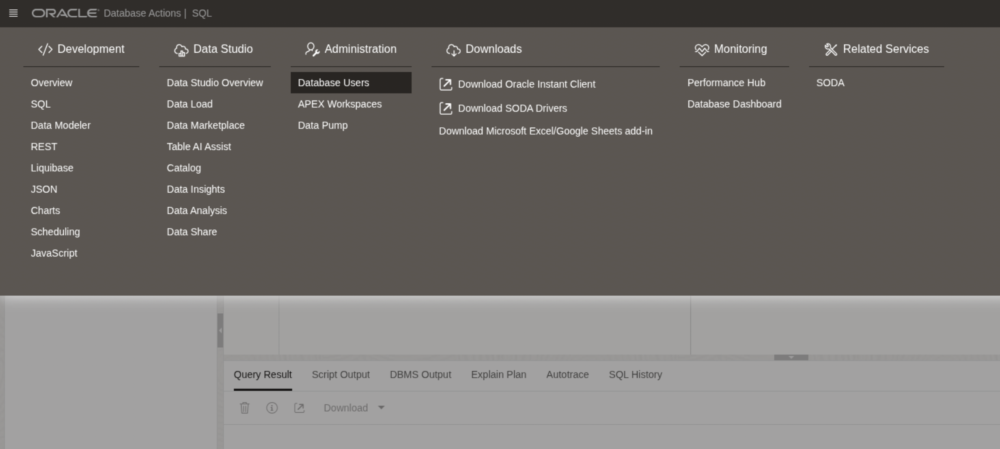
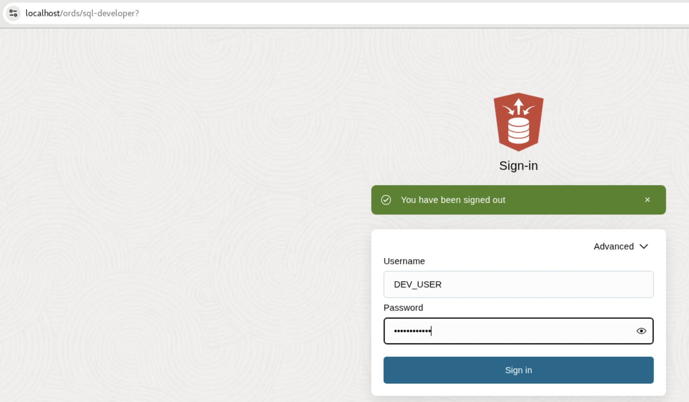
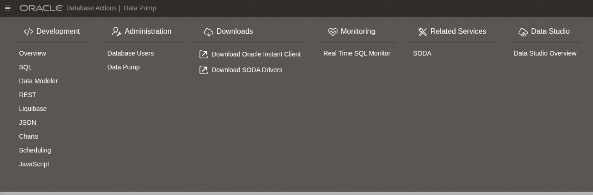
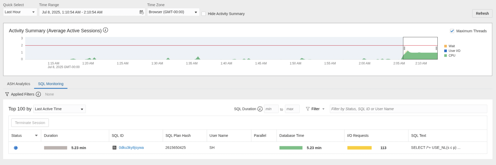

# Database Actions

## Introduction

Database Actions provides a web-based interface with development, data tools, administration, monitoring, and download features for Autonomous Database. In this lab, you will learn ways of performing activities with it, and monitoring Data Pump and dig deeper into the details with tracing.

Estimated Time: 20 Minutes

### Objectives

In this lab, you will:

* View an existing table.
* Create a new user.
* Monitor, troubleshoot and trace performance issues.

### Prerequisites

This lab assumes:

* You have completed Lab 6: Migrate with Data Pump over NFS
* You have completed Lab 7: Migrate with Data Pump over DB Link

## Task 1: Open *Database Actions*

1. Double-click on the *ADB_Actions* shortcut on the desktop.

    

2. On the first tab, connect as *ADMIN* / *Welcome\_1234* .

    

    * Please note that this page may take longer than usual to load the first time it is accessed.
    * You are connecting on *Database Actions* for the *SAPPHIRE* database.
    * The *Database Actions* URL for *RUBY* is: [https://localhost/ords/ruby/sql-developer](https://localhost/ords/ruby/sql-developer)

3. In the main screen or clicking on the *hamburger icon* on the top left, note that *Database Actions* is divided in 6 *Feature Areas*:

    

    As of 23.8, they are:

    * Development

      SQL, Data Modeler, REST, JSON, Charts, Scheduling, Oracle Machine Learning, Graph Studio, and Oracle APEX

    * Data Studio

      Data Load, Catalog, Data Insights, Data Transforms, and Data Analysis

    * Administration

      Database Users, APEX Workspaces, Data Pump, Download Client Credentials, and Set Resource Management Rules

    * Monitoring

      Performance Hub and Database Dashboard

    * Downloads

      Download Oracle Instant Client and Download SODA Drivers

    * Related Services

      Restful Data Services (ORDS) and SODA and Access Oracle Machine Learning Restful Services

    In the next tasks, we will learn how to use some of the ADB features via Web UI.

## Task 2: *Database Actions* | *SQL*

In this task, we will play with the *SQL Navigator*, which looks very familiar to the *SQL Developer* tool.

1. Click on the *hamburger icon* on the top left, and next click on *SQL* under the *Development* group.

    

2. Next, change the currently select schema from *ADMIN* to *PM*.

    

3. Right click on the *PM.PRINT_MEDIA* table and select *OPEN*.

    

    * Note that you can view all table properties from the web UI, like the constraints, grants, statistics, etc

4. Click on "Data", scrool right, click on the pencil icon of *AD_PHOTO* column of *Row 1*.

    

5. Click on the "Image" tab. Note that you can view BLOB column images from there.

    

    * Please note the image can be a different one depending on the order that rows are returned.

6. Click on the "Cancel" and "Close" to leave the column editor.

## Task 3: *Database Actions* | *Database Users*

In this task, we will create another administrator user for this *SAPPHIRE* ADB.

1. Click on the *hamburger icon* on the top left, and next click on *Database Users* under the *Administration* group.

    

2. Click on "+ Create User" on the right. A new screen will open.

    

    Provide the following information:

    * User Name: *DEV\_USER*
    * Password: *Welcome\_1234*
    * Scroll down, enable the *REST, GraphQL, MongoDB API, and Web access* switch.
    * Move to *Granted Roles* tab. Select (mark the first checkbox) for *DB\_DEVELOPER\_ROLE*

3. After filling the information above, click on the *Show code* switch.

    

4. Click "Create User".

5. Click on the "down arrow" in the upper right corner. Select "Sign Out".

6. Let's connect as the newly created *DEV\_USER* (password *Welcome\_1234*).

    

7. Now, click on the *hamburger icon* on the top left menu. Note that some sections like *Performance Hub* and *APEX Workspace* are **not** available.

    

8. Click "Sign Out" on the right top menu and connect back as *ADMIN* (password *Welcome\_1234*).

## Task 4: *Database Actions* | *Performance Hub*

In this task, we will use the *Performance Hub* to check performance issues on the running queries.

1. Click on the *hamburger icon* on the top left, and next click on *Performance Hub* under the *Monitoring* group.

    

    * You need to be connected as *ADMIN*.

2. Keep *Chrome* opened. Move to the *yellow* terminal 🟨 tab. Let's first connect on ADB:

    ``` sql
    <copy>
    . adb
    sql sh/oracle@sapphire_tp
    </copy>

    -- Be sure to hit RETURN
    ```

3. Run a SQL query that is forcing a terrible performance.

    ``` sql
    <copy>
    ! cat ~/scripts/adb-10-sh_query.sql

    @~/scripts/adb-10-sh_query.sql
    </copy>

    -- Be sure to hit RETURN
    ```

    <details>
    <summary>*click to see the output*</summary>

    ``` text
    SQL> ! cat ~/scripts/adb-10-sh_query.sql
    SELECT /*+
        USE_NL(s c p)
        LEADING(s c p)
        FULL(s)
        FULL(c)
        FULL(p)
        NO_PARALLEL
        NO_MERGE
        NO_UNNEST
        NO_SWAP_JOIN_INPUTS
    */
        s.prod_id,
        s.cust_id,
        s.amount_sold,
        c.cust_first_name,
        p.prod_name
    FROM
        sales s,
        customers c,
        products p
    WHERE
        s.cust_id = c.cust_id
        AND s.prod_id = p.prod_id
        AND c.cust_last_name LIKE '%A%' -- kill index use
        AND p.prod_name LIKE '%A%';     -- kill index use

    SQL> @~/scripts/adb-10-sh_query.sql
    ```

    </details>

4. Move back to *Chrome*. Change to the *SQL Monitoring* tab.

    

    * Notice you can view all currently running SQLs.

5. Click on *SQL\_ID 0dku3ky8jsywa*. It will open the *Real-time SQL Monitoring*.

    

    As we can view from the output, 100% of the query time is performing a full table scans on the *CUSTOMERS*, for each row found on sales table (~919k). The plan is indeed terrible.

6. Now that you saw how can we track the queries and plans from the *Database Actions*, you can close *Chrome*.

**Congratulations!** This is the end of the lab.

## Acknowledgments

* **Author** - Rodrigo Jorge
* **Contributors** - William Beauregard, Daniel Overby Hansen, Mike Dietrich, Klaus Gronau, Alex Zaballa
* **Last Updated By/Date** - Rodrigo Jorge, August 2025
