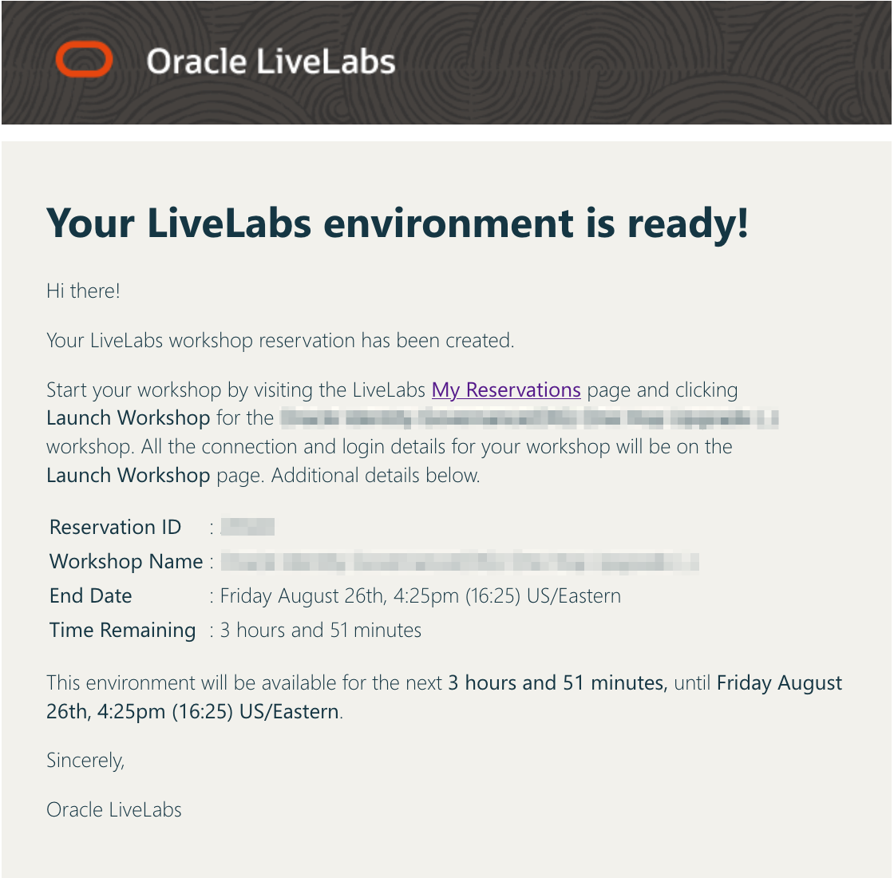
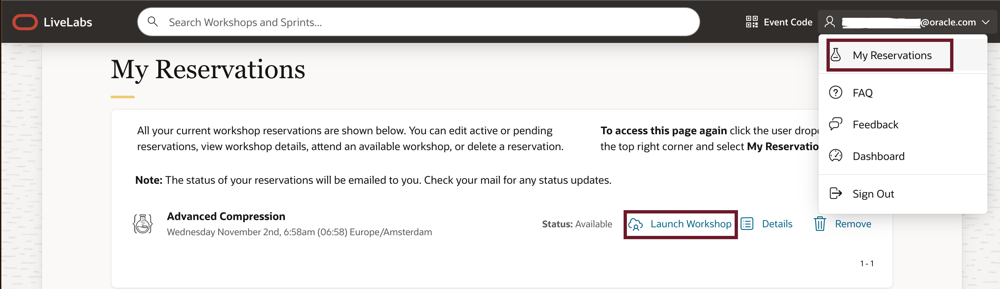
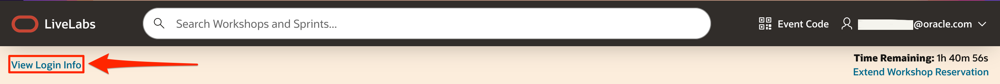
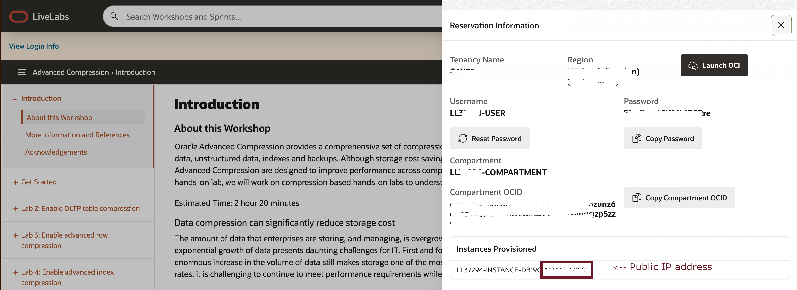
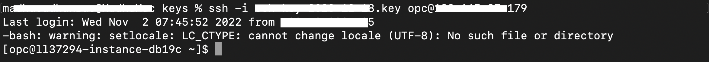
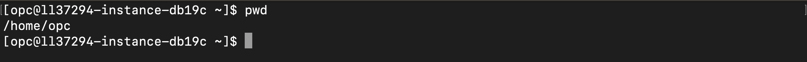

# Get started - LiveLabs login and SSH into Compute Instance

## Introduction

Welcome to your LiveLabs Sandbox environment.
In order to start your workshop, you need to login to our LiveLabs Sandbox.

In this lab, we are going to show you where you can find the login information and how to login to the LiveLabs Sandbox

Estimated Time: 5 minutes

### Objectives

- View login information to LiveLabs Sandbox
- Login to LiveLabs Sandbox


## Task 1: View Login Information

1. After creating a reservation for a LiveLab Workshop, you will receive an e-mail indicating that your reservation is being processed, followed by an e-mail indicating that your environment has been created.

  

  >**Note:** You will receive the second created e-mail just before your selected reservation time.

2. Log into LiveLabs. Click your username, and click **My Reservations**. Then click the **Launch Workshop** link for the Workshop environment you'd like to use. Note that you may have several Workshops listed. 

   

  If you need to view your login information anytime, click **View Login Info**. Click **View Login Info**  

  

  Copy the **public Ip** address displayed on the reservation screen under Instance Provisioned which is required for us to SSH into Database 19c Instance

    

## Task 2: SSH into Database 19c Instance

1. SSH into compute instance directly from your Desktop Machine or Laptop.  change directory to your private key, please note the public key has to be provided during reservation and the same key pair needs to be used to access database instance. 

      ```
      <copy>   
      ssh -i <private key> opc@<public ip>
      </copy>
      ```
  
   

   

You may now **proceed to the next lab**.

## Acknowledgements

- **Created By/Date** - Madhusudhan Rao, Database Product Management, Nov 2022 
- **Last Updated By/Date** -  