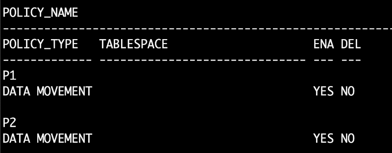

# Enable automatic data optimization

## Introduction

The massive growth in data volume experienced by enterprises introduces significant challenges. Companies must quickly adapt to the changing business landscape without influencing the bottom line. IT managers need to manage their existing infrastructure to control costs efficiently yet deliver extraordinary application performance. Advanced Compression and Oracle Database together provide a robust set of compression, performance, and data storage optimization capabilities that enable IT managers to succeed in this complex environment. Using Advanced Compression, enterprises can efficiently manage their increasing data requirements throughout all components of their data center – minimizing CapEx and OpEx costs while continuing to achieve the highest levels of application performance.

Estimated Time: 20 minutes

### About automatic data optimization

Automatic data optimization allows organizations to create policies that implement data compression and storage tiering automatically. ADO policies define conditions and corresponding actions to be applied to specific objects. Utilizing the information maintained by Heat Map, Oracle Database executes the registered ADO actions, for the requested objects, to move them to the desired state transparently and automatically.

### Key Features 

Exponential data growth has put severe pressure from a cost, performance, scalability and management perspective. It has become imperative to employ more efficient ways of storing and managing data to meet the growing demands on IT systems. The rapid growth in data volumes and associated costs are of significant concern for many companies. The companies have started a global initiative to identify and drive a reduction in storage costs. 
  
*	ADO policies can be specified at the segment level or the row level for tables and partitions. 
*	Segment and row-level ADO policies are evaluated and executed automatically in the background during maintenance windows or executed on demand. 
*	Storage tiering is specified at the segment level and triggered by space pressure in the tablespace where the segment resides. 
 
This Lab will teach you how to enable Automatic Data Optimization. 

### Objectives
 
In this lab, you will:
* Enable automatic data optimization

### Prerequisites 
This lab assumes you have:

* A LiveLabs Cloud account and assigned compartment
* The IP address and instance name for your DB19c Compute instance
* Successfully logged into your LiveLabs account
* A Valid SSH Key Pair
  
## Task 1: Enable automatic data optimization

1.  Create table students 

    ```
    <copy>
    CREATE TABLE students (
        student_id NUMBER , first_name VARCHAR2(128) , last_name VARCHAR2(128) 
        ); 
    </copy>
    ```  

2.  A segment-level ADO policy is created to automatically compress the entire table after there have been no modifications for at least 30 days, using Advanced Row Compression.

    ```
    <copy> 
    ALTER TABLE students ILM ADD POLICY ROW STORE COMPRESS ADVANCED SEGMENT AFTER 30 DAYS OF NO MODIFICATION;
    </copy>
    ```

3. A row-level ADO policy is created to automatically compress blocks in the table, after no rows in the block have been modified for at least 3 days, using Advanced Row Compression..

    ```
    <copy>
    ALTER TABLE students ILM ADD POLICY ROW STORE COMPRESS ADVANCED ROW AFTER 3 DAYS OF NO MODIFICATION;
    </copy>
    ```

4. View user\_ilmpolicies table    

    ```
    <copy>
    select * from user_ilmpolicies;
    </copy>
    ```

    

 
## Task 2: Cleanup

1. When you are finished testing the example, you can clean up the environment by dropping the tables
 
    ```
    <copy>
    drop table students purge; 
    </copy>
    ```
  
    You successfully made it to the end of this lab. 
 
## Learn More
 
* [Oracle advanced compression](https://www.oracle.com/technetwork/database/options/compression/advanced-compression-wp-12c-1896128.pdf) 
 
## Acknowledgements

- **Author** - Madhusudhan Rao, Principal Product Manager, Database
* **Contributors** - Kevin Lazarz, Senior Principal Product Manager, Database and Gregg Christman, Senior Product Manager
* **Last Updated By/Date** -  Madhusudhan Rao, Feb 2022 
