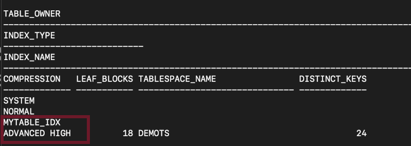

# Enable advanced index compression 

## Introduction

Indexes are used extensively inside OLTP databases since they can efficiently support a wide variety of access paths to the data stored in relational tables. It is prevalent to find many indexes created on a single table to support many access paths for OLTP applications. This can cause indexes to contribute a more significant share to the overall storage of a database when compared to the size of the base tables alone. Advanced Index Compression is a form of index block compression. Creating an index using Advanced Index Compression reduces the size of all supported unique and non-unique indexes while still providing efficient access to the indexes. 

Estimated Time: 20 minutes

### About Advanced index compression

Advanced index compression LOW works well on all supported indexes, including those indexes that are not good candidates (indexes with no duplicate values or few duplicate values for a given number of leading columns of the index) with the existing Prefix Compression feature. Advanced Index Compression HIGH works at the block level to provide the best compression for each block. This means that users do not need knowledge of data characteristics – Advanced Index Compression HIGH automatically chooses the right compression per block.The HIGH level of Advanced Index Compression provides significant space savings while also improving performance for queries that are executed using indexes. Advanced Index Compression LOW and HIGH both provide significant space savings while also improving performance for queries that are executed using indexes.

### Key Features

* Gives higher compression ratios.
* Employs more complex compression algorithms than advanced index compression LOW.
* Stores data in a compression unit, which is a special on-disk format.

### Expectations from adapting a compression technique 

*	Storage costs to drop as the result of any compression deployments, and 
*	No query performance degradation and only minimal Data Manipulation Language (DML) performance impact from compression.
 
This Lab will teach you how to enable advanced index compression. 

### Objectives
 
In this lab, you will:
* Enable Advanced Index Compression 

### Prerequisites 
This lab assumes you have:

* A LiveLabs Cloud account and assigned compartment
* The IP address and instance name for your DB19c Compute instance
* Successfully logged into your LiveLabs account
* A Valid SSH Key Pair
  
## Task 1: Enable advanced index compression

1. create table aud_log 

      ```
      <copy>
      alter session set db_index_compression_inheritance=tablespace;  
      </copy>
      ```  
      Session altered. Create Table Space.
      
      ```
      <copy> 
      create tablespace demots
      datafile 'C:\ORACLE\ORADATA\DB122\DEMO.DBF'
      size 100M
      default index compress advanced high;
      </copy>
      ```

2. create mydemotable.

      ```
      <copy>
      create table mydemotable tablespace demots as
      select *
      from dba_objects;
      </copy>
      ```

3. create index ensure that the tablespace is the one that we created with 'compress advanced high' parameter .

      ```
      <copy>
      create index mytable_idx on mydemotable(owner) tablespace demots;
      </copy>
      ```

4. view  MYDEMOTABLE table data in user_indexes table

      ```
      <copy>
      select TABLE_OWNER, INDEX_TYPE, INDEX_NAME, COMPRESSION,LEAF_BLOCKS, TABLESPACE_NAME, DISTINCT_KEYS
            from user_indexes
            where table_name ='MYDEMOTABLE'; 
      </copy>
      ```

      

## Task 2: Create Materialized View  

1. create materialized view of MYDEMOTABLE and name it as MYDEMOTABLE_MV

      ```
      <copy>
      create materialized view MYDEMOTABLE_MV ROW STORE COMPRESS ADVANCED as select * from MYDEMOTABLE; 
      </copy>
      ```

2. view data in user\_tables

      ```
      <copy>
      SELECT table_name, compression, compress_for, tablespace_name, partitioned FROM user_tables where table_name='MYDEMOTABLE_MV';
      </copy>
      ```

        

## Task 3: Cleanup

1. When you are finished testing the example, you can clean up the environment by dropping the tables
 
      ```
      <copy>
      DROP TABLE MYDEMOTABLE purge; 
      </copy>
      ```
      
      You successfully made it to the end this lab. You may now [proceed to the next lab](#next).    

## Learn More

* [Oracle advanced compression](https://www.oracle.com/technetwork/database/options/compression/advanced-compression-wp-12c-1896128.pdf) 
 
## Acknowledgements

- **Author** - Madhusudhan Rao, Principal Product Manager, Database
* **Contributors** - Kevin Lazarz, Senior Principal Product Manager, Database and Gregg Christman, Senior Product Manager
* **Last Updated By/Date** -  Madhusudhan Rao, Feb 2022 
