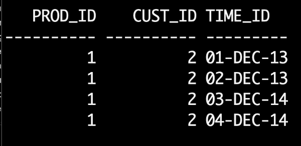
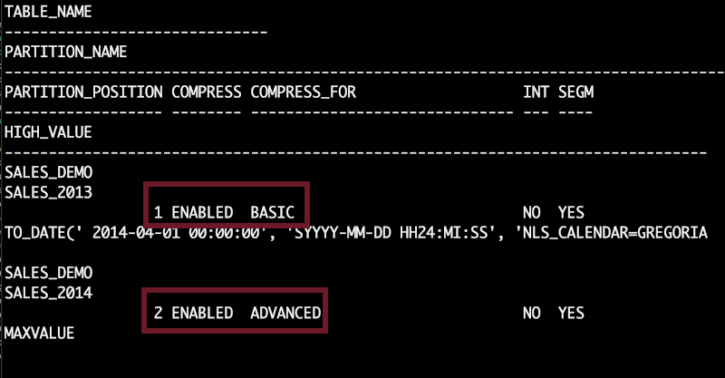
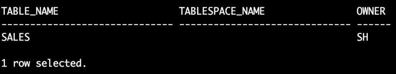
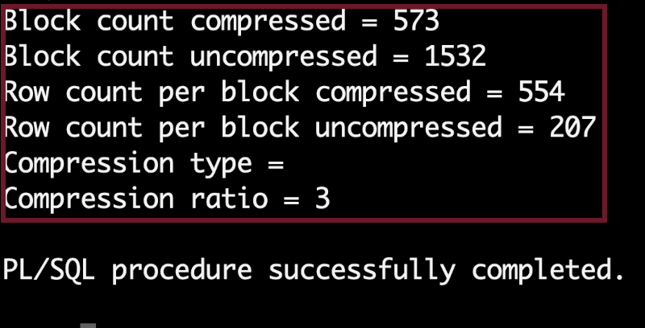

# Enable advanced row compression

## Introduction

Advanced row compression enables table data to be compressed during all types of data manipulation operations, including DML INSERT and UPDATE operations. The intelligent algorithm minimizes compression overhead during write operations, making compression viable for data warehouse and OLTP workloads. The benefits of Advanced row compression go beyond just on-disk storage savings. One significant advantage is Oracle’s ability to read compressed blocks (data and indexes) directly, in memory, without uncompressing the blocks. This helps improve performance due to the reduction in I/O and system calls related to the I/O operations. Further, the buffer cache becomes more efficient by storing more data without adding memory.

Estimated Time: 20 minutes

### About advanced row compression

Advanced row compression uses a unique compression algorithm specifically designed to work with OLTP/DW applications. The algorithm eliminates duplicate values within a database block, even across multiple columns. Compressed blocks contain a structure called a symbol table that maintains compression metadata. When a block is compressed, duplicate values are eliminated by first adding a single copy of the duplicate value to the symbol table. Each duplicate value is then replaced by a short reference to the appropriate entry in the symbol table. Compressed data is self-contained within the database block through this innovative design, as the metadata used to translate compressed data into its original state is stored in the block header. When compared with competing compression algorithms that maintain a global database symbol table, Oracle’s approach offers significant performance benefits by not introducing additional I/O (needed with a global symbol table) when accessing compressed data.

### Data growth challenges 

Exponential data growth has put severe pressure from a cost, performance, scalability and management perspective. It has become imperative to employ more efficient ways of storing and managing data to meet the growing demands on IT systems. The rapid growth in data volumes and associated costs are of significant concern for many companies. The companies have started a global initiative to identify and drive a reduction in storage costs. 

### Expectations from adapting a compression technique 

*	Storage costs to drop as the result of any compression deployments, and 
*	No query performance degradation and only minimal Data Manipulation Language (DML) performance impact from compression.
 
This Lab will teach you how to enable advanced row compression. 

### Objectives
 
In this lab, you will:
* Enable advanced row compression 

### Prerequisites 
This lab assumes you have:

* A LiveLabs Cloud account and assigned compartment
* The IP address and instance name for your DB19c Compute instance
* Successfully logged into your LiveLabs account
* A Valid SSH Key Pair
* Sample Schema has been Setup
  
## Task 1: Enable advanced Row Compression

1. Create table sales with two partitions sales\_2013 which is of Basic compression, and sales\_2014 of advanced row compression 

      ```
      <copy>
         CREATE TABLE sales_demo (
         prod_id     NUMBER     NOT NULL,
         cust_id     NUMBER     NOT NULL,
         time_id     DATE       default sysdate  )
      PCTFREE 5 NOLOGGING NOCOMPRESS
      PARTITION BY RANGE (time_id)
      ( partition sales_2013 values less than (to_date('01-APR-2014','dd-MON-yyyy')) ROW STORE COMPRESS BASIC,
         partition sales_2014 VALUES LESS THAN (MAXVALUE) ROW STORE COMPRESS ADVANCED ); 
      </copy>
      ```  

2. insert few records.

      ```
      <copy> 
      insert into sales_demo (time_id, prod_id, cust_id) values ( date '2013-12-01', 1, 2); 
      </copy>
      ```

      ```
      <copy>  
      insert into sales_demo (time_id, prod_id, cust_id) values ( date '2013-12-02',  1, 2); 
      </copy>
      ```

      ```
      <copy>  
      insert into sales_demo (time_id, prod_id, cust_id) values ( date '2014-12-03',  1, 2); 
      </copy>
      ```

      ```
      <copy>  
      insert into sales_demo (time_id, prod_id, cust_id) values ( date '2014-12-04',  1, 2);
      </copy>
      ```

3. View sales table data.

      ```
      <copy>
      select * from sales_demo;
      </copy>
      ```

      

      View compression for in user\_tab\_partitions.

      ```
      <copy>
      select table_name, partition_name, partition_position, compression, compress_for, interval, segment_created, high_value 
      from user_tab_partitions 
      where table_name = 'SALES_DEMO' 
      order by partition_position; 
      </copy>
      ```

      
 
## Task 2: Create Materialized View 

1. Use the CREATE MATERIALIZED VIEW statement to create a materialized view. A materialized view is a database object that contains the results of a query. The FROM clause of the query can name tables, views, and other materialized views.  

      ```
      <copy>
      create materialized view basic_mv ROW STORE COMPRESS BASIC as select * from SALES_DEMO; 
      </copy>
      ```

      ```
      <copy> 
      create materialized view advanced_mv ROW STORE COMPRESS ADVANCED as select * from SALES_DEMO;
      </copy>
      ``` 

2. you can view compression based on the table name

      ```
      <copy>
      SELECT table_name, compression, compress_for, tablespace_name, num_rows, blocks, partitioned, memoptimize_read, memoptimize_write FROM user_tables where table_name='BASIC_MV';  
      </copy>
      ```

      

      ```
      <copy>
      SELECT table_name, compression, compress_for, tablespace_name, num_rows, blocks, partitioned, memoptimize_read, memoptimize_write FROM user_tables where table_name='ADVANCED_MV';  
      </copy>
      ```

      

## Task 3: View Compressed and Un-compressed blocks

1. View row count of sales table under SH schema which comes along with sample schema setup
 

      ```
      <copy>
      SELECT COUNT(*) FROM SH.SALES; 
      </copy>
      ```

      Row count is 918843

2. Get tablespace name, owner from all_tables, this is optional step   

      ```
      <copy>
      select table_name, tablespace_name, owner from all_tables where table_name='SALES';  
      </copy>
      ```

      

3. Using Advisor – The GET\_COMPRESSION\_RATIO Procedure. Compression advisor typically provides fairly accurate estimates, of the actual compression results that may be obtained, after implementing compression.


      ```
      <copy>
      set serveroutput on
      DECLARE
      blkcnt_cnt pls_integer;
      blkcnt_uncmp pls_integer;
      row_cmp pls_integer;
      row_uncmp pls_integer;
      cmp_ratio pls_integer;
      blkcnt_cmp  PLS_INTEGER;
      comptype_str varchar2(100);
      cmptype_str VARCHAR2(1000);
      BEGIN
      DBMS_COMPRESSION.GET_COMPRESSION_RATIO ('SYSTEM', 'SH', 'SALES', '',
      DBMS_COMPRESSION.COMP_ADVANCED, blkcnt_cmp, blkcnt_uncmp, row_cmp,
      row_uncmp, cmp_ratio, cmptype_str);
      DBMS_OUTPUT.PUT_LINE('Block count compressed = '|| blkcnt_cmp);
      DBMS_OUTPUT.PUT_LINE('Block count uncompressed = '|| blkcnt_uncmp);
      DBMS_OUTPUT.PUT_LINE('Row count per block compressed = '|| row_cmp);
      DBMS_OUTPUT.PUT_LINE('Row count per block uncompressed = '|| row_uncmp);
      DBMS_OUTPUT.PUT_LINE('Compression type = '|| comptype_str);
      DBMS_OUTPUT.PUT_LINE('Compression ratio = '|| cmp_ratio);
      END;
      /
      </copy>
      ```

      
 

## Task 4: Cleanup

1. When you are finished testing the example, you can clean up the environment by dropping the tables
 
      ```
      <copy>
      drop table sales_demo purge;  
      </copy>
      ```

      ```
      <copy> 
      drop materialized view basic_mv ; 
      </copy>
      ```

      ```
      <copy> 
      drop materialized view advanced_mv ;
      </copy>
      ```
      
      You successfully made it to the end this lab. You may now [proceed to the next lab](#next).  

## Learn More

* [Row Compression](https://livesql.oracle.com/apex/livesql/file/content_D84SJGGDXB1SW4HKXVX6BK7N9.html) 
* [DBMS Compression](https://docs.oracle.com/en/database/oracle/oracle-database/19/arpls/DBMS_COMPRESSION.html)
 
## Acknowledgements

- **Author** - Madhusudhan Rao, Principal Product Manager, Database
* **Contributors** - Kevin Lazarz, Senior Principal Product Manager, Database and Gregg Christman, Senior Product Manager
* **Last Updated By/Date** -  Madhusudhan Rao, Feb 2022 