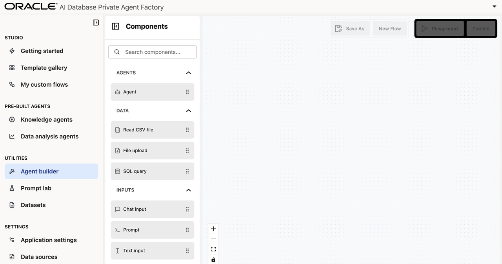
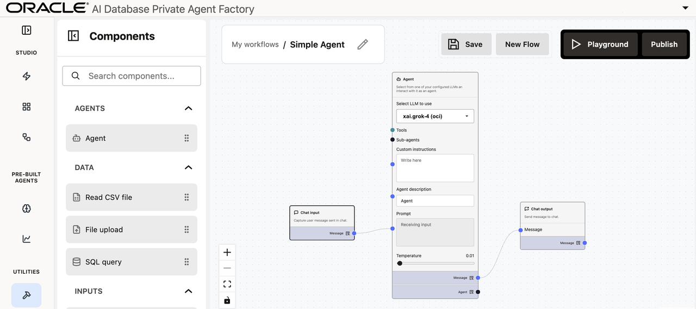
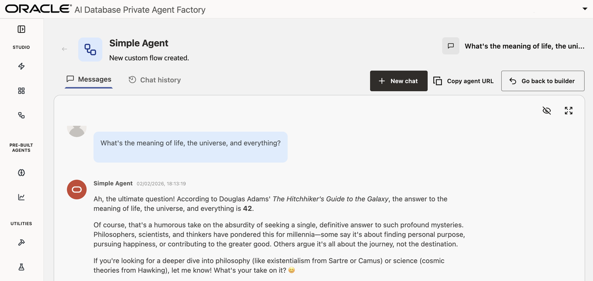
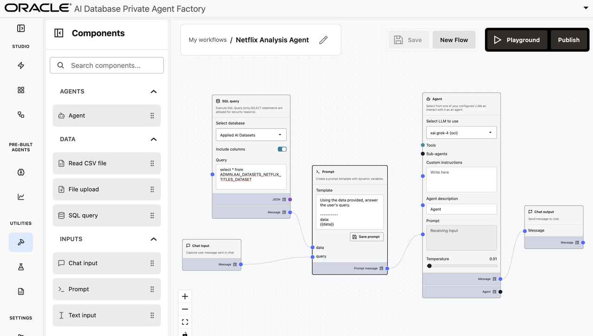
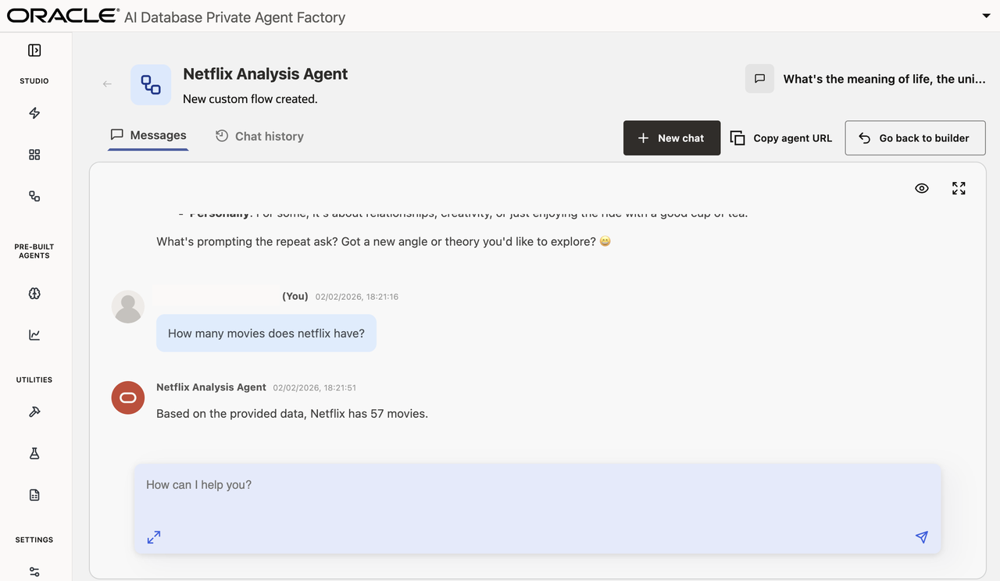

# Agent Builder: Build Agents From Scratch

## Introduction

In this lab session, you will learn how to leverage the Agent Builder within Oracle AI Database Private Agent Factory to accelerate your workflow with minimal setup.

**Estimated time:** 10 minutes.

### Objectives

By the end of this lab, you will be able to:

- Build an agent from scratch using the visual Agent Builder tool
- Publish custom agents

### Prerequisites

* an LLM configuration (grok-4 through OCI Gen AI is recommended)
* The Netflix Dataset imported from the Utilities - Datasets tab on the left-hand menu (This was installed during "Lab 2: Build your First Agent")

## Task 1: Open Agent Builder

Navigate to the **Agent Builder** tab on the left-hand menu. *If there is already an agent configuration present from a previous lab, click **New Flow**.*



## Task 2: Assemble First Agent

### Add components to the canvas

To begin, find the **Chat input** node from the **Components** tool bar. Drag it onto the canvas, or simply click the **+** button.

Next, find the **Agent** component near the top of the menu. Drag that onto the canvas.

Find the **Chat output** node near the bottom of the menu, and drag it onto the canvas.

### Connect components

Drag the blue dot from the **Chat input** component to the **Prompt** field of the agent. 

Then drag the **Message** blue dot on the Agent component to the **Message** dot on the **Chat output** component.

### Name the agent

Click the pencil icon at the top center of the canvas to rename the agent "Simple Agent".



## Task 3: Experiment with First Agent

Click the **Save** button, then click the **Playground** button.

Ask the agent any question to confirm it is working properly.




## Task 4: Add data

### Back to agent Builder

Click the **Go back to Builder** button to return to the Agent Builder.

### Add a data source

Click on the line connecting **Chat input** to **Agent** and hit the *backspace key* on your keyboard to delete the connection.

Find the **SQL query** node and drag it onto the canvas. Within the SQL query node:

* From the drop-down menu under **Select database** select the **Applied AI Datasets** database.
* Check the **Include columns** option.
* Then add the following query: 

```
SELECT * FROM ADMIN.AAI_DATASETS_NETFLIX_TITLES_DATASET
```

### Add a prompt

Now you must create a prompt that can accept the SQL data and the **Chat input**.

First, drag the **Prompt** component onto the canvas.

Next, add the following prompt:

```
Using the data provided, answer the user's query.

----------
data:
{{data}}

----------
query:
{{query}}
```

And click **Save Prompt**.

### Link up agent

* Connect the **Chat input** component to the **Prompt**'s `query` input
* Connect the **SQL query**'s Message node to the **Prompt**'s `data` input
* Connect the **Prompt**'s `Prompt message` output to the **Agent**'s `Prompt` input.



## Task 5: Publish Agent

Now click **Save**. Click **Publish** then **Confirm**.

Finally, click **Playground** and ask your agent a question about the Netflix data.




Congratulations, you are now finished with this workshop. You are ready to begin building agents of your own.

## Acknowledgements

- **Authors** 
* Emilio Perez, Member of Technical Staff, Database Applied AI
* Allen Hosler, Principal Product Manager, Database Applied AI
* Kumar Varun, Senior Principal Product Manager, Database Applied AI

- **Last Updated Date** - February, 2026
