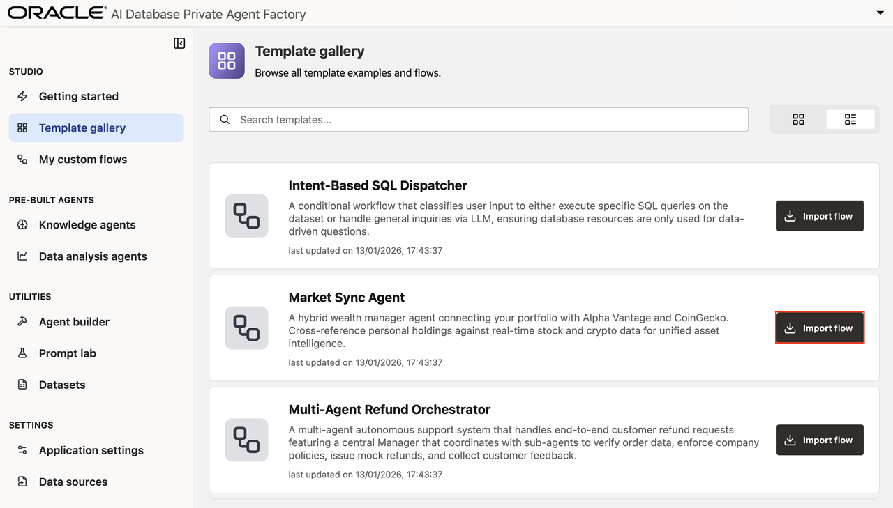
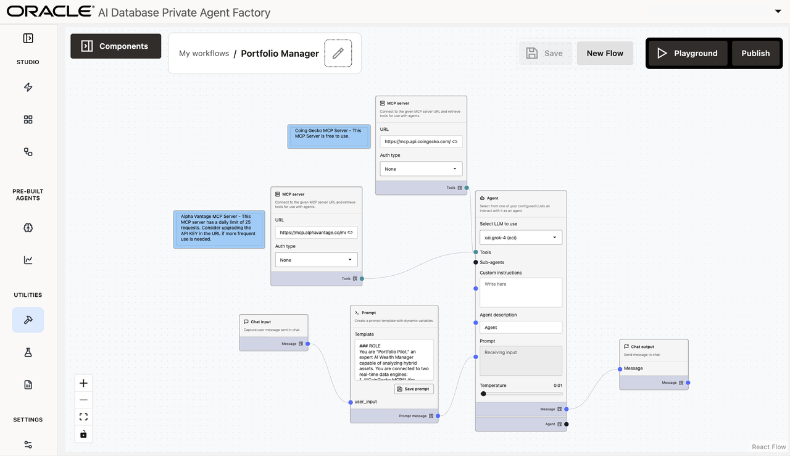
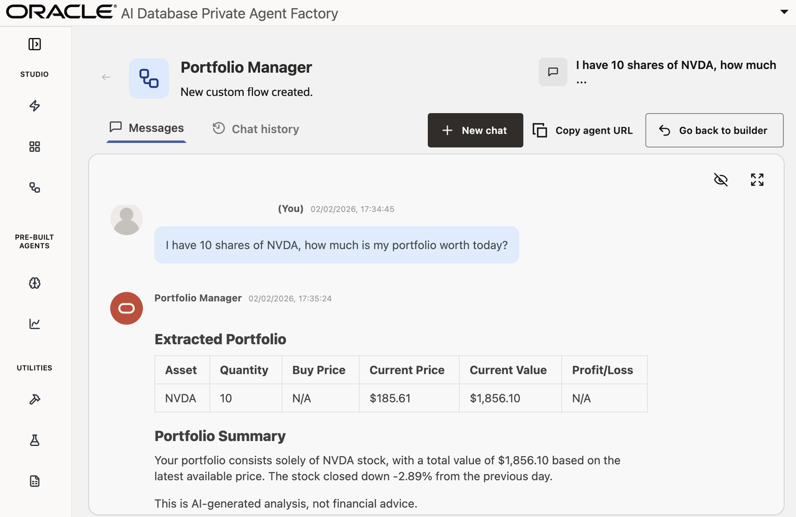

# Agents Built from Custom Templates

## Introduction

Agent Factory provides a number of templates to quickly create sophisticated AI Agents with minimal configuration. In this lab, you explore the template gallery to learn about agent templates and use the **Market Sync Agent** template to create your own agent. 

**Estimated time:** 10 minutes.

### Objectives

By the end of this lab, you will be able to:

- Explore the Template Gallery 
- Import and configure the **Market Sync Agent** template to create your customized agent in Agent Builder

### Prerequisites

* an LLM configuration (grok-4 through OCI Gen AI is recommended)
* an internet connection open from your Agent Factory for MCP (either a NAT Gateway or Internet Gateway)

## Task 1: Explore templates Agent Factory Template Gallery

Navigate the the **Template gallery** tab on the left-hand side.

## Task 2: Import Template

Find the template named **Market Sync Agent** and import it.

    

## Task 3: Understand Agent Builder Interface 

After clicking **Import flow**, you will be taken to the Agent Builder. Here you will see a pre-configured set of boxes and wires.

    > Note: Collapse the left-hand menu and Components menu by clicking the icon at the top.

    

## Task 4: Configure your Agent in Agent Builder

This task will walk through each box and explain how it's contributing to the agentic flow.

**Chat input**: (far left) This box informs the agent that it needs to await a user query from a chat interface. The output of this cell will be whatever the user writes into the chat box.

**Sticky Notes**: (top left, blue) These boxes are simply for reference, and do not contribute to the agnetic flow in any way. Sticky Notes are used for agent builders to leave notes for eachother.

**MCP Servers**: (top left) These boxes are "tools" for agents to call. MCP Severs are a way for agent-compatible systems to interact with agents. In this example we have "alphavantage" and "coingecko" providing realtime pricing data through MCP. Agent nodes will know how to call these MCP Servers to get relevant information.

**Prompt**: (bottom left) This box adds extra context to the user's query to provide better responses. In this case, the prompt is explaining to the agent that it is advising the user on their portfolio, and provides guidance on how it should format responses to the user.

    > Note: Prompts accept incoming text by adding a keyword in double brackets. As an exmaple, the *{{user_input}}* text is given in this prompt which create the *user_input* node on the left of the prompt.

**Agent** (middle) This box does a lot of the heavy lifting:
 * selects the LLM to use (grok-4 is recommended for this lab)
 * allows for 0 or more tools
 * allows for 0 or more sub-agents
 * receives custom instructions
 * receives the prompt
 * provides an output

**Chat input**: (far right) Similar to chat input, the chat output node instructs the agentic flow to return a given text to the user through the chatbot.

## Task 5: Test Agent in Playground and Publish

Before testing the agentic flow, rename it to something more memorable, for example "Portfolio Manager". Had a helpful description for later.

Then click **Playground**.

Now ask a question about your portfolio, for example: "I have 10 shares of NVDA, how much is my portfolio worth today?"

    

## Task 6: Talk to your production agent

Click **Go back to builder** in the top right. Then click **Publish** and **Confirm**.

Now the Agent is published and is accessible via REST. To copy the REST endpoint, click **Playground** and then **Copy agent URL**.

You may now **proceed to the next lab**

## Acknowledgements

- **Authors** 
* Emilio Perez, Member of Technical Staff, Database Applied AI
* Allen Hosler, Principal Product Manager, Database Applied AI
* Kumar Varun, Senior Principal Product Manager, Database Applied AI

- **Last Updated Date** - February, 2026
