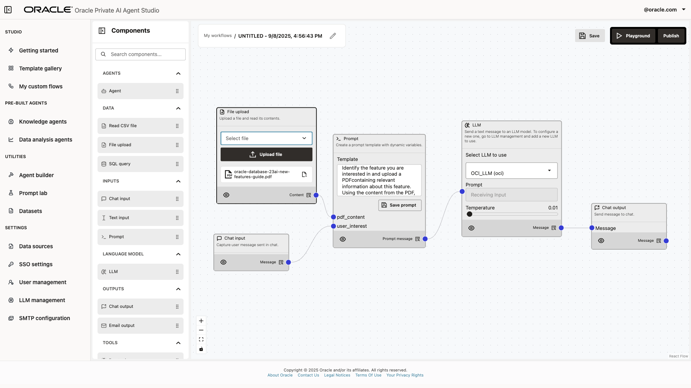
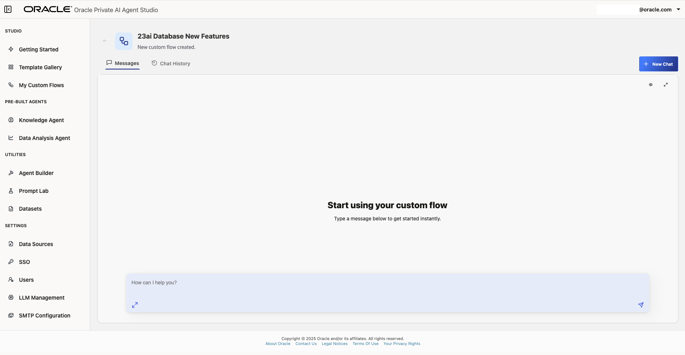

# Agents Built from Custom Templates

## Introduction

In this lab session, you will learn how to leverage the Template Gallery within Oracle AI Database Private Agent Factory to accelerate your workflow with minimal setup.

**Estimated time:** 10 minutes.

### Objectives

By the end of this lab, you will be able to:

- Explore the Template Gallery to identify and utilize pre-built workflow templates for a wide range of automation scenarios.
- Learn how to import and configure templates to quickly deploy AI-powered agents.

### Prerequisites

To follow this tutorial, you need access to an Oracle AI Database Private Agent Factory environment with the necessary permissions to use Template Gallery features. You should also have access to at least one data file (such as a PDF) and an LLM configuration that is available in your environment.

> Note: Screenshots in this tutorial use example files and configurations for illustration purposes. When following along, use resources that are available in your environment.

## Task 1: Create an agent from the Template Gallery

The Template Gallery offers a curated collection of pre-built agentic templates designed to help you get started quickly with intelligent automation.

Templates may include workflows for tasks such as document summarization, meeting note extraction, content transformation, and more. You can browse, search, and import any template that fits your needs, customizing them as needed with minimal configuration.

1. Open Oracle AI Database Private Agent Factory and log in. In the sidebar, click **Template Gallery**.

    

    Here you will find all prebuilt workflows currently offered by Oracle AI Database Private Agent Factory.

2. For this tutorial, we will use the "PDF to Blog Converter" as an example, but you are encouraged to explore other templates based on your needs. Select a template to continue.

    

3. The prebuilt workflow will be displayed and can be customized using a simple drag-and-drop interface, no code required. To help identify the workflow, you can change its name in the top right corner of the canvas. For this example, type a name such as “Blog Post Generator” or another descriptive name of your choice.

    

4. When you import a new workflow, make sure to select your desired LLM provider. You can add different LLM providers on the LLM management section.

    

5. Some templates are designed to process files as inputs, such as PDF files. If the template requires it, use the **Upload File** function to select your file.

    

    You are also able modify the workflow components to suit your needs. For instance, you can remove a node by selecting it and pressing Delete, and you can add a new node by dragging it from the palette and configuring it as needed.

6. Click **Save** and then **Publish** to deploy your customized workflow.

    

## Task 2: Interact with the created workflow

After publishing the workflow, go to your workflow gallery. In the sidebar, click **My Custom Workflows**.

Select your workflow from the gallery. Here, you can edit, delete, or run your custom workflows. To proceed, click **Run Flow**.

Interact with your workflow through the chat interface. Example query prompts will depend on your data source contents. For example, if your document is a product release guide, you could ask about new features described within. The workflow will provide responses based only on the information it has processed from your chosen file.

## Acknowledgements

- **Authors** 
* Emilio Perez, Member of Technical Staff, Database Applied AI
* Allen Hosler, Principal Product Manager, Database Applied AI

- **Last Updated Date** - January, 2026
