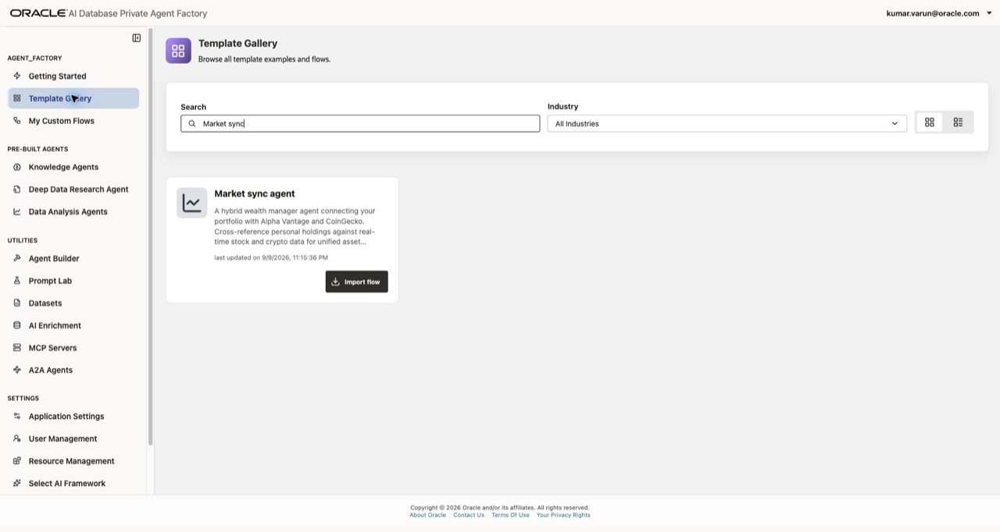
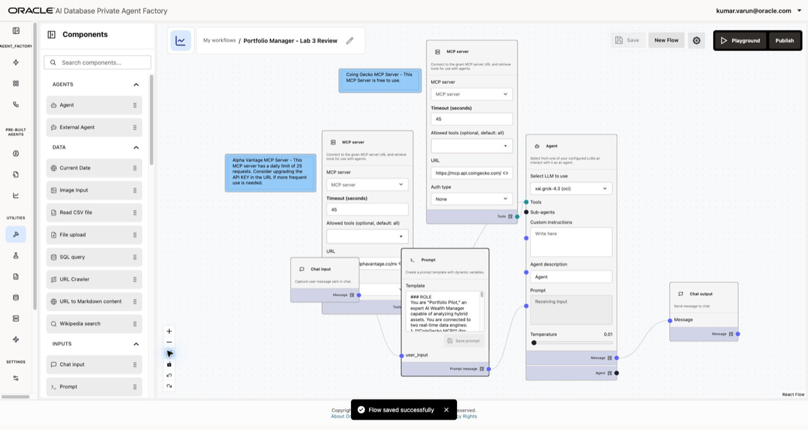
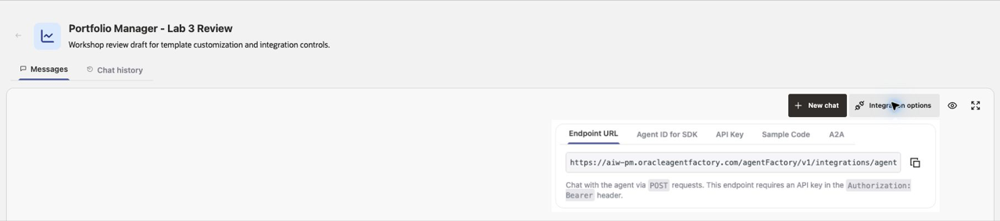

# Build an Agent from a Custom Template

## Introduction

Use the **Market sync agent** template to build a portfolio lookup agent in Oracle AI Database Private Agent Factory. You will inspect its flow, change its prompt, and test how it uses Alpha Vantage for stock prices and CoinGecko for cryptocurrency prices. Publish your flow after verifying its results, then explore how an external application can call it.

**Estimated Time:** 20 minutes

### Objectives

By the end of this lab, you will be able to:

- Import and name a flow from the Template Gallery.
- Explain how the chat, prompt, agent, and MCP server nodes work together.
- Customize the prompt and compare the results in Playground.
- Verify tool results and calculations before publishing.
- Locate the endpoint URL and explain API-key access for a published flow.

### Prerequisites

- Access to the workshop Private Agent Factory instance using the credentials provided by your instructor.
- Permission to create, edit, and publish your own custom flows.
- An instructor-provided language model and working Alpha Vantage and CoinGecko MCP connections. The workshop administrator prepares network access and any required tool credentials.

## Task 1: Import and name the template

1. In the left navigation menu, open **Template Gallery**. Enter `Market sync` in **Search templates...**.

    

2. On the **Market sync agent** card, click **Import flow**. Agent Builder opens with a copy of the template.

3. Click the **Edit** pencil beside the flow name. Enter a name such as `Portfolio Manager - <your-user-id>` and a short description. Click **Save changes**. Use your assigned user ID so your flow is easy to identify in a shared instance.

## Task 2: Inspect the flow and select the workshop model

1. Collapse the application sidebar and the **Components** sidebar to make room for the canvas. Click **fit view** in the canvas controls to see the flow.

    

2. Follow the connections from **Chat input** to **Prompt**, then to **Agent** and **Chat output**. The two **MCP server** nodes connect to the agent's **Tools** input.

    | Node | Role in this flow |
    | --- | --- |
    | Chat input | Receives the message entered in Playground. |
    | Prompt | Combines instructions with the `{{user_input}}` variable. |
    | Agent | Uses the selected language model and calls tools to answer the request. |
    | MCP server: Alpha Vantage | Supplies tools for stock and other market data. |
    | MCP server: CoinGecko | Supplies tools for cryptocurrency data. |
    | Chat output | Returns the agent's response to the chat. |
    | Sticky notes | Explain the template; they do not execute. |

3. In the **Agent** node, check **Select LLM to use**. Select the model specified by your instructor. The imported template may select `xai.grok-4.3 (oci)`; available names and models depend on the instance.

4. Inspect the MCP server nodes and their notes. Keep the instructor-provided connections and credentials. If a model or tool connection is missing, ask the instructor to check the shared resource. Click **Save** in the toolbar if your changes enable it.

## Task 3: Establish a baseline and customize the prompt

1. Click **Playground** and try this stock question:

    ```text
    <copy>
    For a demo portfolio, I have 10 shares of NVDA. Use the stock pricing tool to report the price in USD, its source and timestamp, and the value of the holding.
    </copy>
    ```

2. Note the response format and whether the answer identifies a returned price or an estimate. Use the back arrow at the top of the chat to return to Agent Builder.

3. In the **Prompt** node's **Template** field, find the **EXCEPTION HANDLING** instructions. Replace the instruction that allows estimated values after a tool failure with:

    ```text
    <copy>
    If a tool fails, report which price is unavailable. Do not estimate it or include it in the portfolio total.
    </copy>
    ```

4. Add the following instructions to the template. Keep the existing `User Query: {{user_input}}` text and the `user_input` connection.

    ```text
    <copy>
    ### WORKSHOP RESPONSE FORMAT
    Return a table with Asset, Quantity, Price (USD), Price source, Price timestamp, and Holding value (USD).
    Use only prices returned by the tools. If a price lookup fails, mark the price and holding value as unavailable and exclude that asset from the total.
    Label the total as partial when any lookup fails. Do not invent prices or timestamps.
    Include one brief sentence naming the tools used.
    </copy>
    ```

5. Click **Save prompt** on the node, then **Save** in the toolbar. The prompt controls the response format and failure handling; the MCP connections still supply the pricing tools.

## Task 4: Test both tool paths and verify the results

1. Open **Playground** again and click **New chat**. Repeat the stock question from Task 3. Compare its response with your baseline: it should now use the requested columns and avoid estimated prices when a lookup fails.

2. Start another **New chat** and test the cryptocurrency path:

    ```text
    <copy>
    For a demo portfolio, I have 0.01 BTC. Use the cryptocurrency pricing tool to report the price in USD, its source and timestamp, and the value of the holding.
    </copy>
    ```

3. Review each answer against the returned tool data. Expand tool output or execution details when available; ask the instructor to show the execution trace if the chat does not expose it. An answer naming a tool is not proof that the tool ran successfully.

    - The stock lookup should use Alpha Vantage, and the cryptocurrency lookup should use CoinGecko.
    - Check the asset, currency, returned price, and available price timestamp. A stock quote may reflect a previous market close. If the tool does not supply a timestamp, the answer should say it is unavailable.
    - Verify `holding value = quantity × returned price`: multiply the NVDA price by 10 and the BTC price by 0.01.
    - A failed lookup should show an unavailable price and holding value. If some lookups succeed, any total must be labeled partial.

4. If a lookup fails or the service returns a rate limit, check the error with the instructor before retrying. Shared tool credentials can have request limits. Do not repeatedly submit the same question or treat an estimated answer as a successful lookup.

5. If Playground stays at **Loading chat** or has no usable message input, reopen your flow from **My Custom Flows** using **Run flow** once. If the problem continues, ask the instructor to check the environment. Resume testing after it is resolved; publish only after both tool paths and the calculations are verified.

## Task 5: Publish the verified flow

1. Use the back arrow to return to Agent Builder. If you opened the chat through **Run flow** and return to **My Custom Flows** instead, click **Edit** on your flow. Save any remaining changes.

2. Click **Publish**, review the **Publish Workflow** dialog, and click **Confirm** after completing the verification in Task 4.

3. Open **My Custom Flows**, locate your named flow, and use **Run flow** to open it. Check that the saved prompt changes are still reflected in its responses.

## Task 6: Explore external access to the published flow

1. In the chat window, open **Integration options** and select **Endpoint URL**. Use its copy button to copy the endpoint for your own published flow.

    

2. Review the text below the endpoint. External requests use `POST` and require an API key in the `Authorization: Bearer` header. Publication and authentication are both required for external execution.

3. Only administrators can create and manage API keys. Administrators see the **API Key** and **Sample Code** tabs; workshop participants may not see those tabs. For an optional external test, use a key provided by the instructor for your specific flow and the request example in **Sample Code**. Keep the key out of screenshots and workshop files.

4. If no key is provided, finish this task by identifying the endpoint and explaining the publication and authentication requirements. See [Agent Builder: Publish and Chat With Your Agents Outside the Application](https://docs.oracle.com/en/database/oracle/agent-factory/26.7/paias/agent-builder.html) for details.

    You may now **proceed to the next lab**.

## Acknowledgements

**Authors**

- Database Applied AI Technical Staff
- Allen Hosler, Principal Product Manager, Database Applied AI
- Kumar G. Varun, Lead PM, Oracle Database Applied AI

**Last Updated Date** - October 2026
