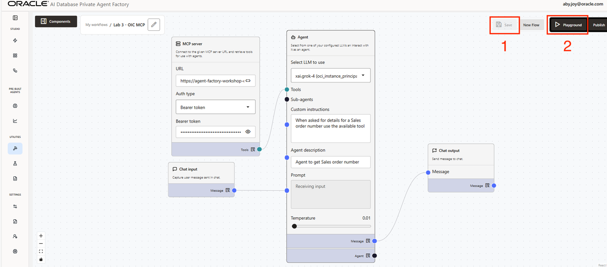
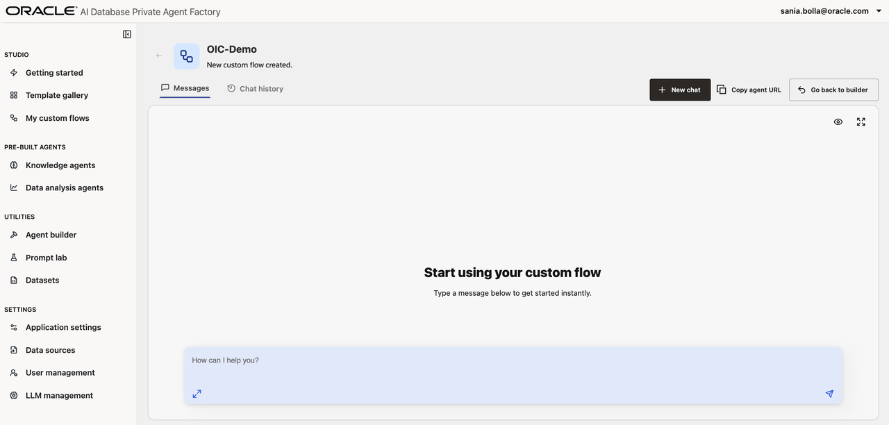
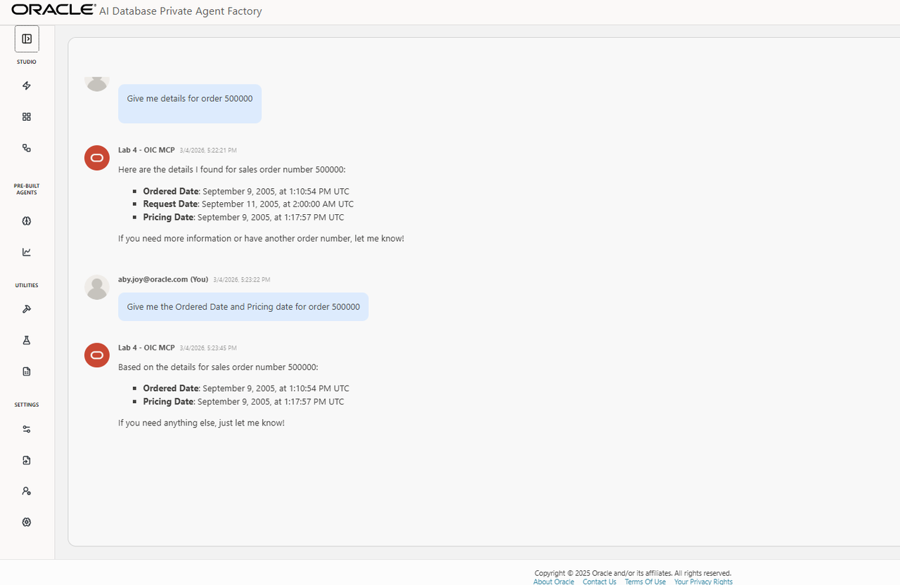

# Build Agent for complex business flows with OIC MCP Server

## Introduction

In this lab, you will learn you can build agents for complex business flows by leveraging OIC Integration MCP tools server. You'll be using a pre-created OIC MCP tool server, which exposes integrations for EBS.

**Estimated time:** 30 minutes.

### Objectives

- Understand OIC + Agent Factory usage patterns
- Use OIC MCP Server to create a custom agent

### Prerequisites

* Oracle AI Database Private Agent Factory instance
* Basic familiarity with AI Agents concepts (tools, MCP server, prompts, etc)
* Basic understanding of E-Business Suite, and OIC Integrations

## Task 1: Understand OIC + Agent Factory Usage Patterns

When deciding between SQLcl MCP and OIC MCP, think scope: 

**SQLcl MCP** is best when the work is primarily **Oracle Database operations** (run SQL/PLSQL, scripts, schema/object tasks) and you want a direct, database-centric toolchain. 

**OIC MCP** is better when the goal is **end-to-end process automation and orchestration** across systems, including **traditional workflows** (steps, approvals, integrations, error handling), **non-deterministic workflows** (where an agent may choose different actions/tools based on context), and stronger **data governance controls** through centralized integration management (consistent connection handling, access control patterns, monitoring/auditing, and standardized interfaces) rather than ad hoc database scripting.

Overall, **OIC MCP** is inherently about orchestrating cross-application processes and governing how data moves between systems, whereas **SQLcl** is a database command-line interface (governance is mostly enforced by the database/security model itself, not by SQLcl as a workflow/orchestration layer).

Please see **Lab 3** of the following for more information on **Discovering Integrations as Tools from an MCP Server**: https://livelabs.oracle.com/ords/r/dbpm/livelabs/run-workshop?p210_wid=4283&p210_wec=&session=14105171758182&cs=1vVIrkqYw44jUJUoyRsGqfhyrQGgRXsF6uuWTAfS_UFqlVUlN0utXMtp8LyR0YBoI9FnLLoKu059LwOULha_OrQ


## Task 2: Open Agent Builder
Navigate to the **Agent Builder** tab on the left-hand menu. <span style="color:red;">If there is already an agent configuration present from a previous lab, click **New Flow**.</span>


## Task 3: Create and Configure an Agent

To assemble a custom agent in Private Agent Factory using your OIC project, we will need our OIC MCP server URL and token. Those two will be provided to you by instructors for the purpose of this lab.

### Step 1. Add components to the canvas

1. To begin, find the **Chat input** node from the Components tool bar. Drag it onto the canvas, or simply click the + button.

2. Next, find the **Agent** component near the top of the menu. Drag that onto the canvas.

3. Find the **MCP Server** component. Drag that onto the canvas.

4. Find the **Chat output** node near the bottom of the menu, and drag it onto the canvas.

    1. Drag the blue dot from the Chat input component to the Prompt field of the agent.

    2. Then drag the Message blue dot on the Agent component to the Message dot on the Chat output component.

    3. Lastly, drag the Tools light blue dot on the MCP Server component to the Tools dot on the Agent component.

    #### Step 3. Fill out details on components

    #### 3.1 MCP Server Component

    In the MCP Server component you will need to:

1. Paste in the provided MCP URL
2. Select Auth type to be Bearer token
3. Paste in the provided Bearer token

    #### 3.2 Agent Component

1. In the Agent, for the "Select LLM to use" field select the **xai.grok-4**.

2. In the "Custom instructions" field for Agent copy/paste:

    ```
    <copy>
    When asked for details for a sales order number use the available tool.
    </copy>
    ```

    <span style="color:red;">Confirm that your agent looks like this:</span>

    

    ### Step 4: Save the flow and test!
1. Click **Save** on the top right hand corner of your page.

2. **Then**, click **Playground**. You should see the following:

    

3. Add the following prompts one after the other:

    ```
    <copy>
    Give me details for order 500000
    </copy>
    ```

    ```
    <copy>
    Give me the ordered date and pricing date for order 500000
    </copy>
    ```

    Please see example output for the above prompts below.

    

    Congratulations! You have successfully finished this lab.

    You may now proceed to the next lab.

## Acknowledgements

**Authors** 

* Aby Joy, Master Principal Cloud Architect
* Sania Bolla, Cloud Engineer
* Kumar Varun, Senior Principal Product Manager, Database Applied AI

**Last Updated Date** - March, 2026
