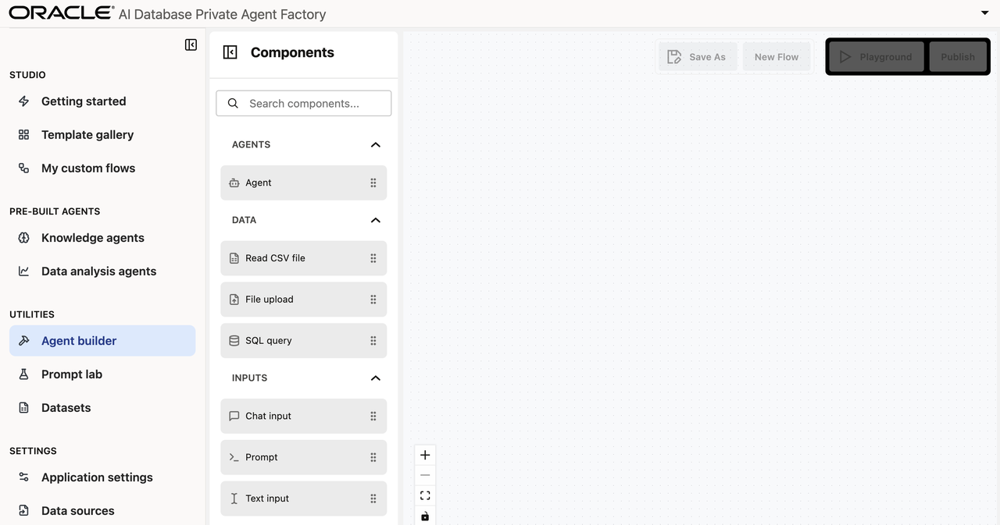
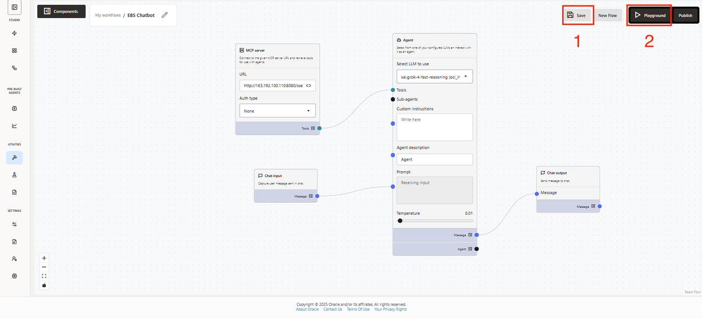
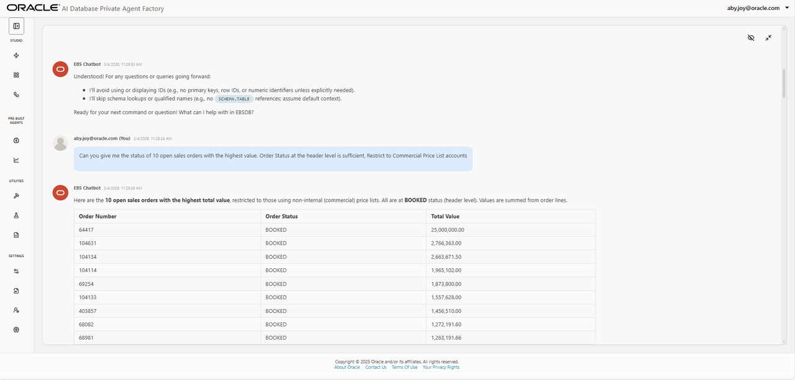
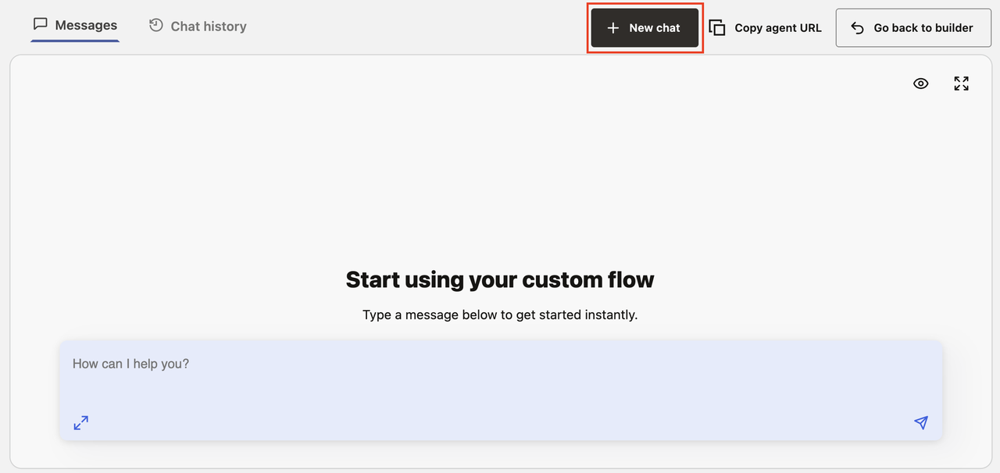
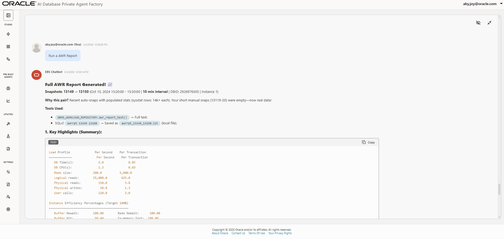
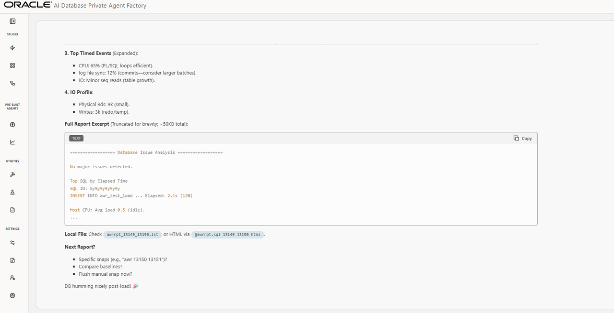

# EBS Database Agent: Analyze Business Data and AWR Reports

## Introduction

In this lab session, you will learn how to use the Agent Builder in Oracle AI Database Private Agent Factory to leverage SQLcl MCP server connected to an E-Business Suite Oracle Database to analyze business data and AWR Reports.

**Estimated time:** 30 minutes.

### Objectives

- Learn how to use Agent Builder to create custom agents
- Configure and use MCP node with SQLcl MCP server
- Customize agent system prompts for specific tasks
- Use Agent Factory Playground to test agent
- Publish custom agents for other users

### Prerequisites

* Oracle AI Database Private Agent Factory instance
* Basic familiarity with AI Agents
* Basic understanding of E-Business Suite Database and AWR Reports

## Task 1: Create a new agent in Agent Builder

Navigate to the **Agent Builder** tab on the left-hand menu. <span style="color:red;">If there is already an agent configuration present from a previous lab, click **New Flow**.</span>



## Task 2: Customize agent for business questions

To assemble this custom agent in Private Agent Factory we will need our MCP server URL. This will be provided to you by instructors for the purpose of this lab.

#### Step 1. Add components to the canvas

1. To begin, find the **Chat input** node from the Components tool bar. Drag it onto the canvas, or simply click the + button.

2. Next, find the **Agent** component near the top of the menu. Drag that onto the canvas.

3. Find the **MCP Server** component. Drag that onto the canvas.

4. Find the **Chat output** node near the bottom of the menu, and drag it onto the canvas.

    1. Drag the blue dot from the Chat input component to the Prompt field of the agent.

    2. Then drag the Message blue dot on the Agent component to the Message dot on the Chat output component.

    3. Lastly, drag the Tools light blue dot on the MCP Server component to the Tools dot on the Agent component.

    #### Step 3. Fill out details on components

    **3.1 MCP Server Component**

    In the MCP Server component you will need to:
1. Paste in the provided MCP URL
2. Select Auth type to be **None**

    **3.2 Agent Component**

1. In the Agent, for the "Select LLM to use" field select **xai.grok-4.reasoning**.
2. In the custom instructions add:

    ```
    <copy>
    You are an Oracle DBA expert in analyzing AWR reports. Answer the user's query.

    Use the SQL query provided to you.

    SELECT *
    FROM awr_reports_html
    WHERE line_num <= 1500
    ORDER BY line_num


    </copy>
    ```

    <span style="color:red;">Confirm that your agent looks like this:</span>

    

    #### Step 4: Save the flow and test!
1. Click **Save** on the top right hand corner of your page.

2. **Then**, click **Playground**. You should see the following:

    

3. Add the following prompt:

    ```
    <copy>
    Connect to the EBSDB database. For the questions here - do not give me IDs. Look for answers in the ONT, OE, WMS, WSH, QP, MTL and related schemas only
    </copy>
    ```

    Please see example output for the above prompt below.

    

4. These are other prompts that may be used to interact with this agent.

    ```
    <copy>
    Can you give me the status of 10 open sales orders with the highest value. Order Status at the header level is sufficient, Restrict to Commercial Price List accounts?
    </copy>
    ```

    ```
    <copy>
    Also show me Order Status, Customer Name, Class.
    </copy>
    ```

    ```
    <copy>
    Show me top 10 open orders for Hilman and Associates only.
    </copy>
    ```

    ```
    <copy>
    Show me details for Order 104134 including quantity ordered and shipped.
    </copy>
    ```

    ```
    <copy>
    Show me the status of the lines. Are they still open?
    </copy>
    ```

    ```
    <copy>
    If the lines are closed, why is the status at the Order level "Booked" and not "Closed"?
    </copy>
    ```

    ```
    <copy>
    It looks like the Workflow is stuck? Can you give me a technical fix that my DBA can run?
    </copy>
    ```


## Task 3: Customize agent for AWR Reports

We will use the same agent to analyze AWR reports.

1. Start a new chat by clicking the "New chat" button on the right hand side of your chat interface.

    

2. Add the following prompt:


    ```
    <copy>
    Run an AWR Report
    </copy>
    ```

    Please see example output for the above prompt below.

    
    

3. Other prompts that may be used to interact with this agent:

    ```
    <copy>
    What are the biggest risks facing my database? Any actions I should take this week?
    </copy>
    ```

    Congratulations! You have successfully finished this lab.

    You may now proceed to the next lab.

## Acknowledgements

**Authors** 

* Aby Joy, Master Principal Cloud Architect
* Sania Bolla, Cloud Engineer
* Kumar Varun, Senior Principal Product Manager, Database Applied AI
* Allen Hosler, Principal Product Manager, Database Applied AI

**Last Updated Date** - March, 2026
