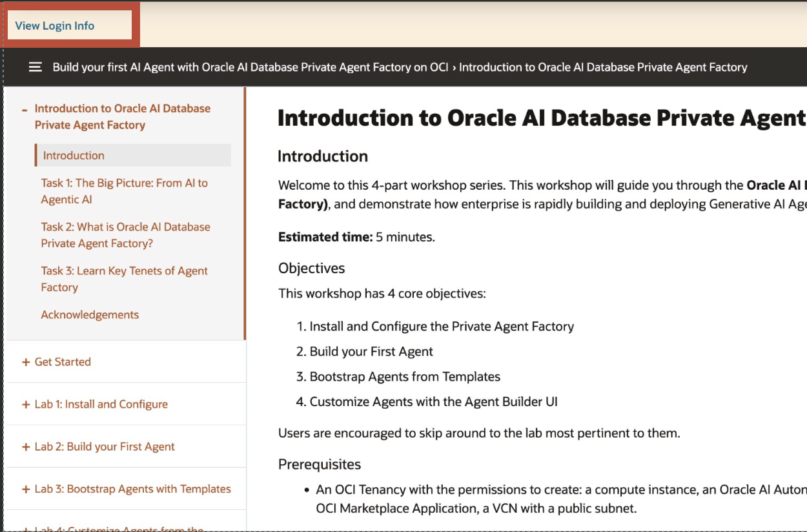
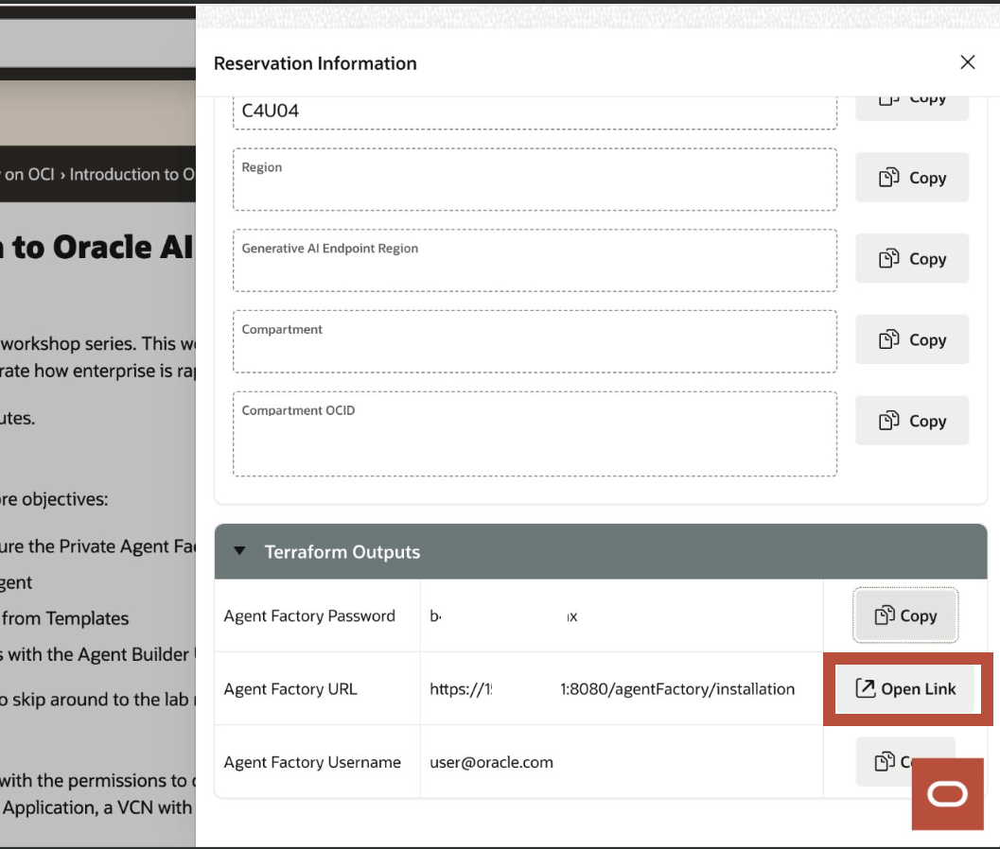
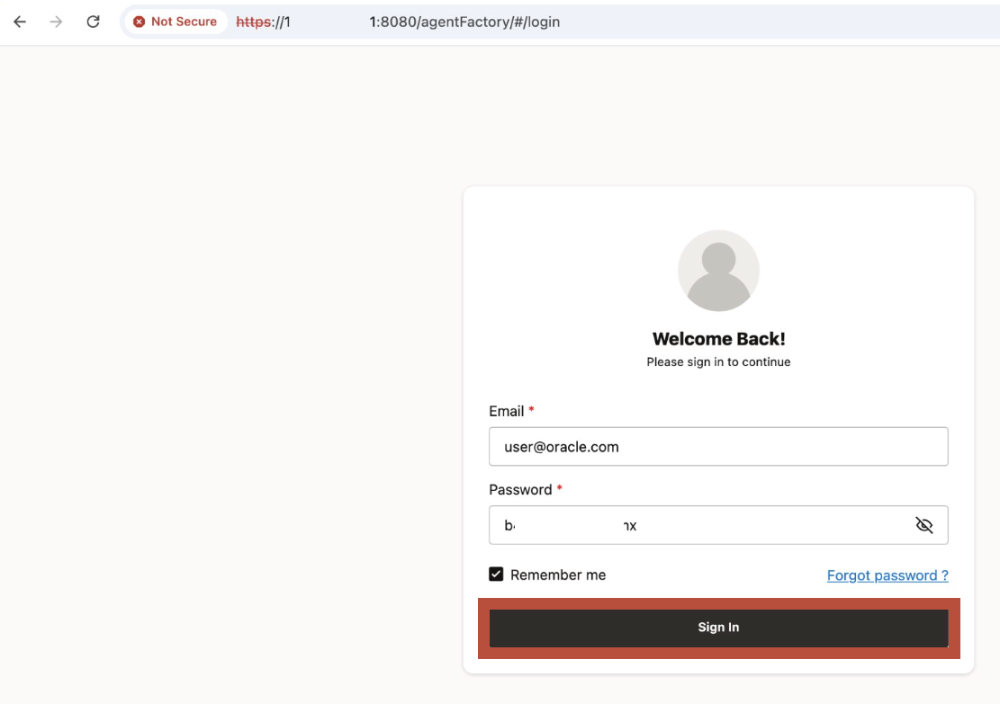

# Get Started with the Oracle AI Database Private Agent Factory

## Introduction
This seection will walk you through launching and logging into the Private Agent Factory

**Estimated time:** 5 minutes.

### Objectives

This workshop has 2 core objectives:

1. Launch the Web App
2. Login

### Prerequisites

* None.

## Task 1: Launch the Website for Agent Factory

1. Go to the **View Login Info** tab in the top left of this page.

    

2. Scroll down to **Terraform Outputs** and click **Open Link**.

    

*Note the username and password, you will need these in Task 2.*

## Task 2: Login to the Agent Factory

Enter your username and password from the **Terraform Outputs** in Task 1, and **Sign In**

You may now **proceed to the next lab**

## Acknowledgements

**Authors** 

* Emilio Perez, Member of Technical Staff, Database Applied AI
* Allen Hosler, Principal Product Manager, Database Applied AI
* Kumar Varun, Senior Principal Product Manager, Database Applied AI

**Last Updated Date** - April, 2026
