# Installing the Private Agent Factory from the OCI Marketplace

> **Purpose**: This Live Lab walks customers through deploying the **Private Agent Factory** using the OCI Marketplace.

This lab assumes a *public, internet-reachable* deployment for learning purposes. Production deployments typically use private subnets, bastion access, and stricter security controls.

---

## Introduction

The **Private Agent Factory** is a no-code platform for building and operating enterprise-grade AI agents that run close to your data inside **Oracle AI Database 26ai**. Agents gain their power from direct access to converged enterprise data (relational, vector, JSON, files) and from the actions they can securely perform.

The OCI Marketplace deployment provides a **pre-built Resource Manager stack** that provisions:

* A compute instance running the Agent Factory container
* Supporting networking configuration (using your selected VCN/subnet)
* Application bootstrap logic that exposes the Agent Factory UI

---

## Objectives

By the end of this lab, you will be able to:

* Prepare networking suitable for a Private Agent Factory deployment
* Provision an Oracle Autonomous AI Database (26ai)
* Install the Private Agent Factory from the OCI Marketplace

---

## Prerequisites

* An OCI tenancy with permissions for:
  * Networking (VCN, Subnet, Security Lists)
  * Autonomous Databases
  * OCI Marketplace and Resource Manager

---

## Task 1: Prepare the Networking Environment

The Agent Factory UI runs as a web application and must be reachable from your browser. For this lab, we use a **public subnet**.

### 1. Create a Virtual Cloud Network (VCN)

* CIDR block: `10.0.0.0/16`
* Example name: `agent-factory-vcn`

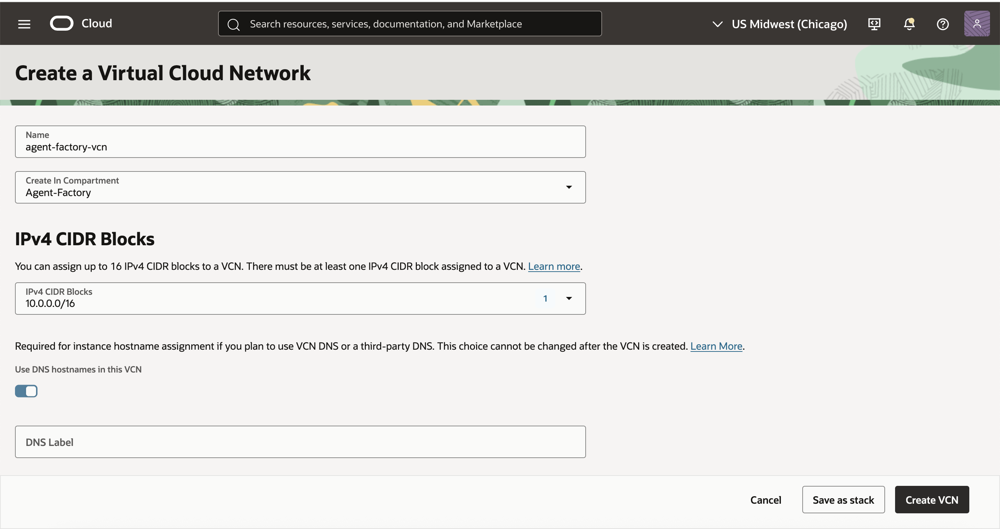

### 2. Create an Internet Gateway

* Attach the Internet Gateway to the VCN
* This allows outbound internet access and inbound browser access


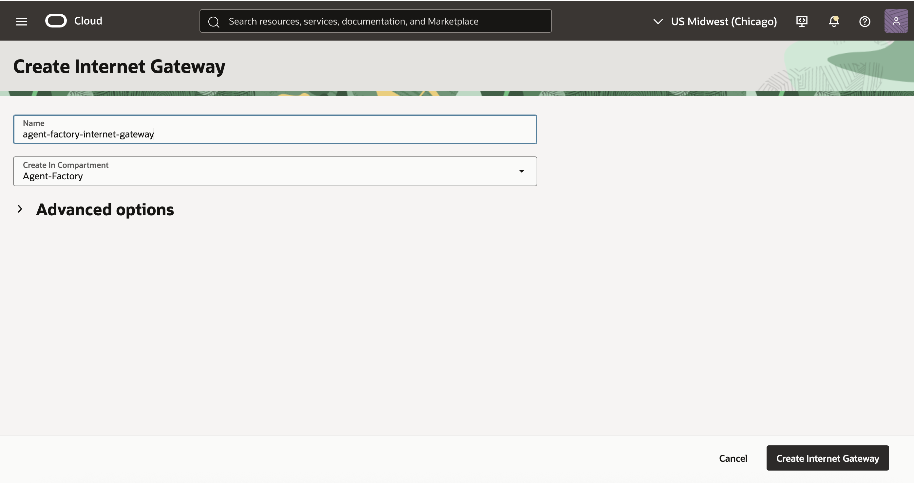

### 3. Update the Route Table

Update the Default Route Table

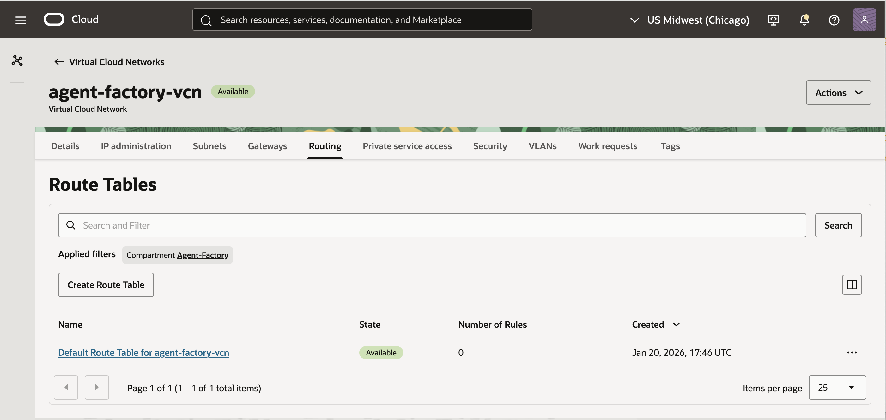

* Add a route rule:

  * Destination CIDR: `0.0.0.0/0`
  * Target: Internet Gateway
 
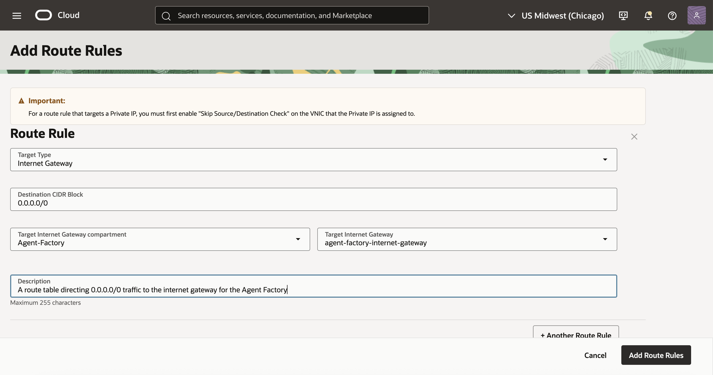

### 4. Update Security List Rules

Add **Ingress Rules** for TCP:

* **Port 22** – SSH access (administration/debugging)
* **Port 8080** – Agent Factory web UI
* **Port 1521** – Oracle Database access

> ⚠️ These open rules are for workshop purposes only. In production, restrict source CIDRs and prefer private networking.


### 5. Create a Public Subnet


* CIDR example: `10.0.1.0/24`
* Associate with the route table pointing to the Internet Gateway
  * The security list updated above

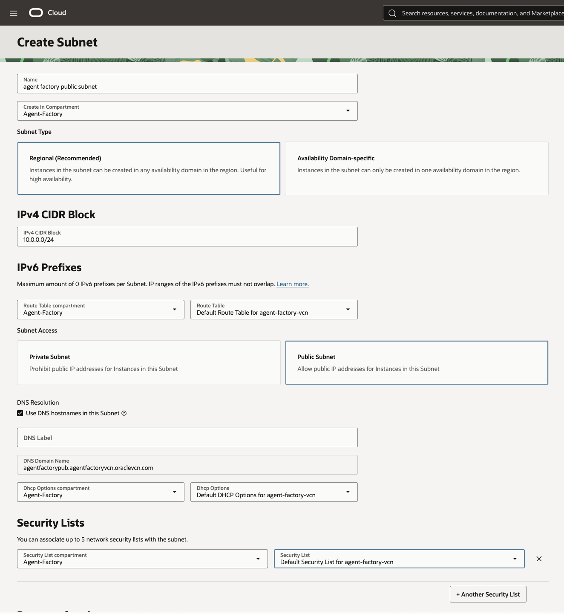

---

## Task 2: Provision the Autonomous AI Database (26ai)

The Private Agent Factory uses Oracle AI Database to store:

* Agent configuration and metadata
* Vector embeddings
* Conversational memory and evaluation artifacts

### 1. Create the Database

* Navigate to **Oracle AI Database → Autonomous Database**
* Choose **Autonomous AI Database**


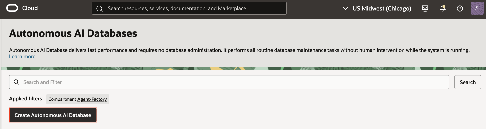

### 2. Configuration

* Database version: **26ai**
* Workload type: *Transaction Processing* or *Lakehouse* (either is fine for this lab)
* Select ECPU and storage appropriate for a demo

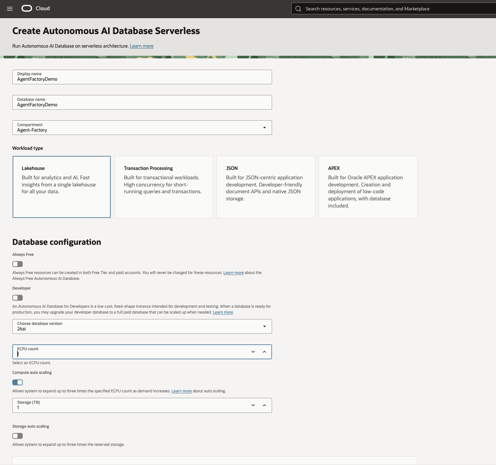

### 3. Network Access

* For this lab, you may select **Secure access from everywhere**
* Alternatively, restrict access to your VCN CIDR

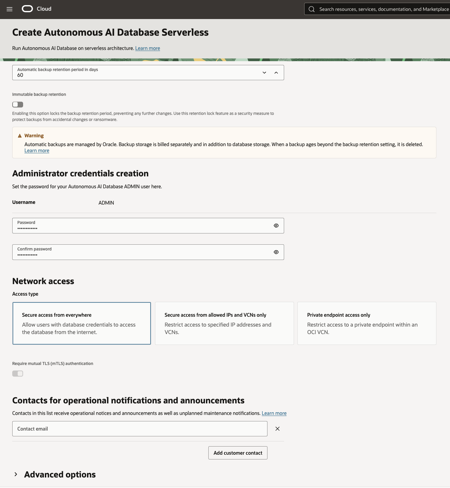

### 4. Credentials (Important)

* Set and **record** the `ADMIN` password
* Download the **database wallet** and remember the **wallet password**

You will need all of these during the Agent Factory setup wizard.

---

## Task 3: Install the Private Agent Factory from the OCI Marketplace

This task uses a Resource Manager stack published in the OCI Marketplace.

### 1. Open the Marketplace Listing

* Navigate to the **Oracle AI Database – Private Agent Factory** listing:
  [https://cloudmarketplace.oracle.com/marketplace/en_US/listing/201588705](https://cloudmarketplace.oracle.com/marketplace/en_US/listing/201588705)

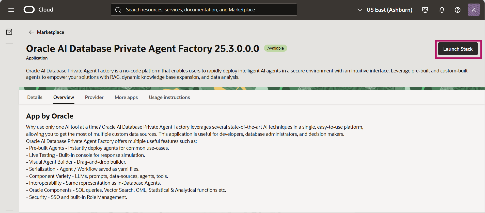

### 2. Launch the Stack

* Click **Get App** and authenticate to your tenancy
* Review the product overview
* Click **Launch Stack**

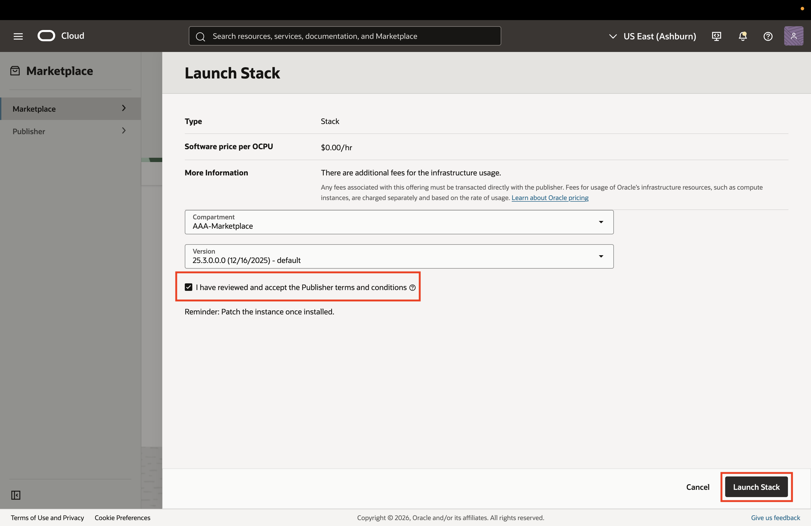

### 3. Accept Terms

* Review and accept the Oracle Standard Terms and Restrictions
* Click **Launch Stack**

### 4. Stack Configuration

Under **General Settings**:

* Select the **Region** where your VCN was created
* Select the **Compartment** where your VCN was created

Under **Network Configuration**:

* Select the **VCN** created in Task 1
* Select the **Public Subnet** created in Task 1


### 5. Compute Configuration

* Provide a display name for the Agent Factory instance
* Select an instance shape (for example, `VM.Standard.E5.Flex`)
* Choose appropriate OCPU and memory (larger memory improves agent performance)

### 6. Create the Stack

* Review the configuration
* Click **Create**

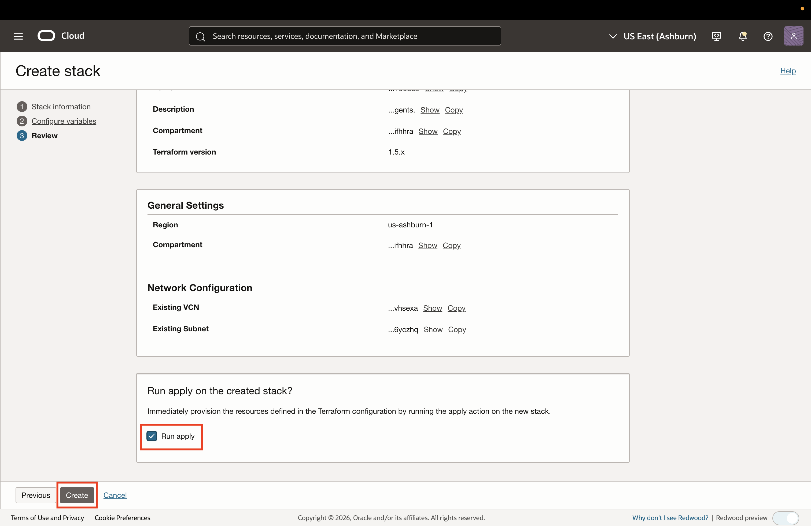

Resource Manager will now run a Terraform **Apply** job to provision the instance and install the Agent Factory container.

### 7. Retrieve the Application URL

Once the job completes successfully:

* Open the **Logs** or **Outputs** tab
* Copy the application URL, which has the format:

```
https://<<instance_public_ip>>:8080/studio/installation
```


This URL will be the starting point for **Lab 2: Log in to the Private Agent Factory**.

---


## Summary

In this lab, you:

* Prepared networking for a public Agent Factory deployment
* Provisioned an Oracle Autonomous AI Database (26ai)
* Installed the Private Agent Factory from the OCI Marketplace

You can now proceed to the next labs to:

* Log in to the Private Agent Factory
* Configure the LLMs and Database
* Create a user

---

## References

* OCI Marketplace listing: [https://cloudmarketplace.oracle.com/marketplace/en_US/listing/201588705](https://cloudmarketplace.oracle.com/marketplace/en_US/listing/201588705)
* Product documentation: [https://docs.oracle.com/en/database/oracle/agent-factory/](https://docs.oracle.com/en/database/oracle/agent-factory/)


- **Authors** 
* Emilio Perez, Member of Technical Staff, Database Applied AI
* Allen Hosler, Principal Product Manager, Database Applied AI

- **Last Updated Date** - January, 2026
