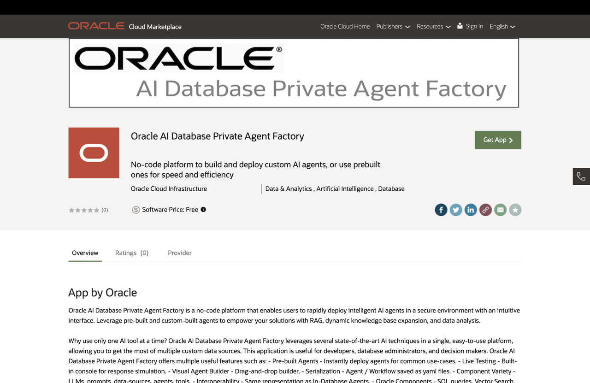
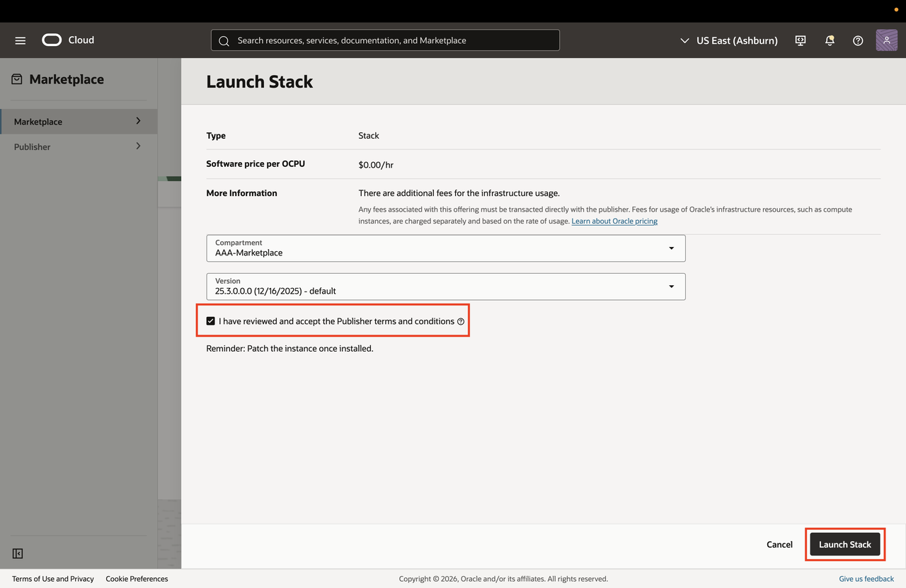
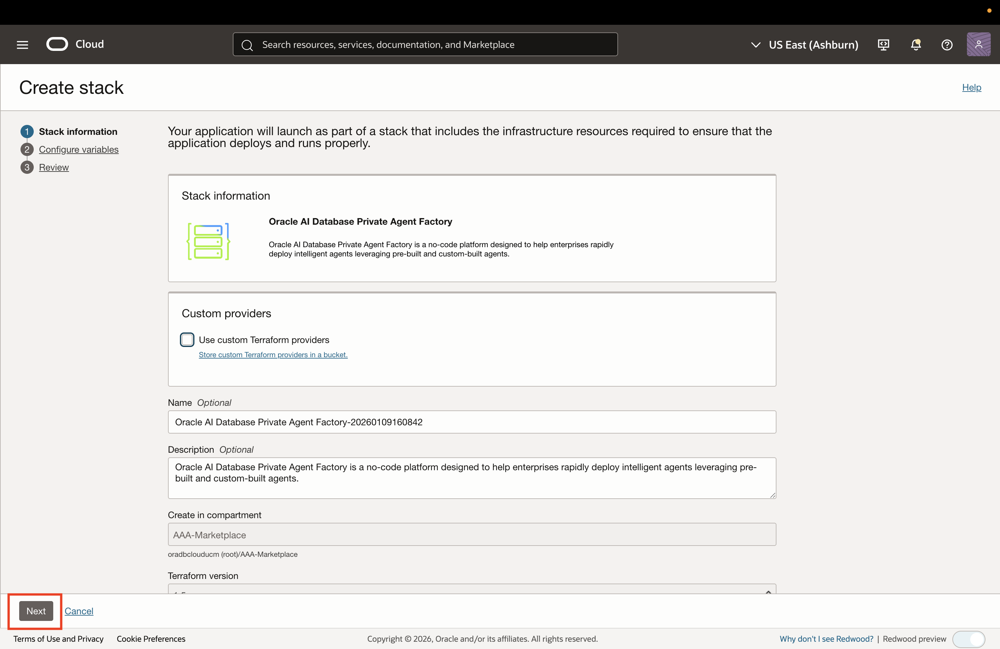
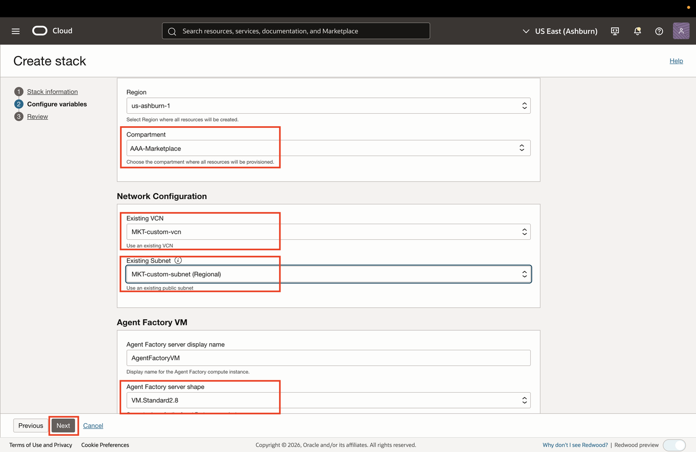
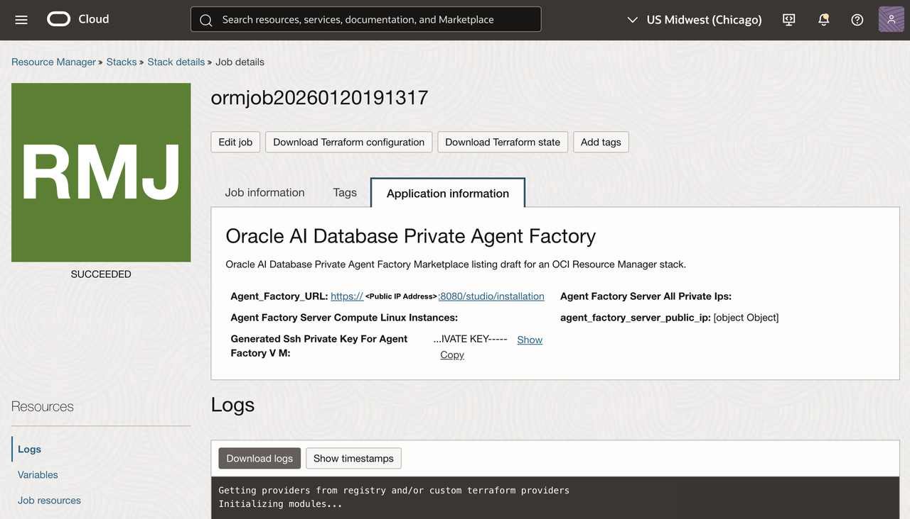
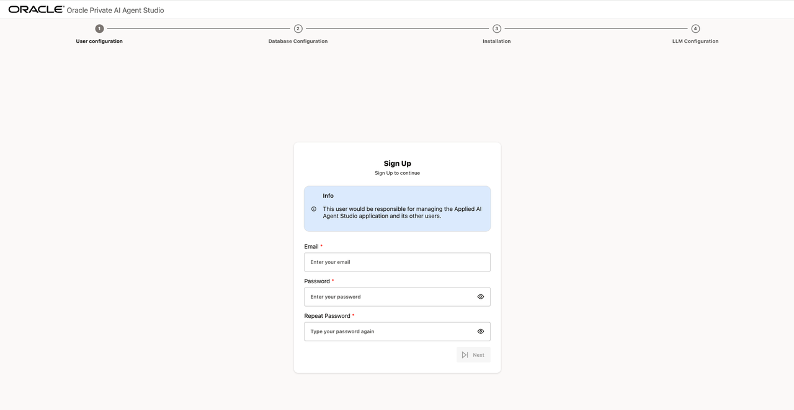
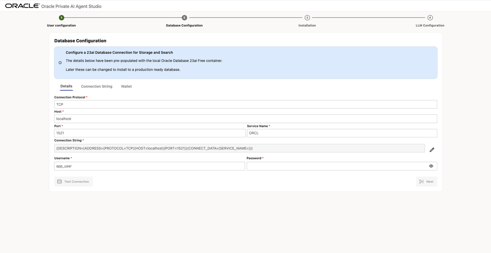
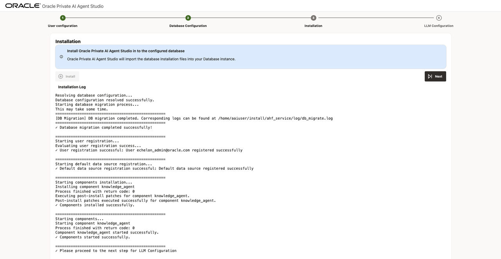
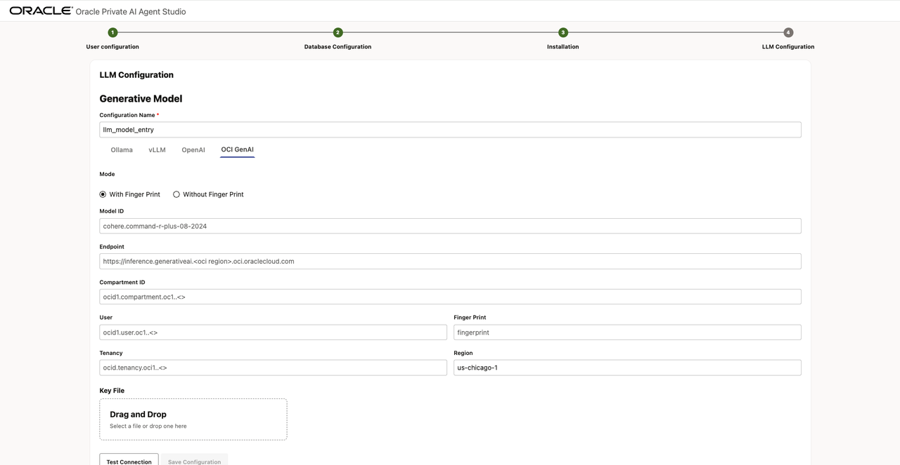

# Install and Configure Agent Factory on OCI
## Introduction
In this lab, you'll deploy Agent Factory from OCI Marketplace on a compute instance using a pre-built image. You'll use the VCN (Public Subnet) and Autonomous Database created in previous lab during setup and configure OCI GenAI Services as LLM Model Provider in Agent Factory web-application.

**Estimated time:** 15 minutes.

### Objectives

* Install Agent Factory from OCI Marketplace 
* Fist time login to Agent Factory webapp to start configuration
* Configure Oracle AI Database and OCI GenAI Service LLM Provider

### Prerequisites

* VCN and Oracle DB details from previous lab
* Familarity with OCI Marketplace and Resource Manager

## Task 1: Navigate and launch Agent Factory Marketplace Application

The Private Agent Factory can be launched from the OCI Marketplace. To start, view the listing.

* OCI Marketplace listing: [https://cloudmarketplace.oracle.com/marketplace/en_US/listing/201588705](https://cloudmarketplace.oracle.com/marketplace/en_US/listing/201588705)

    

Click **Get App** and sign in to your OCI tenancy.

## Task 2: Configure, Review, and Launch Stack

Next, **Launch Stack**

   

Select the region and compartment of the VCN you plan to use. Then select the VCN and a public subnet.

   


## Task 3: Review Stack Resources and Retrieve Application URL

This task uses a Resource Manager stack published in the OCI Marketplace.

### 1. Open the Marketplace Listing

* Navigate to the **Oracle AI Database – Private Agent Factory** listing:
  [https://cloudmarketplace.oracle.com/marketplace/en_US/listing/201588705](https://cloudmarketplace.oracle.com/marketplace/en_US/listing/201588705)

   

### 2. Launch the Stack

* Click **Get App** and authenticate to your tenancy
* Review the product overview
* Click **Launch Stack**

   

### 3. Accept Terms

* Review and accept the Oracle Standard Terms and Restrictions
* Click **Launch Stack**

### 4. Stack Configuration

Under **General Settings**:

* Select the **Region** of your VCN.
* Select the **Compartment** of your VCN.

Under **Network Configuration**:

* Select the **VCN** created in Task 1
* Select the **Public Subnet** created in Task 1

> The stack assumes a subnet that allows public IPs and inbound access on ports 22, 8080, and 1521.

### 5. Compute Configuration

* Provide a display name for the Agent Factory instance
* Select an instance shape (for example, `VM.Standard.E5.Flex`)
* Choose appropriate OCPU and memory (larger memory improves agent performance)

   

### 6. Create the Stack

* Review the configuration
* Click **Create**

Resource Manager will now run a Terraform **Apply** job to provision the instance and install the Agent Factory container.

### 7. Retrieve the Application URL

Once the job completes successfully:

* Open the **Logs** or **Outputs** tab
* Copy the application URL, which has the format:

```
https://<instance_public_ip>:8080/studio/installation
```

   


## Task 4: Login and first time configuration

### 1. Create the Agent Factory User

* Open the application URL in your browser
* Set the **username and password** for the Agent Factory administrator

   

### 2. Configure the Database Connection

Provide the following:

* Upload the **Autonomous Database wallet**
* Wallet username and password
* Database user: `ADMIN`
* Database password

Click **Test Connection** before proceeding.

   


### 3. Install the Agent Factory into your Database

Click **Install** to begin downloading the Private Agent Factory resources into your database. Once complete, select **Next**.

   

### 4. Configure AI Provider Access

Provide credentials for your LLM provider, such as:

* OCI Generative AI (using OCI API keys)
* Other supported providers, depending on your environment

   


This enables:

* Agent reasoning
* Embedding generation
* Evaluation and summarization workflows

### 5. Finalize Setup

* Complete the wizard
* Log back in to access the Agent Factory UI

You are now ready to start building agents using:

* Pre-built agent templates
* The visual Agent Builder
* Open Agent Specification–compatible workflows

---

You may now **proceed to the next lab**

## References

* Product documentation: [https://docs.oracle.com/en/database/oracle/agent-factory/](https://docs.oracle.com/en/database/oracle/agent-factory/)

## Acknowledgements

- **Authors** 
* Emilio Perez, Member of Technical Staff, Database Applied AI
* Allen Hosler, Principal Product Manager, Database Applied AI
* Kumar Varun, Senior Principal Product Manager, Database Applied AI

- **Last Updated Date** - February, 2026
