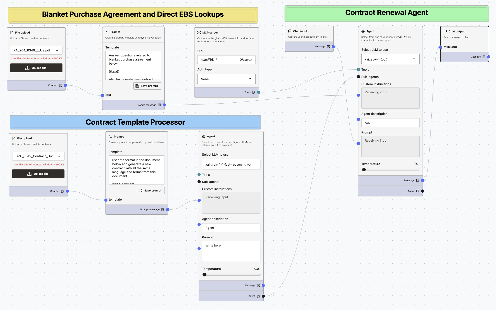

# E-Business Contracts Generation Agent Walkthrough

## Introduction

In this lab, you will learn how build an contracts generation agent. You'll use OIC Integrations as MCP tools, direct connection to EBS Database for fetching product lookups.

**Estimated time:** 30 minutes.

### Objectives

- Understand high-level contract processing business flow and automation components
- Build an agent from scratch using the visual Agent Builder tool
- Publish custom agents

### Prerequisites

* Familairty with Agent Factory and AI Agents concepts (data sources, MCP, Prompts, Tools, etc)
* Understanding of how OIC Integrations are exposed as MCP tools

## Task 1:  Contract processing agent builder walkthrough

Instructors will do a live walkthrough building the contract renewal agent in Agent Factory.

## Acknowledgements

**Authors** 

* Kumar Varun, Senior Principal Product Manager, Database Applied AI
* Aby Joy, Master Principal Cloud Architect

**Last Updated Date** - March, 2026
