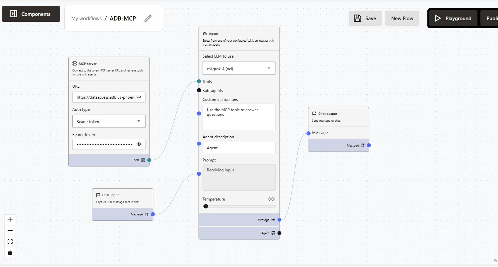

# Build Agent for complex business flows with OIC MCP Server

## Introduction

In this lab, you will learn you can build agents for complex business flows by leveraging OIC Integration MCP tools server. You'll be using a pre-created OIC MCP tool server, which exposes integrations for EBS.

**Estimated time:** 30 minutes.

### Objectives

- Understand OIC + Agent Factory usage patterns
- Use OIC MCP Server to create a custom agent

### Prerequisites

* Oracle AI Database Private Agent Factory instance
* Basic familiarity with AI Agents concepts (tools, MCP server, prompts, etc)
* Basic understanding of E-Business Suite, and OIC Integrations

## Task 1: Understand OIC + Agent Factory usage patterns

### Key MCP Concepts
Table 1: MCP Terminology
| Concept | Description |
|---|---|
| MCP Server | Your OIC project exposed as an MCP server |
| MCP Client | External applications (OCI ADK, Fusion AI Studio, Postman, Langflow, etc.) that discover and use tools |
| MCP Server URL | Unique endpoint for discovering available tools |
| Transport Mechanism | Communication protocol (streamable HTTP) |
| Security | OAuth 2.0 authentication |

### Benefits of MCP
- **Flexibility**: Use OIC tools in any MCP-compatible framework
- **Interoperability**: Integrate with multiple AI agent platforms
- **Scalability**: Expose integrations beyond OIC
- **Security**: OAuth-secured access to tools
- **Decoupling**: Separate your tools from specific agent implementations


### How MCP Works with OIC 
##### When you enable MCP for an OIC project:

- Your project becomes an MCP Server
- All registered agentic AI tools become discoverable through a unique URL
- External AI agent frameworks (OCI ADK, Fusion AI Studio, Postman, Langflow, etc.) can discover these tools
- External frameworks can invoke these tools securely using OAuth


### OIC Integration MCP tools vs SQLcl MCP
OIC MCP is mainly for working with Oracle Integration Cloud, like running integrations and connecting different apps and services. SQLcl MCP is mainly for database work, like running SQL and scripts and managing objects in an Oracle Database.


## Task 2: Create and configure agent

To assemble a custom agent in Private Agent Factory using your OIC project, we will need our OIC MCP server URL and token. Those two will be provided to you by instructors for the purpose of this lab.

#### Create the agent

On the left hand side click the “My custom flows” button and then click “Create flow”. Add in the following components:
- MCP Server
- Agent
- Chat Input
- Chat Output

In the MCP Server Component you need to:
- Add the provided MCP URL
- Auth type = Bearer token
- Add the Bearer token

Connect the light blue dot on the MCP Server component to the Tools (light blue dot) on the Agent component.

For the Agent, select the msi-workshop (openai) LLM.

Custom instructions for Agent (copy/paste):
    ```
    <copy>
    Use the MCP tools to answer questions.
    </copy>
    ```

- Drag the dark blue dot on the chat input component to the dark blue dot labeled prompt on the agent.

- Drag the dark blue dot labelled message on the agent component to the dark blue dot labelled message on the Chat Output component.

You're agent should look like the following:



- Click save on the top right hand corner of your page.

- Click Playground.

- Add the instructor provided prompt and try out questions.


Congratulations! You have successfully finished this lab.

## Acknowledgements

**Authors** 

* Kumar Varun, Senior Principal Product Manager, Database Applied AI
* Sania Bolla, Cloud Engineer

**Last Updated Date** - March, 2026
